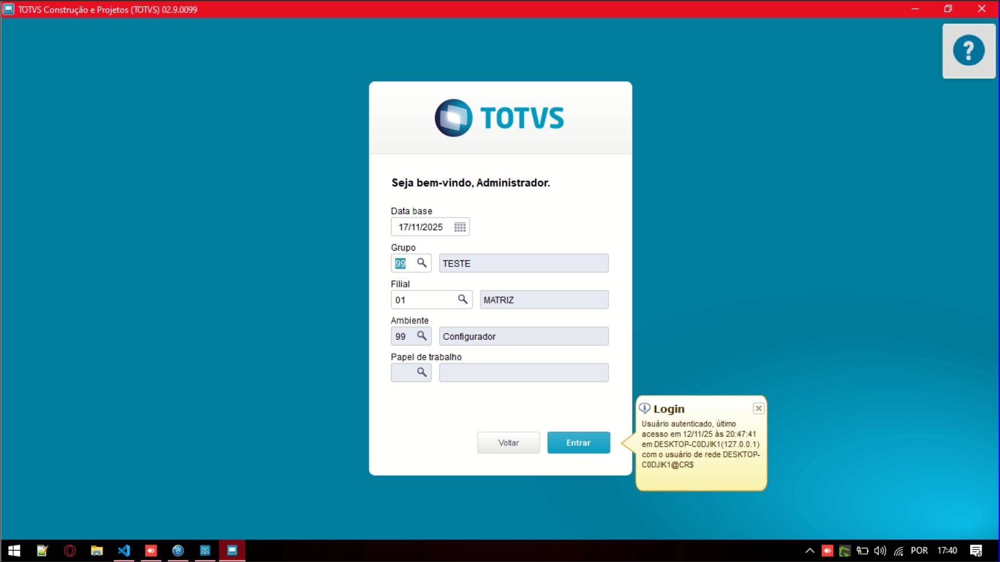
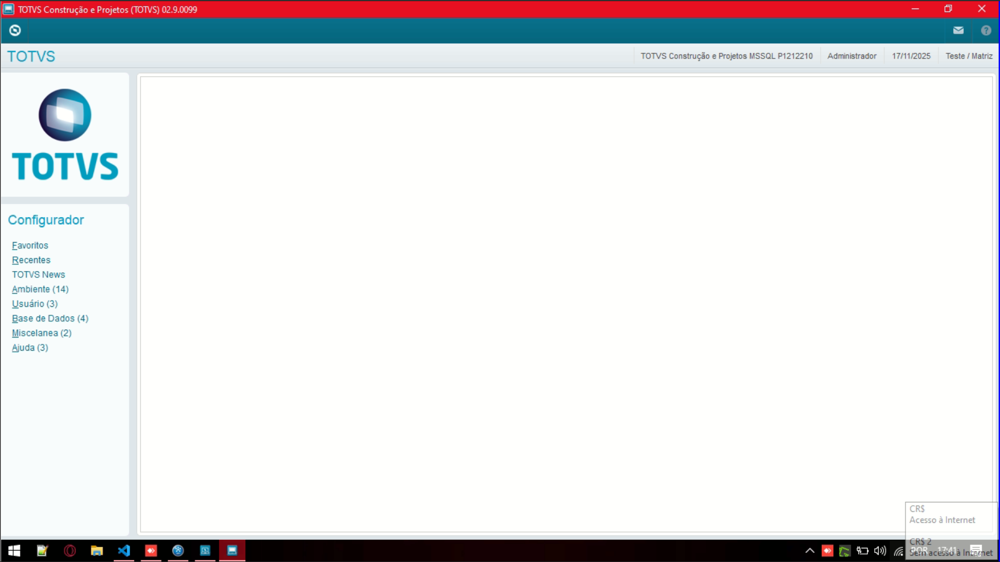
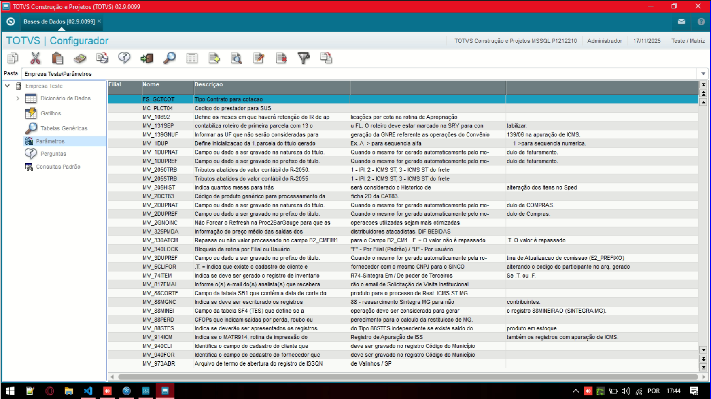
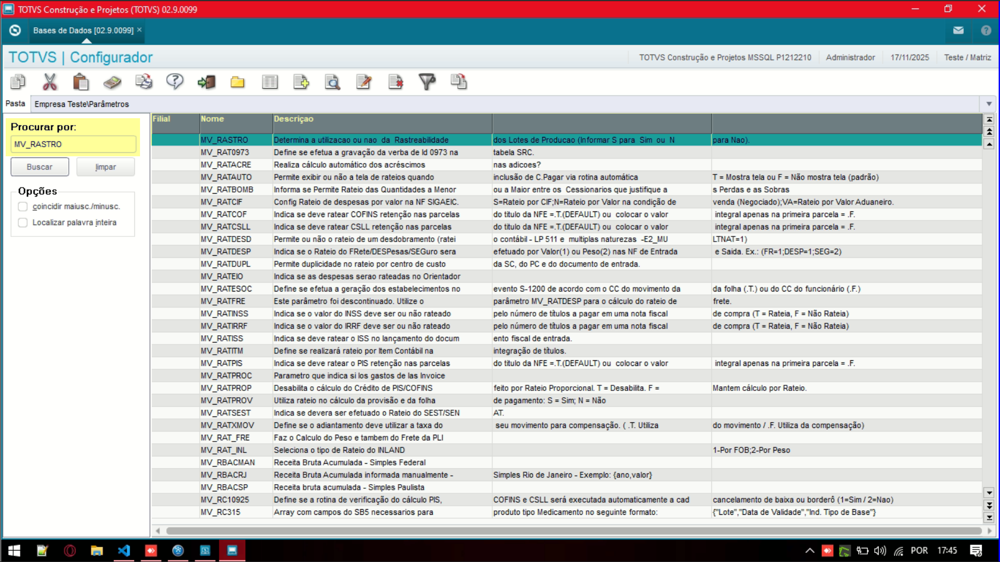
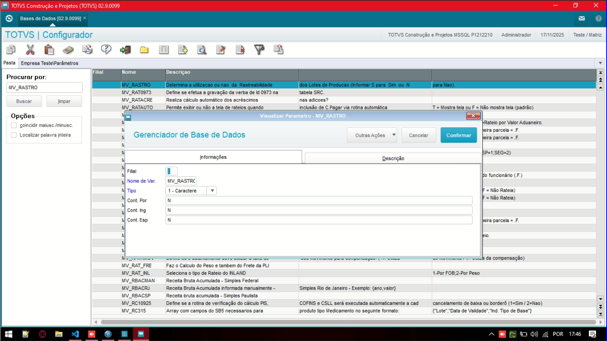
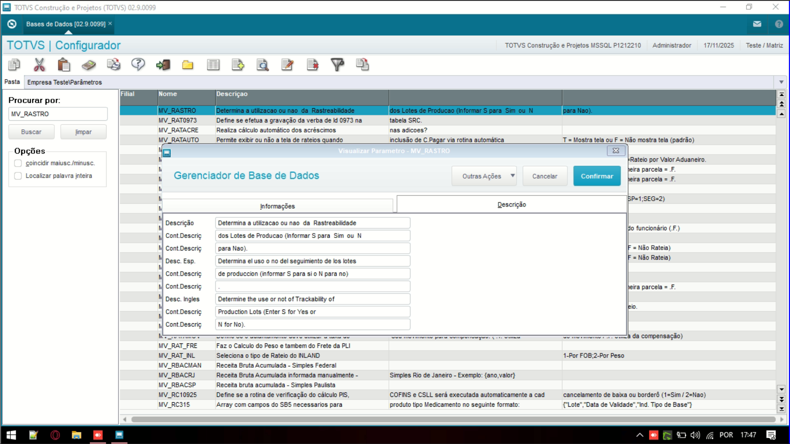

# Entedimento inicial Módulo Financeiro

**Parâmetros Protheus**

O parâmetro dentro do contexto do Protheus é o acesso a um tipo de informação, podendo ter difentes formatos como texto, númerico, lógico.

De forma mais técnica, os parâmetros que são cadastrados no Protheus podem ser encontrados na tabela de **"Parâmetros - SX6"**.

---

Acesso ao cadastro de parâmetros via Módulo Configurador:

---

## Autor

**Cristian Gustavo** | Consultor e desenvolvedor TOTVS Protheus

- [LinkedIn Cristian Gustavo](https://www.linkedin.com/in/cristian-gustavo-719aa71b2/)
- [GitHub Cristian Gustavo](https://github.com/crsgustav0)

---

    Desenvolvido e documentado por: Cristian Gustavo
    Data início: 17/11/2025
