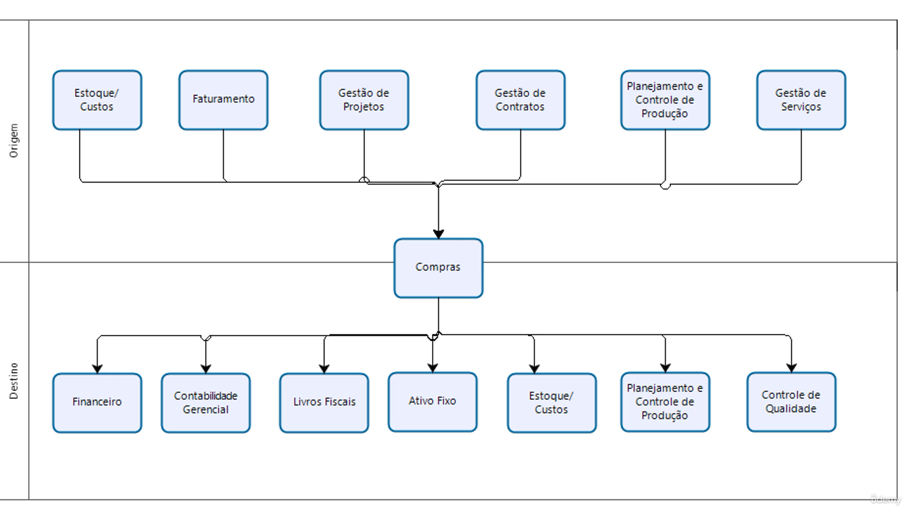

# Entedimento inicial Módulo Compras

**Principais responsabilidades**

- Prover materiais e/ou serviços.
- Análise e desenvolvimento de fornecedores.
- Negociar contratos de aquisição.
- Abertura, negociação e acompanhamento de pedidos.

**Principais integrações Módulo Compras**

- Estoque/ Custo
- Financeiro
- Contabilidade Gerencial
- Livros Fiscais
- Ativo Fixo
- Faturamento
- Gestão de Projetos
- Gestão de Contratos
- Gestão de Serviços
- Planejamento e Controle de Produção (PCO)
- Controle de Qualidade

Exemplo integração do Módulo Compras para outros módulos:

## Autor

**Cristian Gustavo** | Consultor e desenvolvedor TOTVS Protheus

- [LinkedIn Cristian Gustavo](https://www.linkedin.com/in/cristian-gustavo-719aa71b2/)
- [GitHub Cristian Gustavo](https://github.com/crsgustav0)

---

    Desenvolvido e documentado por: Cristian Gustavo
    Data início: 17/11/2025
