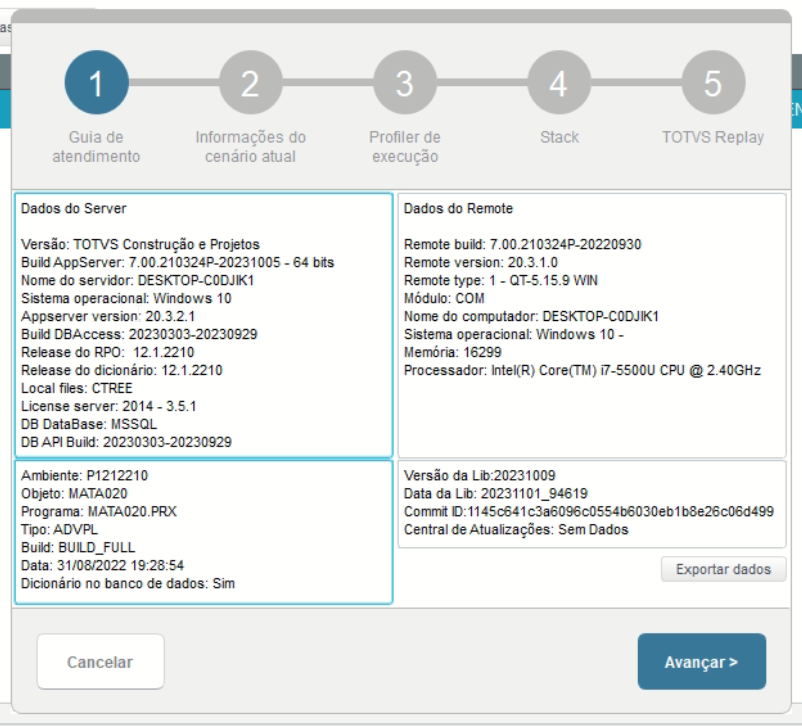
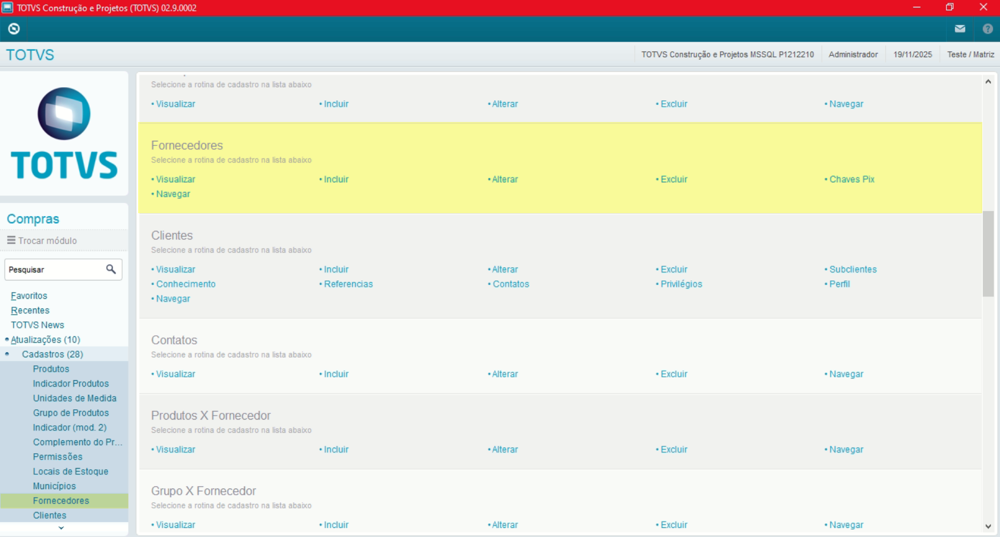
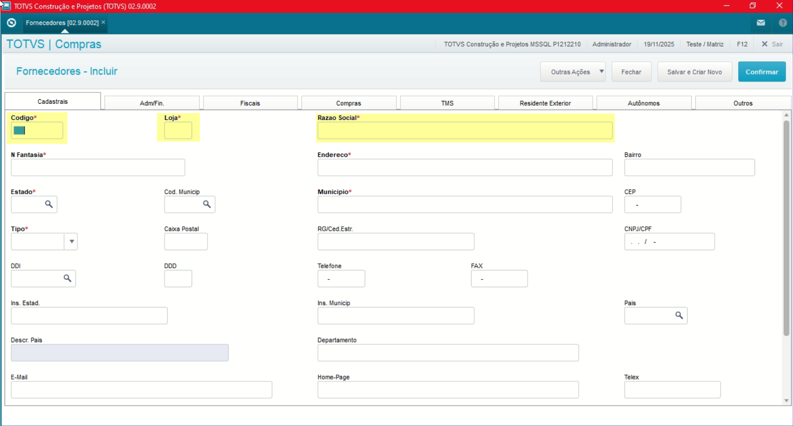
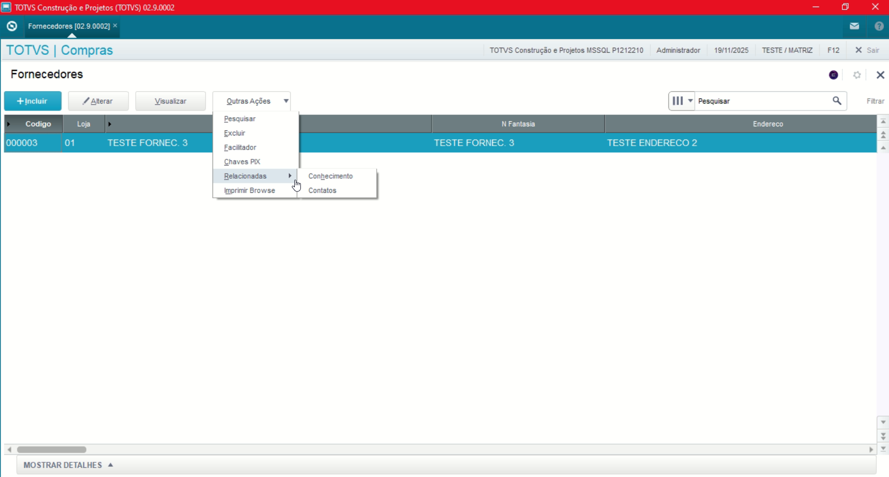
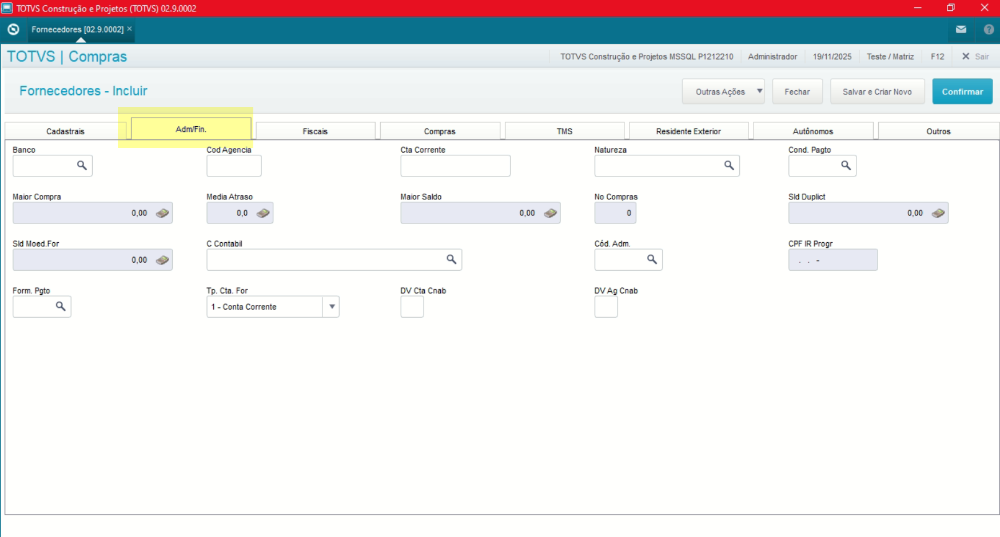
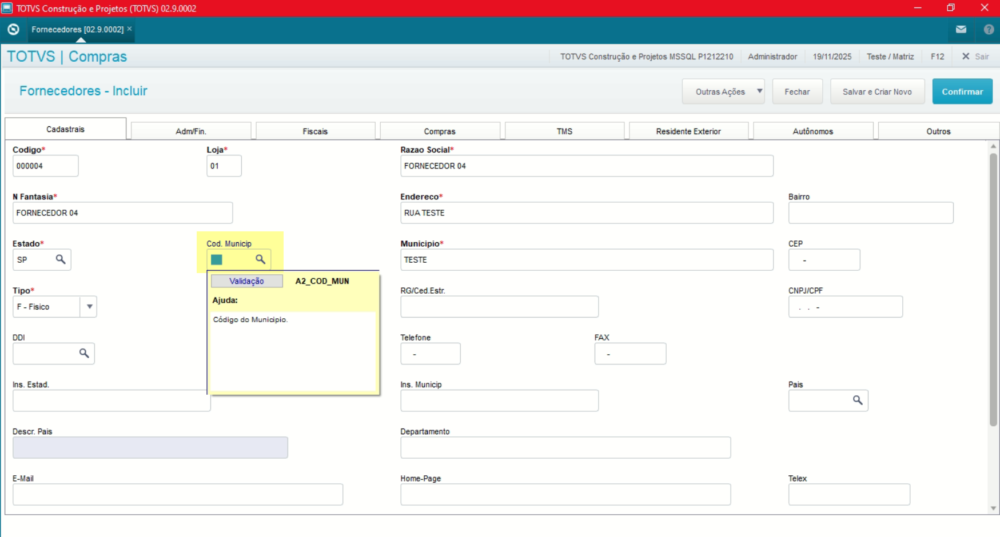
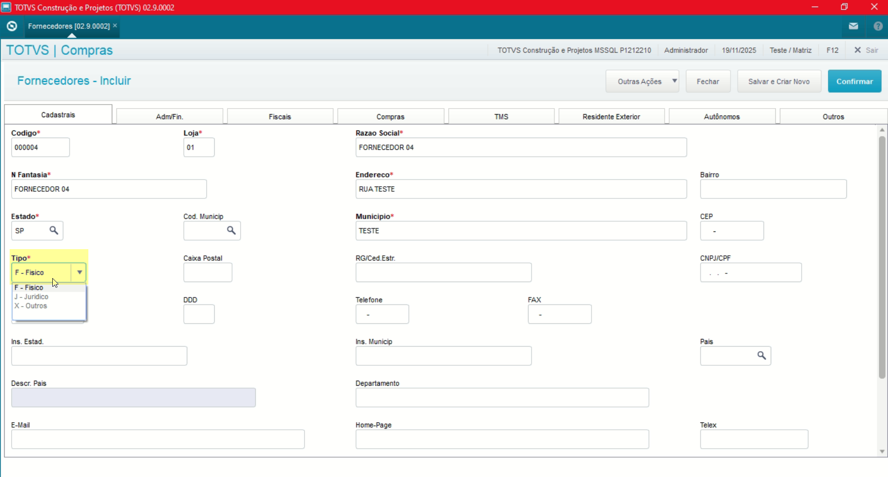
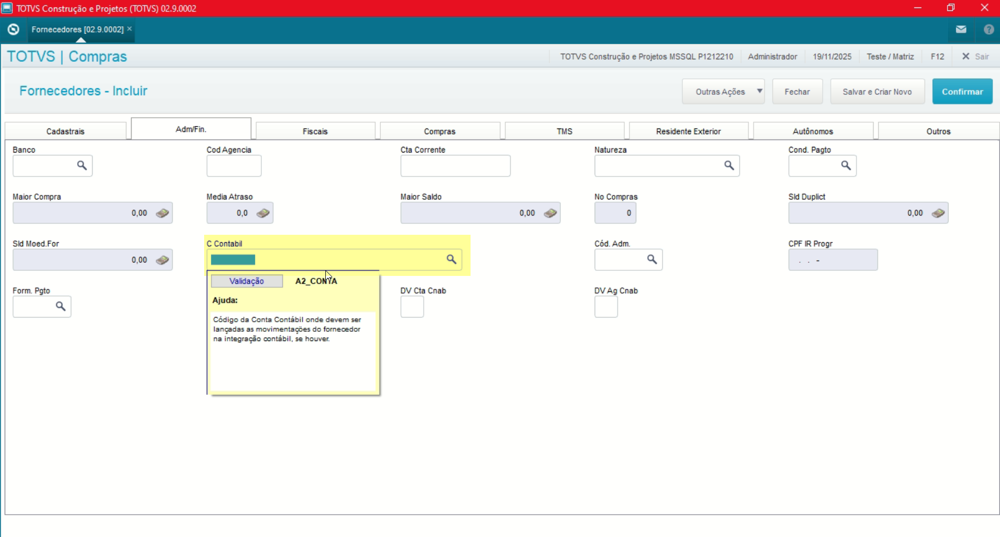
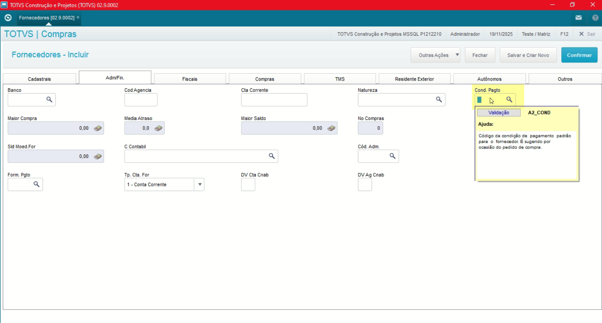
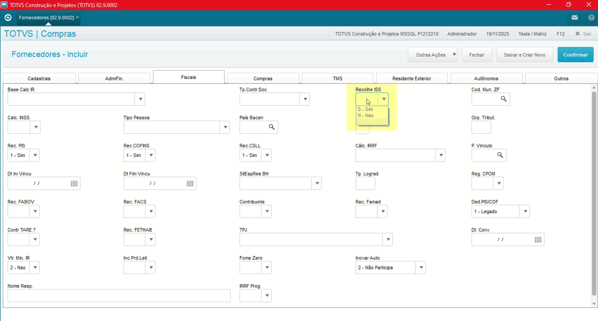

# Entedimento inicial Módulo Compras

**Cadastro Fornecedor**

O cadastro de Fornecedores feitas no Protheus é feito via **"Módulo 06 - Compras"**.

De forma mais técnica, as informações cadastradas no Protheus é feita pela rotina padrão **MATA020.PRW** e suas informações podem ser encontradas na tabela **"Fornecedor - SA2"**.

[SA2 - Fornecedor | ERP Labs](https://erplabs.com.br/SA2)

Rotina Protheus:

---

Acesso a rotina de cadastro de Fornecedor via Módulo Compras:

A rotina padrão de Fornecedores contém as seguintes operações, sendo:

- **Inclusão**
- **Alteração**
- **Consulta**
- **Exclusão**

Em caso de inclusão, deve seguir a regra de preenchimento dos campos obrigatórios, identificados com o **"/"** em sua descrição.

---

No menu Outras Ações, é possível encontrar as seguintes opções, sendo:

- **Facilitador**: Opção para centralizar os campos a serem alterados.
- **Relacionados**: Informações amarradas com o cadastro de Fornecedores.
- **Chave PIX**: Cadastro de chaves de pagamento tipo PIX.

Para o módulo do Compras, importantes informações podem ser encontradas na aba **"Adm./Fin"**.

---

### Observações

- **Código Município**

Sobre o campo **"Cod. Munic"** o mesmo não é obrigatório mas deve ser preenchido em caso de entrega de obrigações fiscais.

- **Tipo**

Sobre o campo **"Tipo"** contém as três opções de preenchimento, sendo:

- **Fisico** - Uso de CPF
- **Juridico** - Uso de CNPJ
- **Outros** - Geralmente trata-se de fornecedores estrangeiros

- **Conta Contábil**

Informar caso possua integração com a Contabilidade Gerencial.

- **Cond. Pagamento**

Campo opcional para informar **caso o fornecedor possua um padrão como condição de pagamento.**

- **Recolhe ISS**

Caso preenchido como "Sim" **indica que o fornecedor faz o recolhimento do ISS, caso contrário quem está fazendo o cadastro faz o recolhimento e desta forma diminuindo o valor do pagamento.**

**A mesma regra se aplica para o recolhimento de CSLL, PIS e COFINS.**

---

## Autor

**Cristian Gustavo** | Consultor e desenvolvedor TOTVS Protheus

- [LinkedIn Cristian Gustavo](https://www.linkedin.com/in/cristian-gustavo-719aa71b2/)
- [GitHub Cristian Gustavo](https://github.com/crsgustav0)

---

    Desenvolvido e documentado por: Cristian Gustavo
    Data início: 17/11/2025
