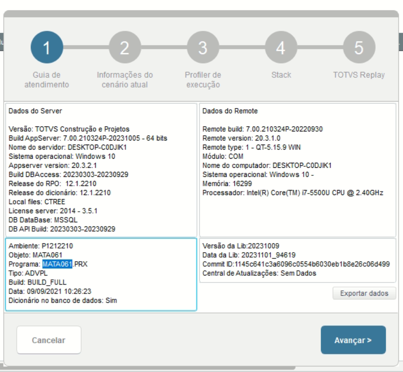
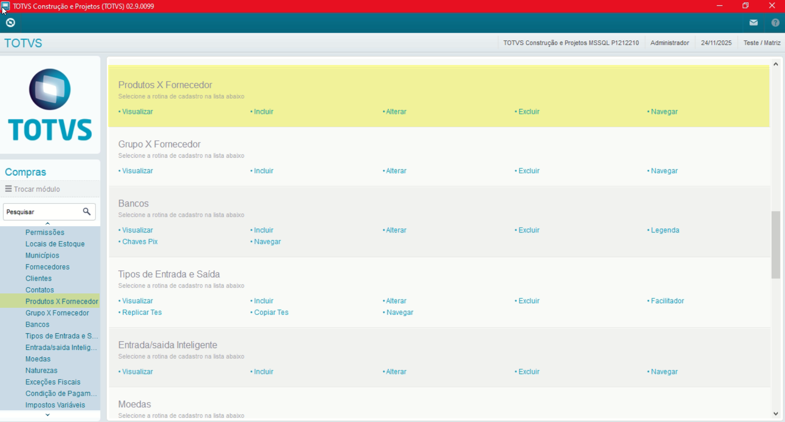
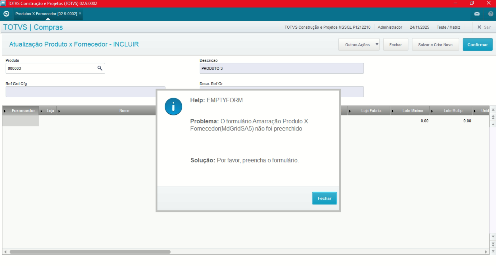
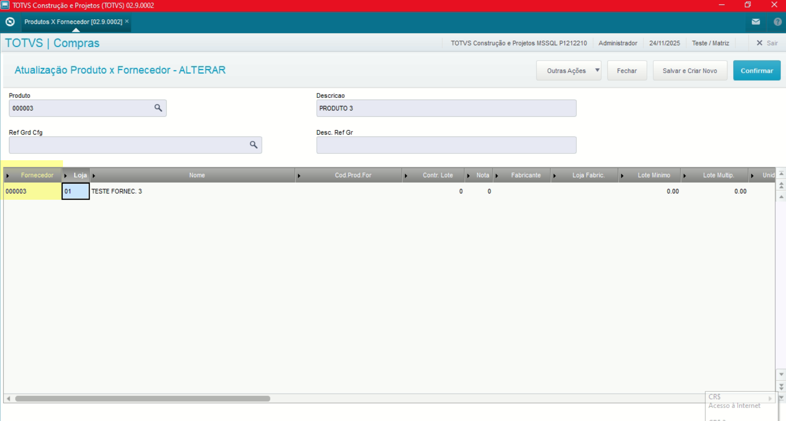
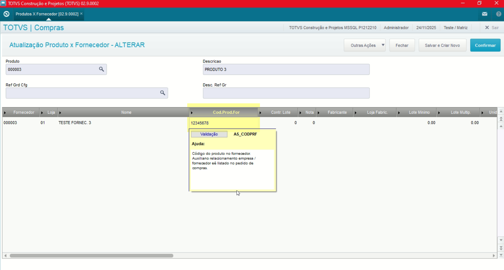
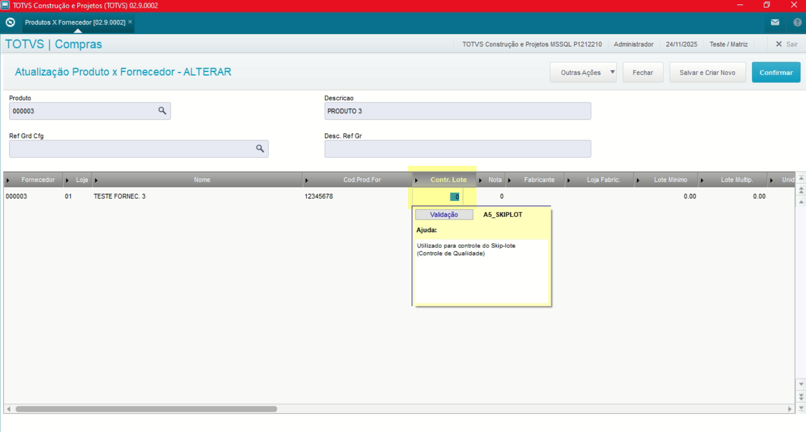

# Entedimento inicial Módulo Compras

**Cadastro Produtos Fornecedor**

O cadastro de Produtos x Fornecedores feitas no Protheus é feito via **"Módulo 06 - Compras"**, pode ser usado na **amarração entre eles, geração automática de cotações e importação de XMLs e controle de notas.**

De forma mais técnica, as informações cadastradas no Protheus é feita pela rotina padrão **MATA061.PRX** e suas informações podem ser encontradas na tabela **"Amarração Produto x Fornecedor - SA5"**.

[SA5 - Amarração Produto x Fornecedor | ERP Labs](https://erplabs.com.br/SA5)

Rotina Protheus:

---

Acesso a rotina de cadastro de Produtos Fornecedor via Módulo Compras:

A rotina padrão de Produtos x Fornecedor contém as seguintes operações, sendo:

- **Inclusão**
- **Alteração**
- **Consulta**
- **Exclusão**

Em caso de inclusão, deve seguir a regra de preenchimento dos campos obrigatórios, identificados com o **"\*"** em sua descrição.

Ao informar o Fornecedor, aponta que o Fornecedor **informado no caso fornecerá o produto em questão.**

## Observações

- **Código Produto Fornecedor**

Caso seja utilizado a amarração do Produto e Fornecedor para importação de XML, o campo é utilizado para identificação. Sendo informado quando realizada a importação automática será feita a amarração para o produto em questão.

- **Control. Lote**

Possui o mesmo contexto que o campo **Código Produto Fornecedor**, utilizado na amarração para o produto em questão.

---

## Autor

**Cristian Gustavo** | Consultor e desenvolvedor TOTVS Protheus

- [LinkedIn Cristian Gustavo](https://www.linkedin.com/in/cristian-gustavo-719aa71b2/)
- [GitHub Cristian Gustavo](https://github.com/crsgustav0)

---

    Desenvolvido e documentado por: Cristian Gustavo
    Data início: 17/11/2025
