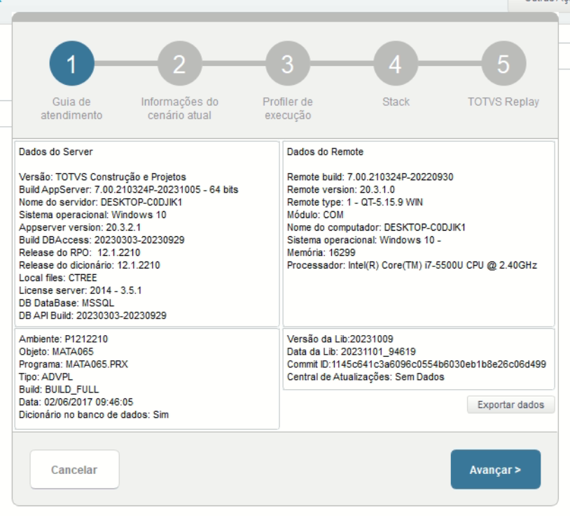
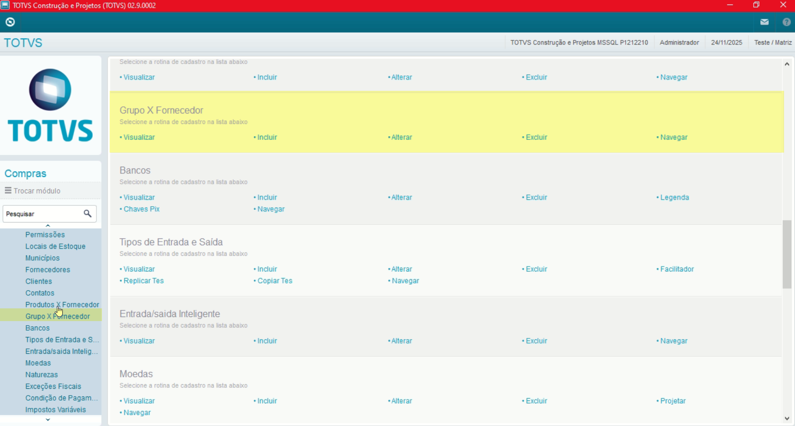
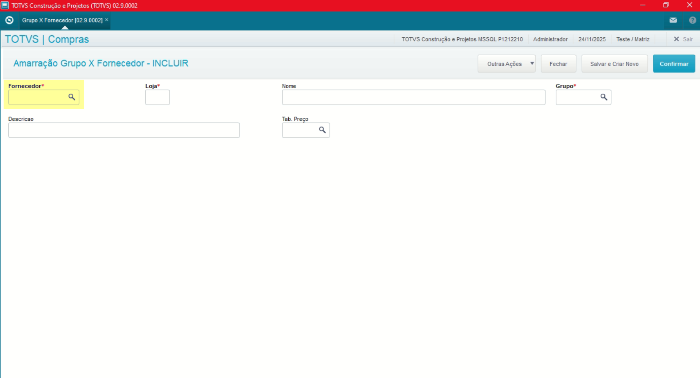
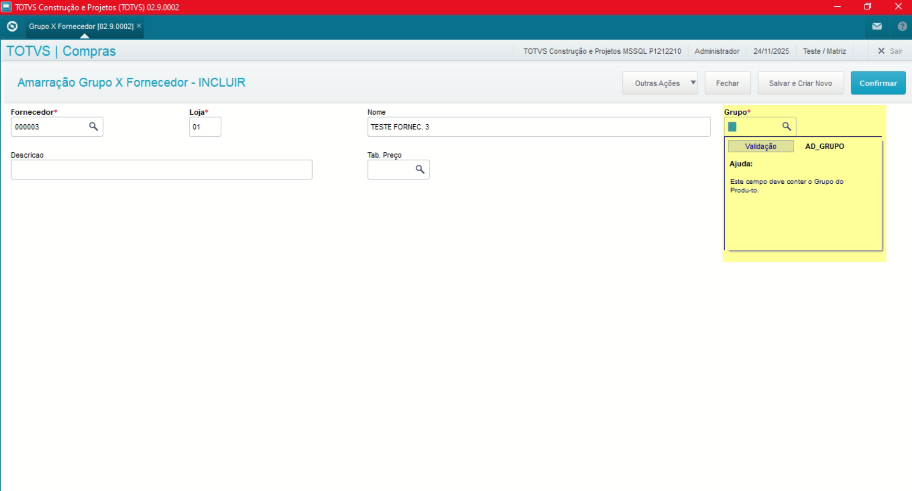
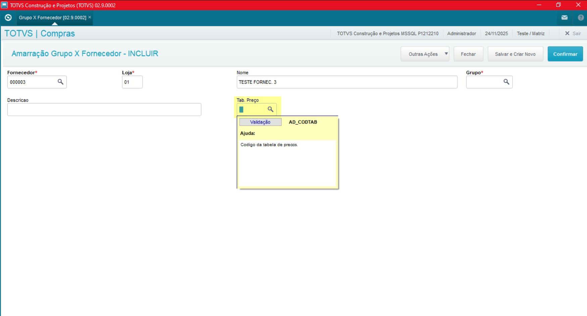

# Entedimento inicial Módulo Compras

**Cadastro Grupo Fornecedor**

O cadastro de Grupo x Fornecedores feitas no Protheus é feito via **"Módulo 06 - Compras"**.

De forma mais técnica, as informações cadastradas no Protheus é feita pela rotina padrão **MATA065.PRW** e suas informações podem ser encontradas na tabela **"Amarração Grupo x Fornecedor - SAD"**.

[SAD - Grupo x Fornecedor | ERP Labs](https://erplabs.com.br/SAD)

Rotina Protheus:

**Obs: A rotina de Grupos x Fornecedores é bastante semelhante a rotina de Produtos x Fornecedores porém, faz faz a divisão por Grupos.**

---

Acesso a rotina de cadastro de Grupo x Fornecedores via Módulo Compras:

A rotina padrão de Fornecedores contém as seguintes operações, sendo:

- **Inclusão**
- **Alteração**
- **Consulta**
- **Exclusão**

Em caso de inclusão, deve seguir a regra de preenchimento dos campos obrigatórios, identificados com o **"/"** em sua descrição.

---

### Observações

- **Grupo**

Sobre o campo **"Grupo"** o mesmo é usado nas amarrações do cadastro.

- **Tabela de Preço**

Sobre o campo **"Tabela de Preço"** campo relacionado a tabela de Preços do Fornecedor, utilizado sobre a parte de Adm. de Compras.

---

## Autor

**Cristian Gustavo** | Consultor e desenvolvedor TOTVS Protheus

- [LinkedIn Cristian Gustavo](https://www.linkedin.com/in/cristian-gustavo-719aa71b2/)
- [GitHub Cristian Gustavo](https://github.com/crsgustav0)

---

    Desenvolvido e documentado por: Cristian Gustavo
    Data início: 17/11/2025
