# Entedimento inicial Módulo Compras

**Cadastro Condições de Pagamento**

O cadastro de Condições de Pagamento feitas no Protheus é feito via **"Módulo 06 - Compras"**.

De forma mais técnica, as informações cadastradas no Protheus é feita pela rotina padrão **MATA360.PRW** e suas informações podem ser encontradas na tabela **"Condições de Pagamento - SE4"**.

[SE4 - Condições de Pagamento | ERP Labs](https://erplabs.com.br/SE4)

Rotina Protheus:

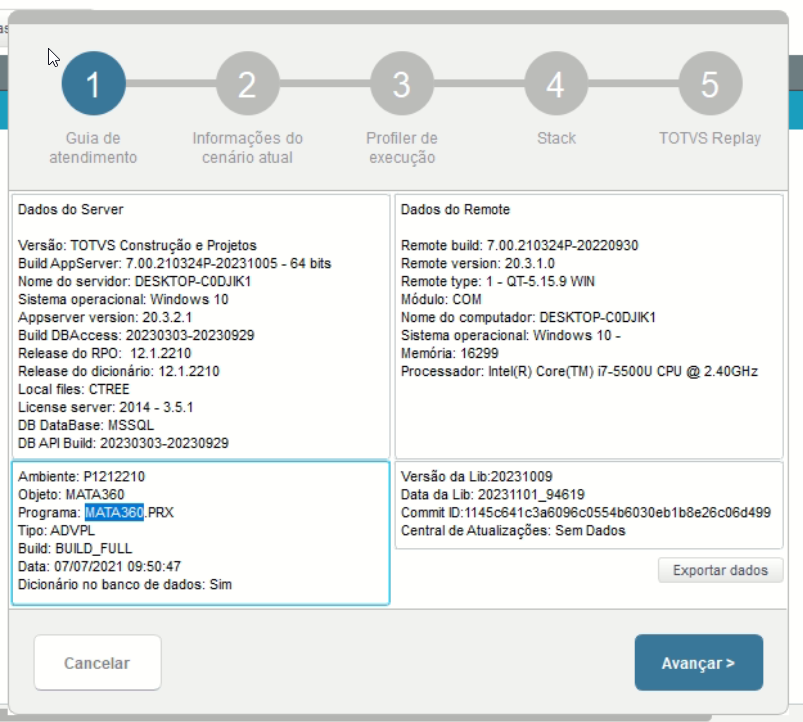

---

Acesso a rotina de cadastro de Condição de Pagamento via Módulo Compras:

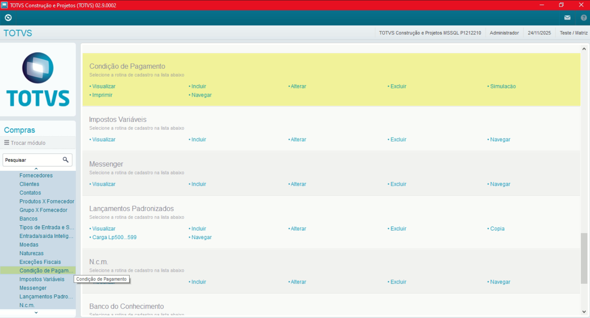

A rotina padrão de Condições de Pagamento contém as seguintes operações, sendo:

- **Inclusão**
- **Alteração**
- **Consulta**
- **Exclusão**

Em caso de inclusão, deve seguir a regra de preenchimento dos campos obrigatórios, identificados com o **"\*"** em sua descrição.

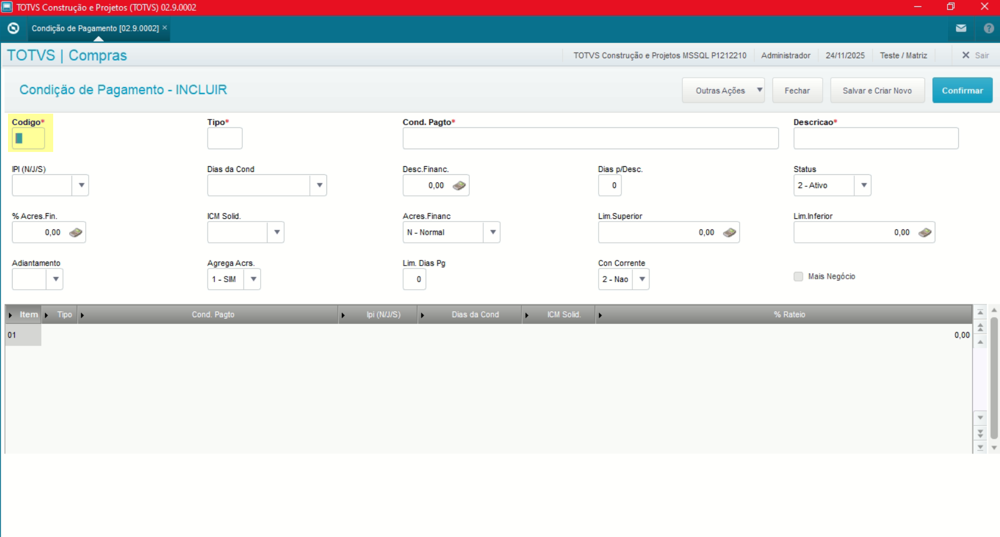

---

No menu Outras Ações, é possível encontrar as seguintes opções, sendo:

- **Simulação**: Referente a simulação referente as regras de pagamento, verificação de registros, valores.

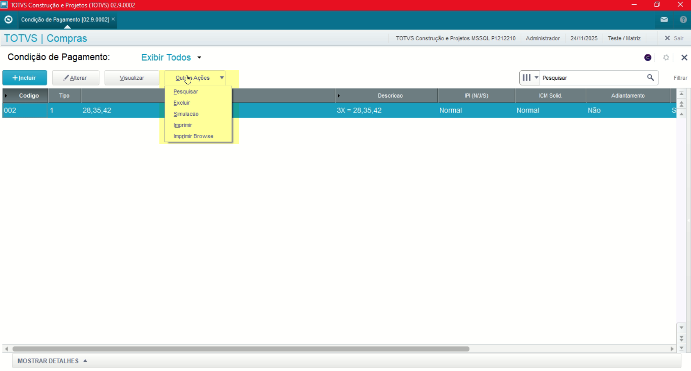
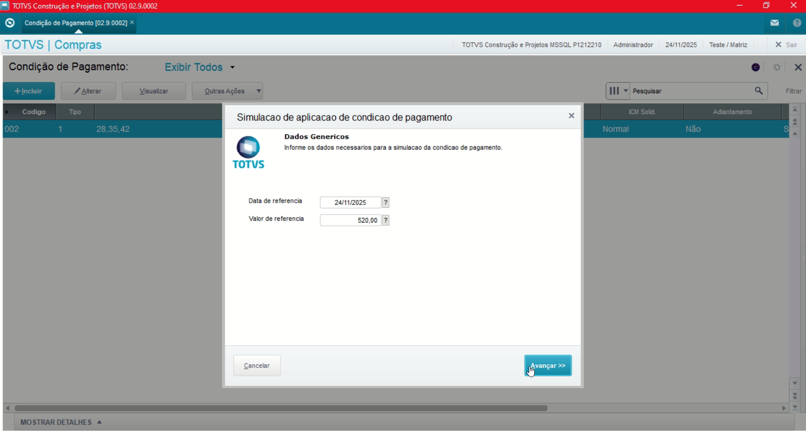

---

## Observações

- **Código**

Informe manual do campo **"Código"**, necessário atentar-se sobre a sequência e padronização do seu cadastro.

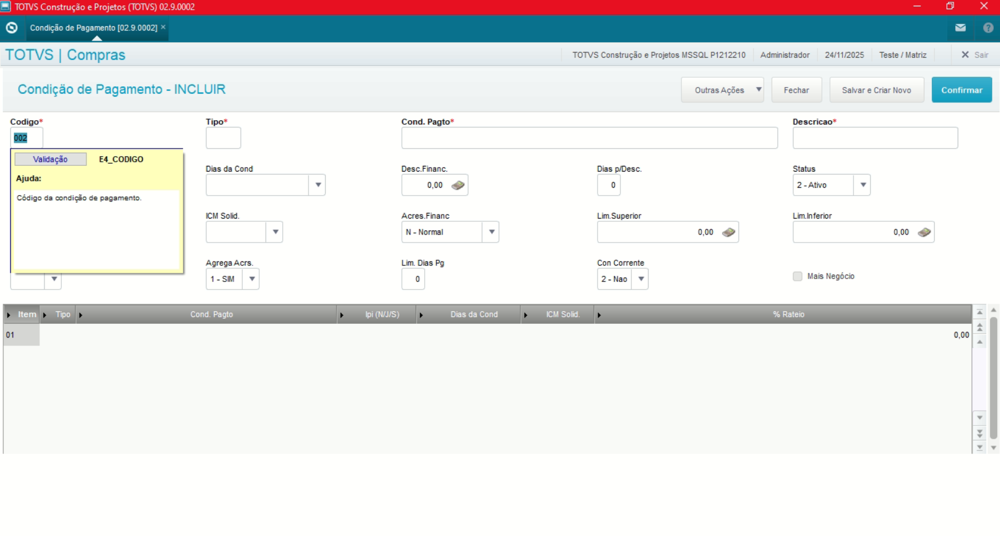

- **Tipo**

Informe manual do campo **"Tipo"**, utilizado a opção **"1"** entre as disponíveis sendo:

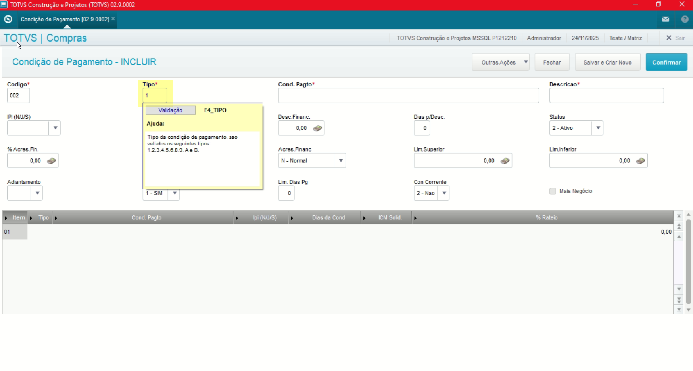

**Documentação Tipo (E4_TIPO)**:

- [Os 9 Tipos De Condição De Pagamento No Protheus E Como Cadastrar | Qive ](https://qive.com.br/blog/tipos-de-condicao-de-pagamento-protheus)

- **Cond. Pagamento**

Referente ao intervalo de pagamento, podendo ser informado diretamente em 30 dias, deve informar o valor **"30"**, caso possua mais de um intervalo de pagamento **"30, 35, 42"** sendo atrelado ao campo **"Tipo"** informado anteriormente como **"1"**.

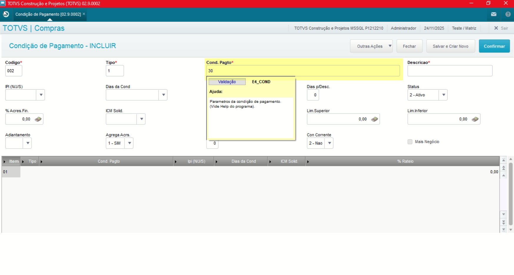

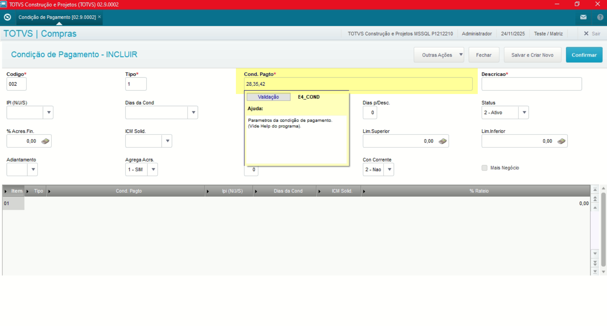

- **Descrição**

Referente a Descrição da Cond. de Pagamento, o valor será exibido em consultas como Nota Entrada, Pedido de Compras.

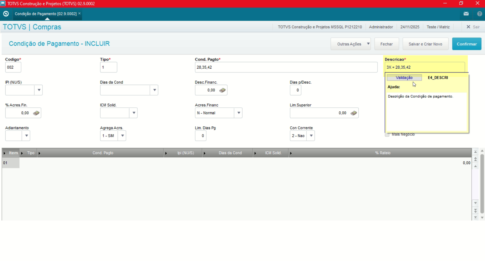

- **Dias da Condição**

Condição que define a regra referente os dias da Condição de Pagamento criada.

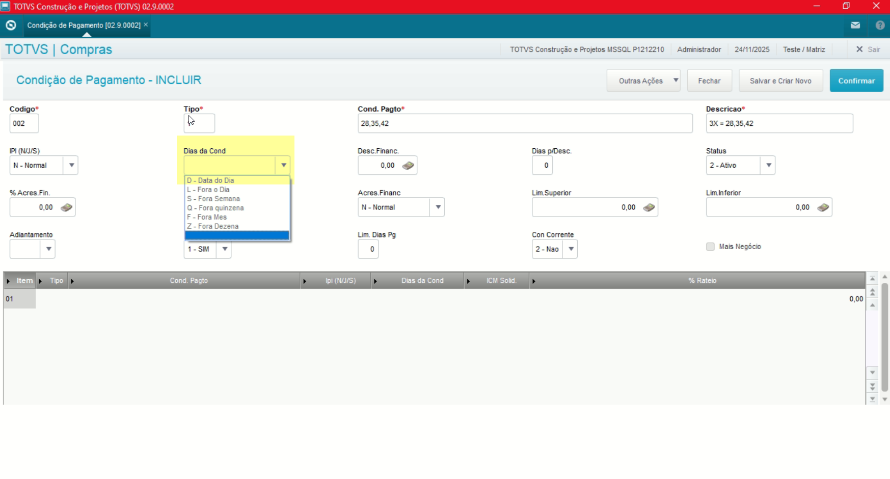

- **Desconto Financeiro**

Valor caso possua desconto financeiro.

- **Dias p/ Desconto**

Valor referente ao dias para desconto em caso possua tratamento de duplicatas.

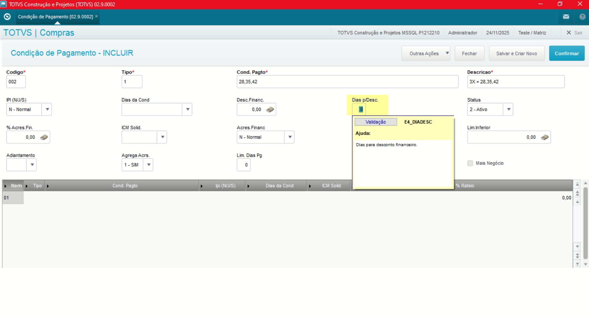

---

## Autor

**Cristian Gustavo** | Consultor e desenvolvedor TOTVS Protheus

- [LinkedIn Cristian Gustavo](https://www.linkedin.com/in/cristian-gustavo-719aa71b2/)
- [GitHub Cristian Gustavo](https://github.com/crsgustav0)

---

    Desenvolvido e documentado por: Cristian Gustavo
    Data início: 17/11/2025
