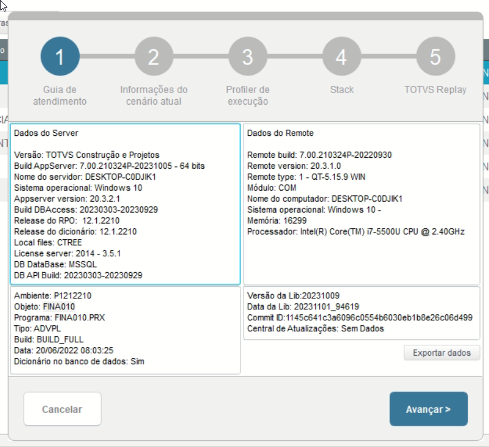
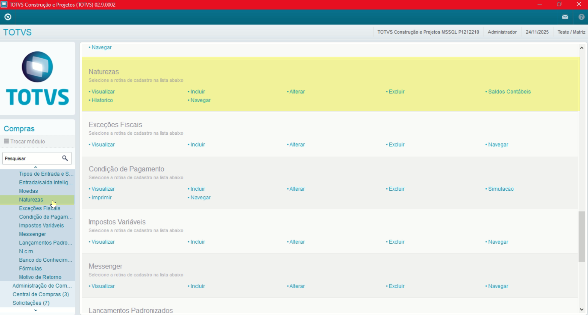
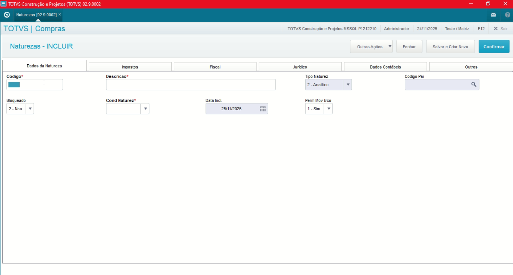
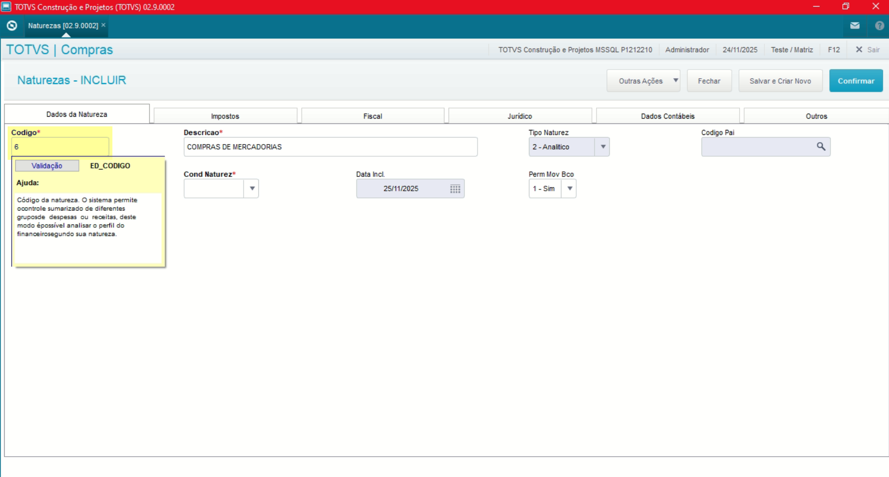
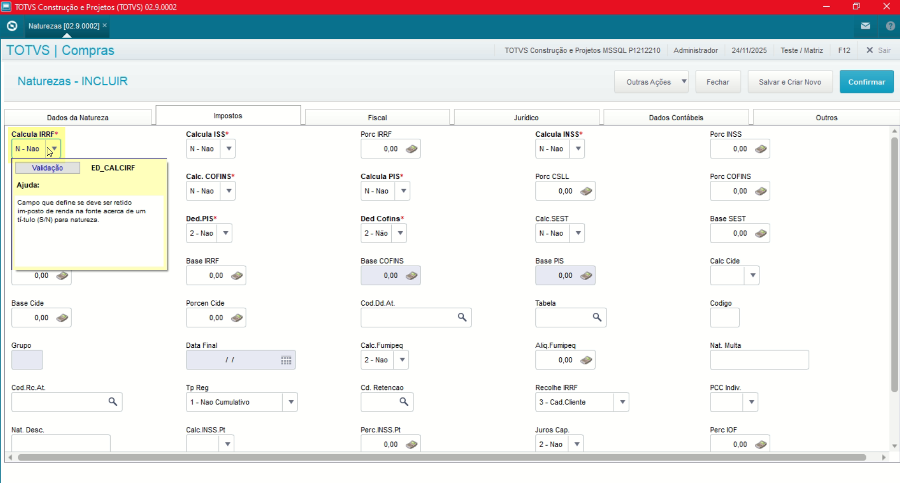
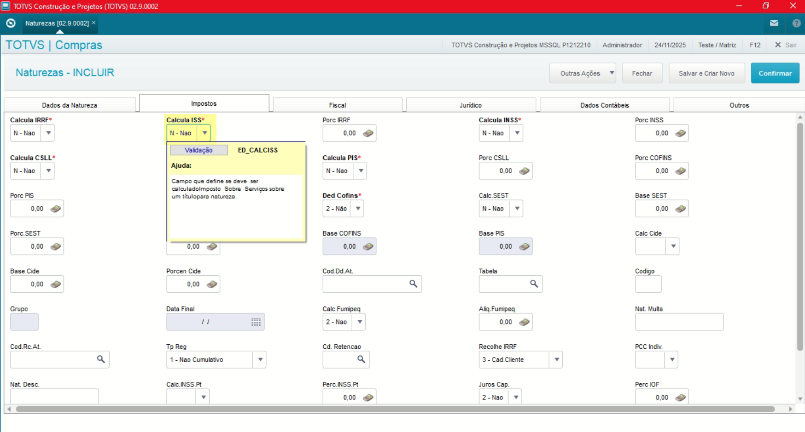
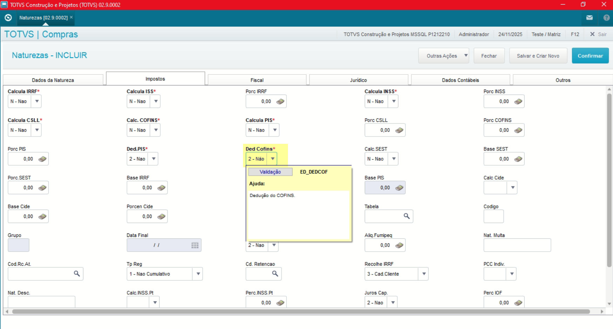

# Entedimento inicial Módulo Compras

**Cadastro Naturezas**

O cadastro de Naturezas feitas no Protheus é feito via **"Módulo 06 - Compras"**.

De forma mais técnica, as informações cadastradas no Protheus é feita pela rotina padrão **FINA010.PRX** e suas informações podem ser encontradas na tabela **"Naturezas - SED"**.

**Obs: Funciona como um classificador das operações financeiras tanto Contas a Pagar quanto Contas a Receber.**

[SED - Naturezas | ERP Labs](https://erplabs.com.br/SED)

Rotina Protheus:

Obs: O cadastro de Naturezas serve também para o Retenção de Impostos, sendo:

- PIS
- COFINS
- CSLL
- Imposto de Renda
- INSS

Então Notas de Entrada que sofram retenção devem ter as suas retenções no Cadastro de Naturezas.

---

Acesso a rotina de cadastro de Natureza via Módulo Compras:

A rotina padrão de Naturezas contém as seguintes operações, sendo:

- **Inclusão**
- **Alteração**
- **Consulta**
- **Exclusão**

Em caso de inclusão, deve seguir a regra de preenchimento dos campos obrigatórios, identificados com o **"\*"** em sua descrição.

---

## Aba "Dados da Natureza"

- **Código do Tipo**

Define o Tipo de Entrada, o código define se o tipo é **"Entrada"** ou **"Saída"**.

Obs: Todos os código entre o intervalo de **"001"** até **"630"** se trata de Tipo Entrada.

## Aba "Impostos"

**Obs: Nessa aba será definido o que será retido ou não. Importante ressaltar que funciona em conjunto com o Cadastro de Fornecedor**

- **Código do Tipo**

Define se será feito o Cálculo de Imposto de Renda sobre Renda

- **Calcula ISS**

Define se será feito o Cálculo de ISS.

**Obs: A mesma regra se aplica para a definição dos demais campos, sendo:**

- **Calcula CSLL**
- **Calcula COFINS**
- **Calcula PIS**

- **Deduz PIS**

Define se será feito a dedução do PIS, em caso de "Sim" se trata de uma retenção.

**Obs: A mesma regra se aplica para a definição dos demais campos, sendo:**

- **Ded. PIS**
- **Ded. COFINS**
- **Ded. INSS**

**Os campos relacionados a deduções funcionam em conjunto com os campos que informam se será feito o cálculo ou não, como exemplo "Calcula COFINS" e "Ded. COFINS"**. Desta forma caso os campos de cálculo sejam informados como **"Não"** os campos de deduções serão desconsiderados.

---

## Autor

**Cristian Gustavo** | Consultor e desenvolvedor TOTVS Protheus

- [LinkedIn Cristian Gustavo](https://www.linkedin.com/in/cristian-gustavo-719aa71b2/)
- [GitHub Cristian Gustavo](https://github.com/crsgustav0)

---

    Desenvolvido e documentado por: Cristian Gustavo
    Data início: 17/11/2025
