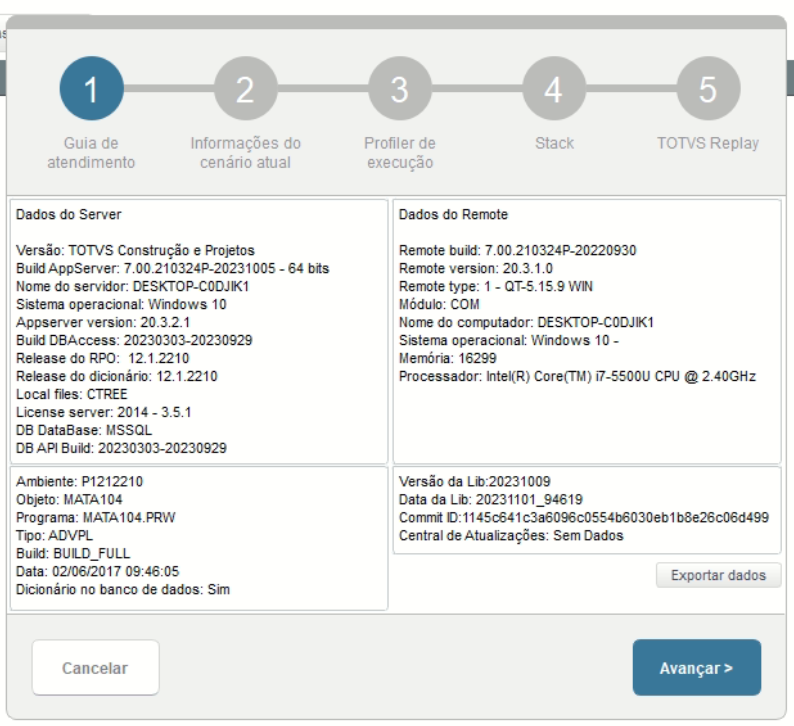
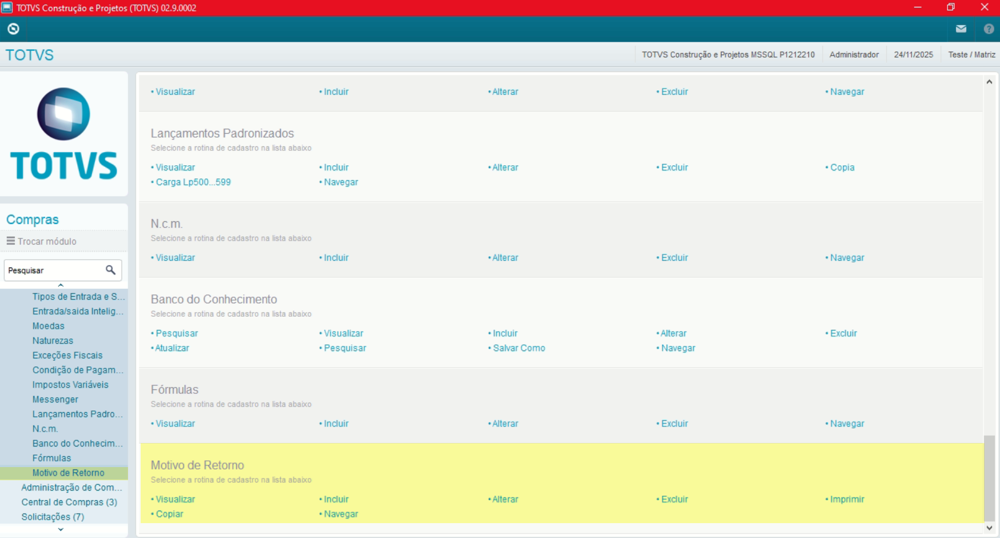
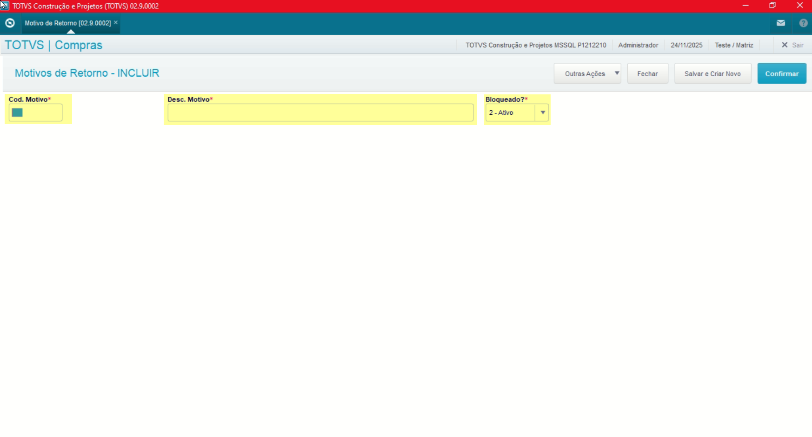

# Entedimento inicial Módulo Compras

**Cadastro Motivos de Retorno**

O cadastro de Motivos de Retorno feitas no Protheus é feito via **"Módulo 06 - Compras"**.

De forma mais técnica, as informações cadastradas no Protheus é feita pela rotina padrão **MATA104.PRX** e suas informações podem ser encontradas na tabela **"Motivos de Retorno - DHI"**.

**Obs: A rotina é utilizada é utilizada para informar os informações, motivos para o retorno de uma nota.**

[DHI - Motivos de Retorno | ERP Labs](https://erplabs.com.br/DHI)

Rotina Protheus:

---

Acesso a rotina de cadastro de NCM via Módulo Compras:

A rotina padrão de Motivos de Retorno contém as seguintes operações, sendo:

- **Inclusão**
- **Alteração**
- **Consulta**
- **Exclusão**

Em caso de inclusão, deve seguir a regra de preenchimento dos campos obrigatórios, identificados com o **"\*"** em sua descrição.

---

## Autor

**Cristian Gustavo** | Consultor e desenvolvedor TOTVS Protheus

- [LinkedIn Cristian Gustavo](https://www.linkedin.com/in/cristian-gustavo-719aa71b2/)
- [GitHub Cristian Gustavo](https://github.com/crsgustav0)

---

    Desenvolvido e documentado por: Cristian Gustavo
    Data início: 17/11/2025
