# Administração Módulo Compras

**Rotina Tabela de Preços do Fornecedor**

O cadastro de Tabela de Preços do Fornecedor feitas no Protheus é feito via **"Módulo 06 - Compras"**.

De forma mais técnica, as informações cadastradas no Protheus é feita pela rotina padrão **COMA010.PRX** e suas informações podem ser encontradas na tabelas **"Tabela de Preços do Fornecedor - AIA"** e **"Itens da Tabela de Preços - AIB"**.

**Obs: A rotina é utiliza tabelas como Cabeçalho (AIA) e Itens (AIB), permite o cadastro de tabelas de fornecedores que atendem a empresa, informando preços e condições de pagamento para os fornecedores, podendo ser amarradas a Produtos x Fornecedor**

| **Cad. Prod. x Fornec.** | **Compras** | SA5 | MATA061 | [Cad. Prod. x Fornec.](../../02.Cadastros/03.1.Produtos%20x%20Fornecedor/Cadastro_ProdutosFornecedor.md) |

[AIA - Tabela de Preços do Fornecedor | ERP Labs](https://erplabs.com.br/AIA)

[AIB - Itens Tabela de Preços do Fornecedor | ERP Labs](https://erplabs.com.br/AIB)

Rotina Protheus:

## 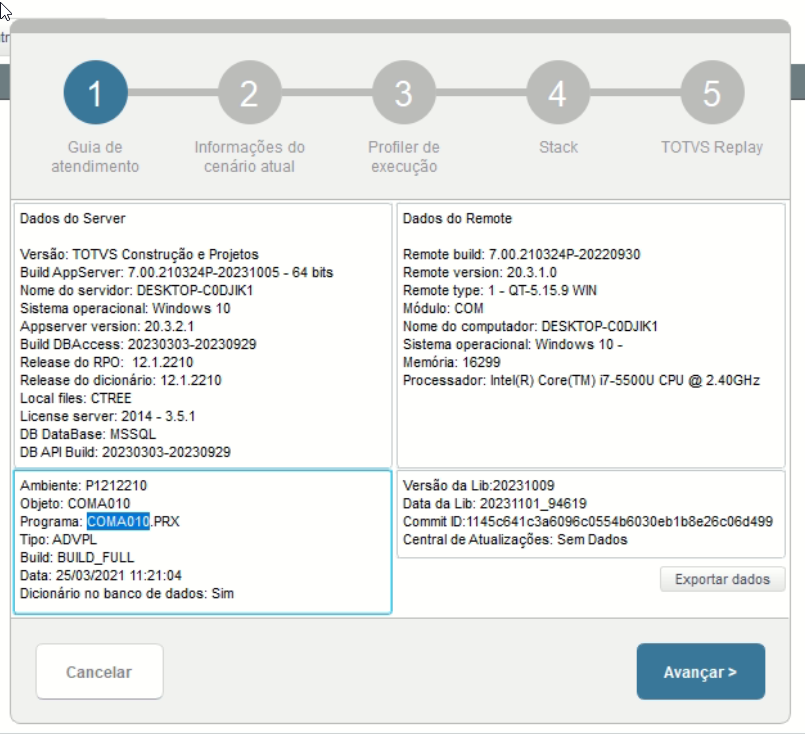

Acesso a rotina de cadastro de Tabela de Preços do Fornecedor via Módulo Compras:

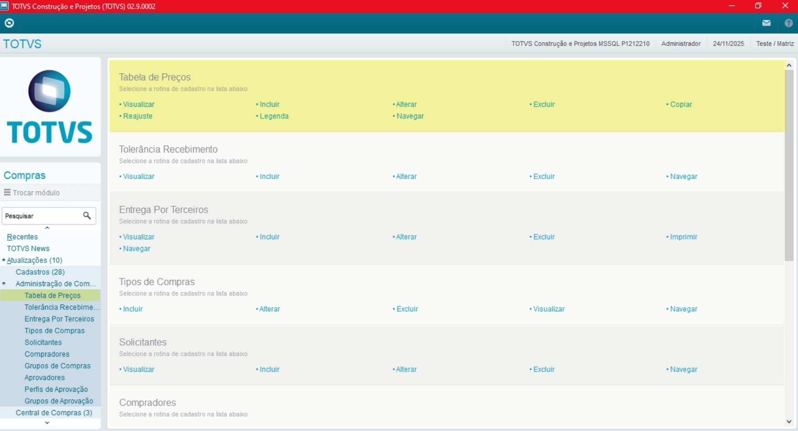

A rotina padrão de Tabela de Preços contém as seguintes operações, sendo:

- **Inclusão**
- **Alteração**
- **Consulta**
- **Exclusão**

Em caso de inclusão, deve seguir a regra de preenchimento dos campos obrigatórios, identificados com o **"/"** em sua descrição.

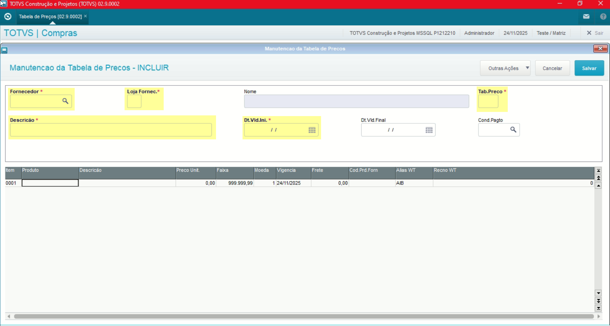

No menu Outras Ações, é possível encontrar as seguintes opções, sendo:

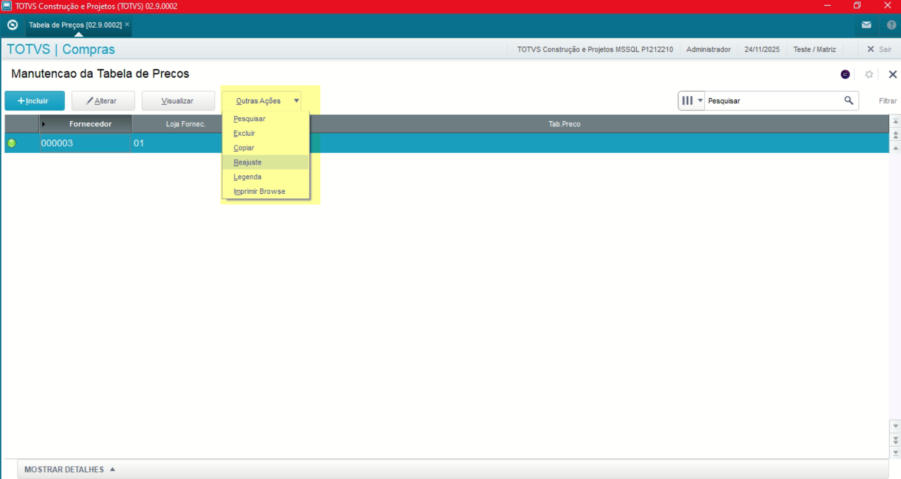

- **Reajuste**: Opção que possibilita informar para fazer o reajuste, aumento informado nos parâmetros nas tabelas de preços retornadas.

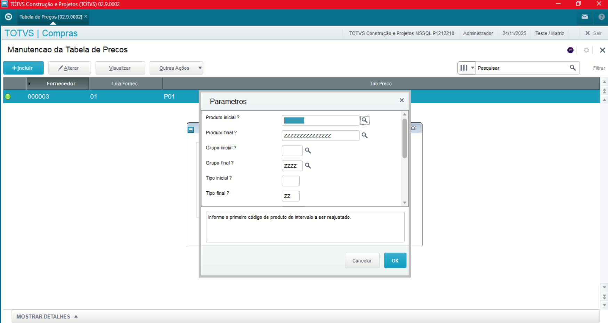
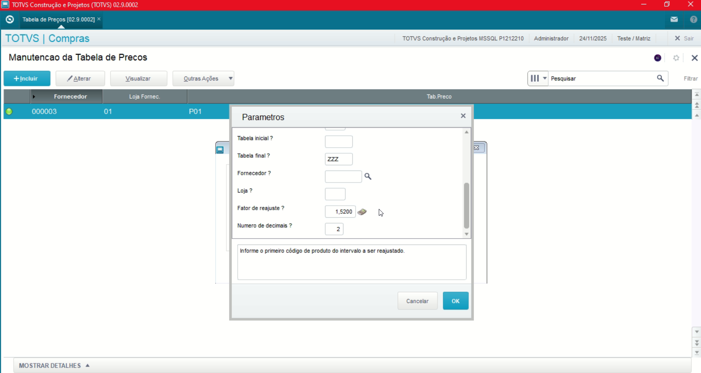

## Campos Cabeçalho (AIA)

- **Data Valida Inicial**

Define a data inicial da tabela de preço.
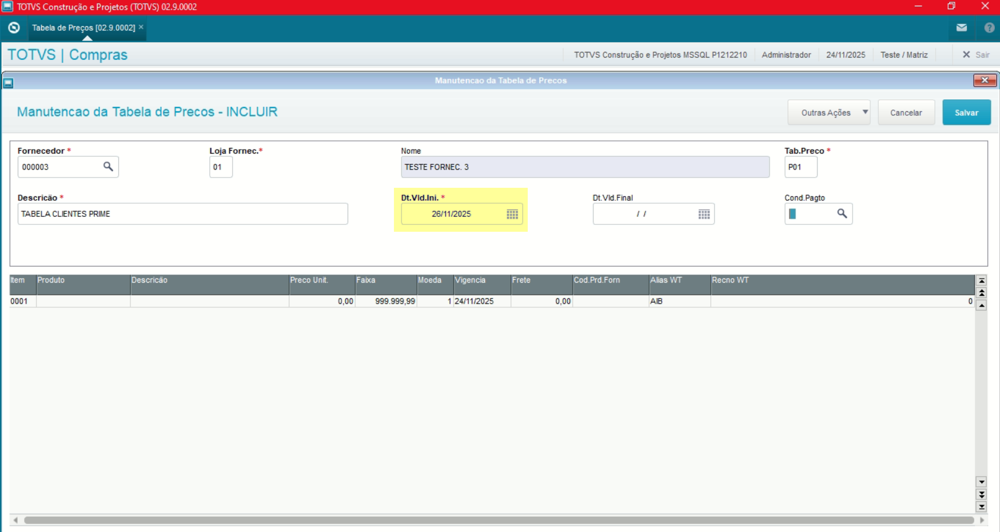

**Obs: Caso a tabela de preço possua data final, o campo "Dt.Vld.Final" deve ser informado.**

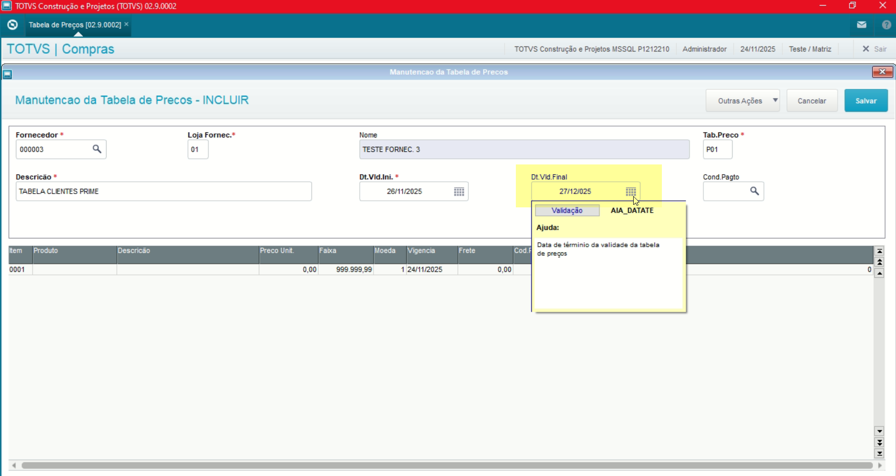

- **Cond. Pagamento**

Caso a tabela de preço possua uma condição de pagamento **específica** deve ser informada, **caso contrário o campo deve ser deixado em branco.**

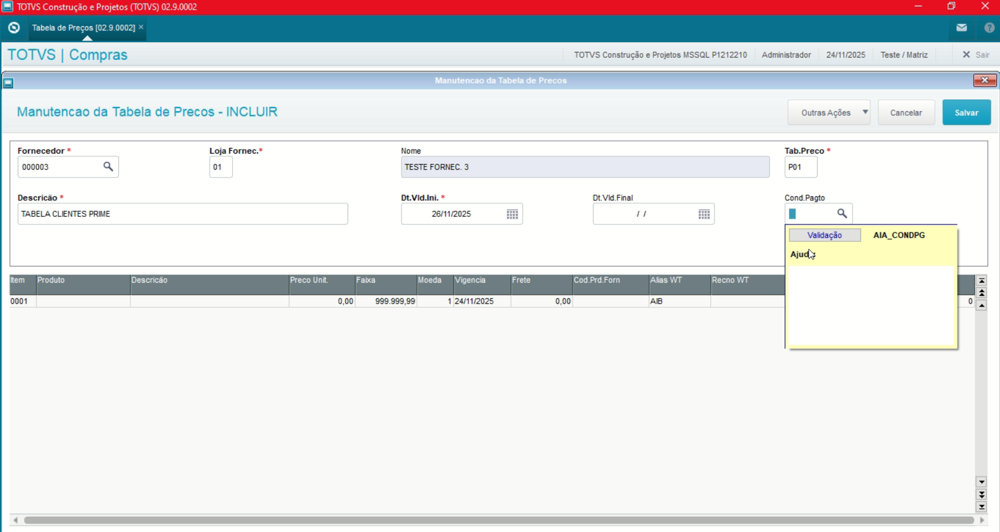

## Campos Itens (AIB)

- **Produto**

Define o produto dentro da tabela de preço.

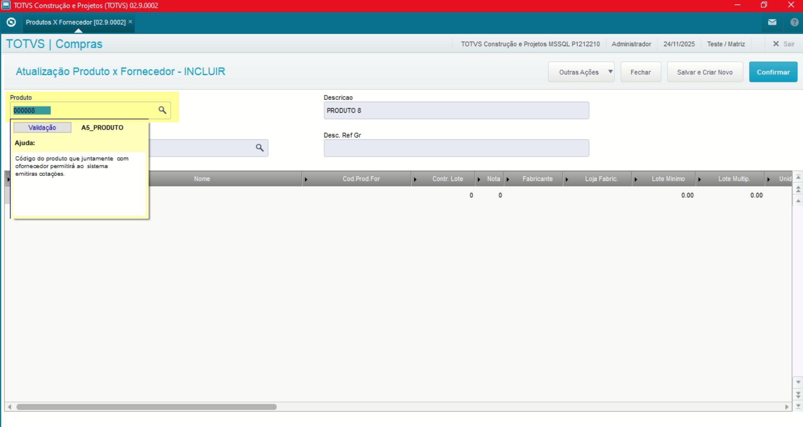

- **Moeda**

Caso possua mais de uma moeda utilizada no pagamento deve ser informada.

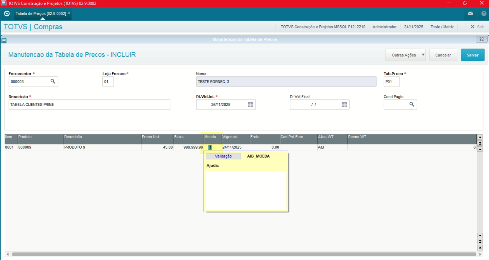

- **Frete**

Caso possua porcentagem em base ao valor de frete, deve ser informado.

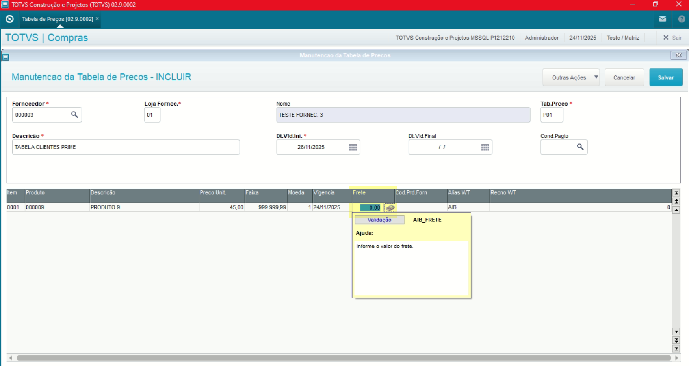

- **Código Produto Fornecedor**

Caso utilize Código Produto Fornecedo pode ser informado. **No entanto se já utilizar o cadastro de Produto x Fornecedor informando esse código no cadastro de Produto x Fornecedor não é necessário informar novamente**.

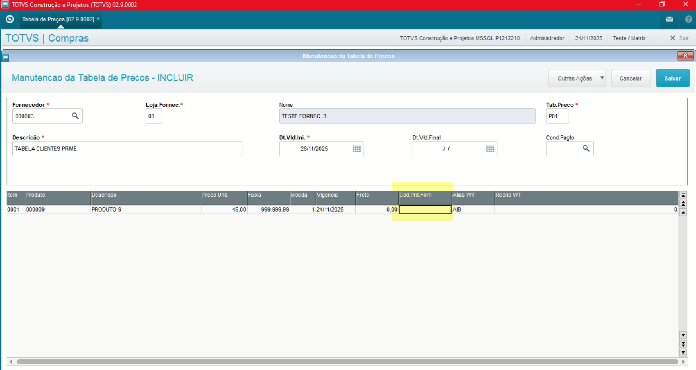

## Amarração Tabela Preços x Produto x Fornecedor

- **Produto**

| **Cad. Prod. x Fornec.** | **Compras** | SA5 | MATA061 | [Cad. Prod. x Fornec.](../../02.Cadastros/03.1.Produtos%20x%20Fornecedor/Cadastro_ProdutosFornecedor.md) |

Definindo o produto:

Definindo o Fornecedor e Loja:

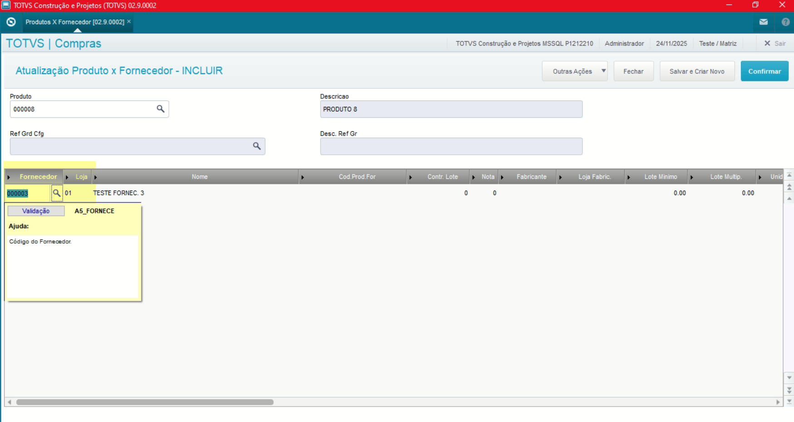

Definindo a tabela de preços:

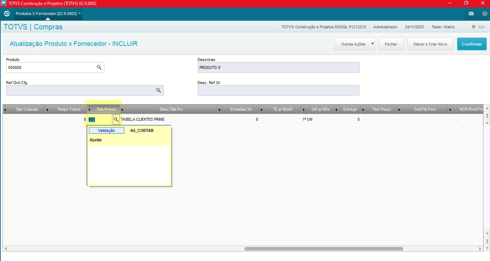

**Obs: Ao fazer a amarração do Produto x Fornecedor juntamente a Tabela de Preços é possível trazer as cotações já relacionadas as tabelas de preços**.

---

## Autor

**Cristian Gustavo** | Consultor e desenvolvedor TOTVS Protheus

- [LinkedIn Cristian Gustavo](https://www.linkedin.com/in/cristian-gustavo-719aa71b2/)
- [GitHub Cristian Gustavo](https://github.com/crsgustav0)

---

    Desenvolvido e documentado por: Cristian Gustavo
    Data início: 17/11/2025
