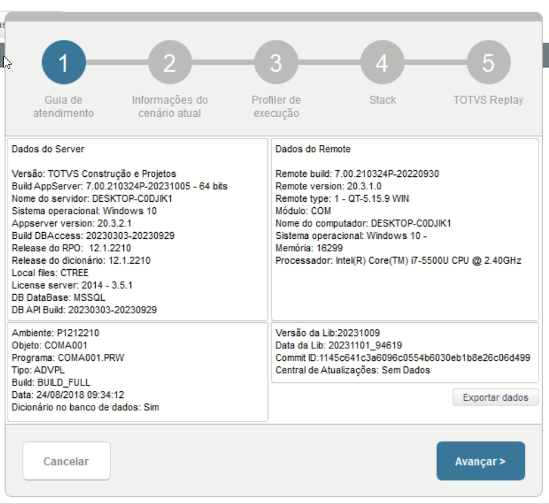
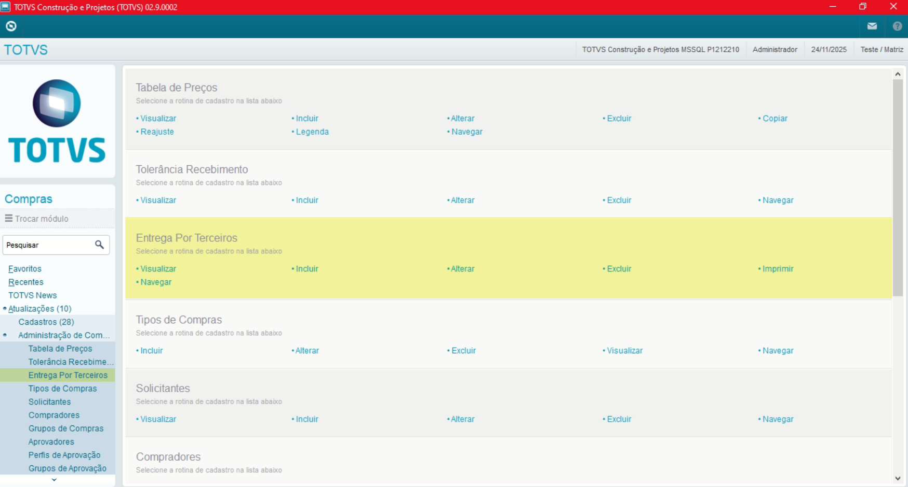
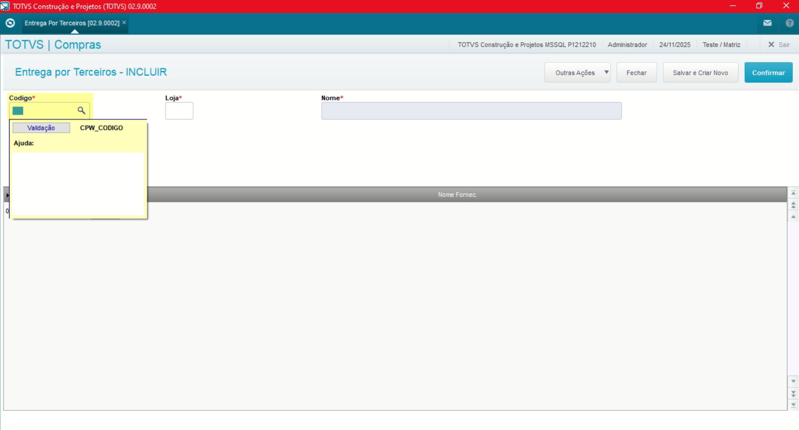
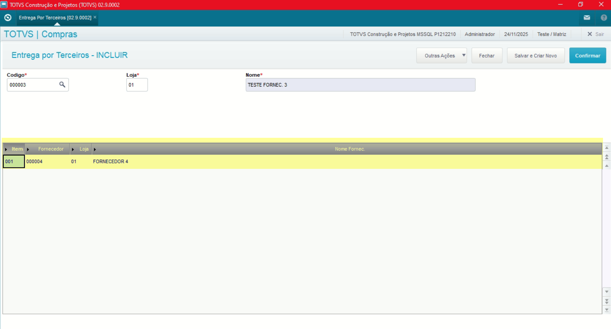

# Administração Módulo Compras

**Rotina Entrega por Terceiros**

O cadastro de Entrega por Terceiros feitas no Protheus é feito via **"Módulo 06 - Compras"**.

De forma mais técnica, as informações cadastradas no Protheus é feita pela rotina padrão **COMA020.PRX** e suas informações podem ser encontradas na tabelas **"Tabela de Grupo do Fornecedor - CPW"** e **"Itens do Grupo do Fornecedor - CPX"**.

**Obs: A rotina tabelas como Cabeçalho (CPW) e Itens (CPX), permite a flexibilização na viabilização de entregas entre Fornecedor e Cliente**.

[CPW - Grupo de Fornecedor | ERP Labs](https://erplabs.com.br/CPW)

[CPX - Itens do Grupo de Fornecedor | ERP Labs](https://erplabs.com.br/CPX)

Rotina Protheus:

Acesso a rotina de cadastro de Entrega por Terceiros via Módulo Compras:

A rotina padrão de Entrega por Terceiros contém as seguintes operações, sendo:

- **Inclusão**
- **Alteração**
- **Consulta**
- **Exclusão**

Em caso de inclusão, deve seguir a regra de preenchimento dos campos obrigatórios, identificados com o **"/"** em sua descrição.

## Observações

- **Código**

Referente ao Código Fornecedor.

- **Informe de itens**

Ao informar os itens, defina-se quais fornecedores podem entregar no lugar do fornecedor acima, dessa forma substituindo.

---

## Autor

**Cristian Gustavo** | Consultor e desenvolvedor TOTVS Protheus

- [LinkedIn Cristian Gustavo](https://www.linkedin.com/in/cristian-gustavo-719aa71b2/)
- [GitHub Cristian Gustavo](https://github.com/crsgustav0)

---

    Desenvolvido e documentado por: Cristian Gustavo
    Data início: 17/11/2025
