# Administração Módulo Compras

**Rotina Solicitantes**

O cadastro de Solicitantes feitas no Protheus é feito via **"Módulo 06 - Compras"**.

De forma mais técnica, as informações cadastradas no Protheus é feita pela rotina padrão **MATA084.PRW** e suas informações podem ser encontradas na tabelas **"Tabela de Grupo do Fornecedor - CPW"** e **"Itens do Grupo do Fornecedor - CPX"**.

**Obs: A rotina tabelas como Cabeçalho (CPW) e Itens (CPX), define quais usuários poderão realizar compras de produtos restritos**.

[CPW - Grupo de Fornecedor | ERP Labs](https://erplabs.com.br/CPW)

[CPX - Itens do Grupo de Fornecedor | ERP Labs](https://erplabs.com.br/CPX)

Rotina Protheus:

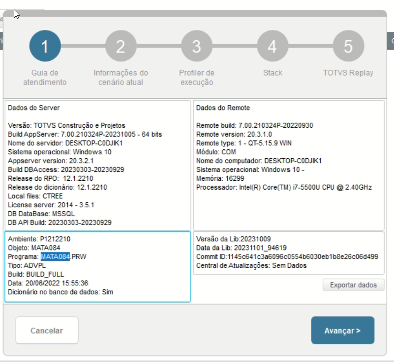

Acesso a rotina de cadastro de Solicitantes via Módulo Compras:

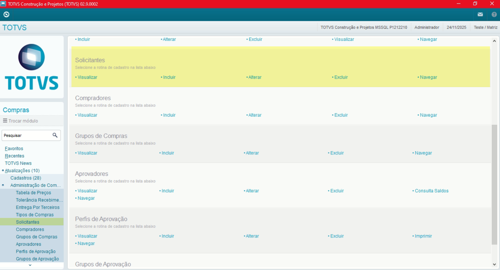

A rotina padrão de Solicitantes contém as seguintes operações, sendo:

- **Inclusão**
- **Alteração**
- **Consulta**
- **Exclusão**

Em caso de inclusão, deve seguir a regra de preenchimento dos campos obrigatórios, identificados com o **"/"** em sua descrição.

## Produtos

- **Código**

Referente ao Código Usuário.

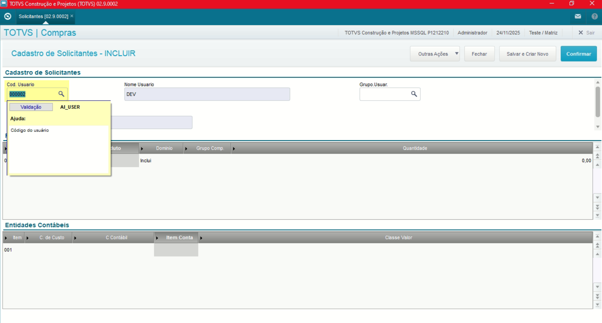

**Obs: É possível também informar via Grupo Usuário porém é necessário manter o campo "Cód. Usuário" vazio**.

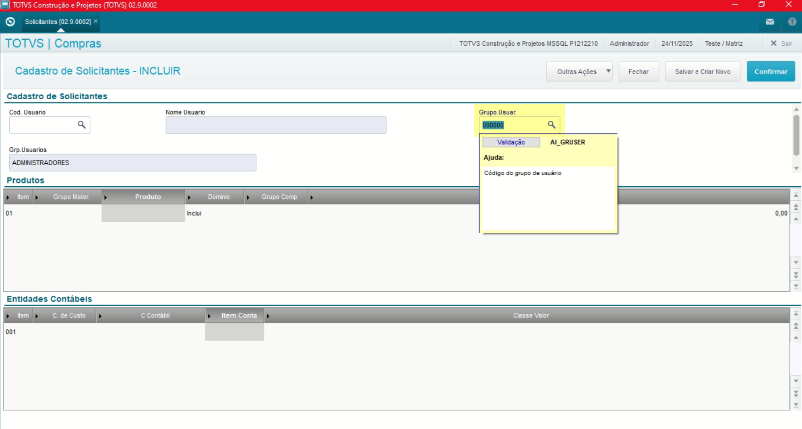

- **Grupo Materiais**

Ao preencher o campo "Grupo Materiais" o campo "Produto" é preenchido com o conteúdo **"\*"** ou seja todos os produtos atrelados ao Grupo informado poderão ser solicitados pelo usuário. **Necessário os produtos serem restritos**

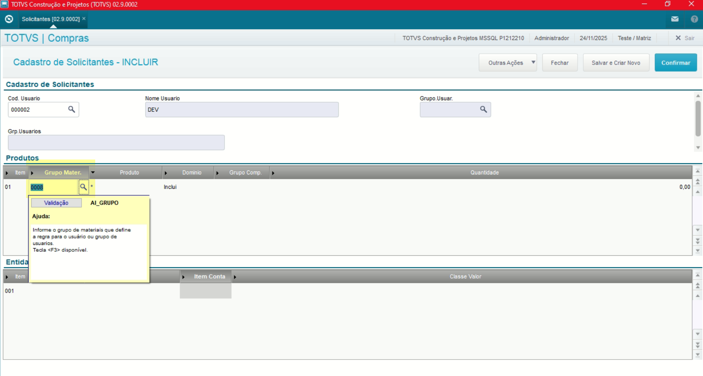

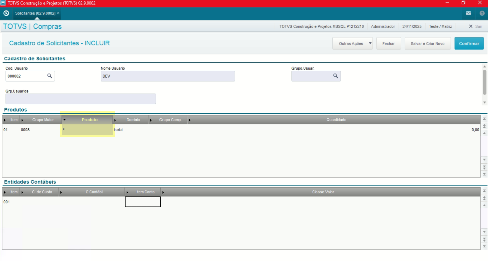

- **Grupo Compra**

Define um grupo de Compras que receberão as Solicitações de Compras, Cotação ou Pedido de Compra.

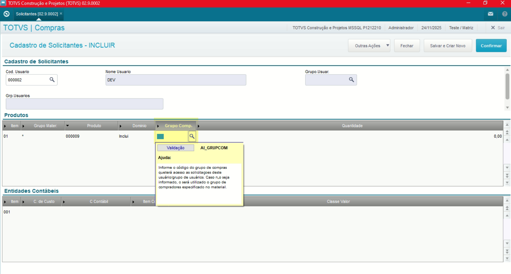

- **Grupo Compra**

Define quantiade permitida para a compra do Produto.

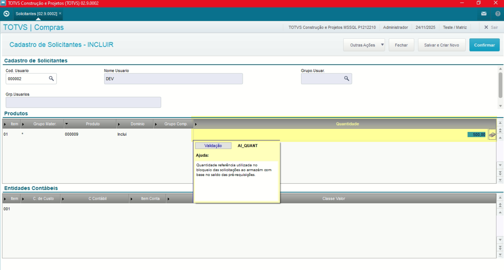

## Entidades Contábeis

- **Grupo Compra**

Pode ser feita a definição por C. Custo também, informando o campo **"C. Custo"**.

**Obs: A mesma regra se aplica para os campos "Conta Contabil" e "Item Conta"**

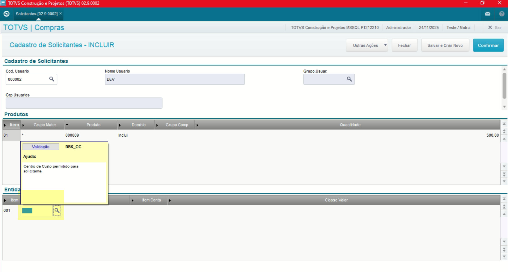

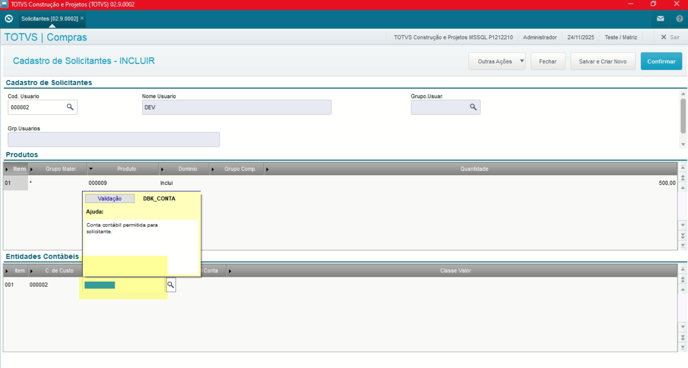

## Produtos Restritos

Verificar via Cadastro de Produtos, se o campo **"Restrito"** está preenchido com a opção **"Sim"**. **Desta forma para que o solicitante possa solicitar o produto é necessário estar preenchido como "Sim", ressaltanto que o cadastro de solicitantes é exclusivo para produtos restritos.**

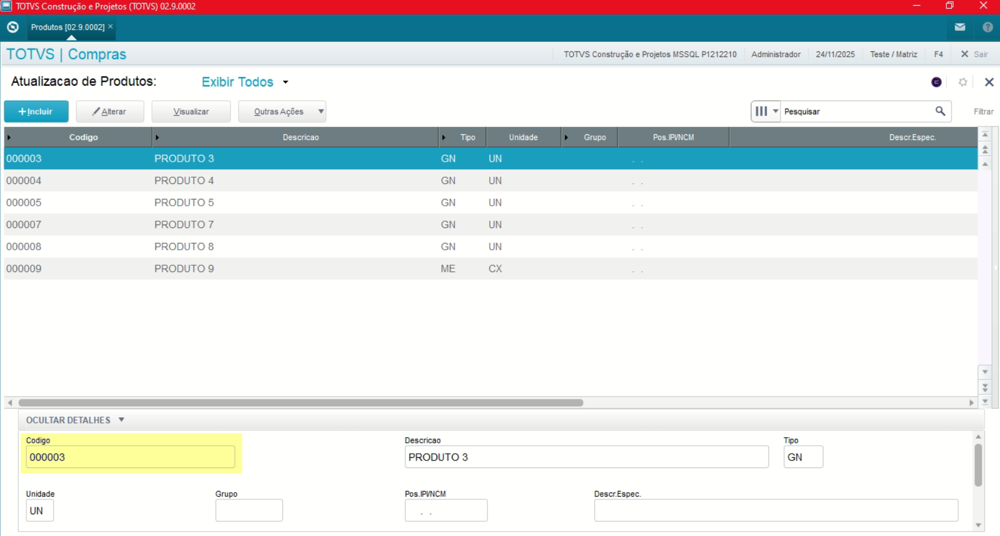

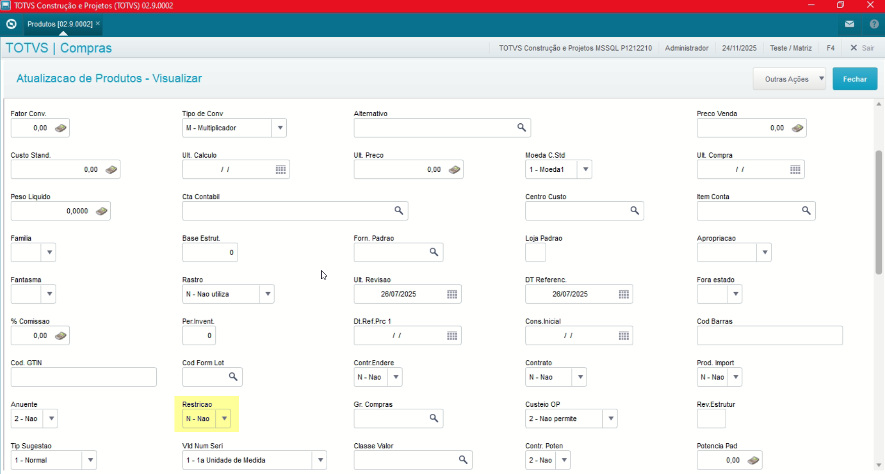

| **Cad. Produtos** | **Compras** | SB5 | MATA010 | [Cad. Produtos](01.Compras/02.Cadastros/02.Produtos/Cadastro_Produtos.md) |

---

## Autor

**Cristian Gustavo** | Consultor e desenvolvedor TOTVS Protheus

- [LinkedIn Cristian Gustavo](https://www.linkedin.com/in/cristian-gustavo-719aa71b2/)
- [GitHub Cristian Gustavo](https://github.com/crsgustav0)

---

    Desenvolvido e documentado por: Cristian Gustavo
    Data início: 17/11/2025
