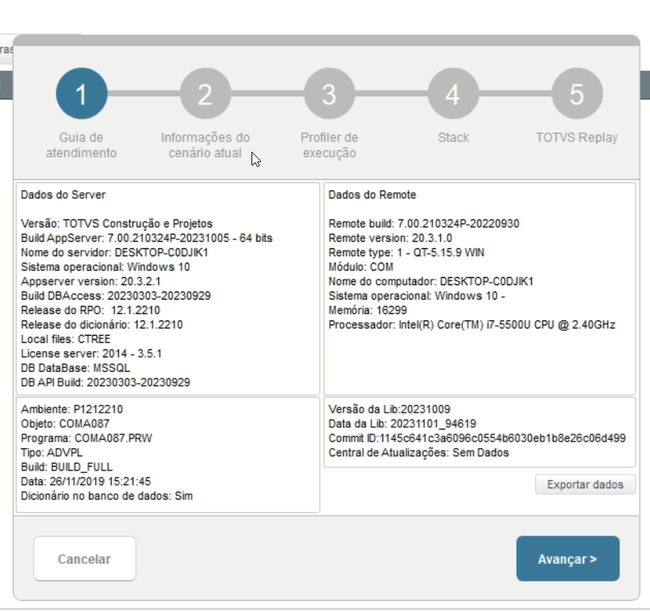
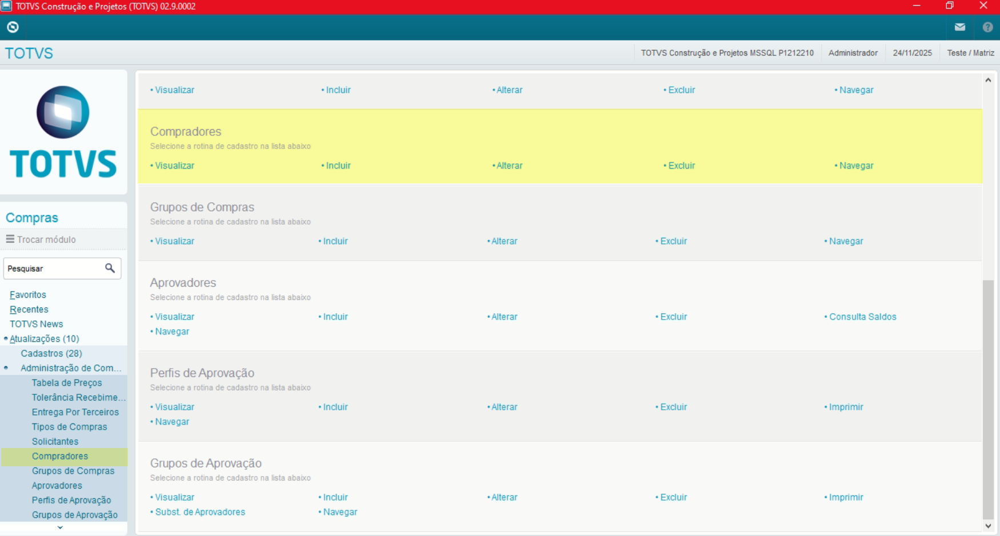
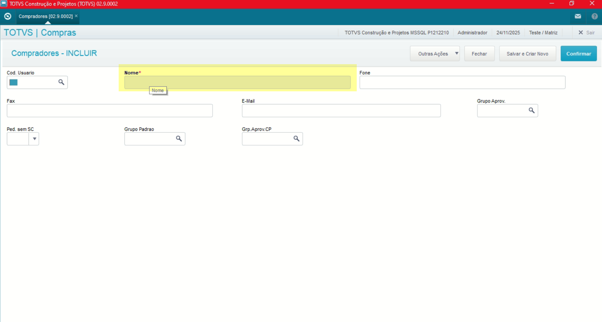
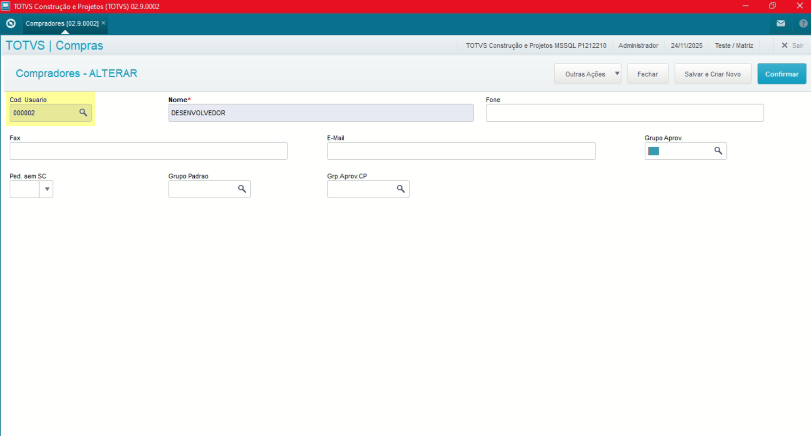
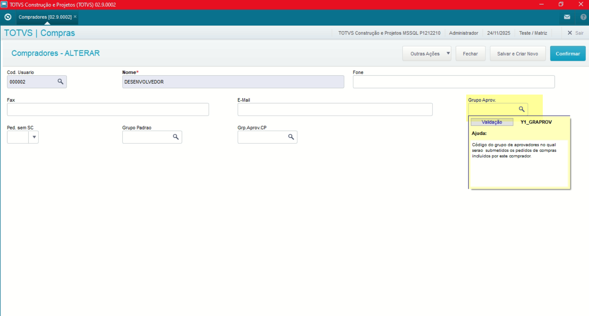
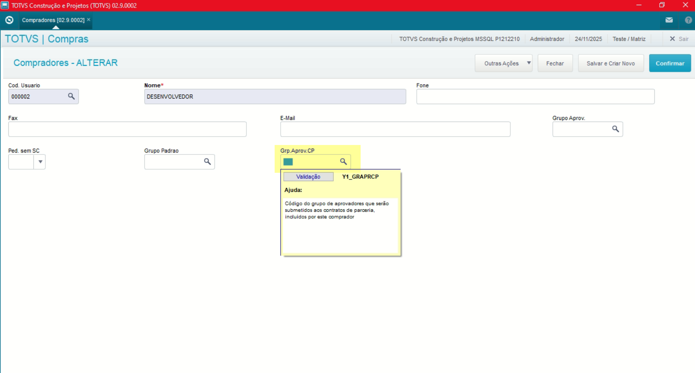

# Administração Módulo Compras

**Rotina Compradores**

O cadastro de Compradores feitas no Protheus é feito via **"Módulo 06 - Compras"**.

De forma mais técnica, as informações cadastradas no Protheus é feita pela rotina padrão **COMA087.PRW** e suas informações podem ser encontradas na tabelas **"Tabela de Compradores - SY1"**.

**Obs: A rotina define quais usuários que poderão cadastrar Pedidos de Compra ou Contratos de Parceria utilizando o Controle de Alçadas, vale ressaltar que caso não possua nenhum Comprador cadastrado, todos os usuários com acesso ao Módulo de Compras poderão também cadastrar Pedidos de Compra ou Contratos de Parceria utilizando o Controle de Alçadas**.

[SY1 - Compradores | ERP Labs](https://erplabs.com.br/SY1)

Rotina Protheus:

Acesso a rotina de cadastro de Compradores via Módulo Compras:

A rotina padrão de Compradores contém as seguintes operações, sendo:

- **Inclusão**
- **Alteração**
- **Consulta**
- **Exclusão**

Em caso de inclusão, deve seguir a regra de preenchimento dos campos obrigatórios, identificados com o **"/"** em sua descrição.

## Observações

- **Código Usuário**

Referente ao Código Usuário.

- **Grupo Aprovador (Pedido)**

Referente ao Grupo Aprovador, **ao preencher o campo todos as compras feitas pelo usuário deverão ser aprovados pelo Grupo Aprovador informado**

- **Pedido sem Solicitação de Compras**

Define se o comprador **poderá criar Pedidos de Compra sem a Solicitação de Compra, desta forma incluindo diretamente**.

- **Grupo Aprovador (Contrato)**

Referente ao Grupo Aprovador de Contrato, **ao preencher o campo todos as compras feitas pelo usuário deverão ser aprovados pelo Grupo Aprovador Contrato informado**

---

## Autor

**Cristian Gustavo** | Consultor e desenvolvedor TOTVS Protheus

- [LinkedIn Cristian Gustavo](https://www.linkedin.com/in/cristian-gustavo-719aa71b2/)
- [GitHub Cristian Gustavo](https://github.com/crsgustav0)

---

    Desenvolvido e documentado por: Cristian Gustavo
    Data início: 17/11/2025
