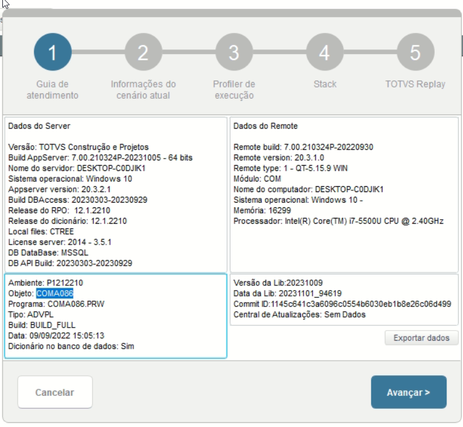
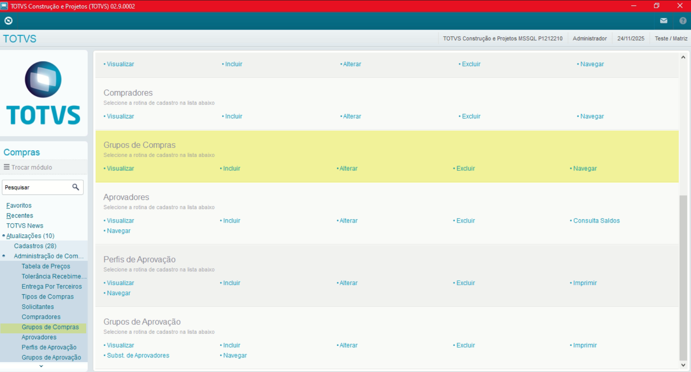
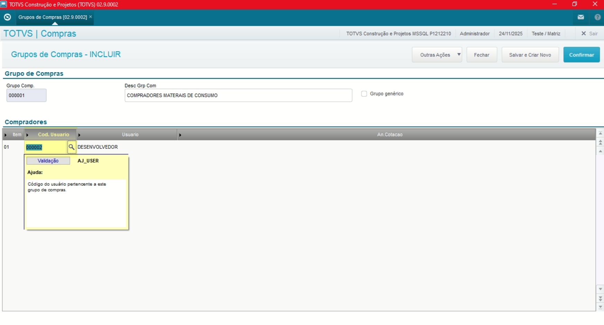

# Administração Módulo Compras

**Rotina Grupo de Compras**

O cadastro de Grupo de Compras feitas no Protheus é feito via **"Módulo 06 - Compras"**.

De forma mais técnica, as informações cadastradas no Protheus é feita pela rotina padrão **COMA086.PRW** e suas informações podem ser encontradas na tabelas **"Tabela de Grupo de Compras - SAJ"**.

**Obs: A rotina tem como objetivo a criação de grupos de compras com definições dos direitos dos compradores visando facilitar o Controle de Alçadas, podendo pertencer a mais de um grupo**.

[SAJ - Grupo de Compras | ERP Labs](https://erplabs.com.br/SAJ)

Rotina Protheus:

Acesso a rotina de cadastro de Grupo de Compras via Módulo Compras:

A rotina padrão de Grupo de Compras contém as seguintes operações, sendo:

- **Inclusão**
- **Alteração**
- **Consulta**
- **Exclusão**

Em caso de inclusão, deve seguir a regra de preenchimento dos campos obrigatórios, identificados com o **"/"** em sua descrição.

## Observações

- **Código Usuário**

Referente ao Código Usuário.

- **Análise Cotação**

Define se os usuários poderão ou não Analisar a Cotação, ou seja transformar em Pedido de Compras.

---

## Autor

**Cristian Gustavo** | Consultor e desenvolvedor TOTVS Protheus

- [LinkedIn Cristian Gustavo](https://www.linkedin.com/in/cristian-gustavo-719aa71b2/)
- [GitHub Cristian Gustavo](https://github.com/crsgustav0)

---

    Desenvolvido e documentado por: Cristian Gustavo
    Data início: 17/11/2025
