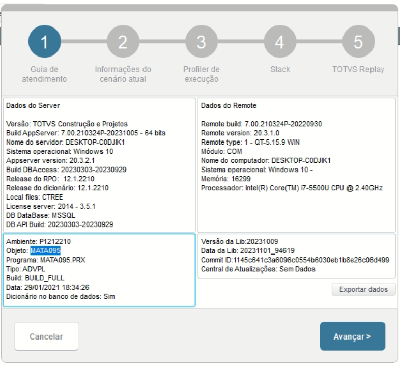
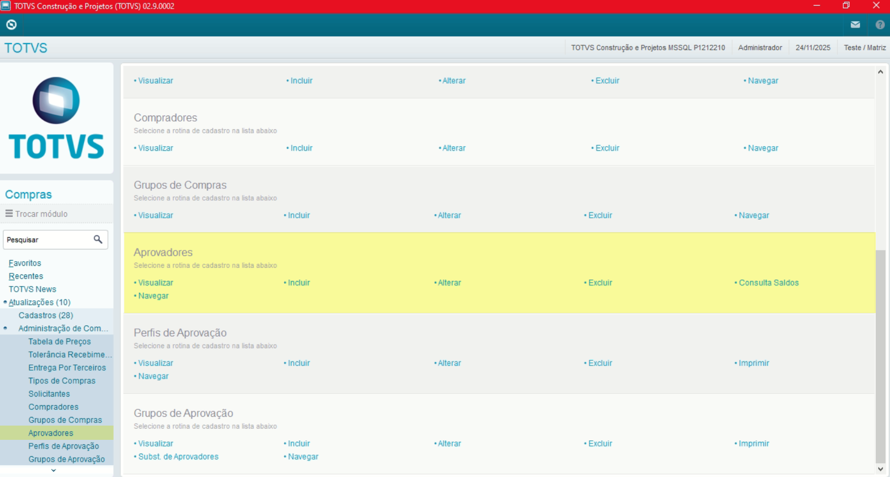
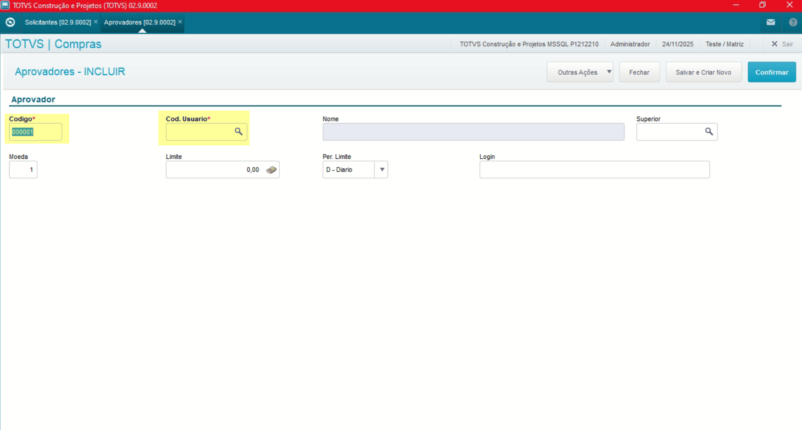
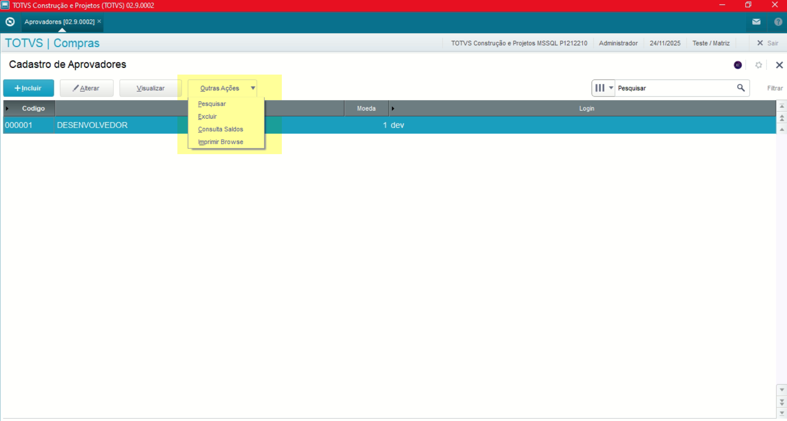
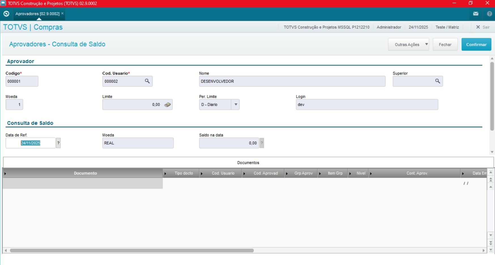
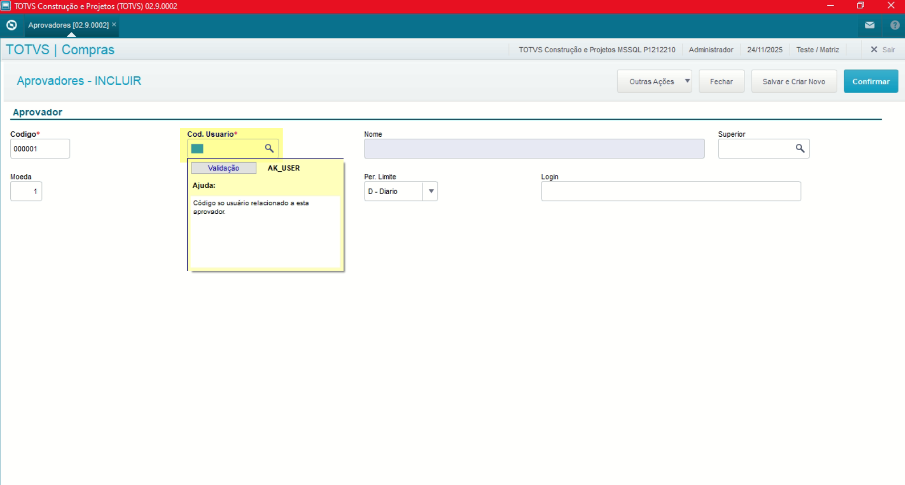
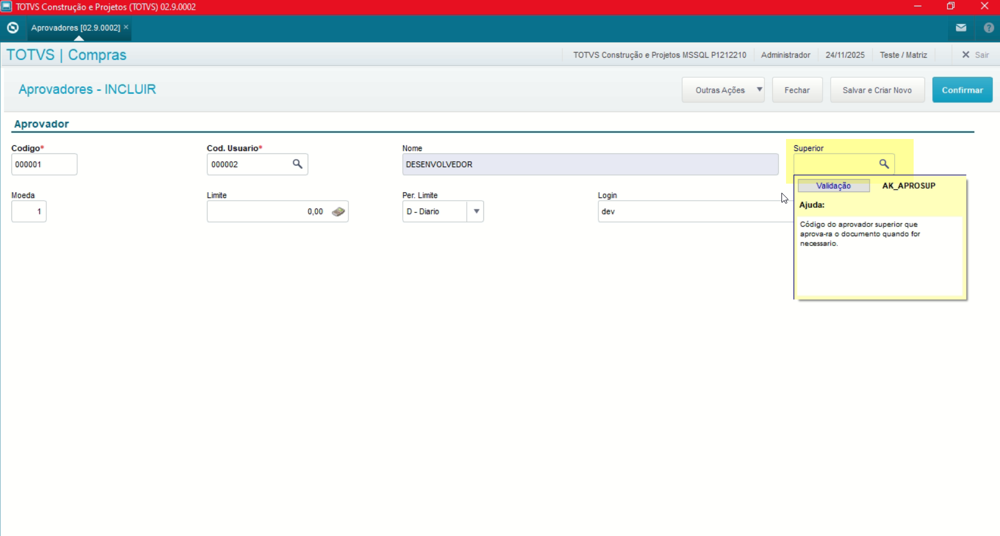
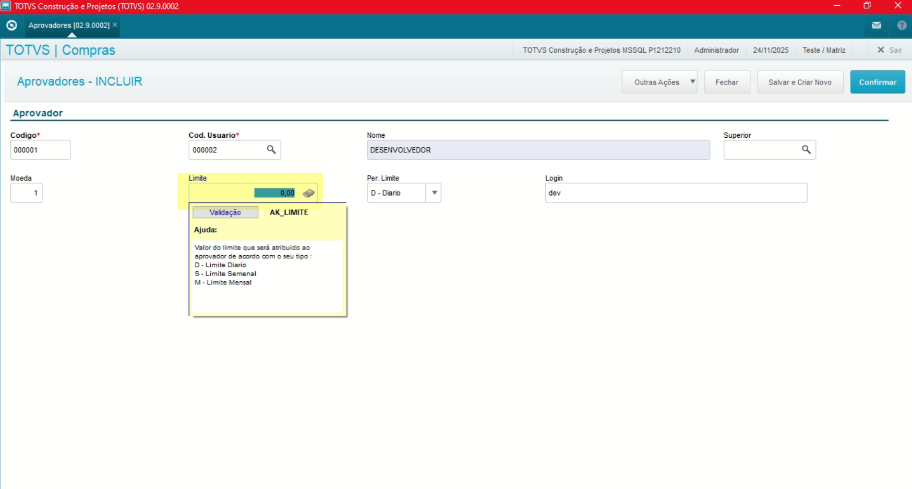
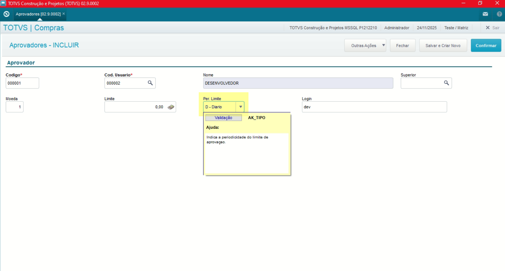

# Administração Módulo Compras

**Rotina Aprovadores**

O cadastro de Aprovadores feitas no Protheus é feito via **"Módulo 06 - Compras"**.

De forma mais técnica, as informações cadastradas no Protheus é feita pela rotina padrão **MATA095.PRX** e suas informações podem ser encontradas na tabelas **"Tabela de Aprovadores - SAK"**.

**Obs: A rotina tem como objetivo a definição de usuários responsáveis pela aprovação de documentos relacionados a Compras subtmetidos ao fluxo de Controle de Alçadas**.

[SAK - Aprovadores | ERP Labs](https://erplabs.com.br/SAK)

Rotina Protheus:

Acesso a rotina de cadastro de Aprovadores via Módulo Compras:

A rotina padrão de Aprovadores contém as seguintes operações, sendo:

- **Inclusão**
- **Alteração**
- **Consulta**
- **Exclusão**

Em caso de inclusão, deve seguir a regra de preenchimento dos campos obrigatórios, identificados com o **"/"** em sua descrição.

---

No menu Outras Ações, é possível encontrar as seguintes opções, sendo:

- **Consulta Saldos**: Consulta de saldos, listando os documentos pendentes para aprovação.

## Observações

- **Código Usuário**

Referente ao Código Usuário.

- **Superior**

Define o responsável caso o usuário informado no campo "Usuário" não possa realizar a aprovação ou aprovação em mais de uma instância.

- **Limite**

Define o valor limite para o aprovador.

- **Período Limite**

Define o limite entre:

- **Diário**
- **Semanal**
- **Mensal**

---

## Autor

**Cristian Gustavo** | Consultor e desenvolvedor TOTVS Protheus

- [LinkedIn Cristian Gustavo](https://www.linkedin.com/in/cristian-gustavo-719aa71b2/)
- [GitHub Cristian Gustavo](https://github.com/crsgustav0)

---

    Desenvolvido e documentado por: Cristian Gustavo
    Data início: 17/11/2025
