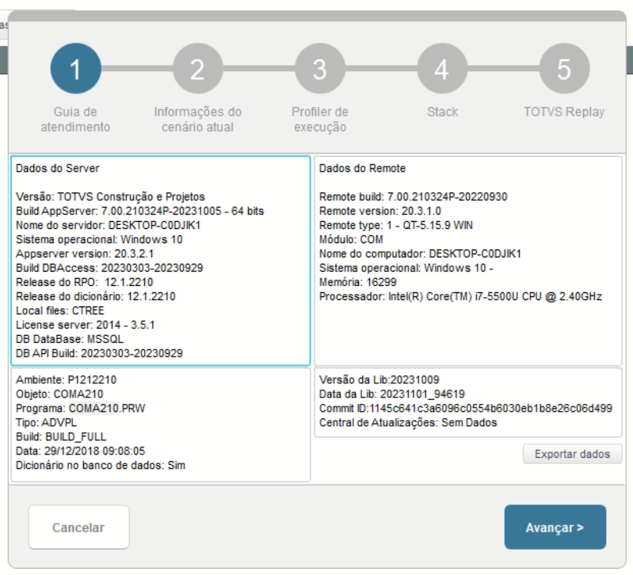

# Administração Módulo Compras

**Rotina Perfil de Aprovadores**

O cadastro de Perfil de Aprovadores feitas no Protheus é feito via **"Módulo 06 - Compras"**.

De forma mais técnica, as informações cadastradas no Protheus é feita pela rotina padrão **COMA210.PRW** e suas informações podem ser encontradas na tabelas **"Tabela de Perfil de Aprovadores - DHL"**.

**Obs: A rotina tem como objetivo a definição de limites de aprovação para cada aprovador cadastrado associado a um Grupo de Aprovação**.

[DHL - Perfil de Aprovadores | ERP Labs](https://erplabs.com.br/DHL)

Rotina Protheus:

Acesso a rotina de cadastro de Perfil de Aprovadores via Módulo Compras:

A rotina padrão de Perfil de Aprovadores contém as seguintes operações, sendo:

- **Inclusão**
- **Alteração**
- **Consulta**
- **Exclusão**

Em caso de inclusão, deve seguir a regra de preenchimento dos campos obrigatórios, identificados com o **"/"** em sua descrição.

---

## Observações

- **Limite Mínimo**

Define valor minimo para aprovação.

**Obs:A mesma regra se aplica para o campo "Limite Máximo"**.

## 

## 

## Autor

**Cristian Gustavo** | Consultor e desenvolvedor TOTVS Protheus

- [LinkedIn Cristian Gustavo](https://www.linkedin.com/in/cristian-gustavo-719aa71b2/)
- [GitHub Cristian Gustavo](https://github.com/crsgustav0)

---

    Desenvolvido e documentado por: Cristian Gustavo
    Data início: 17/11/2025
