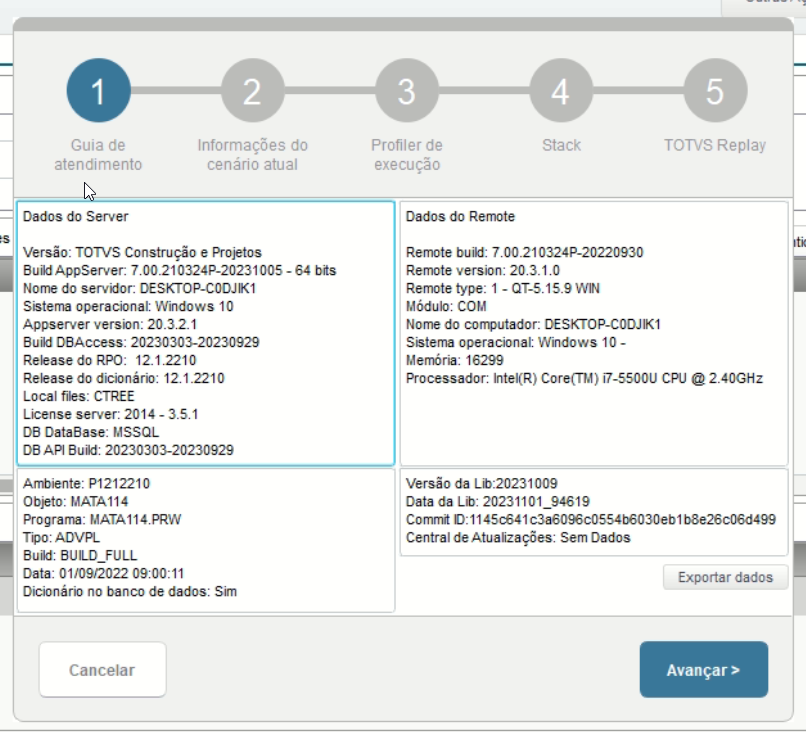
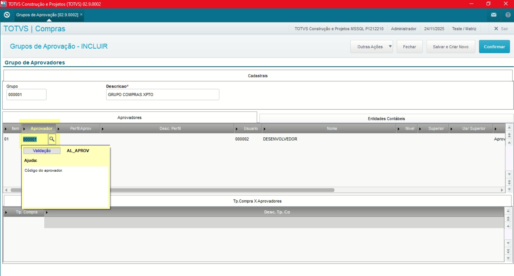
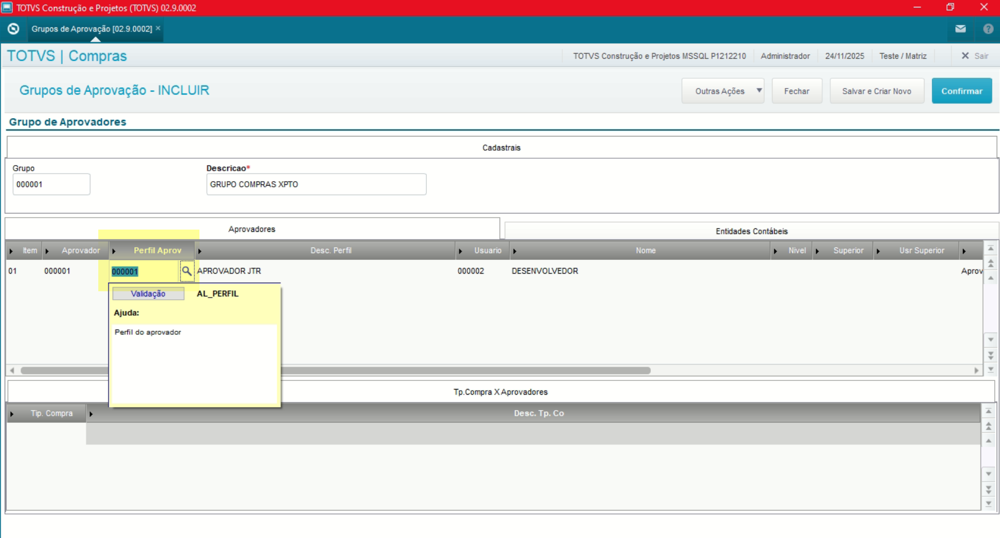
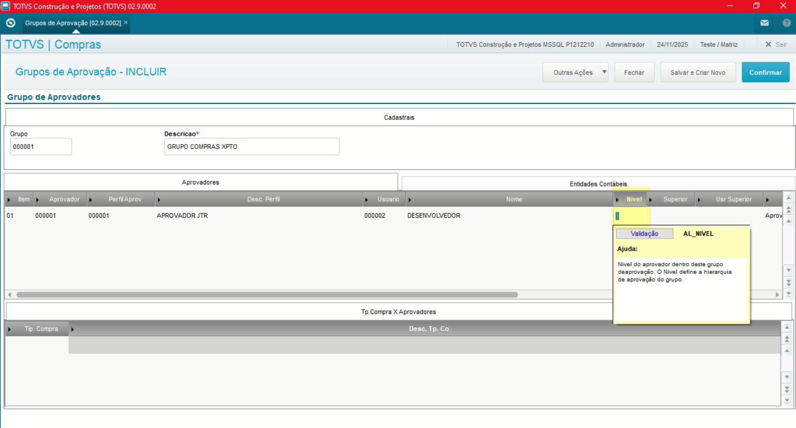
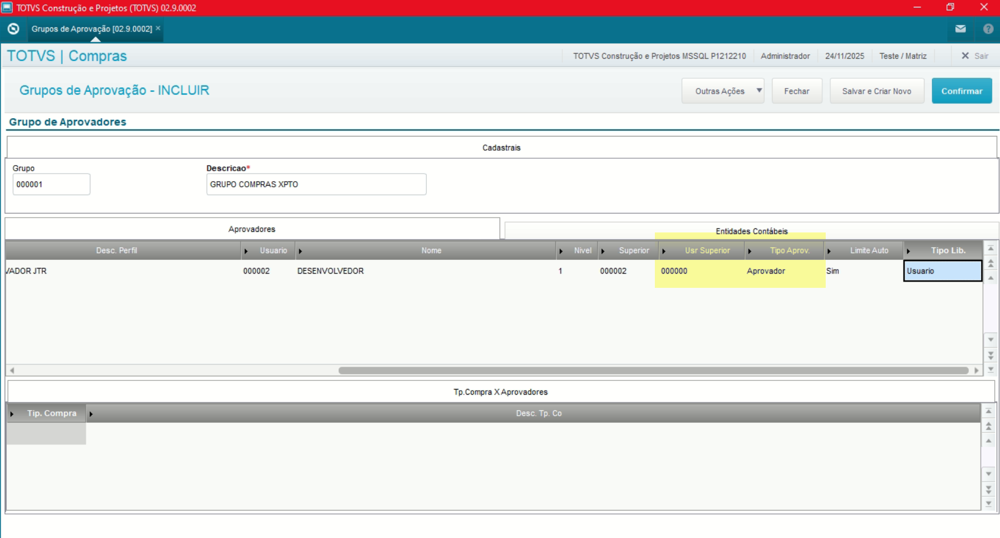
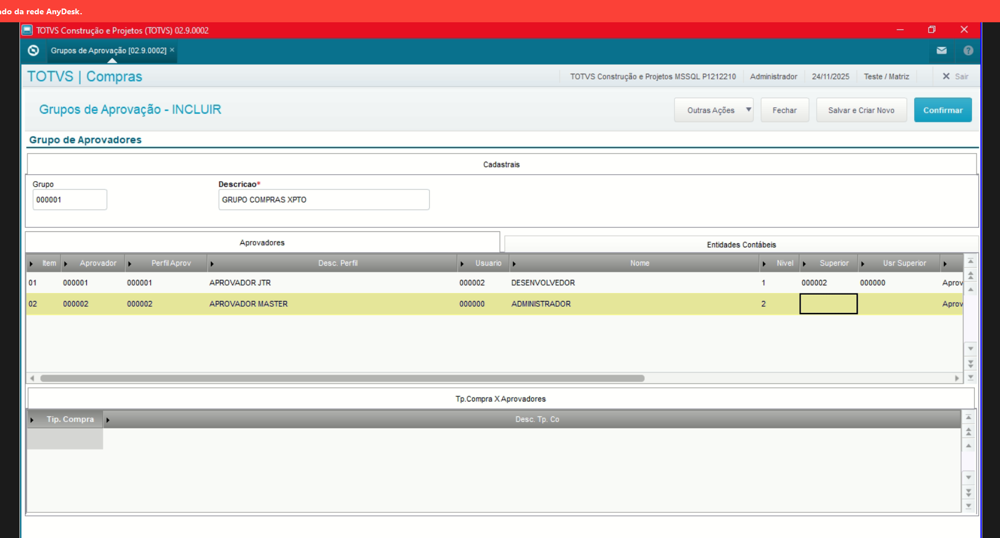
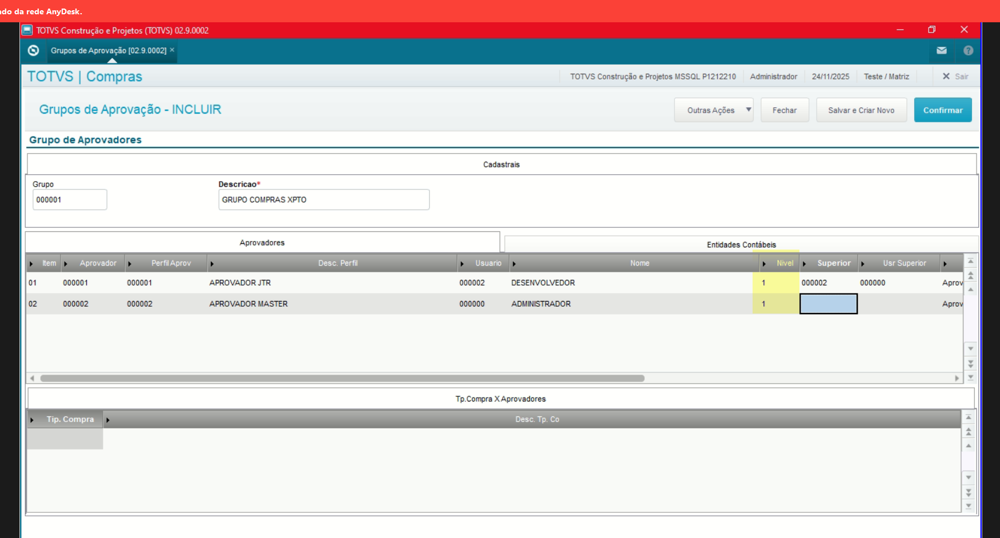
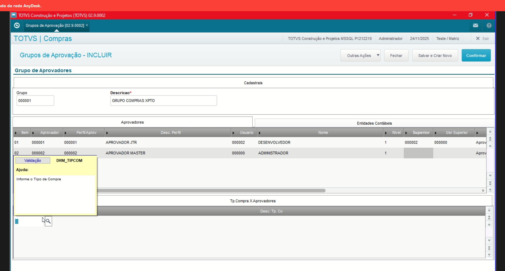

# Administração Módulo Compras

**Rotina Grupo de Aprovação**

O cadastro de Grupo de Aprovação feitas no Protheus é feito via **"Módulo 06 - Compras"**.

De forma mais técnica, as informações cadastradas no Protheus é feita pela rotina padrão **MATA114.PRW** e suas informações podem ser encontradas na tabelas **"Tabela de Grupo de Aprovação - SAL"**.

**Obs: A rotina tem como objetivo a associação de os aprovadores conforme a hierarquia definida**.

[SAL - Grupo de Aprovação | ERP Labs](https://erplabs.com.br/SAL)

Rotina Protheus:

Acesso a rotina de cadastro de Grupo de Aprovação via Módulo Compras:

A rotina padrão de Grupo de Aprovação contém as seguintes operações, sendo:

- **Inclusão**
- **Alteração**
- **Consulta**
- **Exclusão**

Em caso de inclusão, deve seguir a regra de preenchimento dos campos obrigatórios, identificados com o **"/"** em sua descrição.

---

## Grupo de Aprovadores

- **Aprovador**

Define o aprovador.

- **Perfil Aprovador**

Define o perfil aprovador.

- **Nível**

Define o nível do aprovador.

- **Superior**

Define o superior.

Definição segundo superior:

- **Definição de Superior**

Feito a definição do superior responsável, é necessário seguir as etapas, sendo:

- **Aprovação Jr**: Realiza a primeira aprovação.
- **Aprovação Master**: Realiza a segunda, desta forma encaminhando Alçadas.

**Obs: Caso os dois usuários possuam os mesmos níveis, os dois realizarão as aprovações, desta forma aprovando o Pedido de Compra, Solic. de Compras, entre outros.**

## Tipo Compra x Aprovadores

- **Tipo Compra**

Define o tipo de compra por aprovador.

## Autor

**Cristian Gustavo** | Consultor e desenvolvedor TOTVS Protheus

- [LinkedIn Cristian Gustavo](https://www.linkedin.com/in/cristian-gustavo-719aa71b2/)
- [GitHub Cristian Gustavo](https://github.com/crsgustav0)

---

    Desenvolvido e documentado por: Cristian Gustavo
    Data início: 17/11/2025
