# Administração Módulo Compras

**Rotina Solicitações de Compras**

O cadastro de Solicitações de Compras feitas no Protheus é feito via **"Módulo 06 - Compras"**.

De forma mais técnica, as informações cadastradas no Protheus é feita pela rotina padrão **MATA110.PRW** e suas informações podem ser encontradas na tabelas **"Tabela de Solicitações de Compras - SC1"**.

**Obs: A rotina atua como documento que permite o usuário realizar uma Compra sendo para Materiais Produtivo e Materiais Inprodutivo**.

Podendo ser gerada manualmente via rotina, controle de lote econômico e pelo módulo de Estoque e Custos, sendo:

- Controle de Lote Econômico
- Ponto de Pedido
- Solicitação de Armázem

[SC1 - Solicitações de Compras | ERP Labs](https://erplabs.com.br/SC1)

Rotina Protheus:

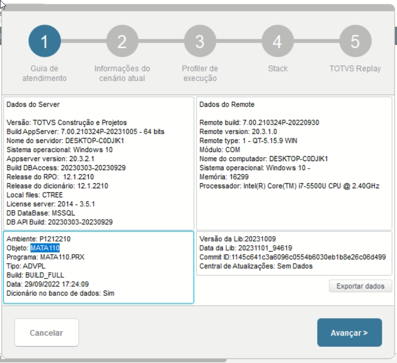

Acesso a rotina de cadastro de Solicitações de Compras via Módulo Compras:

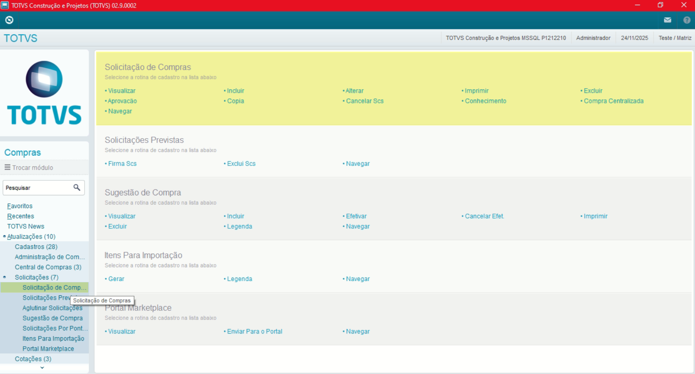

A rotina padrão de Solicitações de Compras contém as seguintes operações, sendo:

- **Inclusão**
- **Alteração**
- **Consulta**
- **Exclusão**

No menu Outras Ações, é possível encontrar as seguintes opções, sendo:

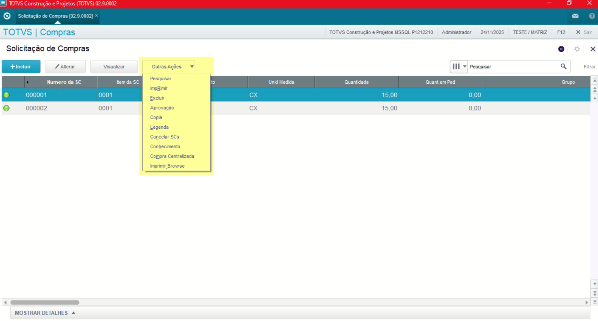

- **Aprovação**: Realiza a aprovação da Solicitação de Compras.
- **Cancelar SCc**: Realiza o cancelamento da Solicitação de Compras.

**Obs: A alteração de Solicitações de Compras só é permitida para registros que estão como Pendentes.**

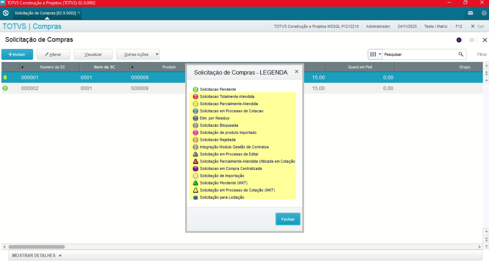

## Observações

- **Unidade Requisição**

Definição de unidade de requisição referente ao Módulo de Importação, por se tratar de Compras não é necessário preencher.

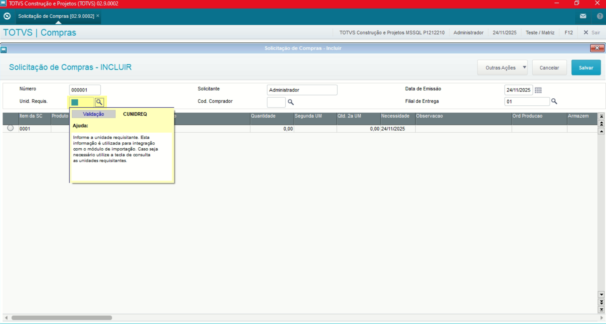

- **Código Comprador**

Definição do comprador para a solicitação criada, caso não preenchido será exibido para todos os compradores.

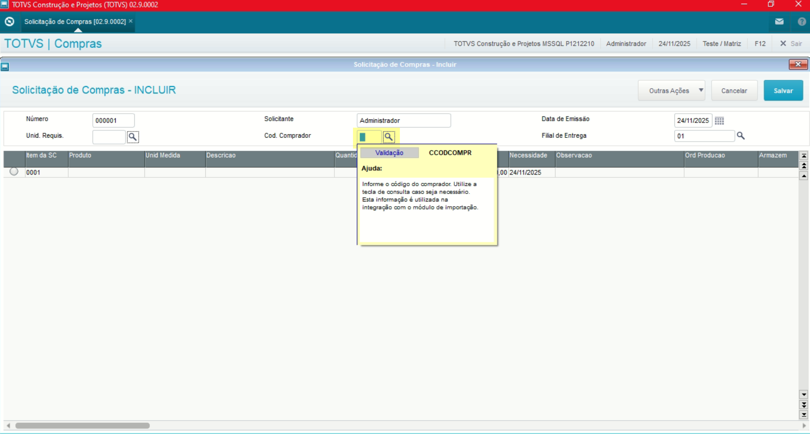

- **Código Produto**

Definição do produto que está sendo solicitado.

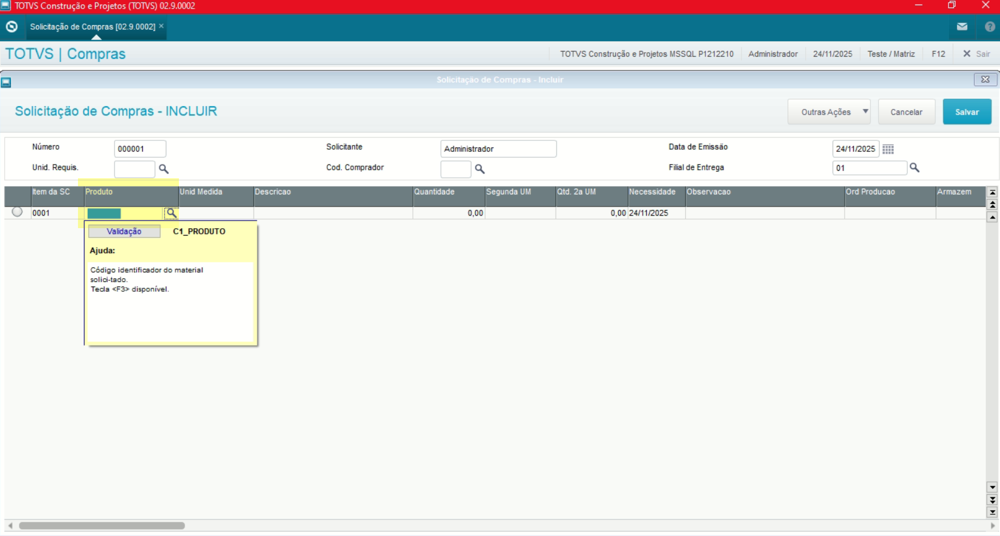

- **Quantidade**

Definição da quantidade do produto solicitado.

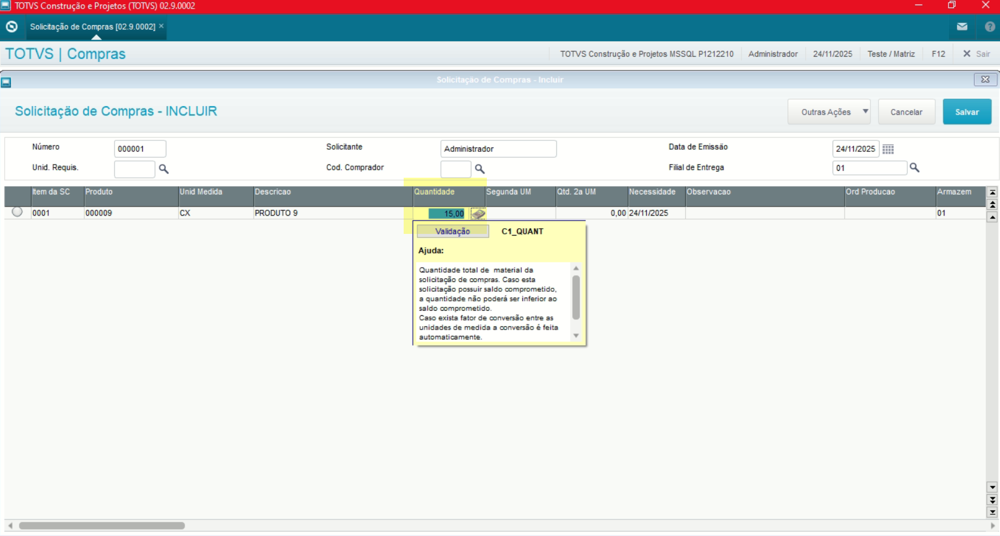

- **Data Necessidade**

Definição da data de previsão da entrega.

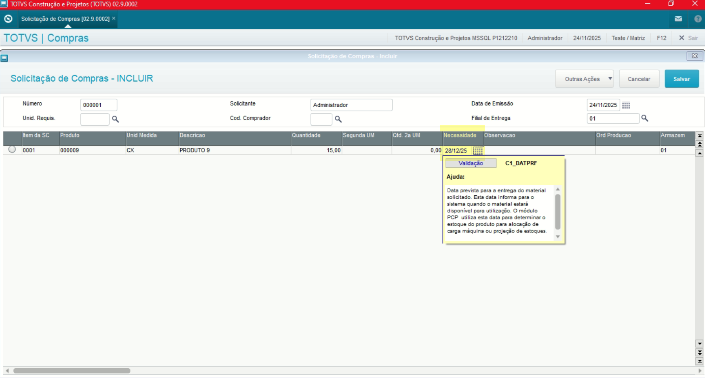

- **Ordem Produção**

Definição de Ordem de Produção, informado quando é gerado a partir de necessidade de Ordem de Produção ou caso seja uma solicitação fora Ordem de Produção.

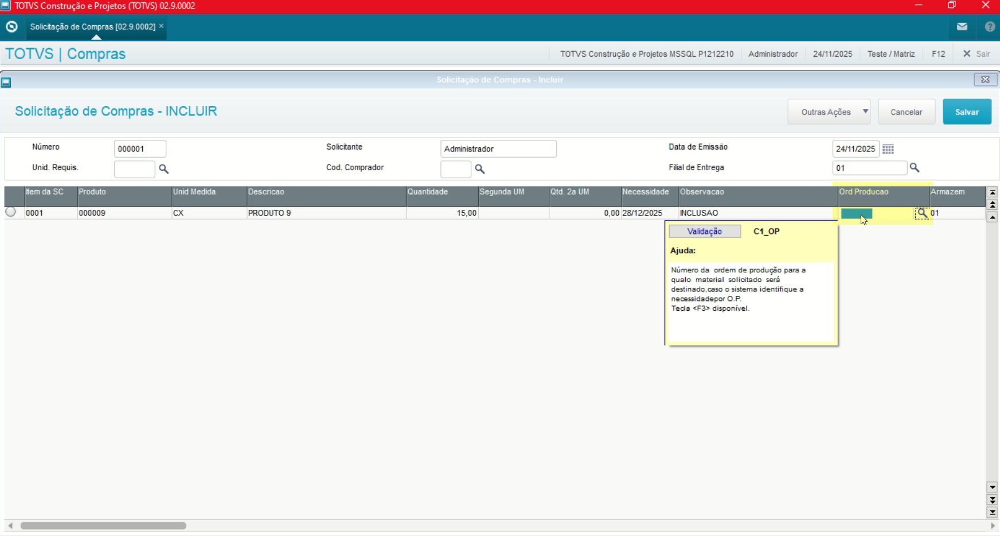

- **Centro de Custo**

Definição de Centro de Custo, pode ser preenchido ou não.

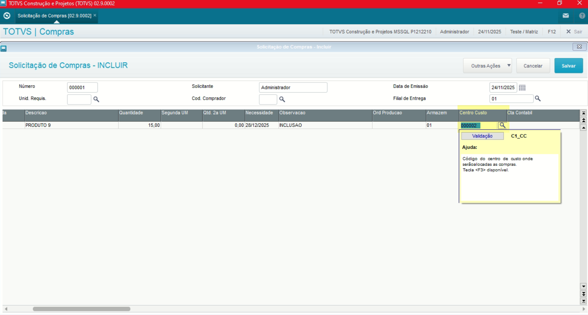

**Obs: A mesma regra se aplica para os campos "Conta Contábil" e "Fornecedor"**.
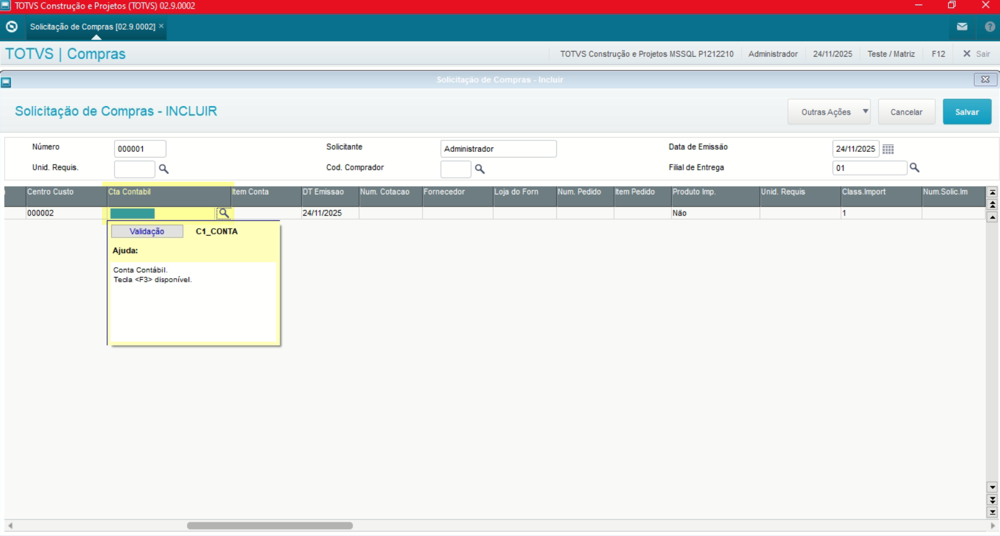

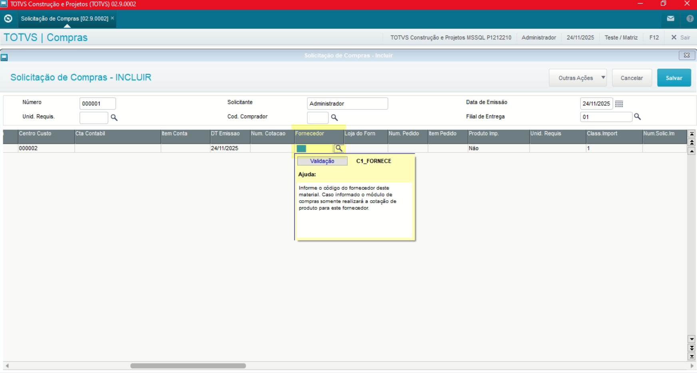

---

## Autor

**Cristian Gustavo** | Consultor e desenvolvedor TOTVS Protheus

- [LinkedIn Cristian Gustavo](https://www.linkedin.com/in/cristian-gustavo-719aa71b2/)
- [GitHub Cristian Gustavo](https://github.com/crsgustav0)

---

    Desenvolvido e documentado por: Cristian Gustavo
    Data início: 17/11/2025
