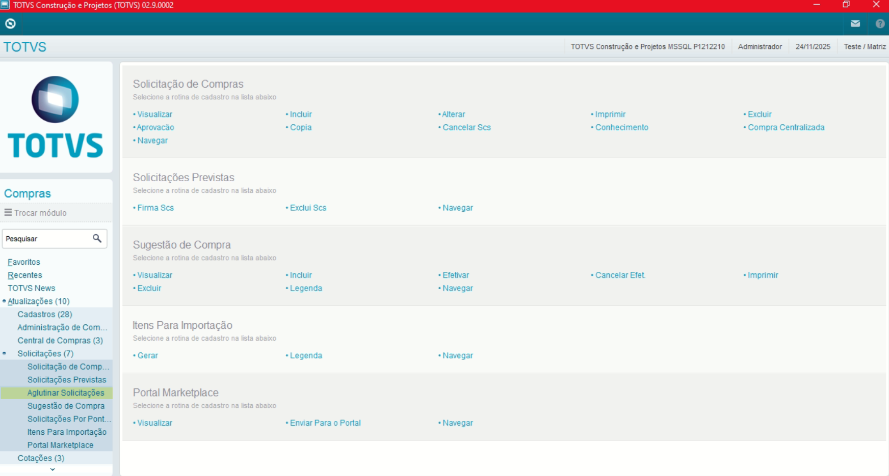
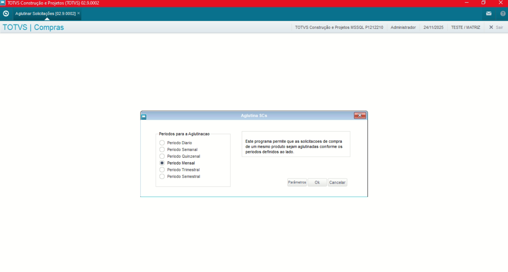
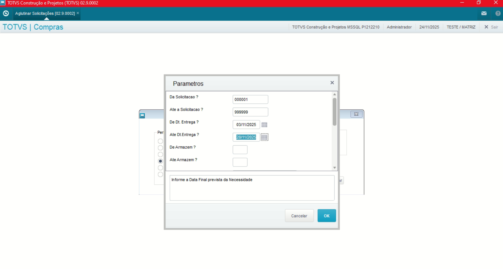
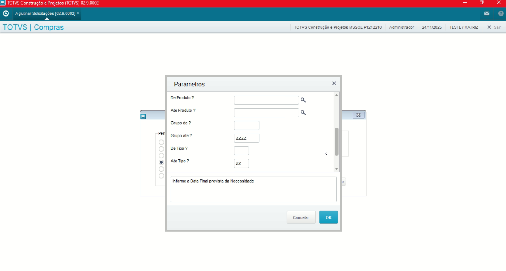
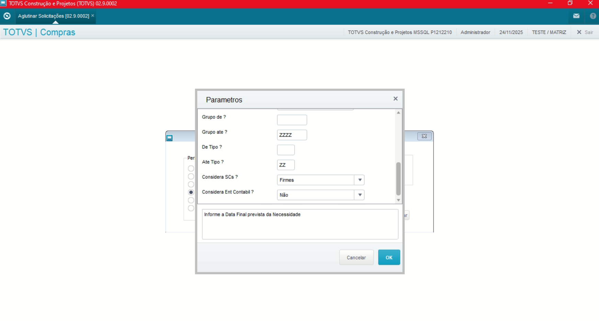
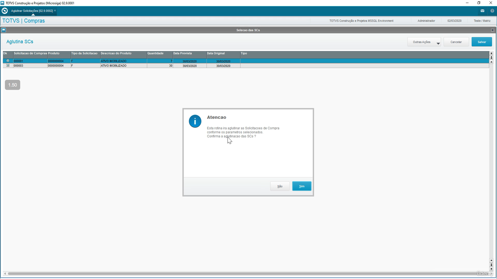
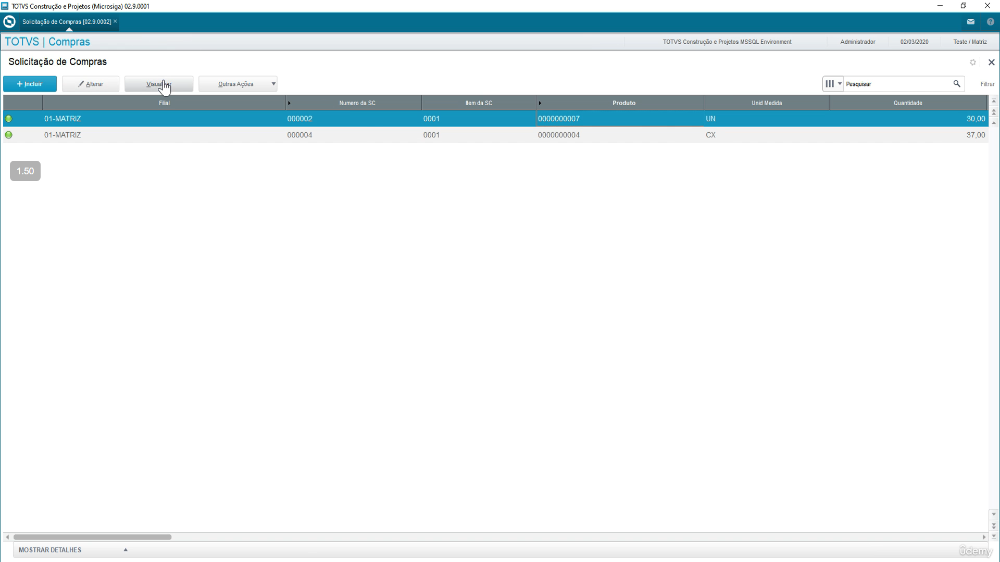
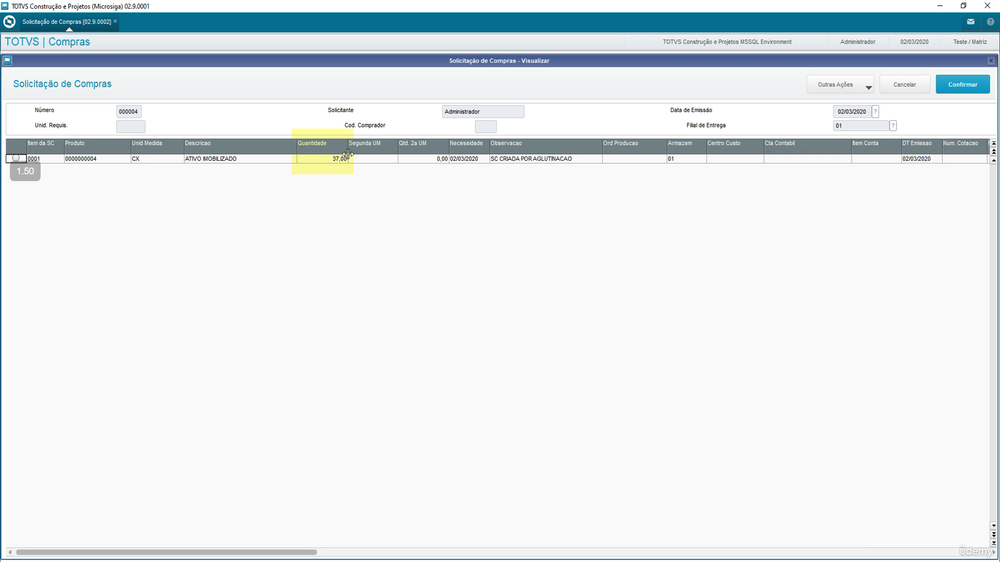

# Administração Módulo Compras

**Rotina Aglutinar Solicitações**

O cadastro de Aglutinar Solicitações feitas no Protheus é feito via **"Módulo 06 - Compras"**.

De forma mais técnica, as informações cadastradas no Protheus é feita pela rotina padrão **MATA110.PRW** e suas informações podem ser encontradas na tabelas **"Tabela de Aglutinar Solicitações - SC1"**.

**Obs: A rotina premite que solicitações de compras se um mesmo produto sejam aglutinadas de acordo com parâmetros definidos**.

Podendo ser gerada manualmente via rotina, controle de lote econômico e pelo módulo de Estoque e Custos, sendo:

- Controle de Lote Econômico
- Ponto de Pedido
- Solicitação de Armázem

[SC1 - Aglutinar Solicitações | ERP Labs](https://erplabs.com.br/SC1)

Rotina Protheus:

Acesso a rotina de cadastro de Aglutinar Solicitações via Módulo Compras:

A rotina padrão de Aglutinar Solicitações contém as seguintes operações, sendo:

- **Inclusão**
- **Alteração**
- **Consulta**
- **Exclusão**

No menu Outras Ações, é possível encontrar as seguintes opções, sendo:

- **Aprovação**: Realiza a aprovação da Solicitação de Compras.
- **Cancelar SCc**: Realiza o cancelamento da Solicitação de Compras.

## Parâmetros

Na abertura da rotina a seguinte tela é exibida:

**Recordando que parâmetros iniciais são preenchidos incialmente como vazios e parâmetros finais com "ZZZZ" informando que todos os registros dentro desses parâmetros serão consultados.**

Após confirmar os parâmetros, serão exibidos os registros, sendo necessário confirmar a operação.

Após a operação é possível acessar a rotina de Solicitação de Compras e visualizar os registros aglutinados. **Sendo possível visualizar a o campo "Quantidade" somada**.

---

## Autor

**Cristian Gustavo** | Consultor e desenvolvedor TOTVS Protheus

- [LinkedIn Cristian Gustavo](https://www.linkedin.com/in/cristian-gustavo-719aa71b2/)
- [GitHub Cristian Gustavo](https://github.com/crsgustav0)

---

    Desenvolvido e documentado por: Cristian Gustavo
    Data início: 17/11/2025
