# Administração Módulo Compras

**Rotina Cotações**

O cadastro de Cotações feitas no Protheus é feito via **"Módulo 06 - Compras"**.

De forma mais técnica, as informações cadastradas no Protheus é feita pela rotina padrão **MATA110.PRW** e suas informações podem ser encontradas na tabelas **"Tabela de Cotações - SC8"**.

[SC8 - Cotações | ERP Labs](https://erplabs.com.br/SC8)

# Gera Cotações

Rotina Protheus:

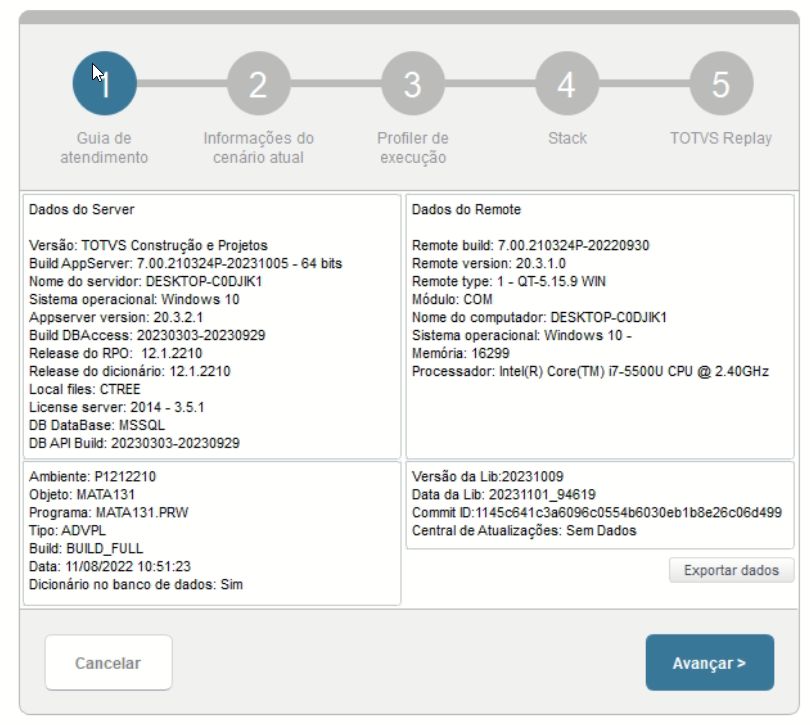

**Obs: A rotina atua com a premissa de que será feitas as Cotações das Solicitações de Compras já cadastradas.**.

Acesso a rotina de cadastro de Cotações via Módulo Compras:

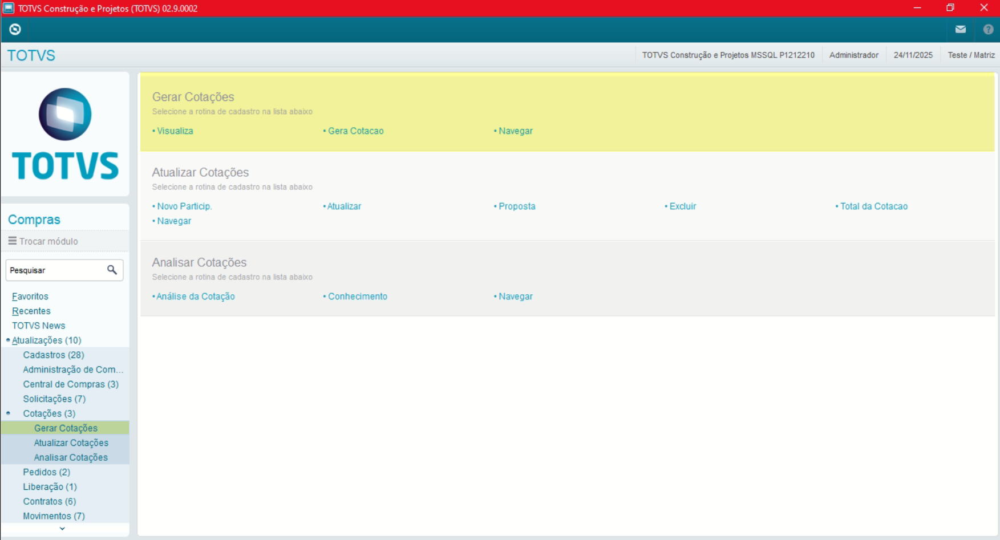

## Parâmetros

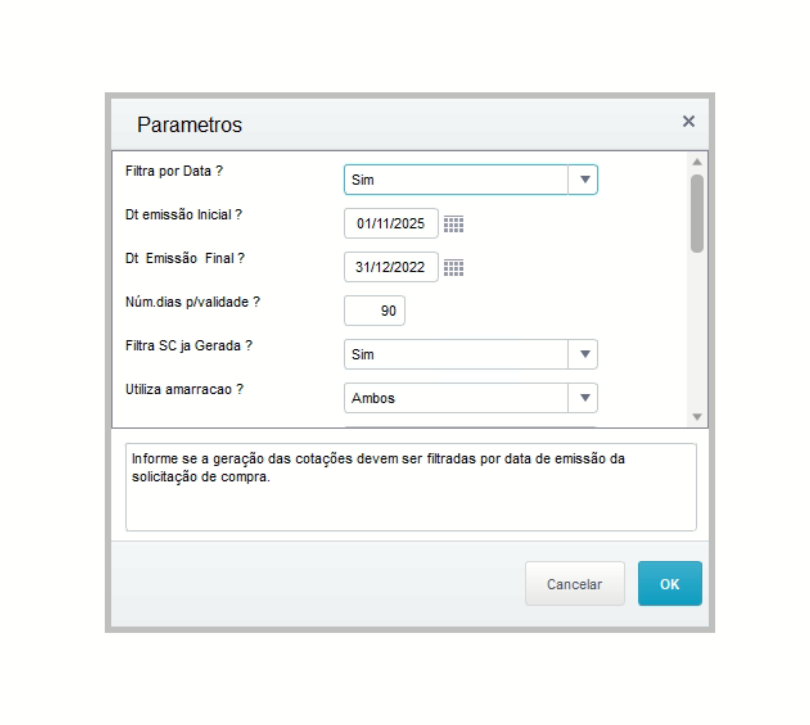

- **Parâmetros processamento Cotações**

Necessário informar os parâmetros para retorno de dados, sendo:

- **Data Inicial** e **Data Data Final**: Referente ao período de busca das Solicitações de Compras.

- **Número dias para validade Inicial**: Referente ao período que a cotação pode receber propostas dos Fornecedores.

- **Filtrar por SC já geradas**: Referente retorno de Solicitações de Compras já geradas.

- **Utiliza amarração**: Referente a amarração dos dados, sendo:

  - Produto x Fornecedor
  - Grupo x Fornecedor
  - Ambos
  - Webb

- **Tipo de Cotação**: Referente a amarração dos dados, sendo:

  - Aberta - Permite a inclusão de outros fornecedores durante o processo de Cotação.
  - Fechada - Não permite a inclusão de outros fornecedores durante o processo de Cotação.

- **Solicitação De** e **Solicitação Até**: Referente ao período de busca das Solicitações de Compras.

**Obs: Campo "Solicitação Até" pode ser preenchido como 'ZZZZZZZ'**

- **Amarração produto x Fornecedor amarração**: Referente a amarração dos dados, sendo:

  - Codigo Produto
  - Codigo Retorno Grade

- **C. Custo Inicial** e **C. Custo Final**: Referente ao C. de Custos.

**Obs: Campo "C. Custo Final" pode ser preenchido como 'ZZZZZZZ'**

- **Considera C1_OP na quebra?**: Referente a Solicitações de Compras atreladas a Ordem de Produção.

- **Ao final da cotação gerar?**: Ao finalizar a busca dos registros, pode gerar entre as opções sendo:
  - Pedido Compra
  - Contrato via **Módulo de Contratos (GCT)**

Ao informar os parâmetros será aberta a tela com o retorno dos registros, necessário selecionar um e apertar sobre a opção **"Gerar Cotação"**.

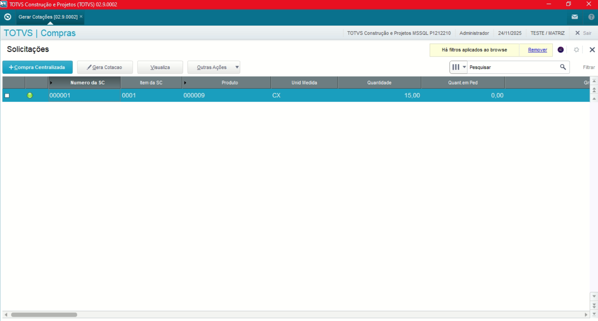

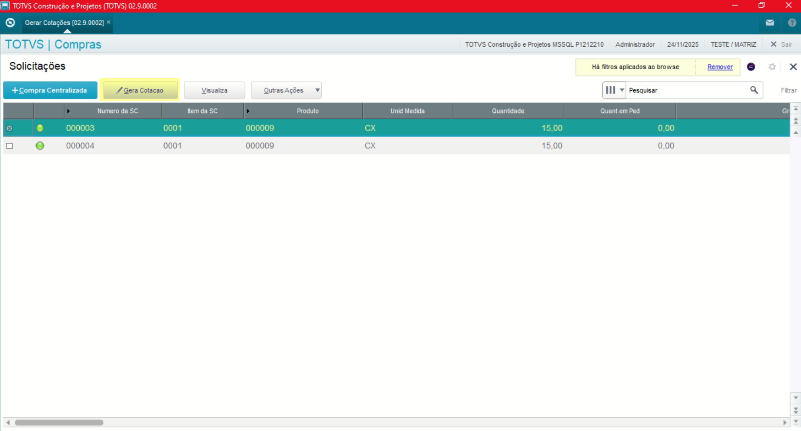

Obs: Durante processo, caso a Solicitação de Compras não possua amarração Produto x Fornecedor, será exibida a seguinte tela:

**Sendo necessário possuir a amarração de Produto x Fornecedor ou Grupo x Fornecedor, na rotina de Solicitação de Compras**.

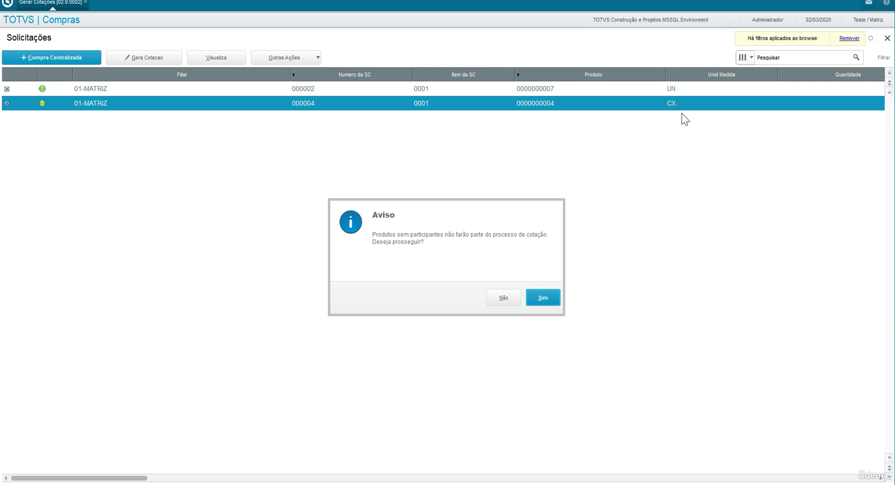

# Atualiza Cotações

Acesso a rotina de cadastro de Atuliza Cotações via Módulo Compras:

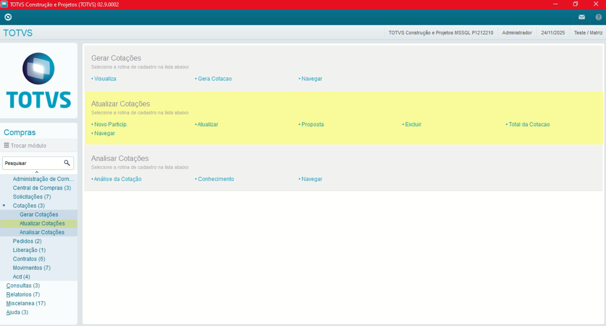

Rotina Protheus:

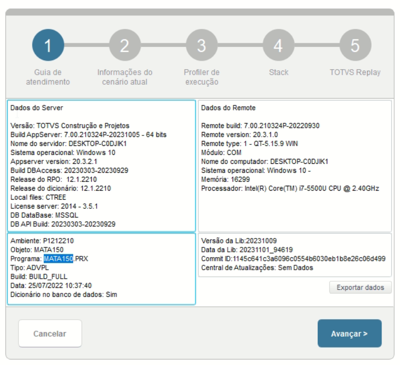

**Obs: A rotina tem a premissa de que será feitas somente com os Fornecedores com amarrações com Produto ou Grupo. Possui o objetivo de informar campos como:**.

- Preço
- Prazo
- Prazo Entrega
- Prazo Pagamento
- Inclusão de novos participantes no pagamento

## Parâmetros

- **Parâmetros processamento Cotações**

Necessário informar os parâmetros para retorno de dados, sendo:

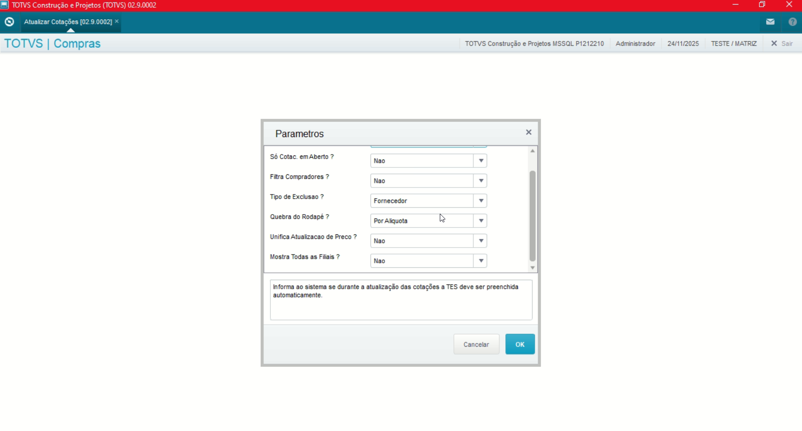

Após o informe dos parâmetros é exibida a seguinte tela, sendo:

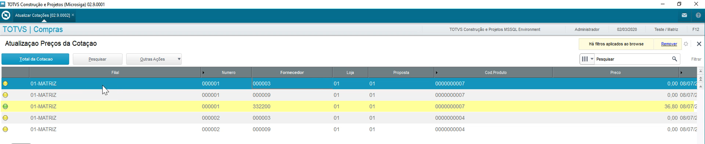

**Obs: Registros com a legenda como "Verde" sinalizam que o Fornecedor relacionado a essa cotação já possui uma tabela de preço. Para os demais registros é necessário informar**.

Para realizar preencher os campos restante, é necessário posicionar sobre o registros e apertar sobre a opção **"Atualizar"** no menu **"Outras Ações"**.

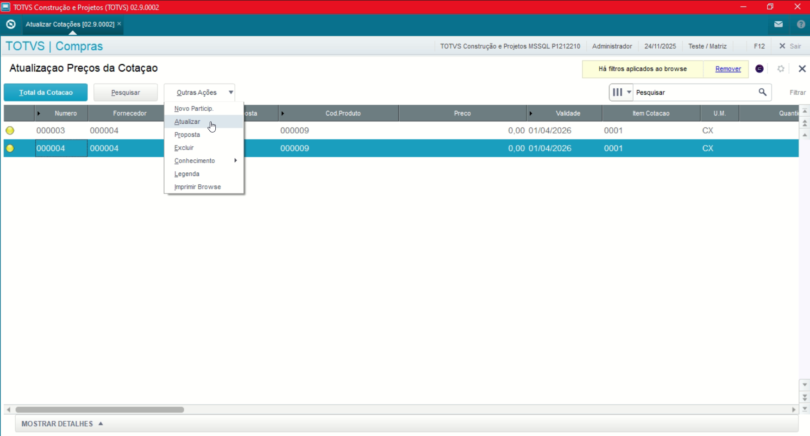
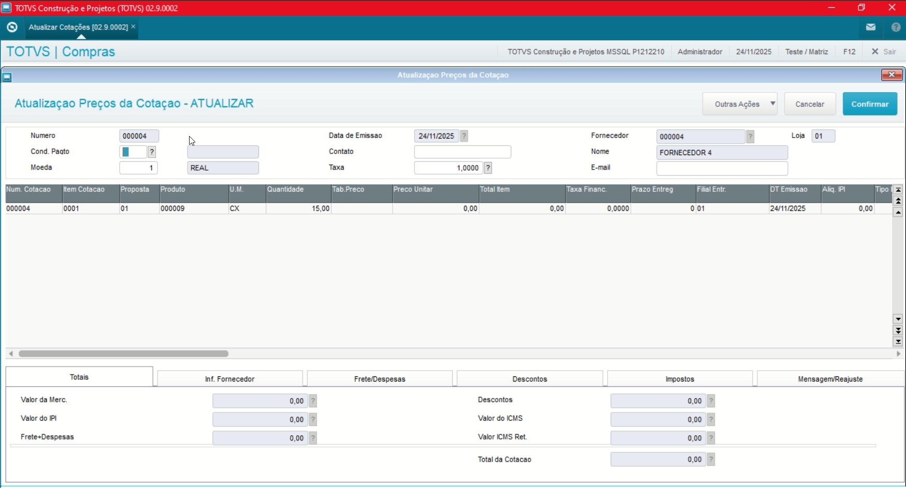

# Analisa Cotações

Acesso a rotina de cadastro de Atuliza Cotações via Módulo Compras:

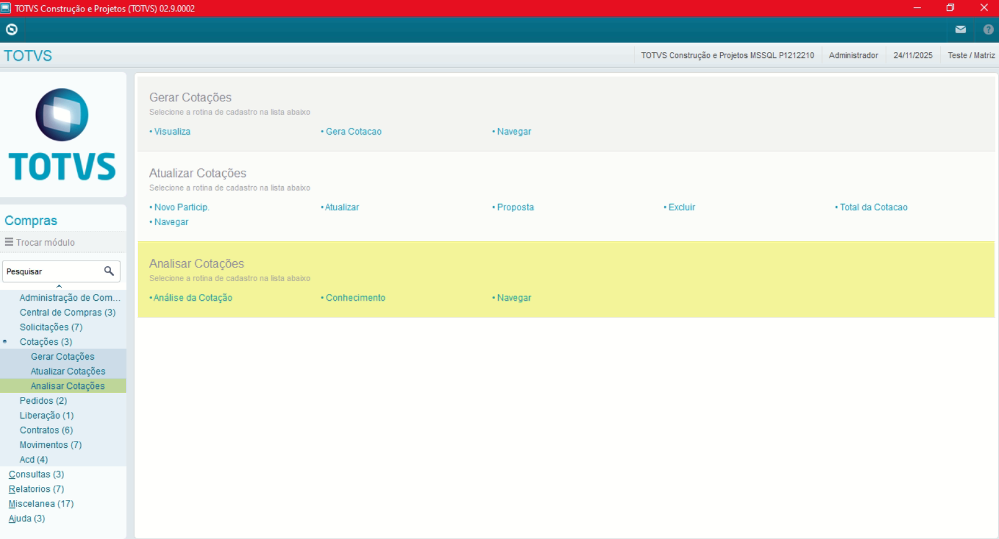

Rotina Protheus:

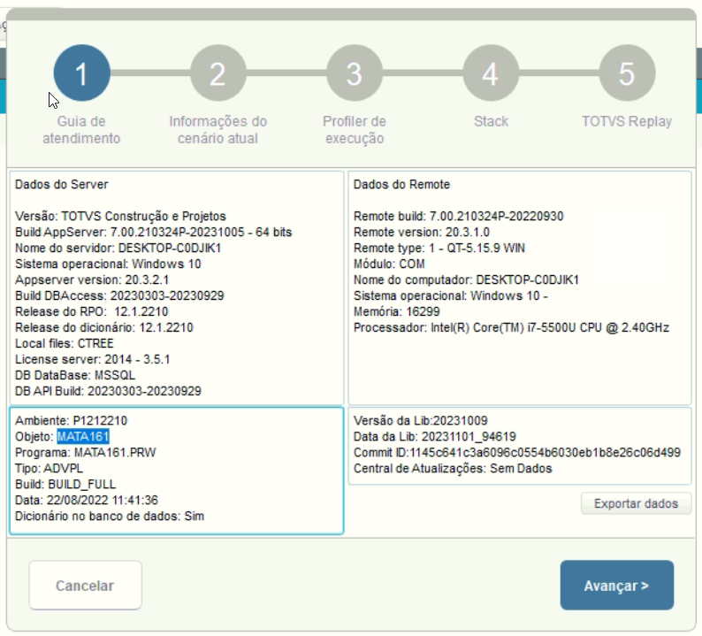

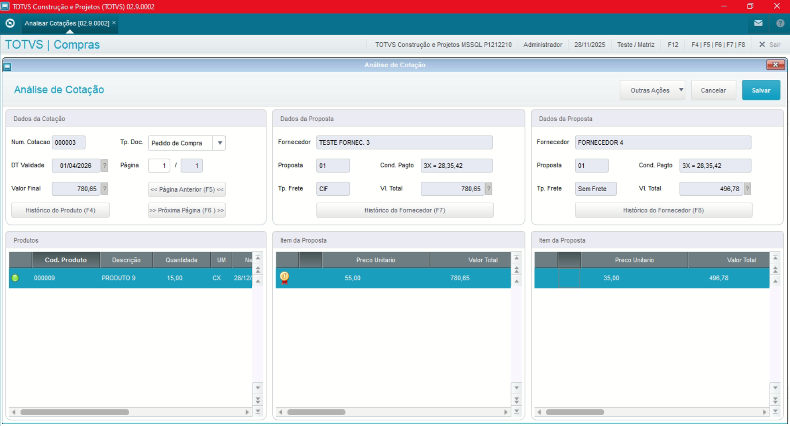

**Obs: A rotina tem o objetivo de comparar as propostas referente a Orçamento e definição para Pedido de Compras ou Contrato via GCT.**

Ao salvar a Cotação, é exibida a seguinte tela.

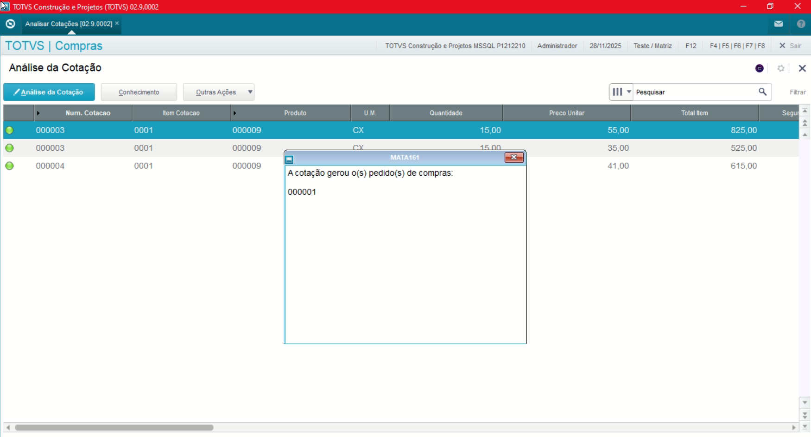

---

## Autor

**Cristian Gustavo** | Consultor e desenvolvedor TOTVS Protheus

- [LinkedIn Cristian Gustavo](https://www.linkedin.com/in/cristian-gustavo-719aa71b2/)
- [GitHub Cristian Gustavo](https://github.com/crsgustav0)

---

    Desenvolvido e documentado por: Cristian Gustavo
    Data início: 17/11/2025
