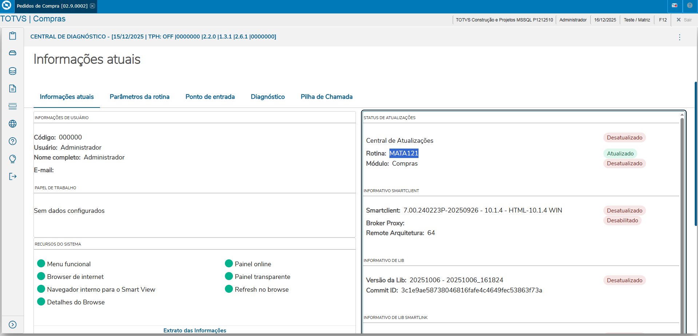
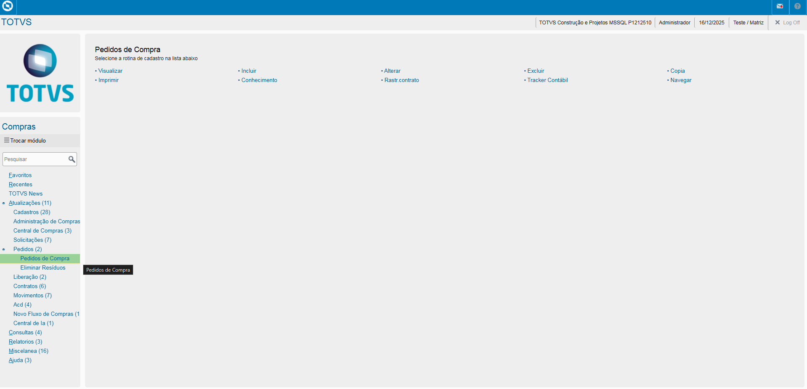
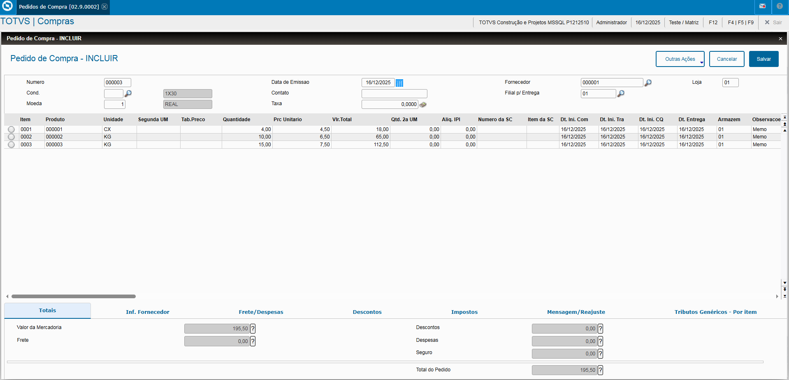
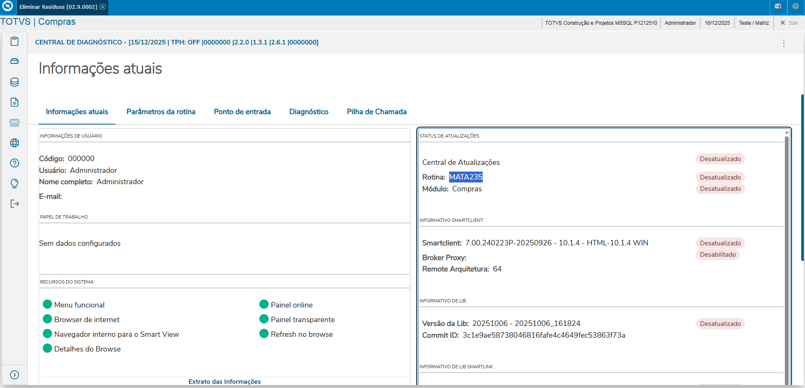
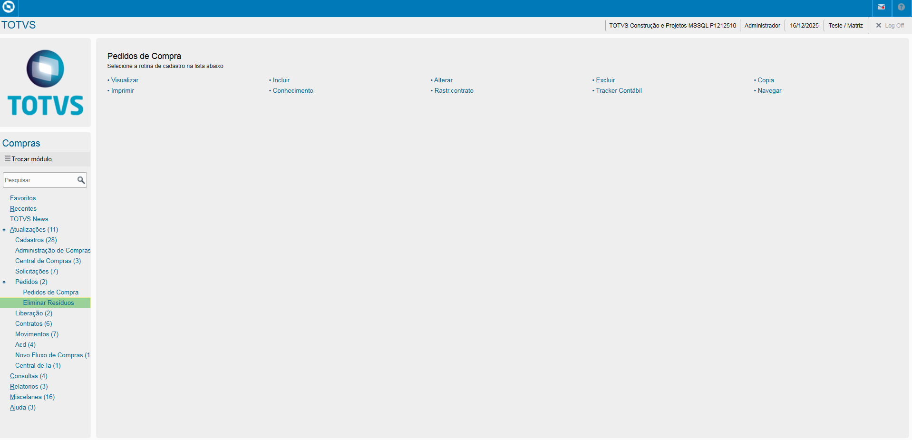
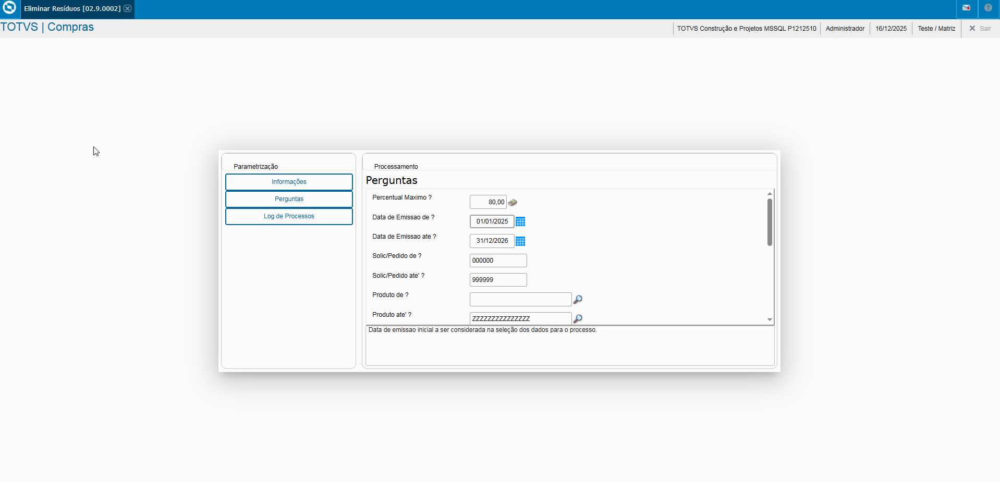
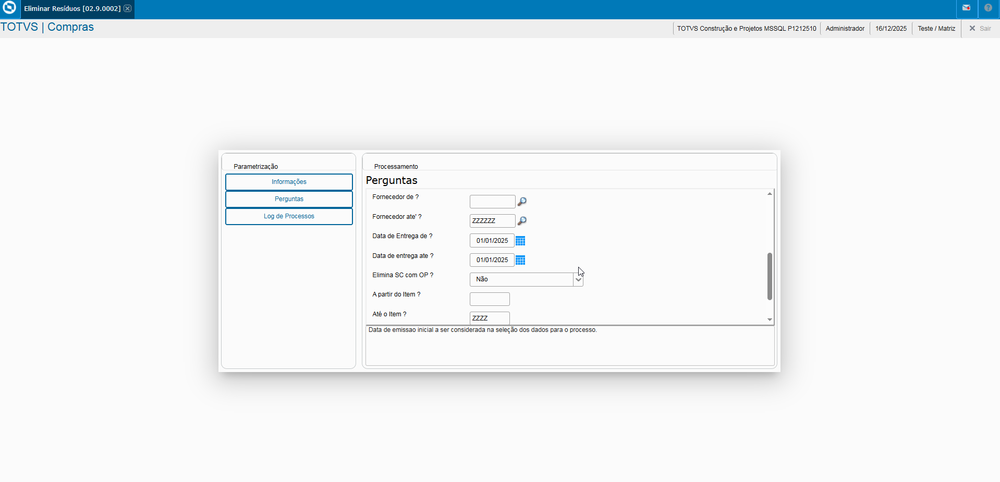
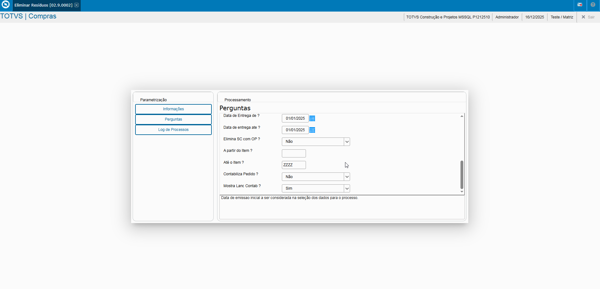
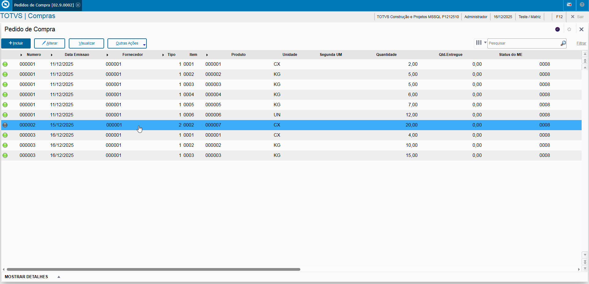

# Administração Módulo Compras

**Rotina Pedidos**

O cadastro de Pedidos feitas no Protheus é feito via **"Módulo 06 - Compras"**.

De forma mais técnica, as informações cadastradas no Protheus é feita pela rotina padrão **MATA121.PRW** e suas informações podem ser encontradas na tabelas **"Tabela de Pedidos - SC7"**.

[SC7 - Pedidos | ERP Labs](https://erplabs.com.br/SC7)

# Gera Pedidos

Rotina Protheus:

**Obs: A rotina atua com a premissa de que será feitas as Pedidos das Solicitações de Compras já cadastradas.**.

Acesso a rotina de cadastro de Pedidos via Módulo Compras:

## Parâmetros

Necessário informar os parâmetros para retorno de dados, sendo:

- Fornecedor
- Condição de Pagamento
- Filial de Entrega, caso de filial diferente
- Moeda

Itens:

- Produto
- Quantidade
- Preço Unitário
- Data Entrega
- C.Custo, Conta Contábil, Valor de Desconto

Na tela de baixo é exibido os totais.

Caso possua informar Descontos.

Na legenda dos Pedidos de Compras é possível visualizar que os itens sinalizados com AZUL são Pedidos ainda em aprovação.
Verde pendente, aguardando Nota de Entrada.

No menu de outras ações é possível encontrar as seguintes opções, sendo:

- Copiar
- Impressão do Pedido de Compras

## Eliminação de Resíduos

**Obs: A rotina tem como objetivo a eliminação de resíduos do Pedido de Compras que foi atendido parcialmente e que não será mais utilizado.**.

De forma mais técnica, as informações cadastradas no Protheus é feita pela rotina padrão **MATA235.PRW**.

Um registro visualizado na tela de Pedido de Compras está sendo sinalizado com a legenda AMARELA, onde mostra que parte foi atendido via Nota de Entrada.

Rotina Protheus:

Na tela de baixo é exibido os totais.

Necessário informar os parâmetros, sendo:

- Pedido Inicial
- Pedido Final
- Data Inicial
- Data Final
- Produto Inicial
- Produto Final
- Eliminar resíduo por:
  - Pedido de Compras
  - Aut. de Entrega
  - Pedido/ Aut. Entrega
  - Contrato Parceria
  - Solicitação de Compras
- Fornecedor Inicial
- Fornecedor Final
- Item Inicial
- Item Final

Após o informe dos parâmetros e execução da rotina, é possível visualisar o item do Pedido de Compras sinalizado com a legenda cinza.
"Pedido de Compras eliminado por Resíduo."

## Liberação de Documentos

**Obs: A rotina é relacionada a Alçada de Aprovação, utilizada para aprovação de documentos.**.

Ao abrir a tela é exibida a mensagem que o usuário necessita de estar cadastrado como aprovado.

Registros sinalizados com a legenda vermelha estão como Pendencia de Aprovação pelo Usuário.

Caso o limite de aprovação do usuário seja menor que o limite do item da rotina de Aprovações é necessário alterar o limite do cadastro do usuário na tela de Aprovadores.

No menu de Outras Ações é possível também rejeitar a Aprovação.

---

## Autor

**Cristian Gustavo** | Consultor e desenvolvedor TOTVS Protheus

- [LinkedIn Cristian Gustavo](https://www.linkedin.com/in/cristian-gustavo-719aa71b2/)
- [GitHub Cristian Gustavo](https://github.com/crsgustav0)

---

    Desenvolvido e documentado por: Cristian Gustavo
    Data início: 17/11/2025
