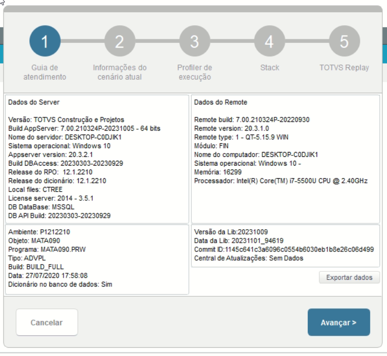
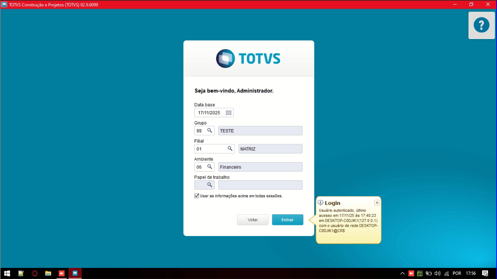
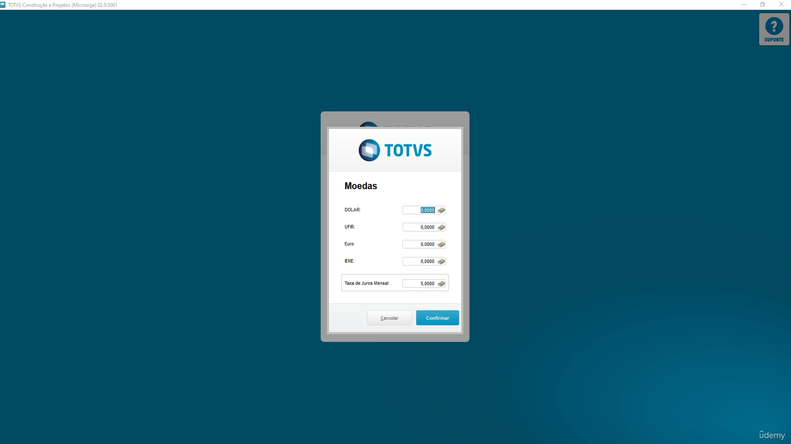
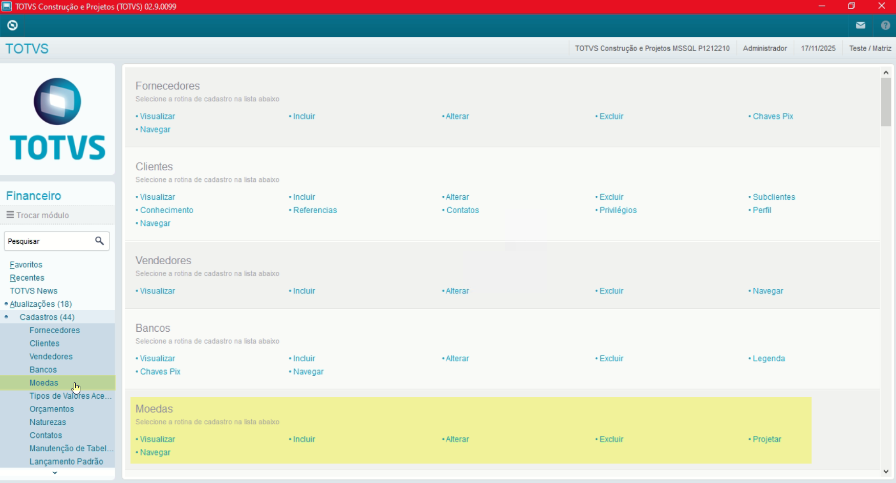
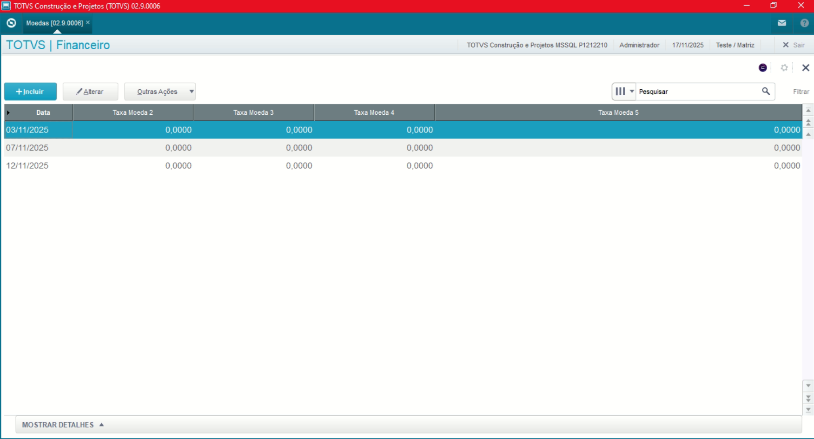
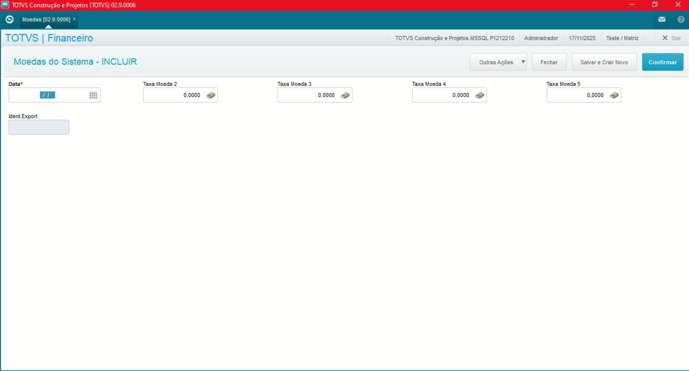
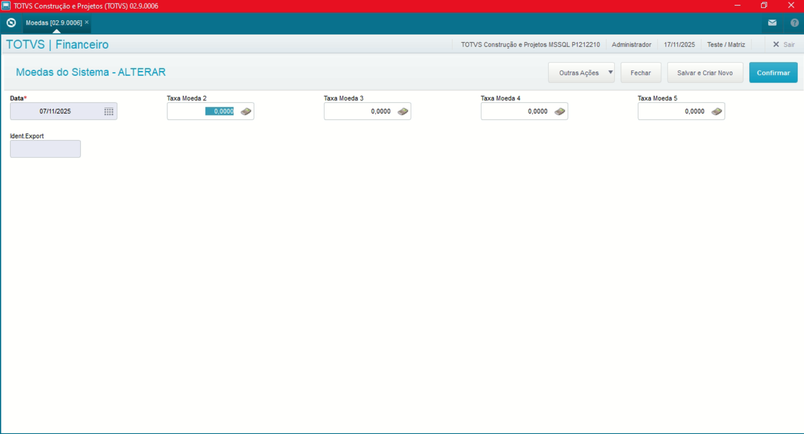
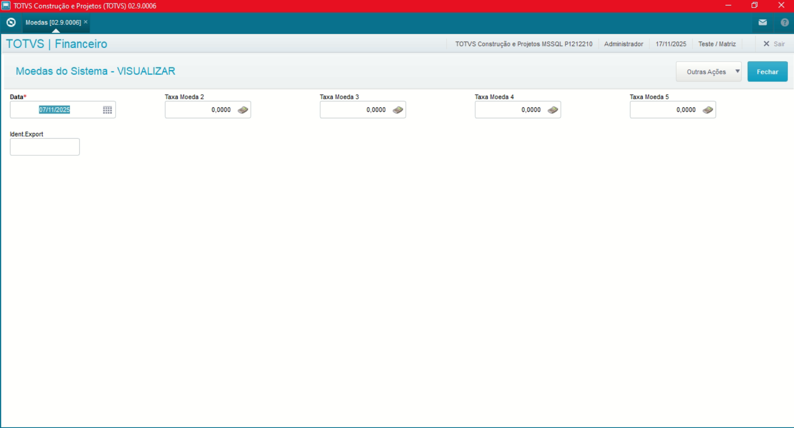
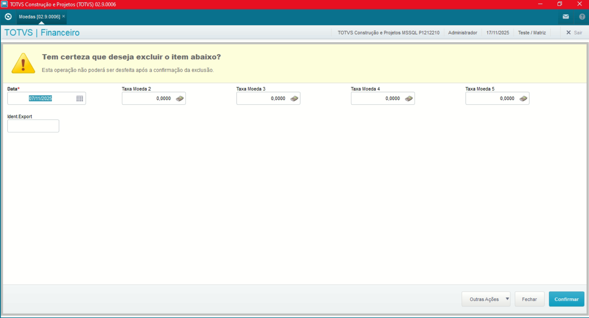

# Entedimento inicial Módulo Financeiro

**Cadastro Moedas**

O cadastro de Moedas feitas no Protheus é feito via **"Módulo 06 - Financeiro"**.

De forma mais técnica, as informações cadastradas no Protheus é feita pela rotina padrão **MATA090.PRW** e suas informações podem ser encontradas na tabela **"Moedas do Sistema - SM2"**.

[SM2 - Moedas do Sistema | ERP Labs](https://https://erplabs.com.br/sm2)

Rotina Protheus:

---

Acesso a rotina de cadastro de moedas via Módulo Financeiro:

Obs: Ao acessar o Protheus pela primeira vez no dia será exibido a tela de Cadastro de Moedas.

Acesso Rotina Moedas:

É possível realizar as operações de inclusão, alteração ou consulta de moedas pelas opções da Rotina:

Inclusão:

Alteração:

Visualização/ Consulta:

Exclusão:

---

## Autor

**Cristian Gustavo** | Consultor e desenvolvedor TOTVS Protheus

- [LinkedIn Cristian Gustavo](https://www.linkedin.com/in/cristian-gustavo-719aa71b2/)
- [GitHub Cristian Gustavo](https://github.com/crsgustav0)

---

    Desenvolvido e documentado por: Cristian Gustavo
    Data início: 17/11/2025
