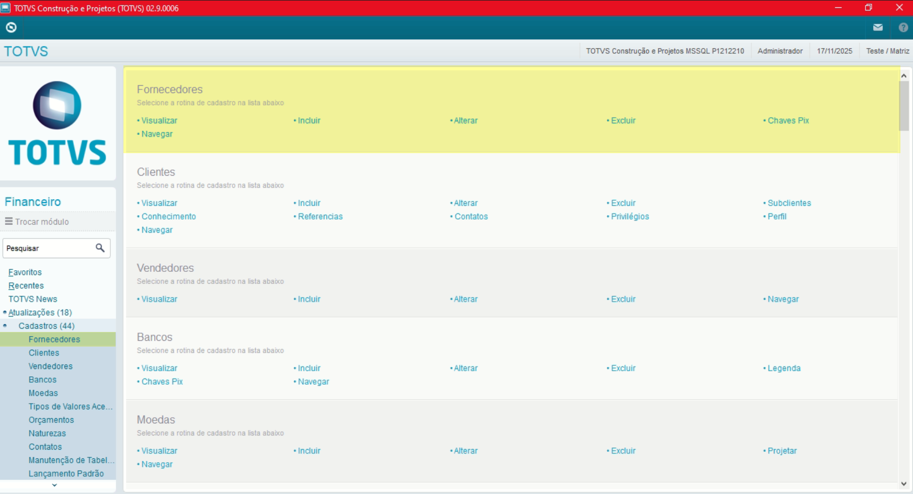
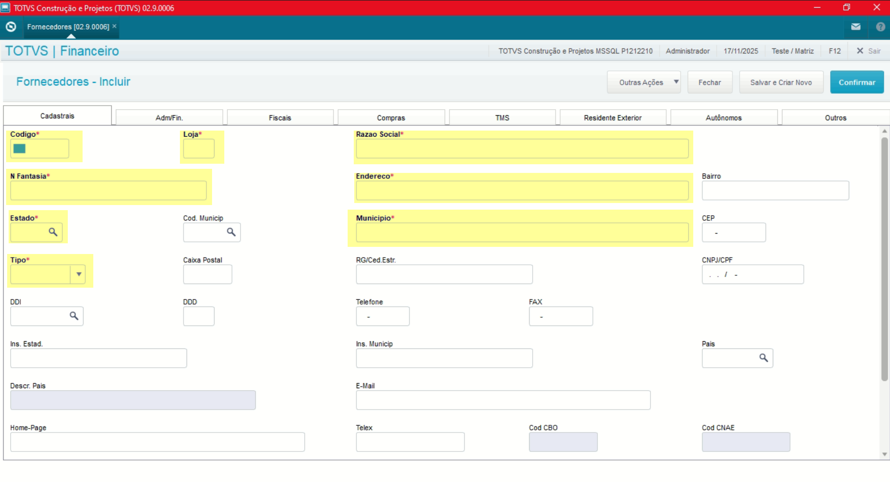
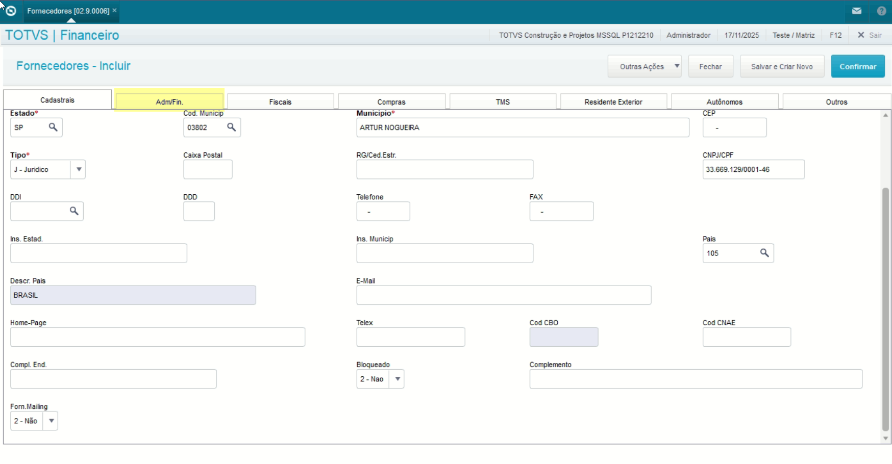
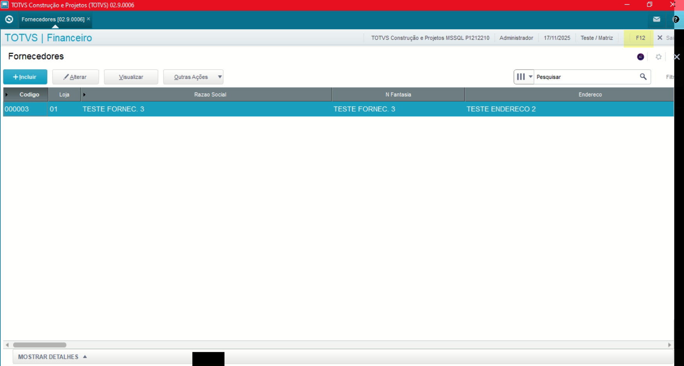
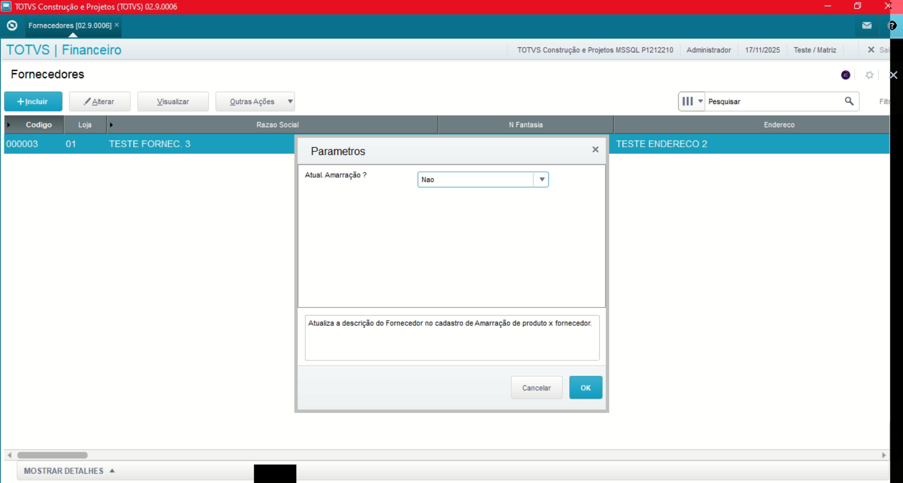
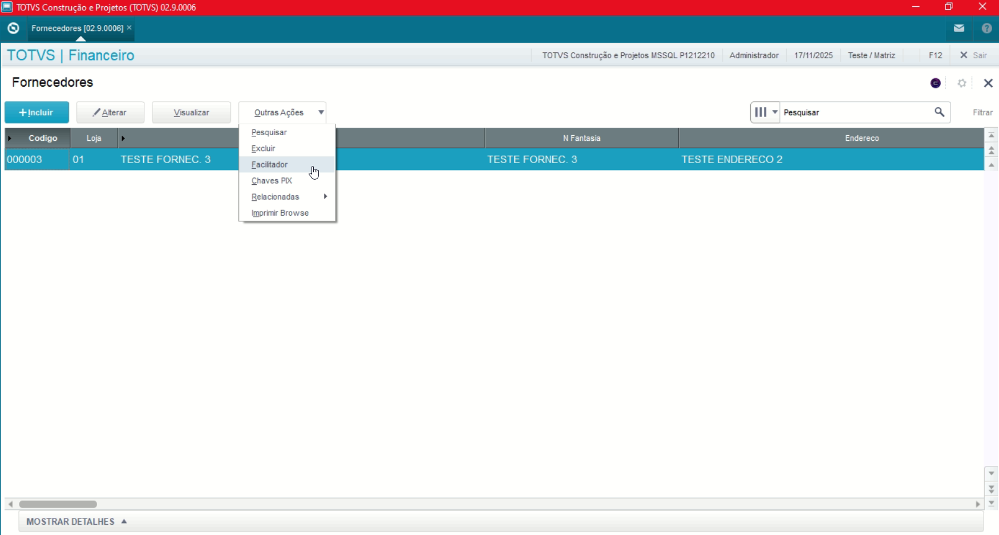
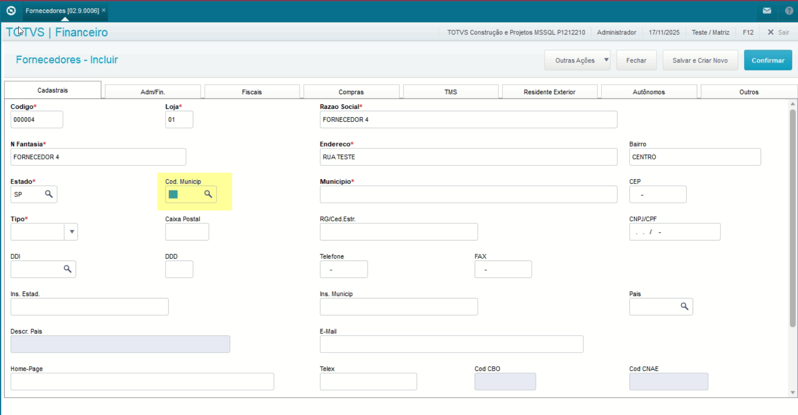
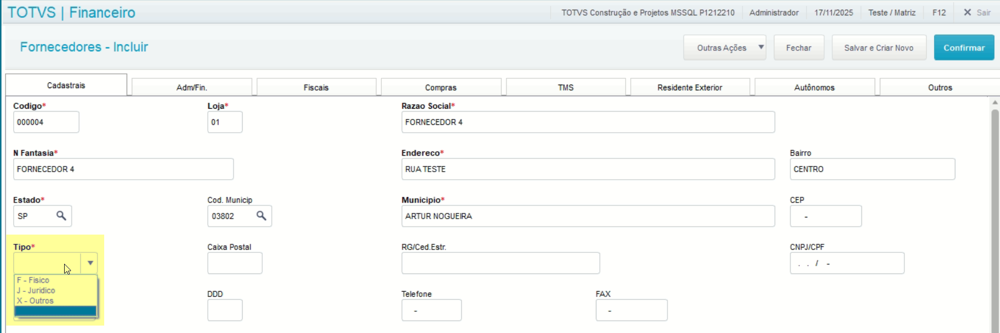
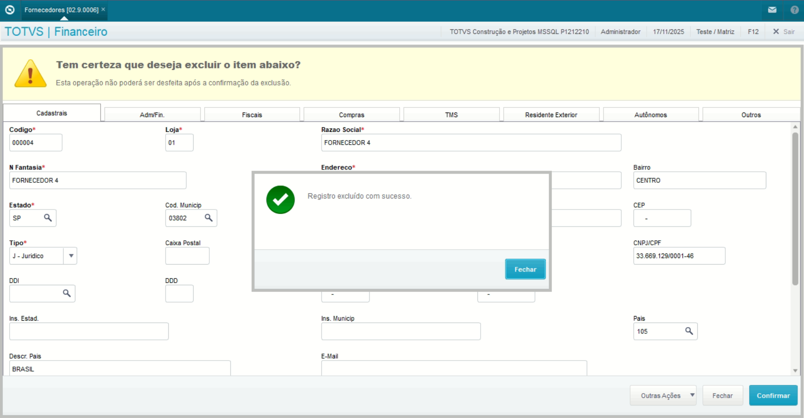
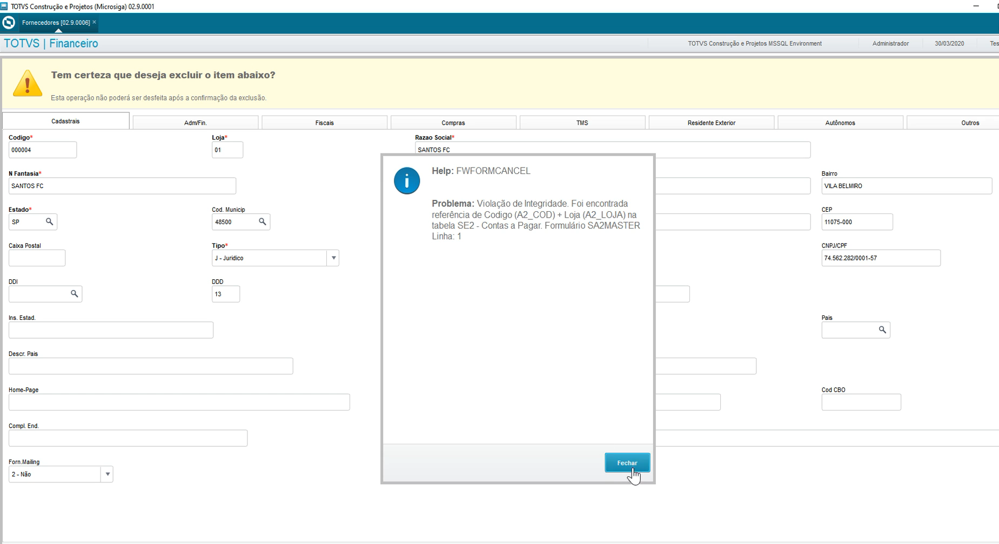

# Entedimento inicial Módulo Financeiro

**Cadastro Fornecedores**

O cadastro de Moedas feitas no Protheus é feito via **"Módulo 06 - Financeiro"**.

De forma mais técnica, as informações cadastradas no Protheus é feita pela rotina padrão **MATA090.PRW** e suas informações podem ser encontradas na tabela **"Fornecedores - SA2"**.

[SM2 - Fornecedores | ERP Labs](https://https://erplabs.com.br/SA2)

Rotina Protheus:

---

Acesso a rotina de cadastro de moedas via Módulo Financeiro:

A rotina padrão de Fornecedores contém as seguintes operações, sendo:

- **Inclusão**
- **Alteração**
- **Consulta**
- **Exclusão**

Em caso de inclusão, deve seguir a regra de preenchimento dos campos obrigatórios, identificados com o **"\*"** em sua descrição.

Para o módulo do Financeiro a aba mais importante do cadastro de Fornecedores é aba **"Adm./Fin"**.

Na parte superior da rotina é possível visualizar o conteúdo **"F12" que por sua vez sinaliza que a rotina possui mais situações de dados que possam ser visualizados.**

---

No menu Outras Ações, é possível encontrar as seguintes opções, sendo:

- **Facilitador**: Opção para centralizar os campos a serem alterados.
- **Relacionados**: Informações amarradas com o cadastro de Fornecedores.
- **Chave PIX**: Cadastro de chaves de pagamento tipo PIX.

---

## Observações

- **Código Município**

Sobre o campo **"Cod. Munic"** o mesmo não é obrigatório mas deve ser preenchido em caso de entrega de obrigações fiscais.

- **Tipo**

Sobre o campo **"Tipo"** contém as três opções de preenchimento, sendo:

- **Fisico** - Uso de CPF
- **Juridico** - Uso de CNPJ
- **Outros** - Geralmente trata-se de fornecedores estrangeiros

- **Exclusão de Fornecedores**

Em caso de exclusão o registro, cadastro do Fornecedor só pode ser excluído caso **não possua registros relacionados** para manter a integridade do sistema.

Do contrário será exibida a seguinte tela:

---

## Autor

**Cristian Gustavo** | Consultor e desenvolvedor TOTVS Protheus

- [LinkedIn Cristian Gustavo](https://www.linkedin.com/in/cristian-gustavo-719aa71b2/)
- [GitHub Cristian Gustavo](https://github.com/crsgustav0)

---

    Desenvolvido e documentado por: Cristian Gustavo
    Data início: 17/11/2025
