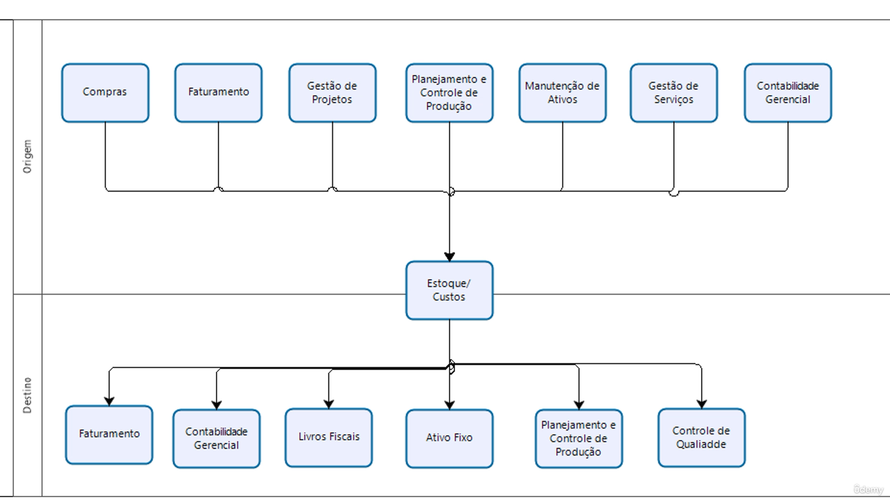

# Entedimento inicial Módulo Estoque

**Principais responsabilidades**

- Gerenciamento e análise de Estoques;
- Controle de:

  - Lote e endereçamento
  - Movimentação de materiais;
  - Acervo de marteriais relacionados a atividade empresarial;
  - Formação de preços e análises de Custos;
  - Produção própria e de terceiros.

- **Principais integrações Módulo Estoque**

- Ativo Fixo
- Compras
- Faturamento
- Financeiro
- Gestão de Projetos
- Planejamento e Controle de Produção (PCO)
- Livros Fiscais
- Controle de Qualidade
- Manutenção de Ativos
- Gestão de Serviços

Exemplo integração do Módulo Estoque para outros módulos:

## Autor

**Cristian Gustavo** | Consultor e desenvolvedor TOTVS Protheus

- [LinkedIn Cristian Gustavo](https://www.linkedin.com/in/cristian-gustavo-719aa71b2/)
- [GitHub Cristian Gustavo](https://github.com/crsgustav0)

---

    Desenvolvido e documentado por: Cristian Gustavo
    Data início: 17/11/2025
