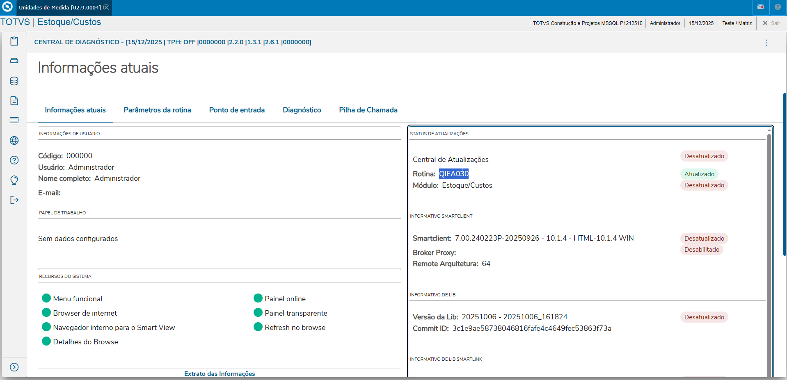
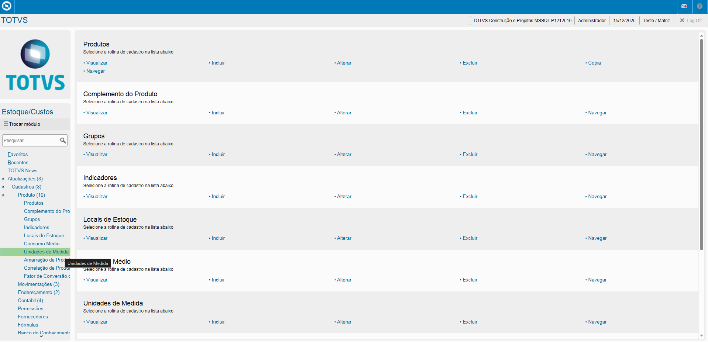
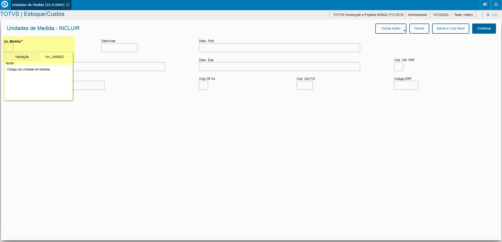
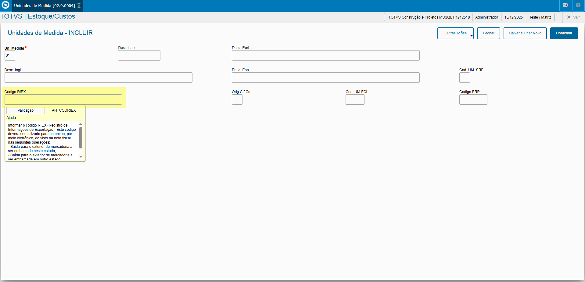

# Entedimento inicial Módulo Estoque/Custos

**Cadastro Unidades de Medida**

O cadastro de Unidades de Medida feitas no Protheus é feito via **"Módulo 04 - Estoque/Custos"**.

De forma mais técnica, as informações cadastradas no Protheus é feita pela rotina padrão **QIEA030.PRW** e suas informações podem ser encontradas na tabela **"Unidades de Medida do Sistema - SAH"**.

[SAH - Unidades de Medida | ERP Labs](https://erplabs.com.br/SAH)

Rotina Protheus:

---

Acesso a rotina de cadastro de Unidades de Medida via Módulo Estoque/Custos:

A rotina padrão de Unidades de Medida contém as seguintes operações, sendo:

- **Inclusão**
- **Alteração**
- **Consulta**
- **Exclusão**

Em caso de inclusão, deve seguir a regra de preenchimento dos campos obrigatórios, identificados com o **"/"** em sua descrição.

## Observações

- **Codigo RIEX**

Sobre o campo **"Codigo RIEX"** o mesmo não é obrigatório mas deve ser preenchido em caso de exportações.

---

## Autor

**Cristian Gustavo** | Consultor e desenvolvedor TOTVS Protheus

- [LinkedIn Cristian Gustavo](https://www.linkedin.com/in/cristian-gustavo-719aa71b2/)
- [GitHub Cristian Gustavo](https://github.com/crsgustav0)

---

    Desenvolvido e documentado por: Cristian Gustavo
    Data início: 17/11/2025
