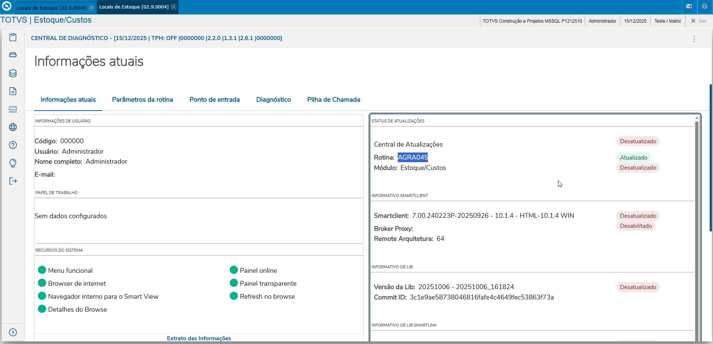
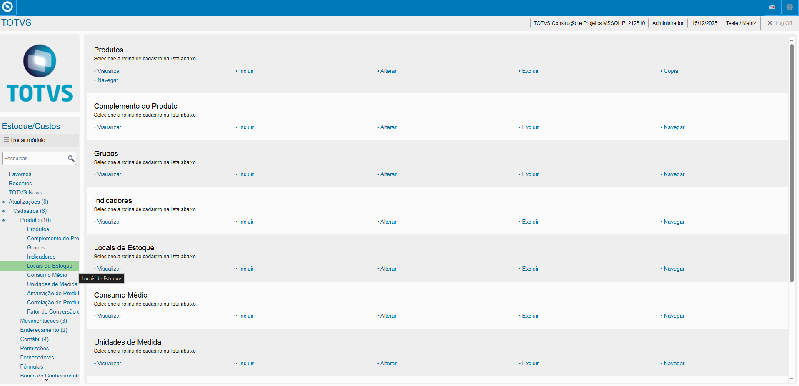
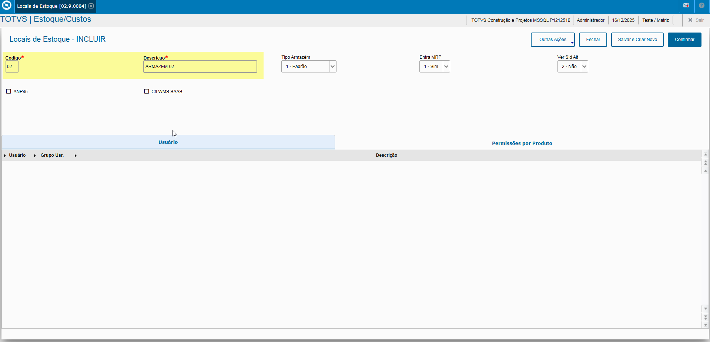
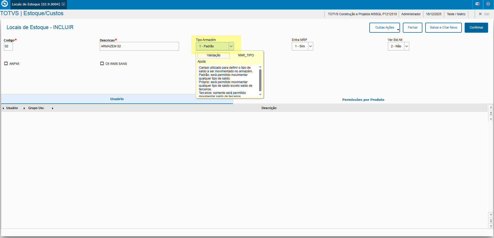
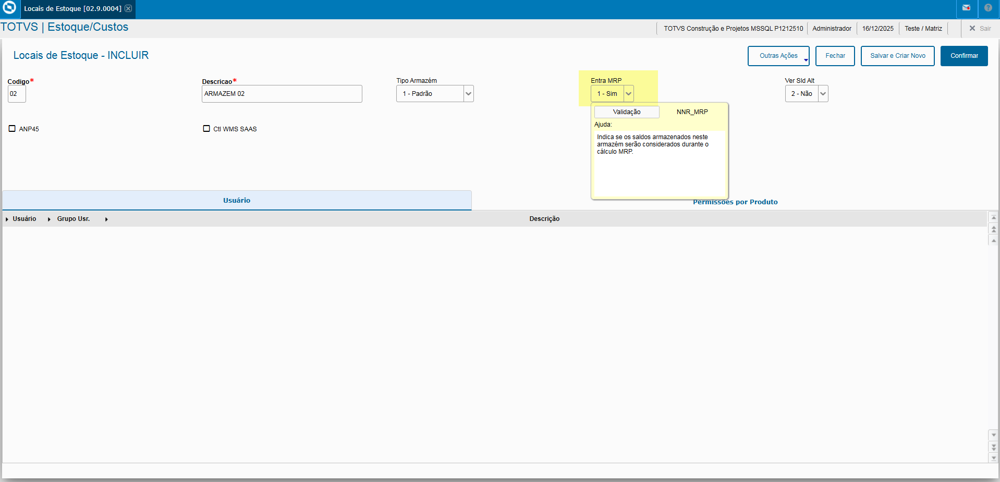
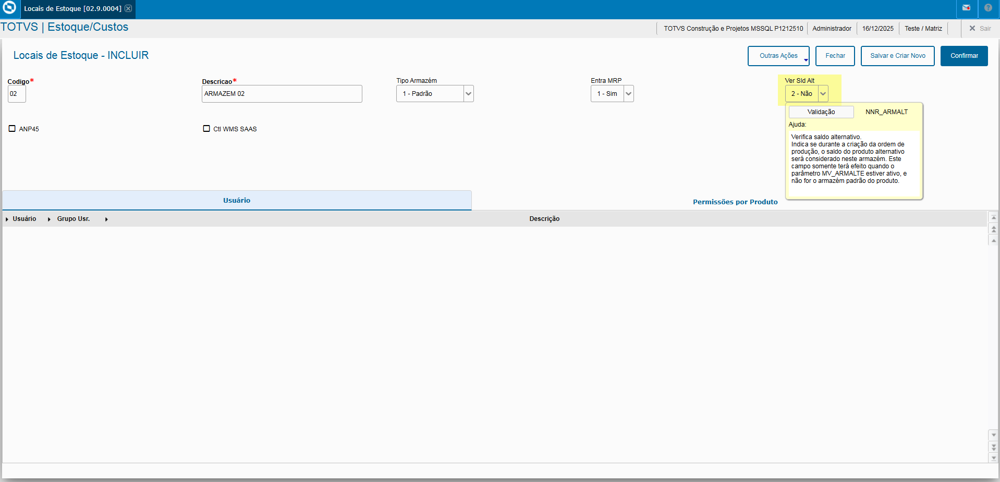
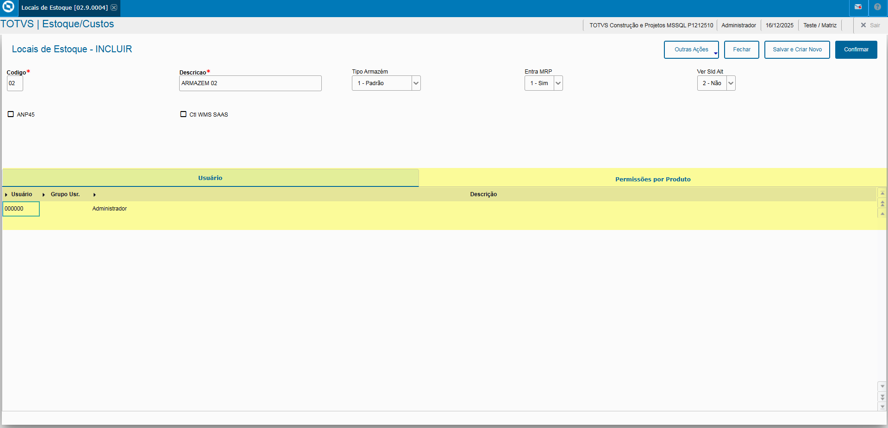
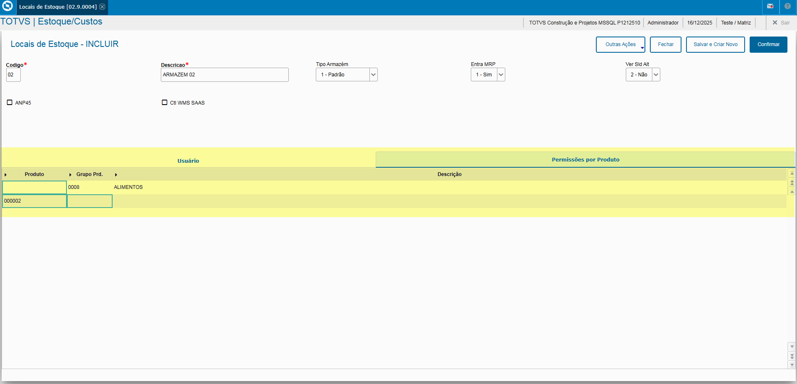

# Entedimento inicial Módulo Estoque/Custos

**Cadastro Locais de Estoque**

O cadastro de Locais de Estoque feitas no Protheus é feito via **"Módulo 04 - Estoque/Custos"**.

De forma mais técnica, as informações cadastradas no Protheus é feita pela rotina padrão **AGRA045.PRW** e suas informações podem ser encontradas na tabela **"Locais de Estoque do Sistema - NNR"**.

**Obs: A rotina tem como objetivo o cadastro, controle de armazens que poderão ser atualizados Mov. Interno, Solic. de Material, Entrada e Saída de Material. O cadastro deve ser feito antes do cadastro de Produto em ordem de cadastro, dados.**.

[NNR - Locais de Estoque | ERP Labs](https://erplabs.com.br/NNR)

Rotina Protheus:

---

A rotina padrão de Locais de Estoque contém as seguintes operações, sendo:

- **Inclusão**
- **Alteração**
- **Consulta**
- **Exclusão**

Em caso de inclusão, deve seguir a regra de preenchimento dos campos obrigatórios, identificados com o **"/"** em sua descrição.

### Observações

- **Tipo Armazém**

Referente ao tipo do armazém, sendo:

- Padrão
- Próprio
- Terceiros

- **Entra MRP**

Define se é incluso a regra do cálculo MRP, necessidades de materias.

- **ANP45**

Específico para controle de combustível.

- **Verifica Saldo Alternativo**

Verifica saldo alternativo, depende da configuração específica.

## Controle de Armazém por Usuário

Caso necessário é possível informar quais armazéns e produto o usuário terá acesso.

A definição de produto pode ser feita tanto pelo Código quanto pelo Grupo Produto.

---

## Autor

**Cristian Gustavo** | Consultor e desenvolvedor TOTVS Protheus

- [LinkedIn Cristian Gustavo](https://www.linkedin.com/in/cristian-gustavo-719aa71b2/)
- [GitHub Cristian Gustavo](https://github.com/crsgustav0)

---

    Desenvolvido e documentado por: Cristian Gustavo
    Data início: 17/11/2025
