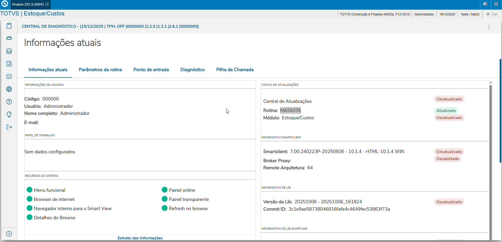
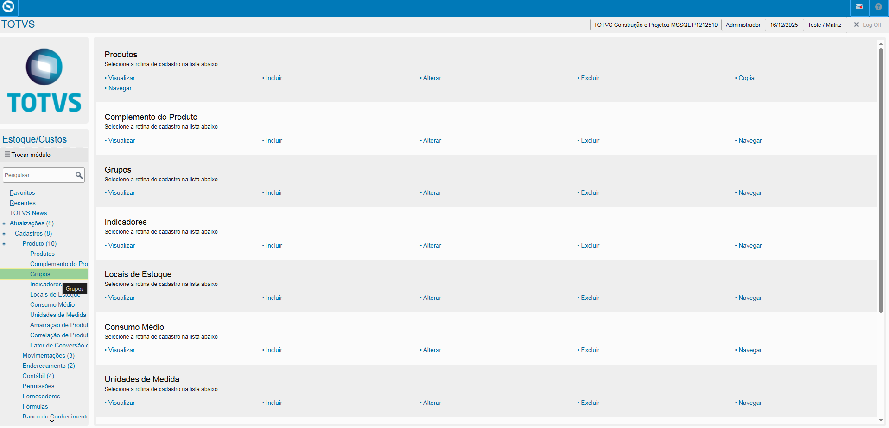
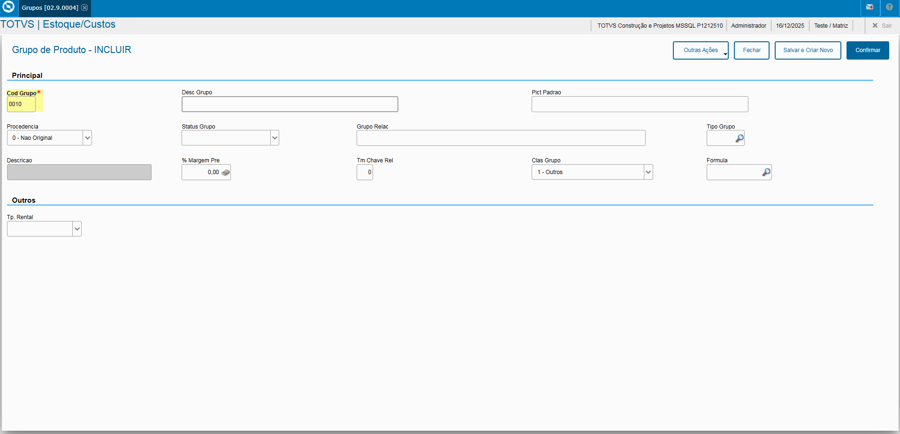
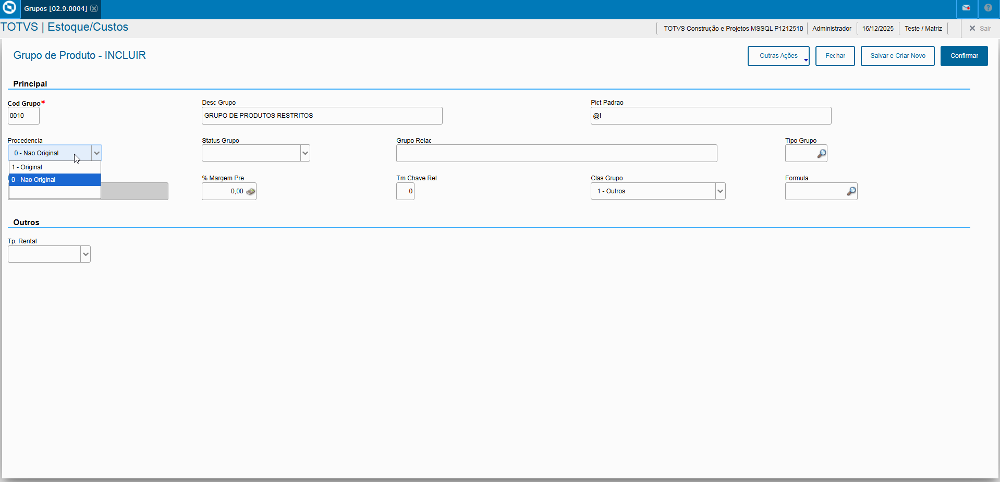
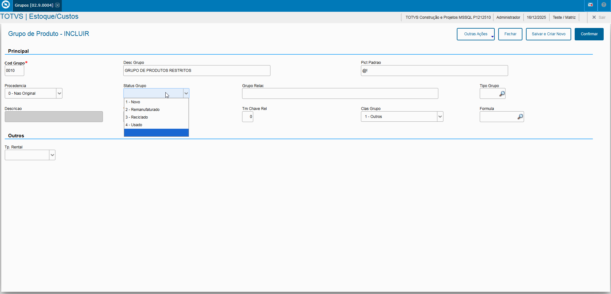
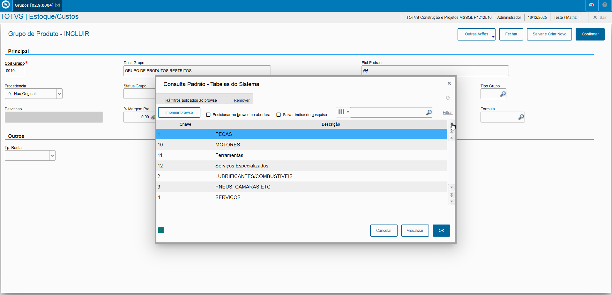

# Entedimento inicial Módulo Estoque/Custos

**Cadastro Grupos de Produtos**

O cadastro de Grupos de Produtos feitas no Protheus é feito via **"Módulo 04 - Estoque/Custos"**.

De forma mais técnica, as informações cadastradas no Protheus é feita pela rotina padrão **MATA035.PRW** e suas informações podem ser encontradas na tabela **"Grupos de Produtos do Sistema - SBM"**.

**Obs: A rotina tem como objetivo agrupar cadastros de produtos aonde, permite geração de consultas, identifcação de produtos entre outros sendo um cadastro não obrigatório.**.

[SBM - Grupos de Produtos | ERP Labs](https://erplabs.com.br/SBM)

Rotina Protheus:

---

A rotina padrão de Grupos de Produtos contém as seguintes operações, sendo:

- **Inclusão**
- **Alteração**
- **Consulta**
- **Exclusão**

Em caso de inclusão, deve seguir a regra de preenchimento dos campos obrigatórios, identificados com o **"/"** em sua descrição.

### Observações

- **Procedência**

Referente a procedência do grupo de produto, sendo:

- Não Original
- Original

- **Status Grupo**

Define o status do grupo do produto, sendo:

- Novo
- Remanfaturado
- Recebido
- Usado

- **Tipo Grupo**

Especifico para uso de concessionárias.

---

## Autor

**Cristian Gustavo** | Consultor e desenvolvedor TOTVS Protheus

- [LinkedIn Cristian Gustavo](https://www.linkedin.com/in/cristian-gustavo-719aa71b2/)
- [GitHub Cristian Gustavo](https://github.com/crsgustav0)

---

    Desenvolvido e documentado por: Cristian Gustavo
    Data início: 17/11/2025
