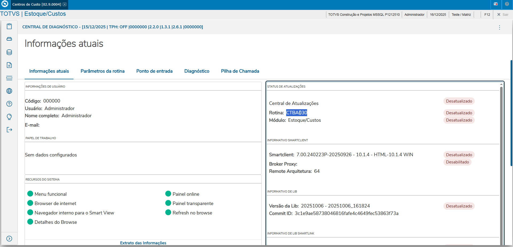
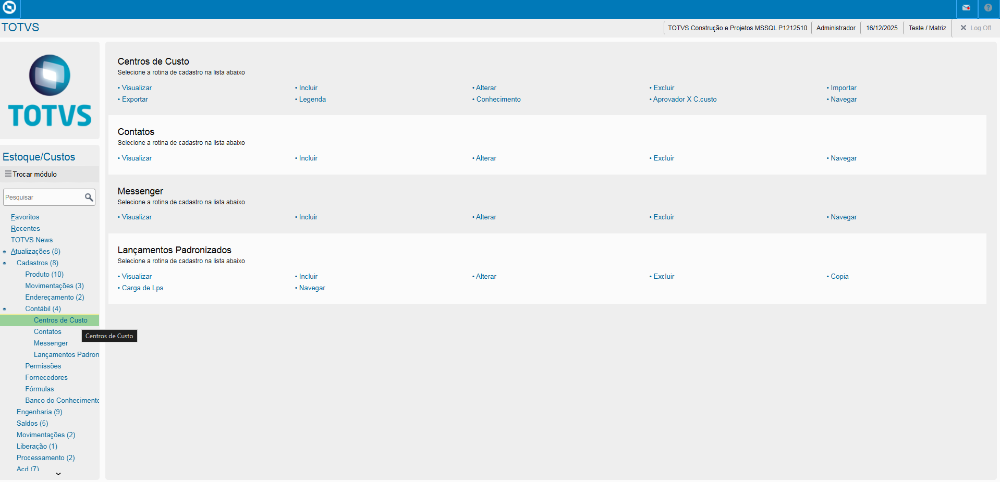
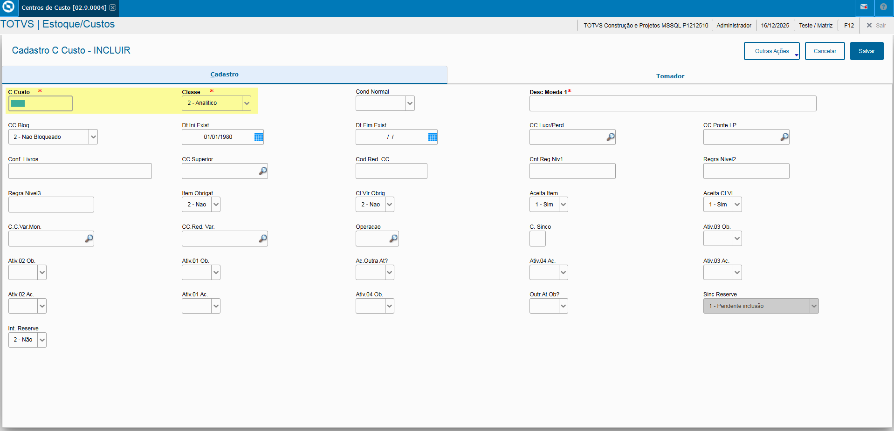
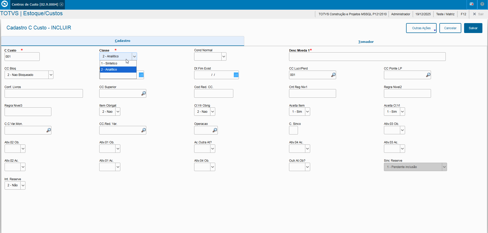
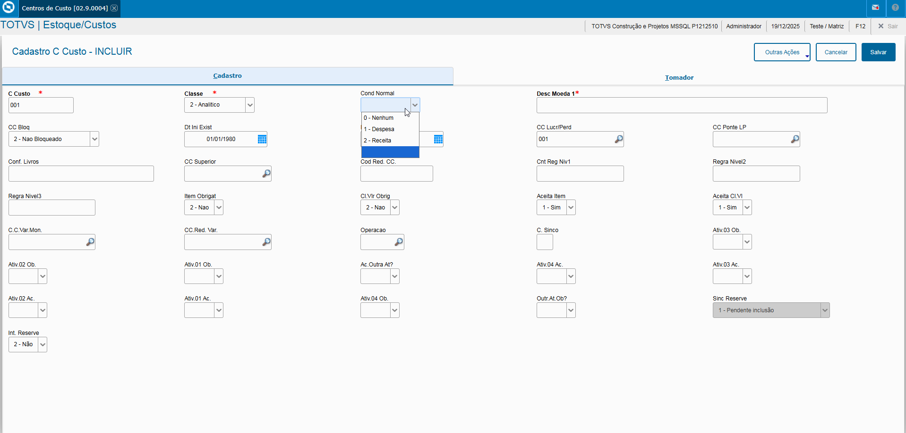
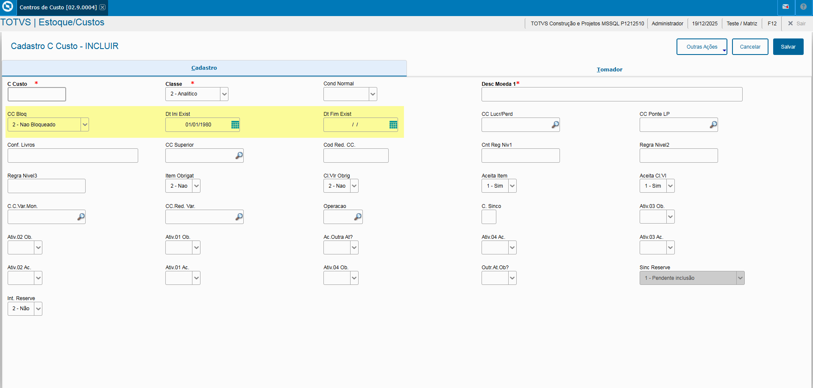

# Entedimento inicial Módulo Estoque/Custos

**Cadastro Centros de Custos**

O cadastro de Centros de Custos feitas no Protheus é feito via **"Módulo 04 - Estoque/Custos"**.

De forma mais técnica, as informações cadastradas no Protheus é feita pela rotina padrão **CTBA030.PRW** e suas informações podem ser encontradas na tabela **"Centros de Custos do Sistema - CTT"**.

**Obs: A rotina tem como objetivo o cadastro e relacionamento do custeio do tipo mão de obra para efeitos de custeio desse determinado produto**.

[CTT - Centro de Custo | ERP Labs](https://erplabs.com.br/CTT)

Rotina Protheus:

---

A rotina padrão de Centros de Custos contém as seguintes operações, sendo:

- **Inclusão**
- **Alteração**
- **Consulta**
- **Exclusão**

Em caso de inclusão, deve seguir a regra de preenchimento dos campos obrigatórios, identificados com o **"/"** em sua descrição.

## Observações

- **Classe**

Referente a procedência do grupo de produto, sendo:

- Sintético, C. Custo apenas somatórios
- Analítco, C. Custo que recebe lançamentos

- **Cond. Normal**

Define a condição do C. Custo, sendo:

- Receita
- Despesa
- Nenhum

- **Data Inicial e Data Final**

Define a data inicial do C. Custo, caso informado o campo **"Data Final"** o C. Custo será bloqueado a partir da data informada.

---

## Autor

**Cristian Gustavo** | Consultor e desenvolvedor TOTVS Protheus

- [LinkedIn Cristian Gustavo](https://www.linkedin.com/in/cristian-gustavo-719aa71b2/)
- [GitHub Cristian Gustavo](https://github.com/crsgustav0)

---

    Desenvolvido e documentado por: Cristian Gustavo
    Data início: 17/11/2025
