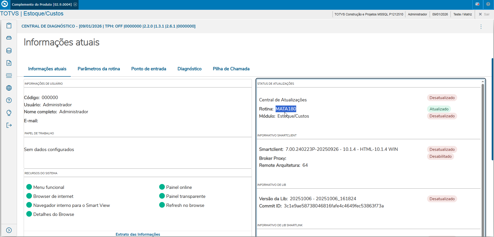
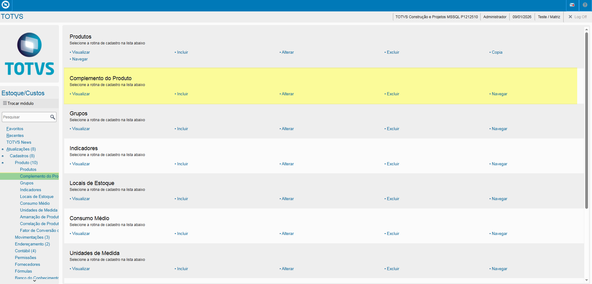
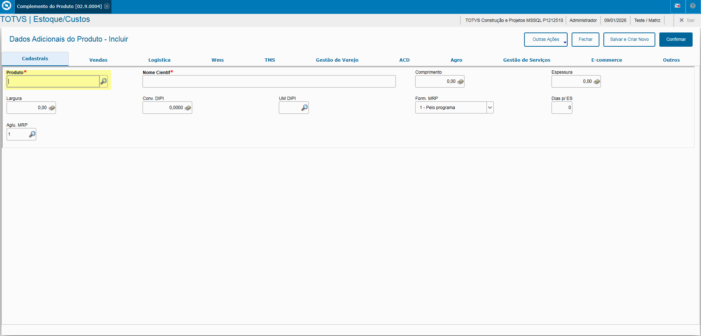
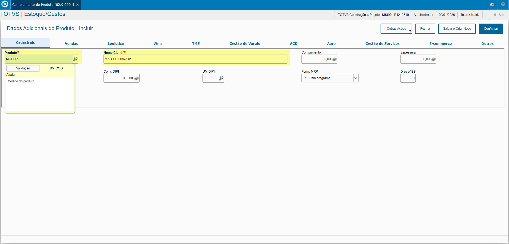

# Entedimento inicial Módulo Estoque/Custos

**Cadastro Dados Adicionais do Produto**

O cadastro de Dados Adicionais do Produto feitas no Protheus é feito via **"Módulo 04 - Estoque/Custos"**.

De forma mais técnica, as informações cadastradas no Protheus é feita pela rotina padrão **MATA180.PRW** e suas informações podem ser encontradas na tabela **"Dados Adicionais do Produto - SB5"**.

**Obs: A rotina tem como objetivo de armazenar informações complementares do produto como Tabela de Preços, Nome Científico, Certificado de Qualidade e outras informações fornecidas pela empresa tendo como premissa um produto já cadastrado**.

[SB5 - Dados Adicionais do Produto | ERP Labs](https://erplabs.com.br/SB5)

Rotina Protheus:

---

A rotina padrão de Dados Adicionais do Produto contém as seguintes operações, sendo:

- **Inclusão**
- **Alteração**
- **Consulta**
- **Exclusão**

Em caso de inclusão, deve seguir a regra de preenchimento dos campos obrigatórios, identificados com o **"/"** em sua descrição.

### Observações

- **Produto**

Referente ao produto, o campo **"Nome Científico"** pode ser preenchido com o mesmo valor que sua Descrição.  

- **FEFO**: Campo opcional, caso a empresa utilize e deseja controlar o controle a classe da valor via Cadastro do Produto.

# Aba "C.Q (Controle de Qualidade)"

Cadastro que permite a inspeção e avaliação de produtos via Almoxarifado e caso a empresa faça o uso do Módulo de Controle de Qualidade.

- **Nota Minima**: Campo que indica a nota mínima do Controle de Qualidade para o produto.

- **Tipo Controle de Qualiade**: Campo que indica o tipo de controle de qualidade para produto, sendo:

  - **M - Materiais**, Materiais sendo no Módulo Estoque/ Custos.
  - **Q - SigaQuality**, Módulo Controle de Qualidade.

### Observações

É realizado também o cadastro de produtos que não necessariamente são insumos, sendo apontados em Ordem de Produção como:

- Mão de Obra
- Gastos gerais de Produção

Sendo feito com o preenchimento do campo **Código** com o "MOD" e seu **Centro de Custo**, sendo preenchido desta forma:

- **Código**: "MOD001"
  Nesse exemplo está sendo feito o cadastro de Mão de Obra para um determinado C. Custo.
- **Tipo**: "MO", referente a Mão de Obra.
- **Unidade**: "HR", referente a Hora.
- **Arm. Padrão**: "01", referente ao Armazém Padrão.
- **C. Custo**: "001", referente ao C. Custo Padrão e também usado na composição do campo "Código".

  

---

## Autor

**Cristian Gustavo** | Consultor e desenvolvedor TOTVS Protheus

- [LinkedIn Cristian Gustavo](https://www.linkedin.com/in/cristian-gustavo-719aa71b2/)
- [GitHub Cristian Gustavo](https://github.com/crsgustav0)

---

    Desenvolvido e documentado por: Cristian Gustavo
    Data início: 17/11/2025
