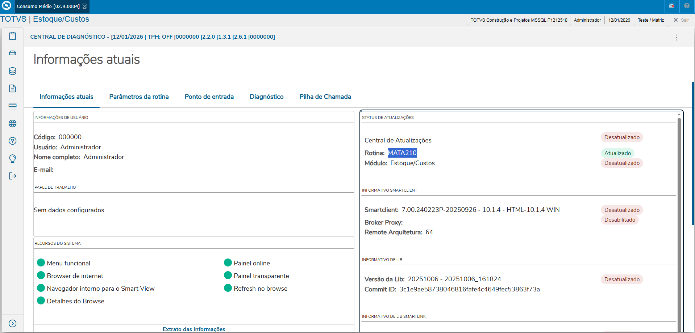
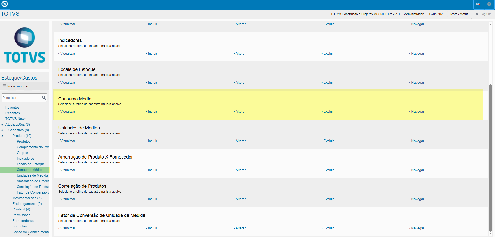
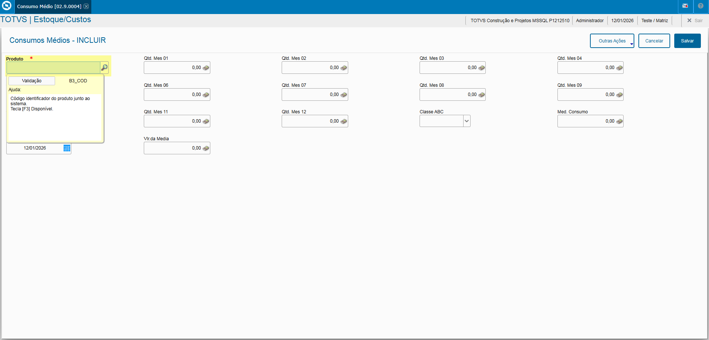

# Entedimento inicial Módulo Estoque/Custos

**Cadastro Consumo Médio**

O cadastro de Consumo Médio feitas no Protheus é feito via **"Módulo 04 - Estoque/Custos"**.

De forma mais técnica, as informações cadastradas no Protheus é feita pela rotina padrão **MATA210.PRW** e suas informações podem ser encontradas na tabela **"Consumo Médio - SB3"**.

**Obs: A rotina tem como objetivo de armazenar informações como consumo médio de um produto nos últimos 12 meses ou em um período específico e informações médias de consumo e classificação dos produtos.**

[SB3 - Demandas | ERP Labs](https://erplabs.com.br/SB3)

Rotina Protheus:

---

A rotina padrão de Consumo Médio contém as seguintes operações, sendo:

- **Inclusão**
- **Alteração**
- **Consulta**
- **Exclusão**

Em caso de inclusão, deve seguir a regra de preenchimento dos campos obrigatórios, identificados com o **"/"** em sua descrição.

---

## Autor

**Cristian Gustavo** | Consultor e desenvolvedor TOTVS Protheus

- [LinkedIn Cristian Gustavo](https://www.linkedin.com/in/cristian-gustavo-719aa71b2/)
- [GitHub Cristian Gustavo](https://github.com/crsgustav0)

---

    Desenvolvido e documentado por: Cristian Gustavo
    Data início: 17/11/2025
