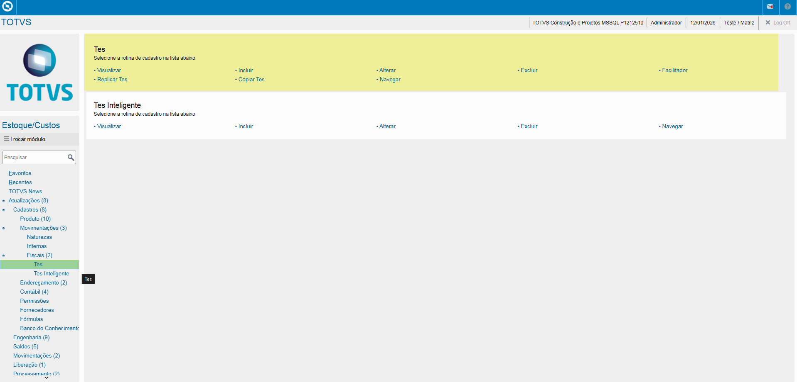
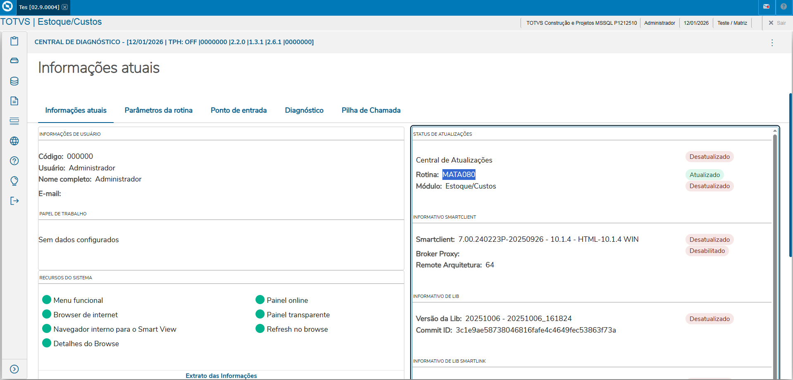
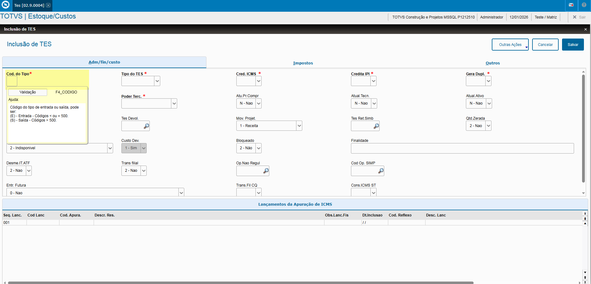

# Entedimento inicial Módulo Estoque/Custos

**Cadastro Tipos Entrada e Saída**

O cadastro de Tipos Entrada e Saída feitas no Protheus é feito via **"Módulo 04 - Estoque/Custos"**.

De forma mais técnica, as informações cadastradas no Protheus é feita pela rotina padrão **MATA080.PRW** e suas informações podem ser encontradas na tabela **"Tipos de Entrada e Saida - SF4"** e **"Amarração TES X Lanc. Apur. - CC7"**

**Obs: A rotina tem como objetivo de classificar entrada e saídas fiscais, ambas sendo externas como:**

- Notas Entrada
- Notas Saída

[SF4 - Tipos de Entrada e Saida | ERP Labs](https://erplabs.com.br/SF4)

[CC7 - Amarração TES X Lanc. Apur. | ERP Labs](https://erplabs.com.br/SF4)

Rotina Protheus:

---

A rotina padrão de Tipos Entrada e Saída contém as seguintes operações, sendo:

- **Inclusão**
- **Alteração**
- **Consulta**
- **Exclusão**

Em caso de inclusão, deve seguir a regra de preenchimento dos campos obrigatórios, identificados com o **"/"** em sua descrição.

Pode ser feita a consulta da documentação do Cadastro Entrada e Saída no Módulo de Compras.

| **Cad. Moedas** | **Compras** | SM2 | MATA090 | [Cad. Moedas](<../../../../02.Negocios\01.Compras\02.Cadastros\05.Tipo Entrada Saida (TES)\README.md>)

## Aba "Adm"

- **Código do Tipo**

Define o Tipo de Entrada, o código define se o tipo é **"Entrada"** ou **"Saída"**.

Obs: Todos os código entre o intervalo de **"001"** até **"630"** se trata de Tipo Entrada.

- **Código do Tipo**

Campo que define se será feito a Creditação ICMS deduzindo do produto informado, a mesma regra se aplica para os campos: **"Credita IPI"**, tendo como premissa o preenchimento como **"Sim"** do campo **"Atualiza Estoque"**.

- **Poder de Terceiros**

Campo que permite o recebimento, envio de materiais para fornecedor ou cliente.

## Aba "Custos/Impostos"

Preenchimento dos campos obrigatórios, sendo:

- **Cálculo ICMS**
- **Cálculo IPI**
- **Cód. Fiscal**
- **Texto Padrão**

Para fins relacionados a Custos, são preenchidos os campos:

- **% Red. do ICMS**
- **% Red. do IPI**
- **Livros Fiscais ICMS**
- **Livros Fiscais ICMS**
- **Destaca IPI**
- **IPI na Base**
- **Calc. Dif. ICM**

Campo:

- **Agrega Valor**: Campo define a forma de agrupar os valores de acordo com as opções disponíveis.

---

## Autor

**Cristian Gustavo** | Consultor e desenvolvedor TOTVS Protheus

- [LinkedIn Cristian Gustavo](https://www.linkedin.com/in/cristian-gustavo-719aa71b2/)
- [GitHub Cristian Gustavo](https://github.com/crsgustav0)

---

    Desenvolvido e documentado por: Cristian Gustavo
    Data início: 17/11/2025
