# Entedimento inicial Módulo Estoque/Custos

**Cadastro Tipos de Movimentação**

O cadastro de Tipos de Movimentação feitas no Protheus é feito via **"Módulo 04 - Estoque/Custos"**.

De forma mais técnica, as informações cadastradas no Protheus é feita pela rotina padrão **MATA230.PRW** e suas informações podem ser encontradas na tabela **"Tipos de Movimentação - SF5"**.

**Obs: A rotina tem como objetivo o cadastro de movimentações de materiais dentro do Estoque. Mov. Interna são definidos pelo Tipo de Movimentação, internas dentro da empresa, diferenciando da TES que são movimentações externas sendo entrada ou saída.**

- Notas Entrada
- Notas Saída

[SF5 - Tipos de Movimentação | ERP Labs](https://erplabs.com.br/SF5)

Rotina Protheus:

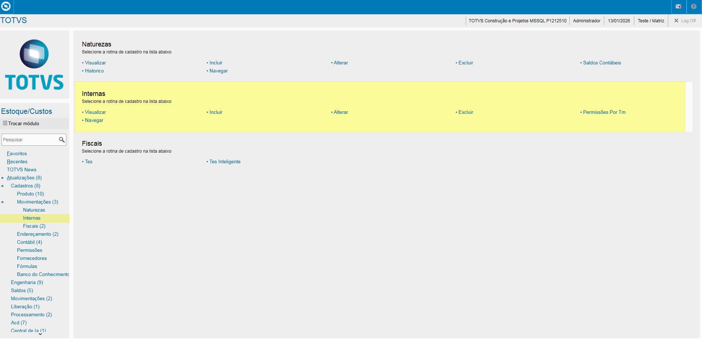

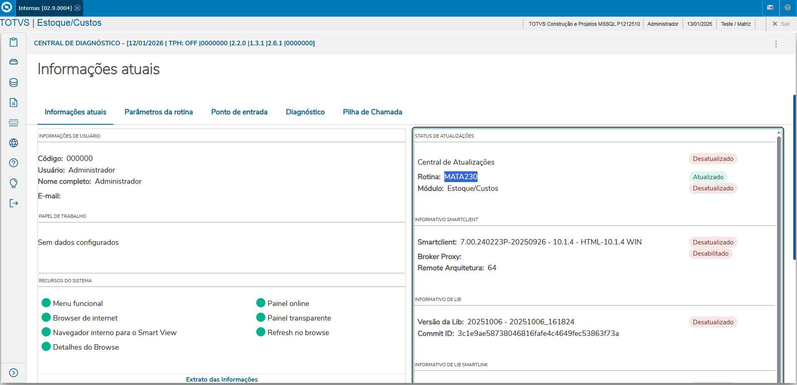

---

A rotina padrão de Tipos de Movimentação contém as seguintes operações, sendo:

- **Inclusão**
- **Alteração**
- **Consulta**
- **Exclusão**

Em caso de inclusão, deve seguir a regra de preenchimento dos campos obrigatórios, identificados com o **"/"** em sua descrição.

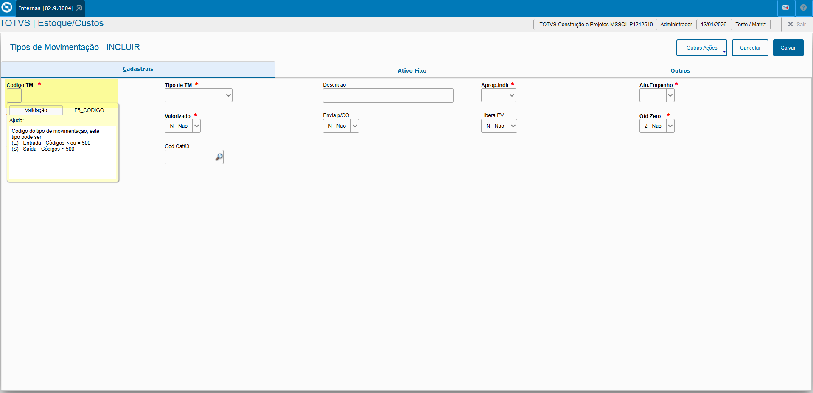

## Aba "Cadastrais"

- **Código Tipo Movimentação** e **Tipo Movimentação**

Define o Tipo de Movimentação, o código define se o tipo é **"Entrada"** ou **"Saída"**.

Obs: Todos os código entre o intervalo de **"001"** até **"500"** se trata de Tipo Entrada. Acima de **"500"** se tratam do Tipo Saída.
Podem ser cadastrado outros Tipo de Movimentação, sendo:

- **Produção**: Gera Tipo Movimentação "PR0" de um Produto acabado.
- **Devolução**: Inclusão do Estoque.
- **Requisição**: Retira do Estoque.

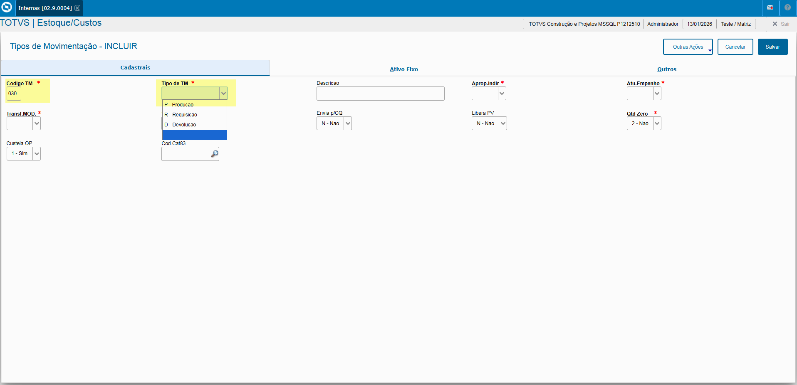

---

- **Apropriação Indireta**

Campo que define se o Produto em questão será armazenado em um armazem de processo, sendo consumido via Ordens de Produção. O campo **Apropriação Indireta** trabalha em conjunto com o campo **Apropriação** da rotina de Produtos sendo usado para Tipo de Movimentação como:

- **Devolução**: Inclusão do Estoque.
- **Requisição**: Retira do Estoque.

Necessário preencher como **"Sim"**.
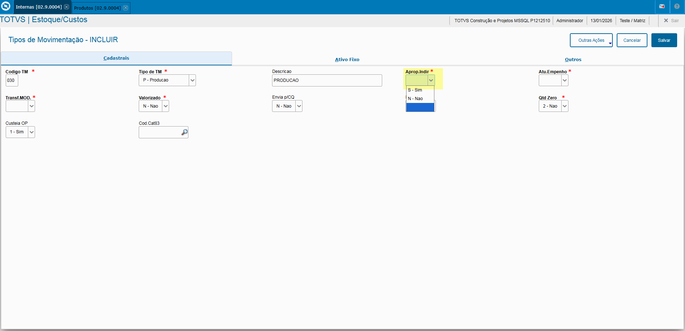

Rotina Produtos, necessário preencher como **"Indireto"**.
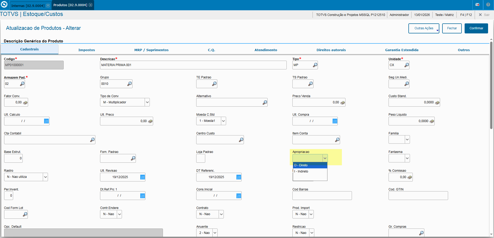

---

- **Atualiza Empenho**

Campo que define se será feita a Atualização do Empenho do Produto em questão.

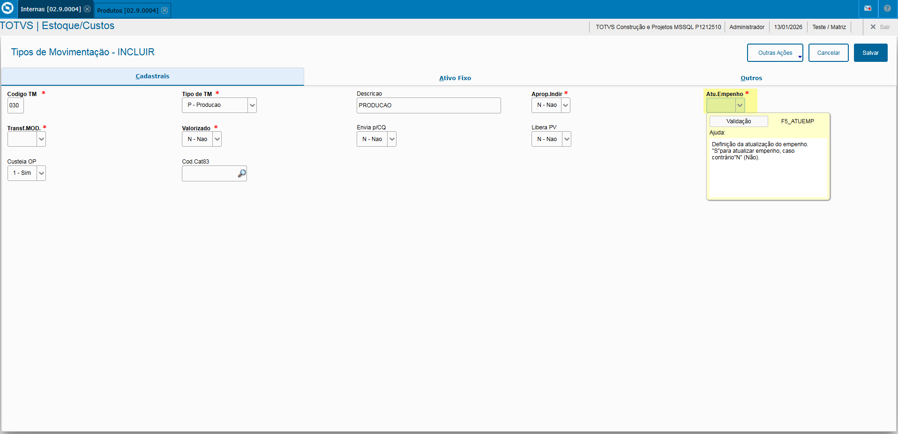

- **Transferir Produto de Mão de Obra**

Campo que define se será feita a transferência de Mão de Obra.

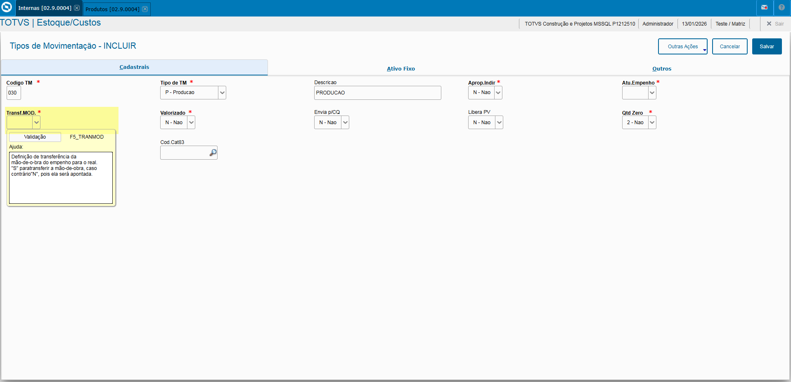

- **Valorizado**

Campo que define se o Mov. Interno deve ser valorizado, ou seja, **possua necessidade de alteração de valores**, por se tratar de um Produto de Mão de Obra deve ser informado como **"Não"**.

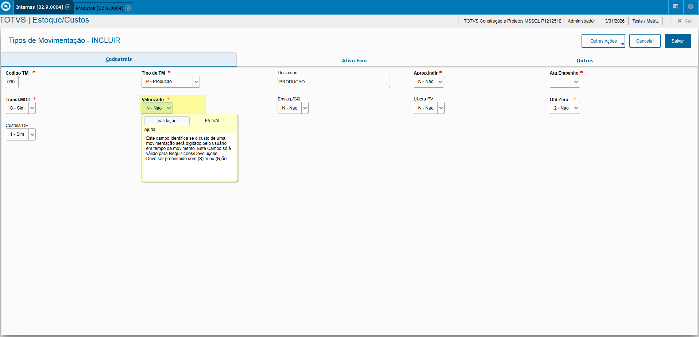

- **Envia para Controle Qualidade**

Caso a empresa utilize o Controle de Qualidade o campo deve ser informado como **"Sim"**.

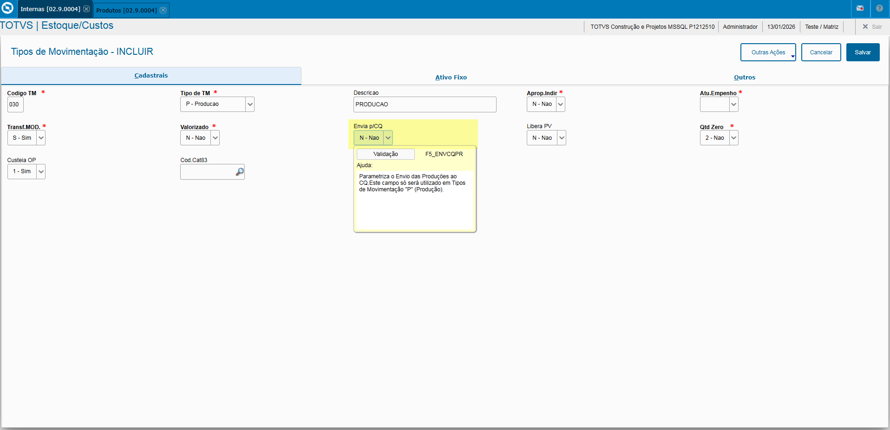

- **Libera PV**

Campo que define ao realizar a produção desse produto, será feito a liberação de um eventual Pedido de Venda.

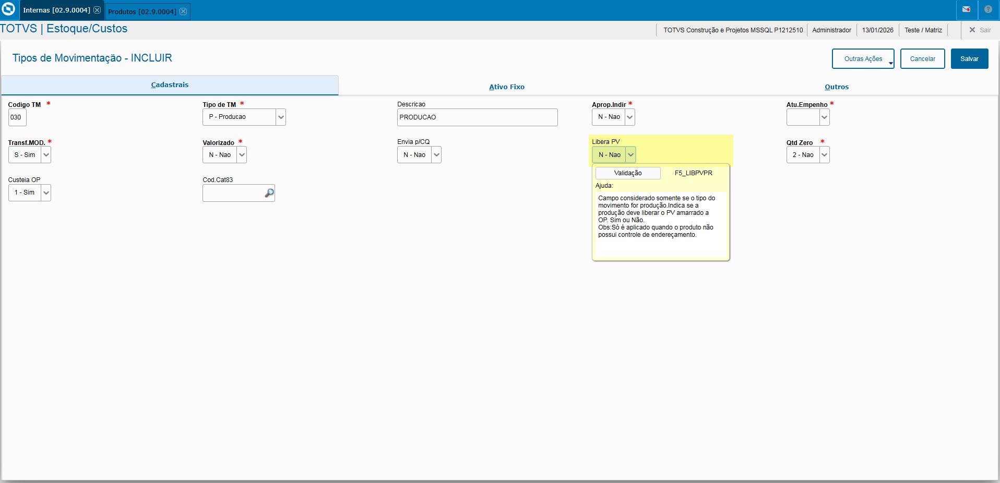

- **Qtde. Zero**

Campo que define será a quantidade dessaa Movimentação interna pode ser zerada ou não.

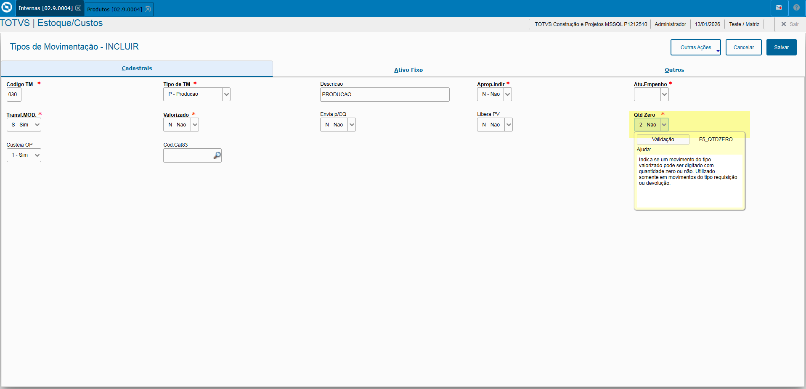

- **Custeio OP**

Campo que define se será feito o Custeio da OP dessa Movimentação interna.

## Aba "Ativo Fixo"

Preenchimento dos campos obrigatórios, sendo:

- **Gera Ativo**: Campo que define que se esse tipo Mov. Interna incluirá um Ativo no Módulo Ativo Fixo e caso informado como **"Sim"** também o **"Tipo Entrada"**.

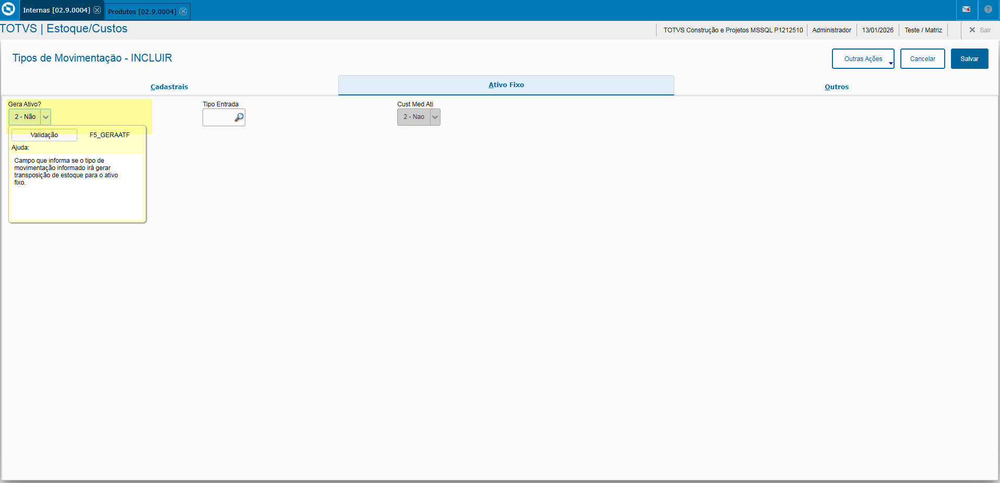

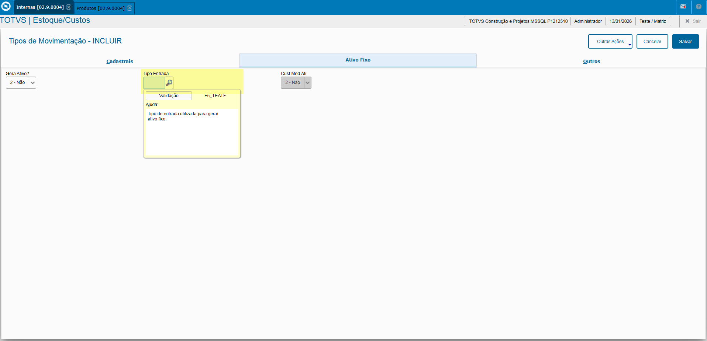

## Aba "Outras Ações"

Caso a Movimentação Interna possua definição de permissão de usuários como ou também a definição de permissões por Tipo de Movimentações como:

- **Apontar Produção**
- **Requisição Valorizada**
- **Requisição Almoxarifado**

Pode ser feito a definição via opção **"Permisões por TM"** no menu **"Outras Ações"**, por fim informando o usuário que será incluso nas permissões do TM em questão.

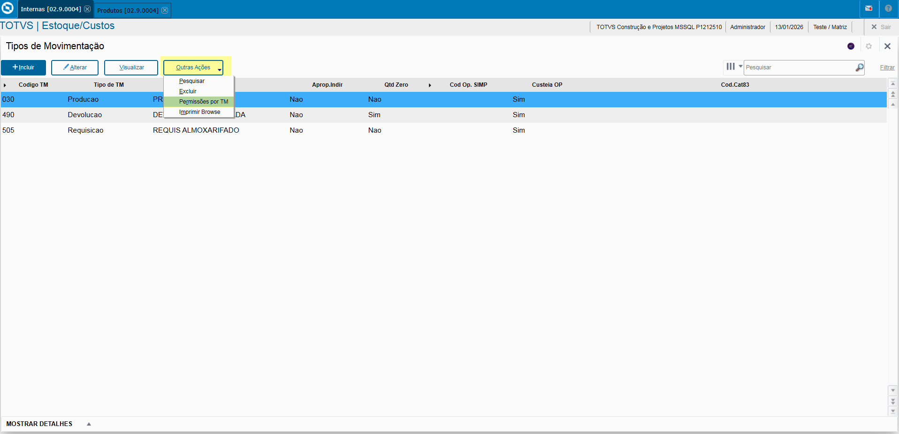

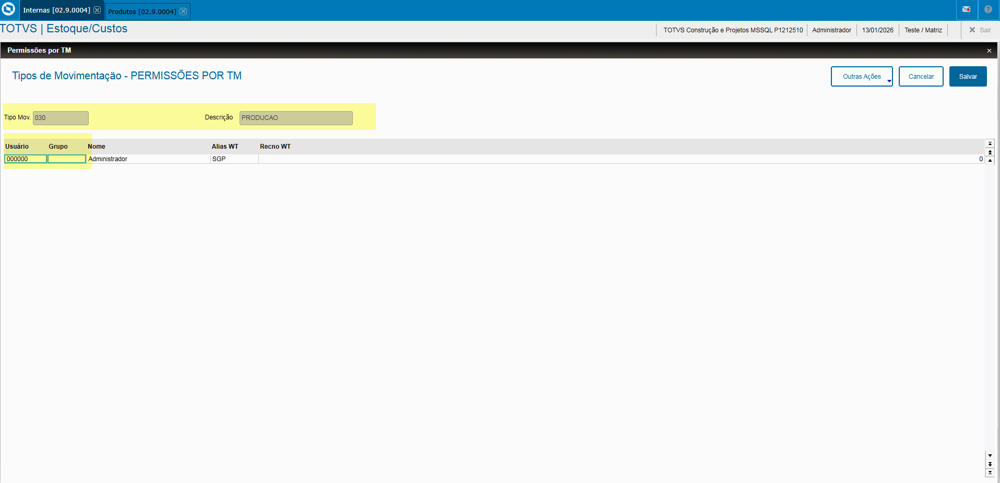

---

## Autor

**Cristian Gustavo** | Consultor e desenvolvedor TOTVS Protheus

- [LinkedIn Cristian Gustavo](https://www.linkedin.com/in/cristian-gustavo-719aa71b2/)
- [GitHub Cristian Gustavo](https://github.com/crsgustav0)

---

    Desenvolvido e documentado por: Cristian Gustavo
    Data início: 17/11/2025
