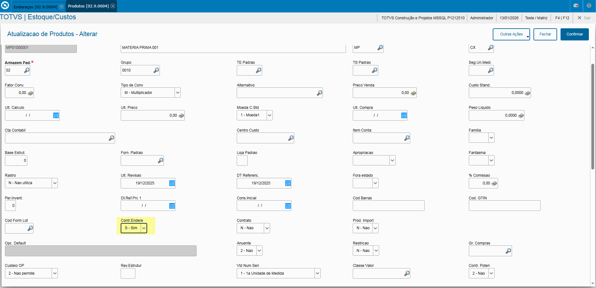
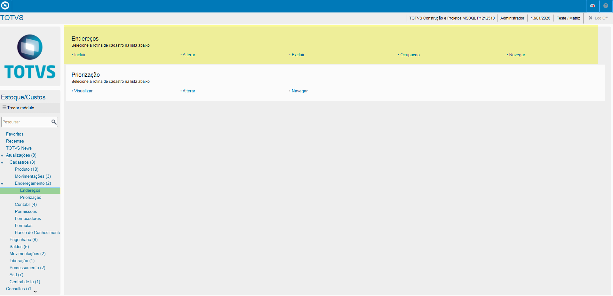
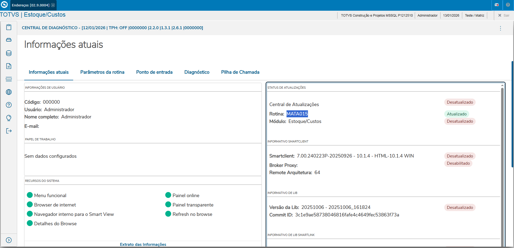
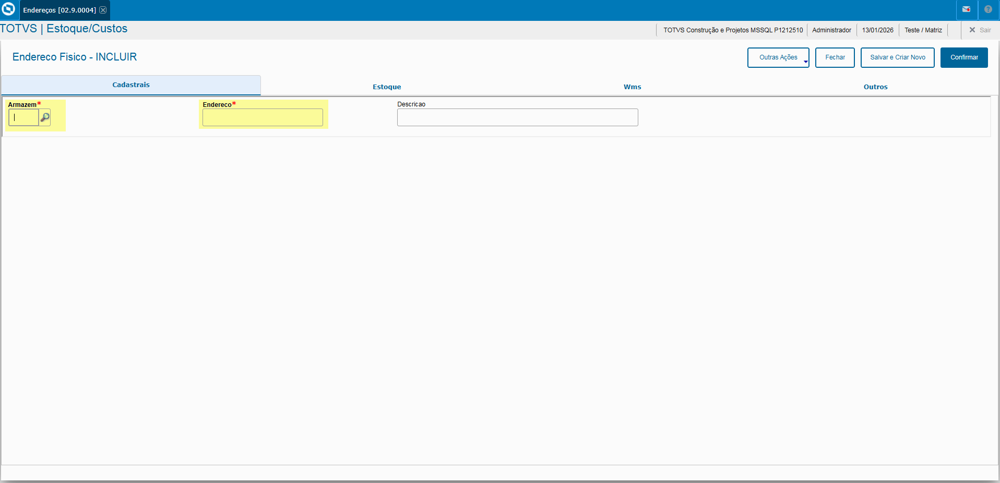
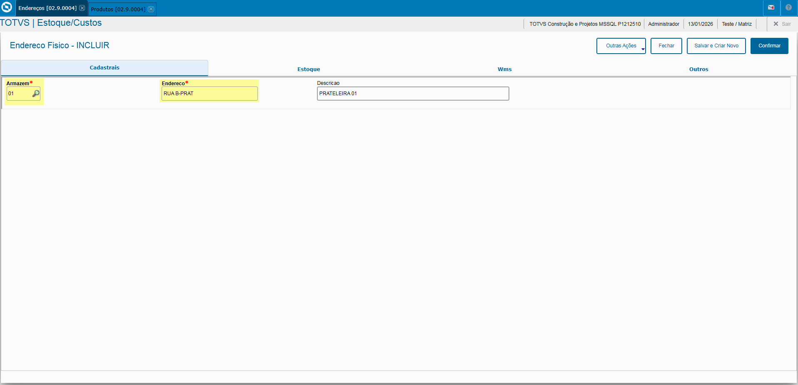
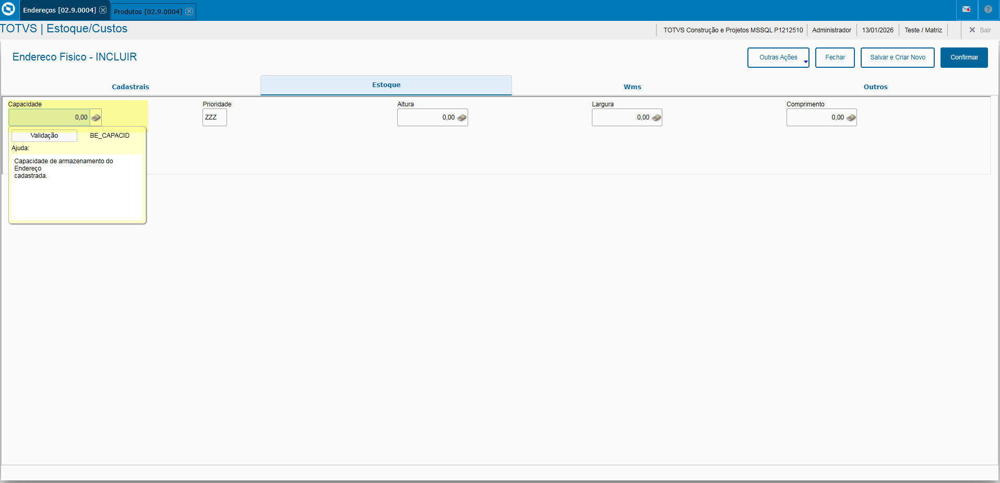
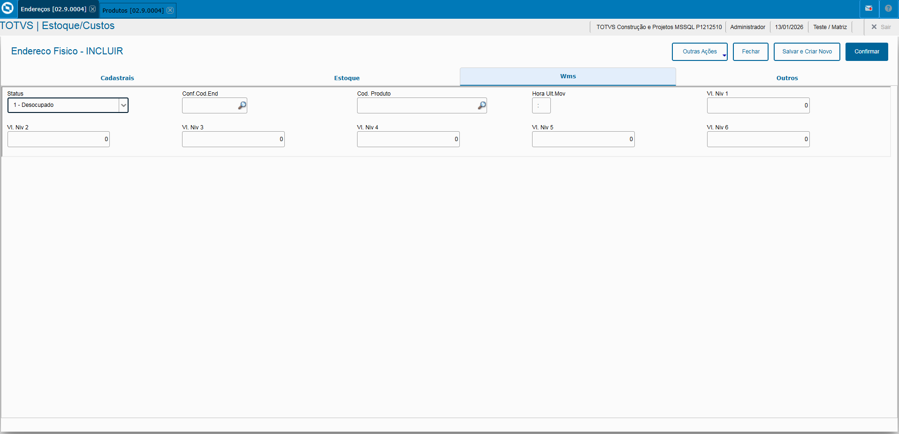

# Entedimento inicial Módulo Estoque/Custos

**Cadastro Endereços**

O cadastro de Endereços feitas no Protheus é feito via **"Módulo 04 - Estoque/Custos"**.

De forma mais técnica, as informações cadastradas no Protheus é feita pela rotina padrão **MATA015.PRW** e suas informações podem ser encontradas na tabela **"Endereços - SBE"**.

**Obs: A rotina tem como objetivo o cadastro de endereços para a alocação dos produtos.**

Tendo como premissa o preenchimento do campo **"Controla Endereço"** no cadastro de Produtos.

---

[SBE - Endereços | ERP Labs](https://erplabs.com.br/SBE)

Rotina Protheus:

---

A rotina padrão de Endereços contém as seguintes operações, sendo:

- **Inclusão**
- **Alteração**
- **Consulta**
- **Exclusão**

Em caso de inclusão, deve seguir a regra de preenchimento dos campos obrigatórios, identificados com o **"/"** em sua descrição.

## Aba "Cadastrais"

- Campos obrigatórios **Armazém** e **Descrição**

## Aba "Estoque"

- **Capacidade**
  Caso necessário informar a capacidade.

  

## Aba "WMS"

Caso possua integração com o módulo "WMS".

---

## Autor

**Cristian Gustavo** | Consultor e desenvolvedor TOTVS Protheus

- [LinkedIn Cristian Gustavo](https://www.linkedin.com/in/cristian-gustavo-719aa71b2/)
- [GitHub Cristian Gustavo](https://github.com/crsgustav0)

---

    Desenvolvido e documentado por: Cristian Gustavo
    Data início: 17/11/2025
