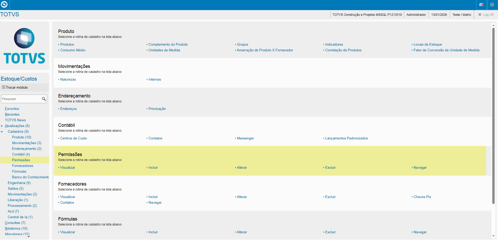
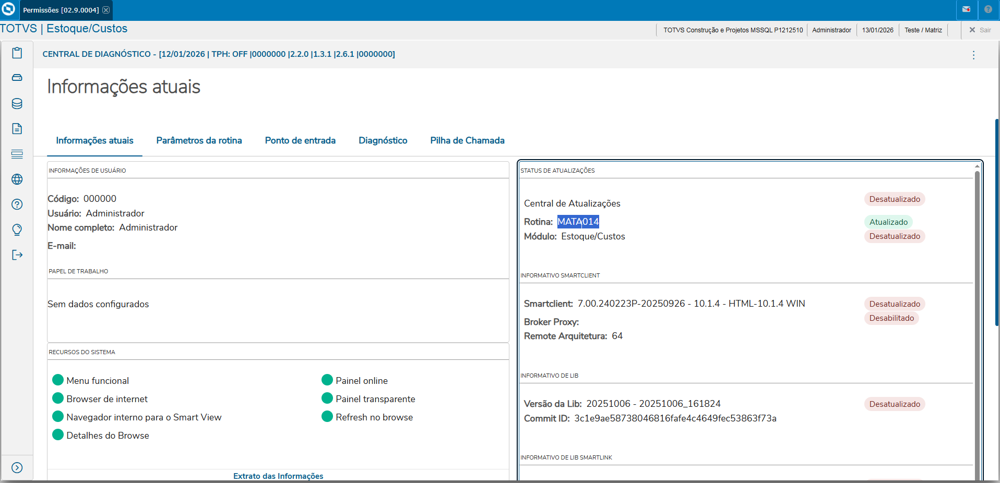
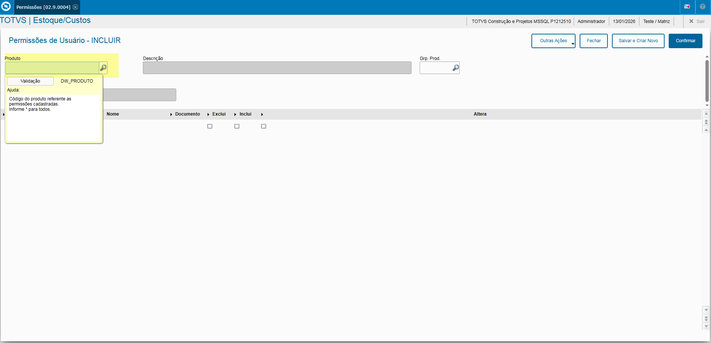
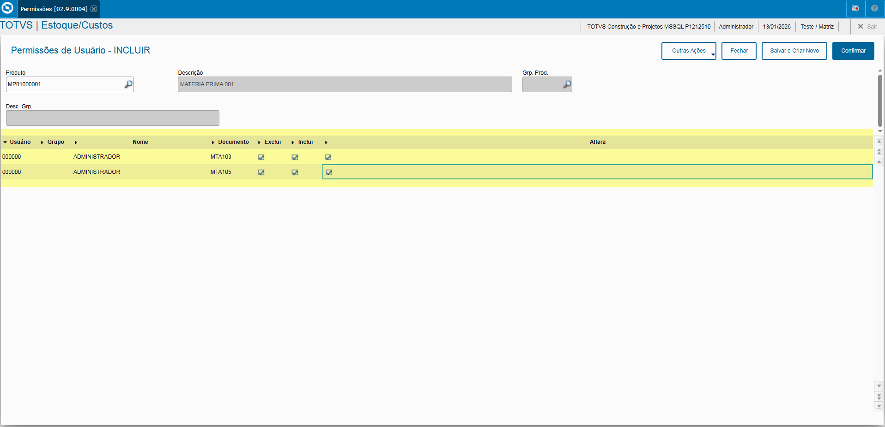

# Entedimento inicial Módulo Estoque/Custos

**Cadastro Permissões**

O cadastro de Permissões feitas no Protheus é feito via **"Módulo 04 - Estoque/Custos"**.

De forma mais técnica, as informações cadastradas no Protheus é feita pela rotina padrão **MATA014.PRW** e suas informações podem ser encontradas na tabela **"Permissões - SDW"**.

**Obs: A rotina tem como objetivo o cadastro de permissões por produto**

---

[SDW - Permissões de Usuário | ERP Labs](https://erplabs.com.br/SDW)

Rotina Protheus:

---

A rotina padrão de Permissões contém as seguintes operações, sendo:

- **Inclusão**
- **Alteração**
- **Consulta**
- **Exclusão**

Em caso de inclusão, deve seguir a regra de preenchimento dos campos obrigatórios, identificados com o **"/"** em sua descrição.

## Informe de Campos

Informar de acordo com o produto os documentos e permissões para o usuário ou grupo de usuários definidos.

---

## Autor

**Cristian Gustavo** | Consultor e desenvolvedor TOTVS Protheus

- [LinkedIn Cristian Gustavo](https://www.linkedin.com/in/cristian-gustavo-719aa71b2/)
- [GitHub Cristian Gustavo](https://github.com/crsgustav0)

---

    Desenvolvido e documentado por: Cristian Gustavo
    Data início: 17/11/2025
