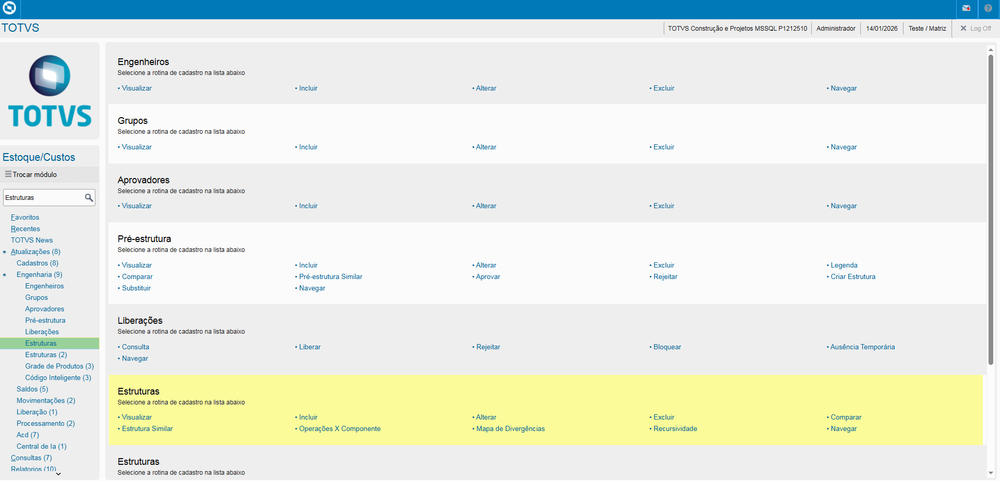
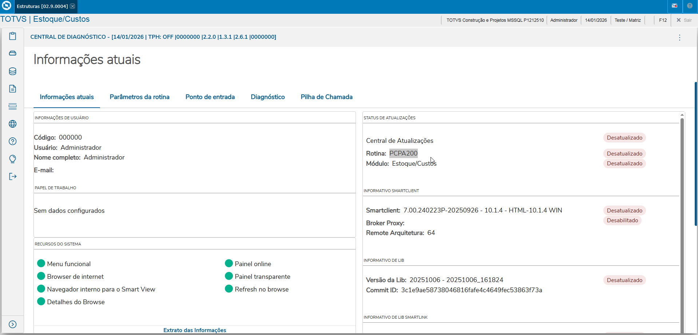
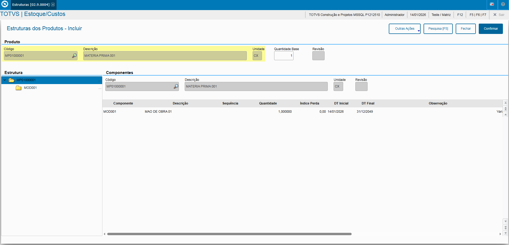
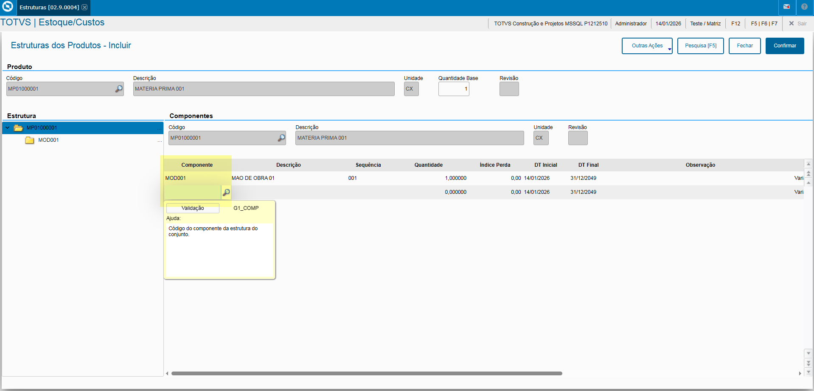
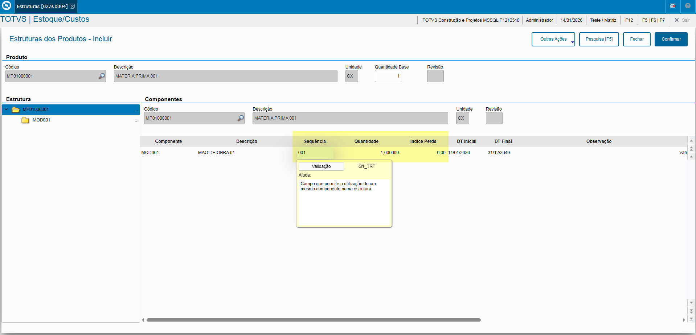
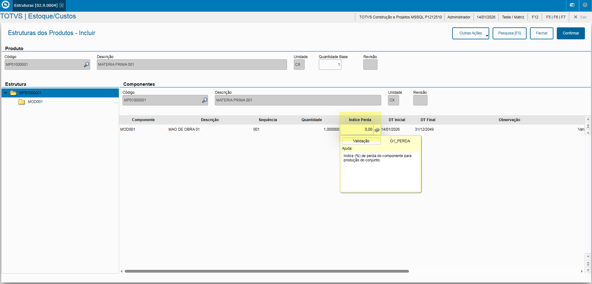
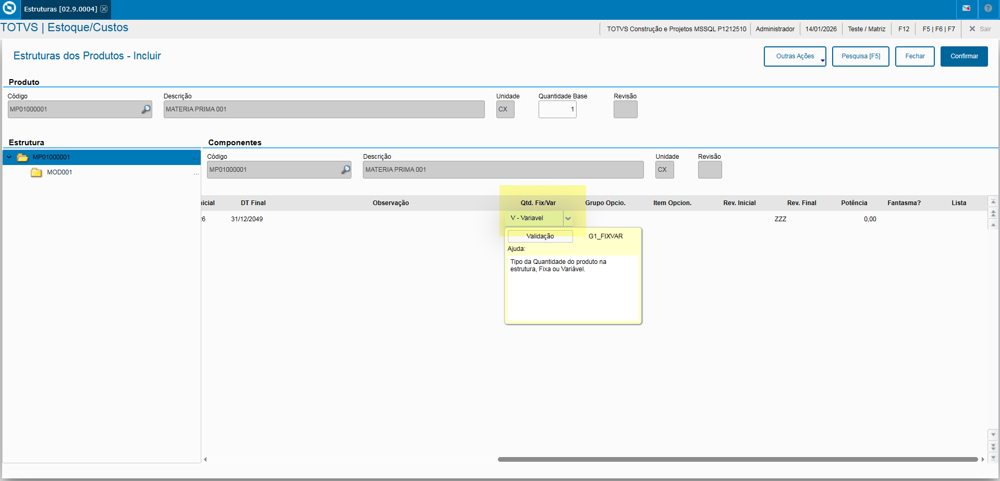

# Entedimento inicial Módulo Estoque/Custos

**Cadastro Estrutura**

O cadastro de Estrutura feitas no Protheus é feito via **"Módulo 04 - Estoque/Custos"**.

De forma mais técnica, as informações cadastradas no Protheus é feita pela rotina padrão **PCPA200.PRW** e suas informações podem ser encontradas na tabela **"Estrutura - SG1"**.

**Obs: A rotina tem como objetivo o cadastro da composição de produtos sendo Produto Acabado ou Inacabado ou Intermediário que terão suas produções dentro do Protheus, aonde na criação de uma Ordem de Produção, ao possuir as informações poderá realizar o Empenho conforme sua estrutura e por fim ao realizar o Apto. de Produção transforma o Empenho em requisições.**

---

[SG1 - Estruturas dos Produtos | ERP Labs](https://erplabs.com.br/SG1)

Rotina Protheus:

---

A rotina padrão de Estrutura contém as seguintes operações, sendo:

- **Inclusão**
- **Alteração**
- **Consulta**
- **Exclusão**

Em caso de inclusão, deve seguir a regra de preenchimento dos campos obrigatórios, identificados com o **"/"** em sua descrição.

## Informe de Campos

- Campos **"Produto"** e **"Qtd. Base"**: Obrigatórios para o início do cadastro das Estruturas do Produto, informando seu Produto e sua Quantidade Base para a produção.

- Campos **"Componente"**: Obrigatório para composição da Estrutura.

Podendo informar também os campos:

- **"Sequencia"**
- **"Quantidade"**, sendo a quantidade base para produção.
- **"Índice Perca"**, ao ser informado ao criar um OP e em seguida Empenho, a quantidade retornada seria referente a Qtd. Base + Indice Perca totalizando a Qtde. Produzida.

  

  

  

- **"Qtd. Fix/Var"**: Campo que informa se a quantidade produzida desse produto é **Fixa (F)**ou **Váriavel (V)**.

---

## Autor

**Cristian Gustavo** | Consultor e desenvolvedor TOTVS Protheus

- [LinkedIn Cristian Gustavo](https://www.linkedin.com/in/cristian-gustavo-719aa71b2/)
- [GitHub Cristian Gustavo](https://github.com/crsgustav0)

---

    Desenvolvido e documentado por: Cristian Gustavo
    Data início: 17/11/2025
