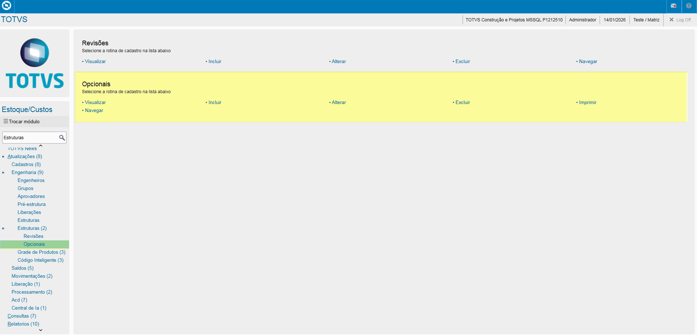
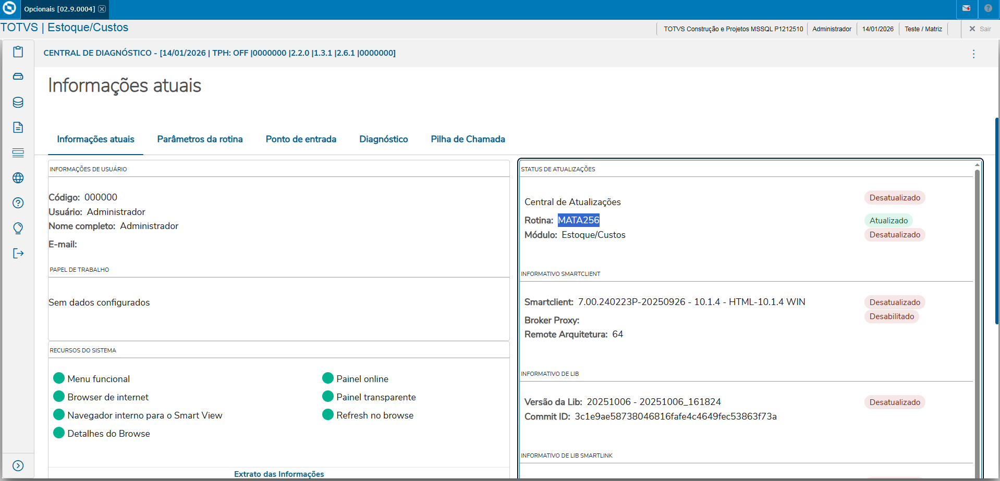
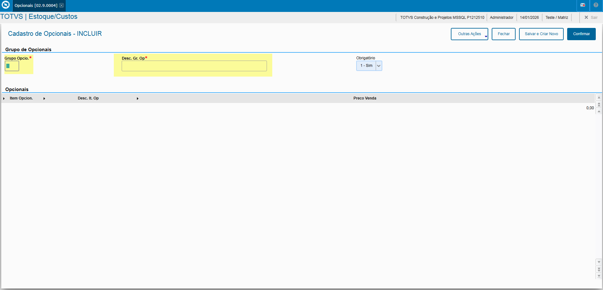
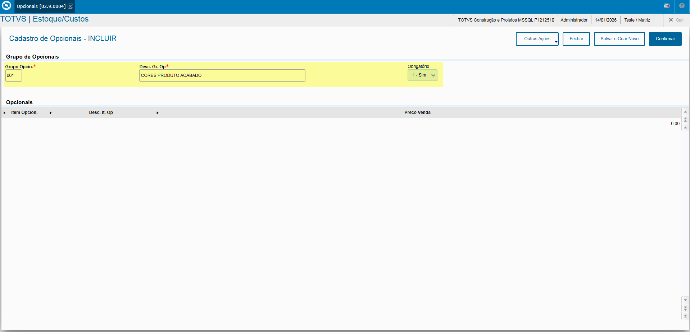
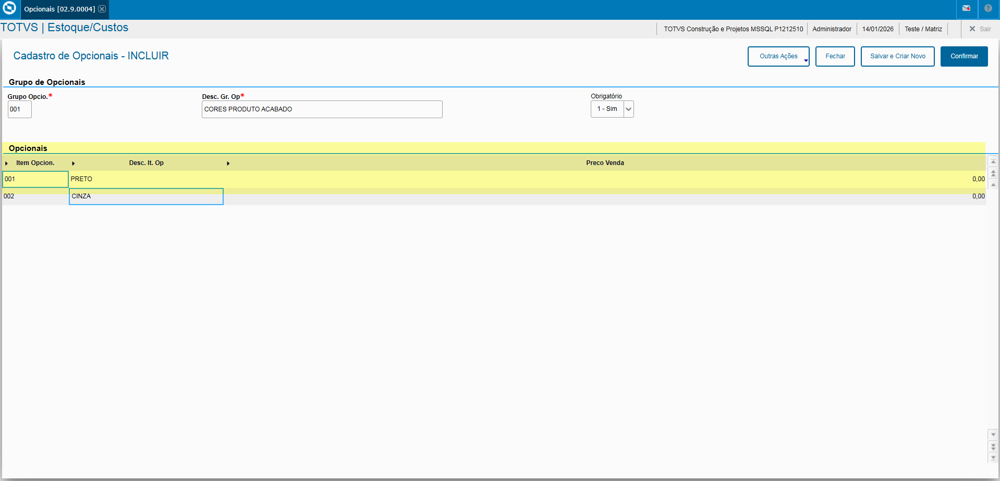

# Entedimento inicial Módulo Estoque/Custos

**Cadastro Grupo Opcionais**

O cadastro de Grupo Opcionais feitas no Protheus é feito via **"Módulo 04 - Estoque/Custos"**.

De forma mais técnica, as informações cadastradas no Protheus é feita pela rotina padrão **MATA256.PRW** e suas informações podem ser encontradas na tabela **"Grupo Opcionais - SGA"**.

**Obs: A rotina tem como objetivo a otimização do cadastro de processamento, produção e estoque, permitindo a montagem dinâmica de Produtos com Opcionais e geralmente utilizado para Vendas Sob-Encomenda.**

---

[SGA - Grupo Opcionais | ERP Labs](https://erplabs.com.br/SGA)

Rotina Protheus:

---

A rotina padrão de Grupo Opcionais contém as seguintes operações, sendo:

- **Inclusão**
- **Alteração**
- **Consulta**
- **Exclusão**

Em caso de inclusão, deve seguir a regra de preenchimento dos campos obrigatórios, identificados com o **"/"** em sua descrição.

## Informe de Campos

- Campos **"Código"** e **"Descrição"**: Obrigatórios para o início do cadastro dos Opcionais do Produto e **"Obrigatório"**.

Podendo informar também os campos:

- **"Item Opcional"**
- **"Descrição Item Opcional"**
- **"Preço Venda"**, caso possua o Preço de Venda do Opcional.

---

## Autor

**Cristian Gustavo** | Consultor e desenvolvedor TOTVS Protheus

- [LinkedIn Cristian Gustavo](https://www.linkedin.com/in/cristian-gustavo-719aa71b2/)
- [GitHub Cristian Gustavo](https://github.com/crsgustav0)

---

    Desenvolvido e documentado por: Cristian Gustavo
    Data início: 17/11/2025
