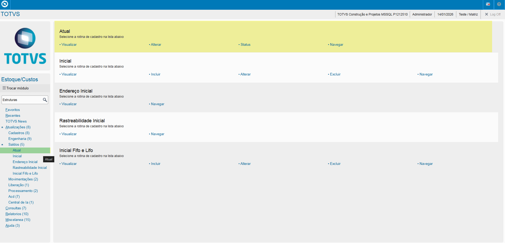
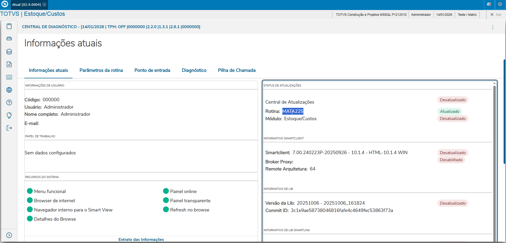
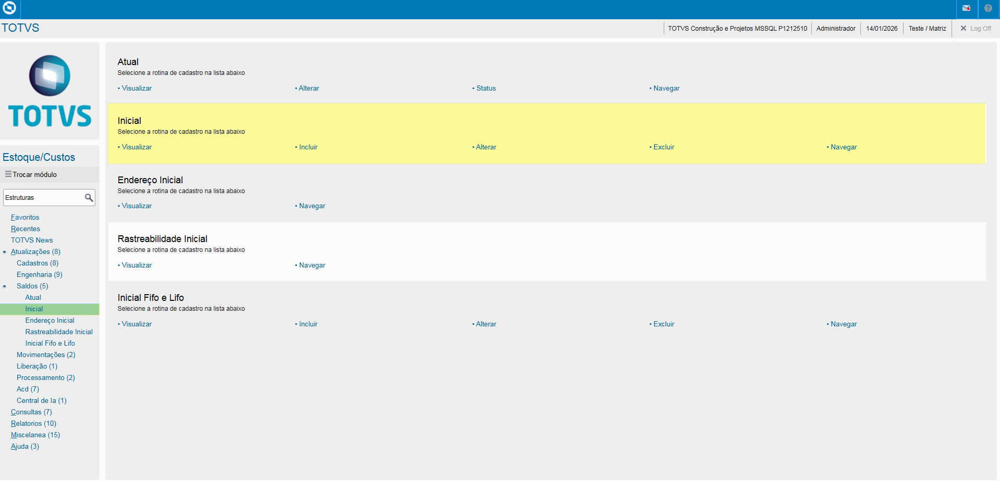
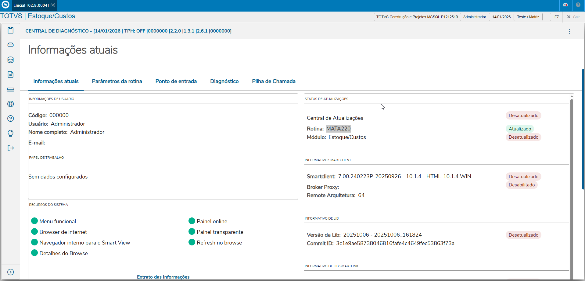
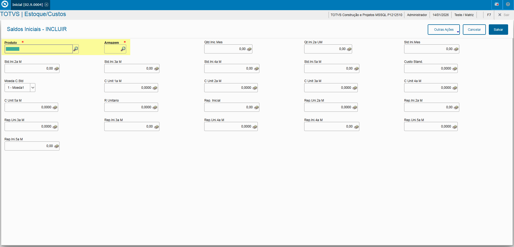
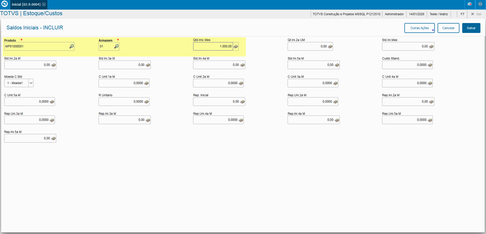

# Entedimento inicial Módulo Estoque/Custos

Saldos são composta por duas rotinas, ambos sendo feito no **"Módulo 04 - Estoque/ Custos"**, sendo:

- **Saldo Atual**, consulta do Saldo Atual do Produtos em Estoque, incluir ou alterar o Preço Médio da Mão de Obra.
- **Saldo Inicial**, inclusão de saldo iniciais de Produto ou inclusão de Produtos sem movimentação para armazém destinado.

## Saldo Atual

De forma mais técnica, as informações cadastradas no Protheus é feita pela rotina padrão **MATA225.PRW** e suas informações podem ser encontradas na tabela **"SB2-Saldos Físico e Financeiro"**.

[SB2 - Saldos Físico e Financeiro | ERP Labs](https://erplabs.com.br/SB2)

Rotina Protheus:

## Saldo Inicial

De forma mais técnica, as informações cadastradas no Protheus é feita pela rotina padrão **MATA220.PRW** e suas informações podem ser encontradas na tabela **"SB9-Saldos Iniciais"**.

[SB9 - Saldos Iniciais | ERP Labs](https://erplabs.com.br/SB9)

Rotina Protheus:

A rotina padrão de Grupo Saldos contém as seguintes operações, sendo:

- **Inclusão**
- **Alteração**
- **Consulta**
- **Exclusão**

Em caso de inclusão, deve seguir a regra de preenchimento dos campos obrigatórios, identificados com o **"/"** em sua descrição.

## Informe de Campos

- Campos **"Produto"** e **"Armazém"**: Obrigatórios para o início do cadastro dos Saldos do Produto.

**Lembrando que as alterações podem ser feitas desde que o produto cadastrado em questão não possua movimentações.**

---

## Autor

**Cristian Gustavo** | Consultor e desenvolvedor TOTVS Protheus

- [LinkedIn Cristian Gustavo](https://www.linkedin.com/in/cristian-gustavo-719aa71b2/)
- [GitHub Cristian Gustavo](https://github.com/crsgustav0)

---

    Desenvolvido e documentado por: Cristian Gustavo
    Data início: 17/11/2025
