# Movimentações Externas -

**Rotina Aviso de Recebimento de Carga - Módulo Compras**

O cadastro de Aviso de Recebimento de Carga feitas no Protheus é feito via **"Módulo 06 - Compras"**.

De forma mais técnica, as informações cadastradas no Protheus é feita pela rotina padrão **MATA110.PRW** e suas informações podem ser encontradas na tabelas **"Tabela de Aviso de Recebimento de Carga - SC1"**.

**Obs: A rotina centraliza informações relacionadas a carga dos produtos de um veículo, se referindo a uma única ou mais de um ou mais fornecedores**.

[SC1 - Aviso de Recebimento de Carga | ERP Labs](https://erplabs.com.br/SC1)

Acesso via Módulo Compras e Rotina Protheus:

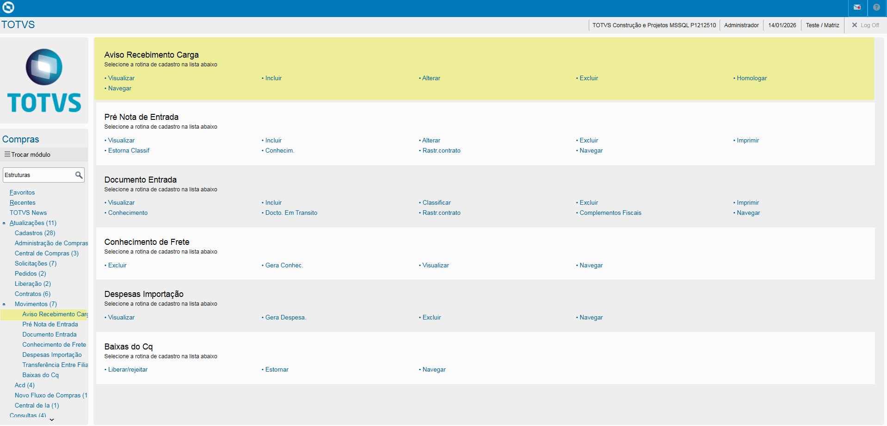

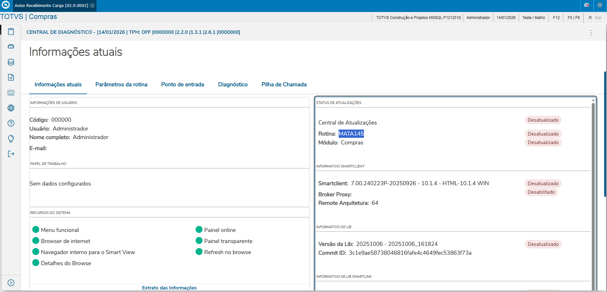

### Cabec. Aviso Recebimento de Carga

- **Aviso**

Definição código Aviso Recebimento de Carga.

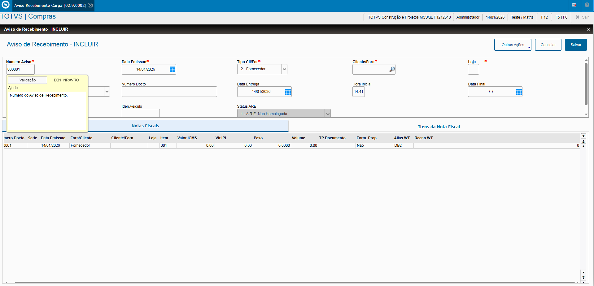

- Campos **Tipo Cliente/ Fornecedor** e **Código Cliente/ Fornecedor**

Informa o Tipo Cliente Fornecedor e seu código.

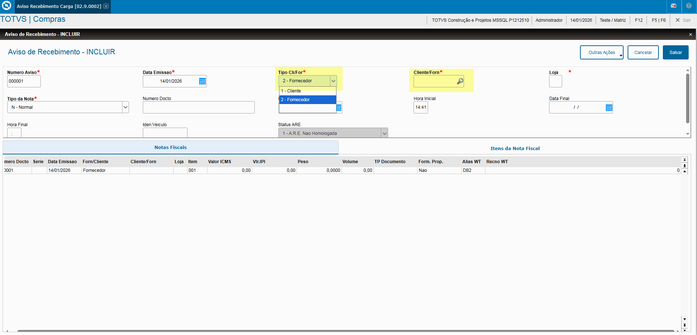

- **Tipo Nota**

Informa o Tipo Cliente Fornecedor e seu código, sendo:

- **Normal**
- **Devolução**
- **Complemento de ICMS**
- **Complemento de IPI**
- **Beneficiamento**
- **Complemento de Preço/Frete**

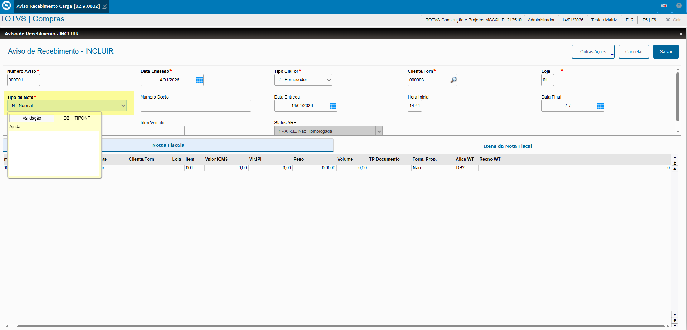

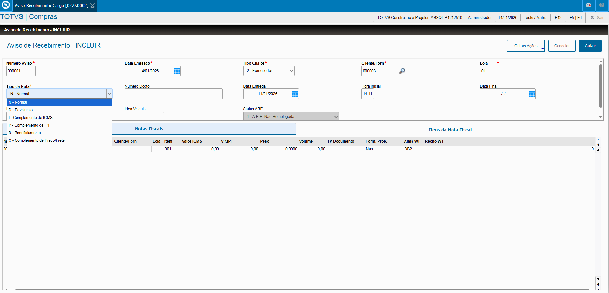

### Aba "Notas Fiscais"

Preenchimento das informações:

- **Nº Documento**
- **Série**
- **Data Emissão**
- **Tipo Fornecedor/ Cliente**
- **Código Fornecedor/ Cliente**
- **Valor ICMS**
- **Valor IPI**
- **Peso**
- **Volume**
- **Tipo Documento**
  Em caso de DANFE, deve ser informado como tipo **"SPED - Nota FIscal Eletrônica do SEFAZ"**.

  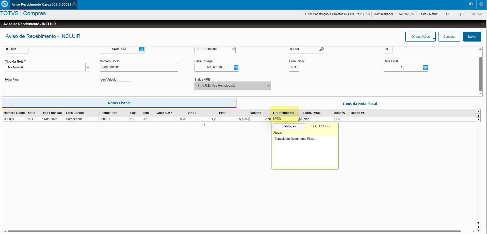

  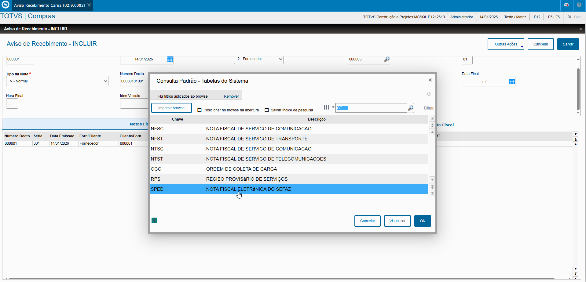

Informações após o preenchimento:

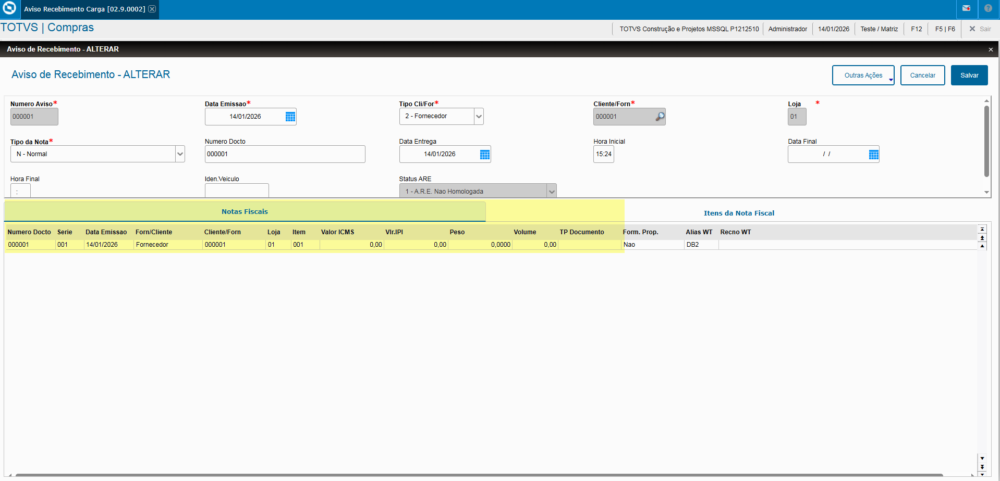

### Aba "Itens Nota Fiscal"

Preenchimento das informações:

- **Produto**
- **Quantidade**
- **Valor Unitário**
- **Valor Total**
- **Valor Desconto**
- **Nº Pedido** e **Item Pedido**

Informações após o preenchimento:

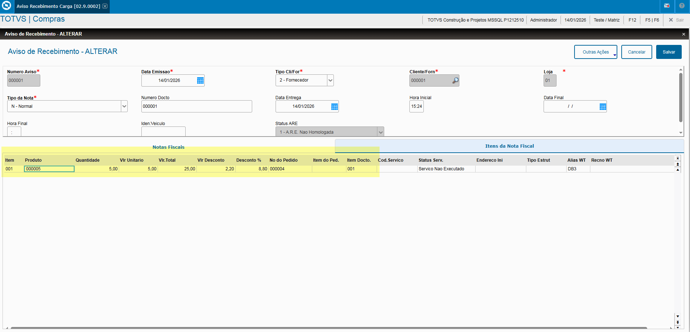

As informações podem ser preenchidas manualmente ou pela opção **"Pedido"** no Menu **"Outras Ações", desde que possua amarração com o Pedido**.

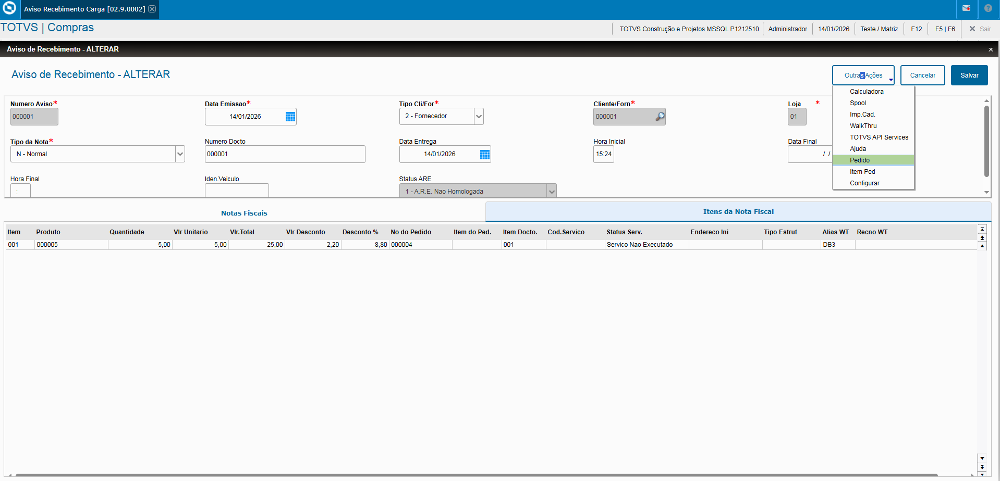

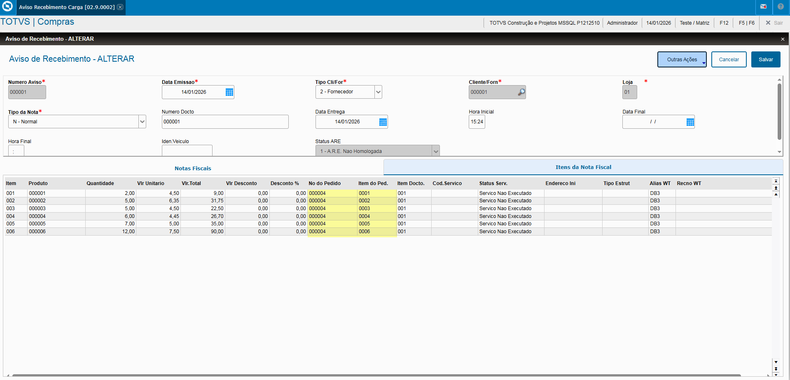

### Homologar Aviso Recebimento de Carga

Para realizar a homologação é necessário apertar sobre a opção **"Homologar"** no menu **"Outras Ações"**.

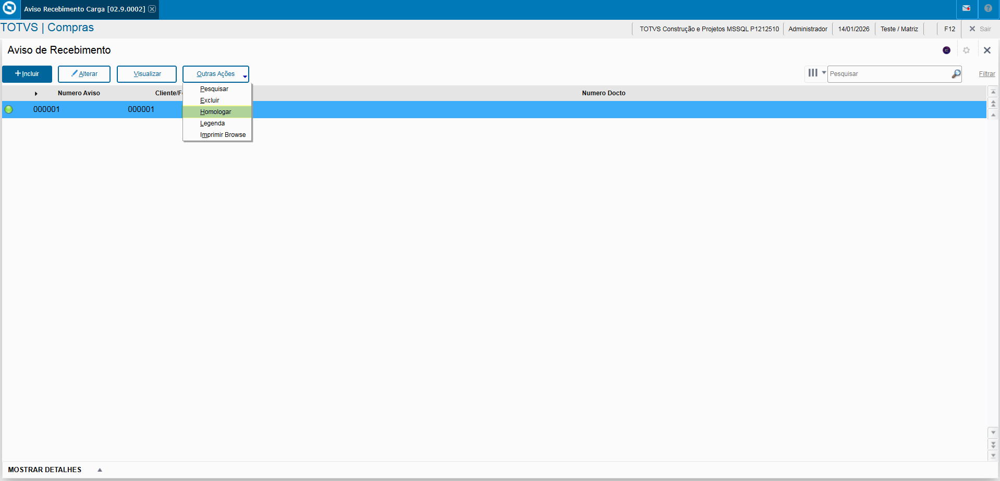

Ao abrir a tela, é necessário somente confirmar as informações preenchidas antes da confirmação, lembrando que:
**- Caso o Pedido esteja amarrado ao Tipo de Entrada, será gerado uma Nota de Entrada já com a classificação da sua TES.**
**- Não possuindo a amarração do Tipo de Entrada, será gerado uma Pré-Nota da Entrada com a classificação da sua TES como pendente.**

Desta forma finalizando o processo de homologação:

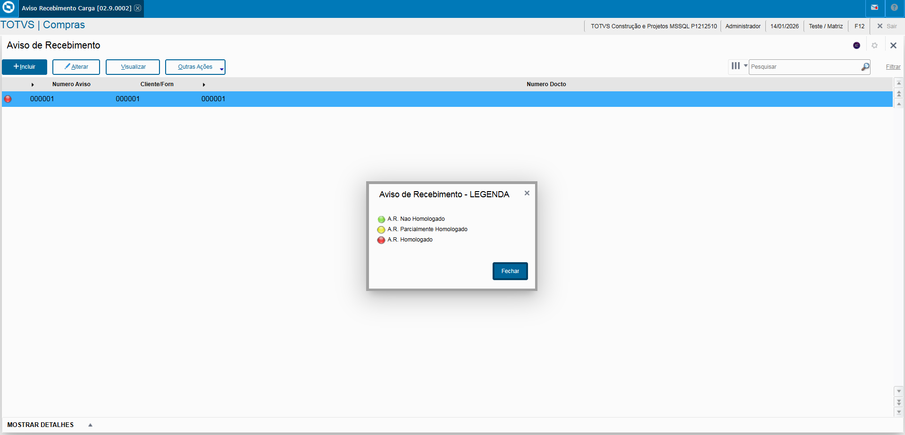

---

## Autor

**Cristian Gustavo** | Consultor e desenvolvedor TOTVS Protheus

- [LinkedIn Cristian Gustavo](https://www.linkedin.com/in/cristian-gustavo-719aa71b2/)
- [GitHub Cristian Gustavo](https://github.com/crsgustav0)

---

    Desenvolvido e documentado por: Cristian Gustavo
    Data início: 17/11/2025
