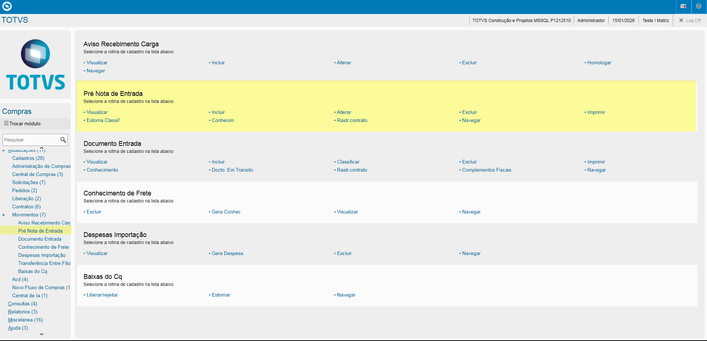
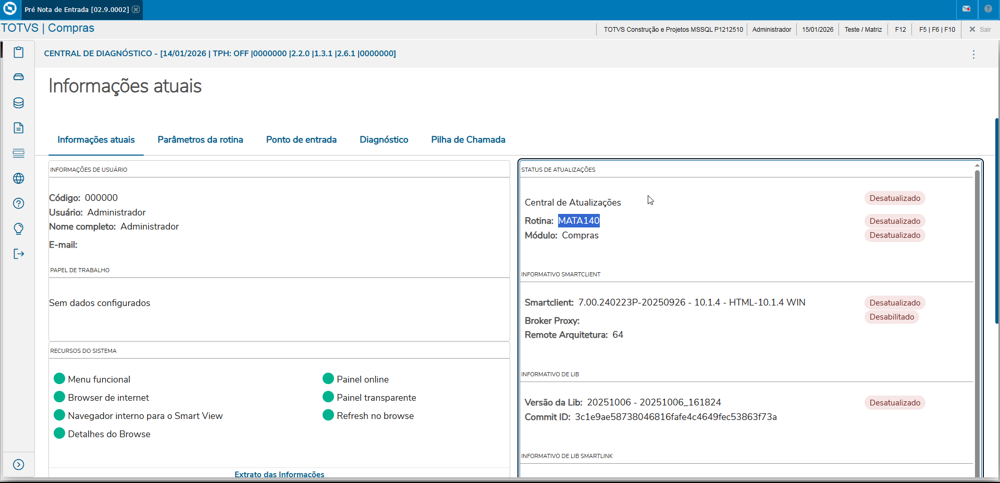
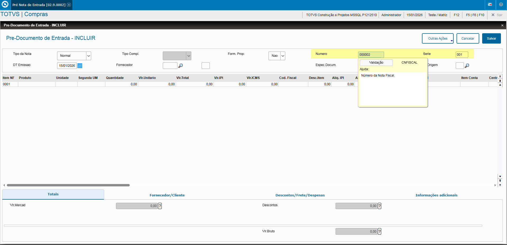
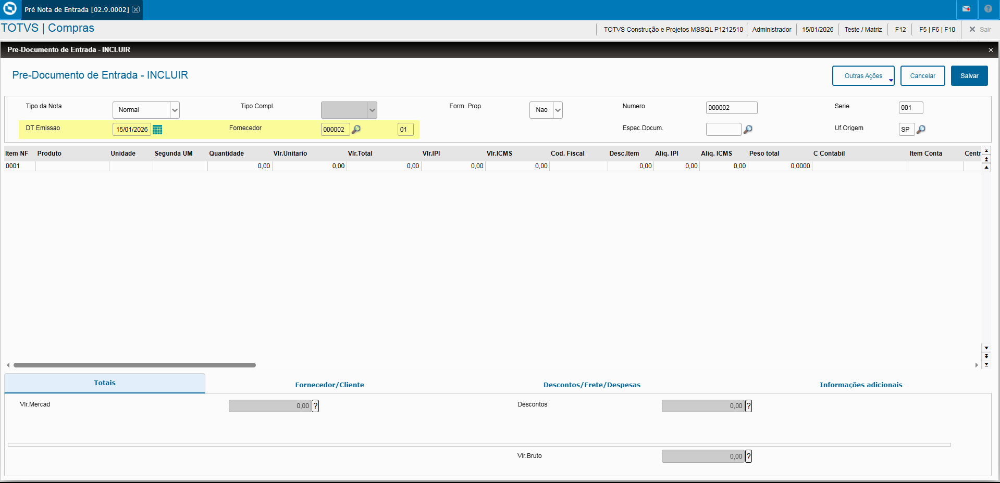
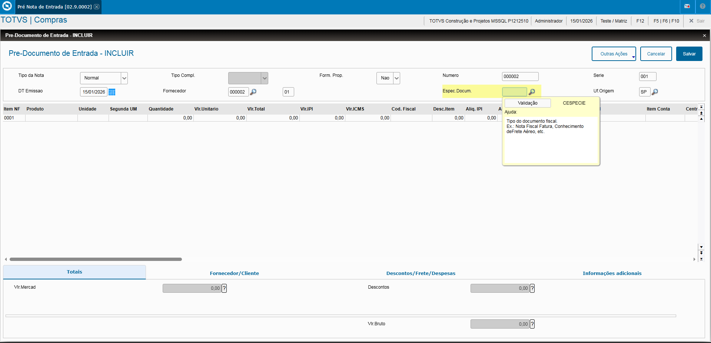
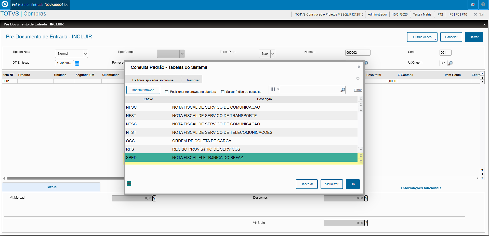
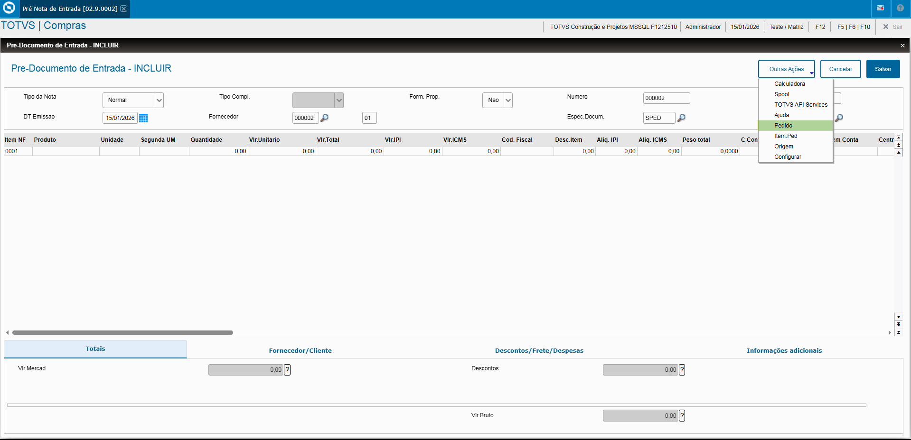
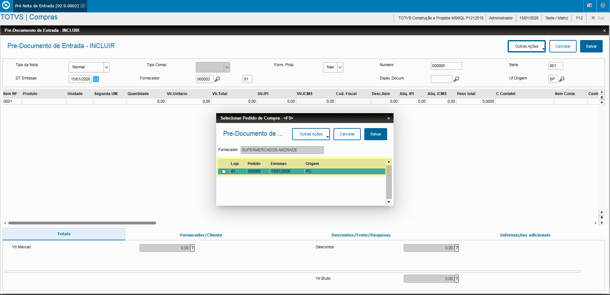
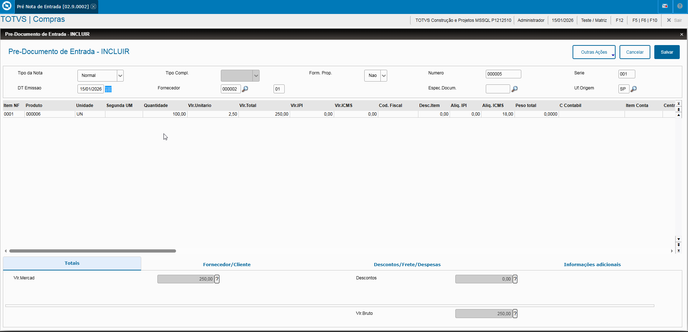
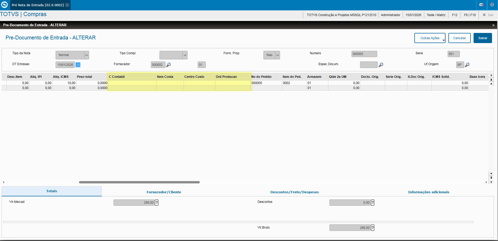

# Movimentações Externas - **Rotina Pré Documento de Entrada - Módulo Compras**

O cadastro de Pré Documento de Entrada feitas no Protheus é feito via **"Módulo 02 - Compras"**.

De forma mais técnica, as informações cadastradas no Protheus é feita pela rotina padrão **MATA140.PRW** e suas informações podem ser encontradas na tabelas **"SF1 - Tabela Cabeçalho das NF de Entrada"** e **"SD1 - Itens das NF de Entrada"**.

**Obs: A rotina tem como função o cadastramento prévio de informações básicas do documento fiscal que será recebido na empresa, facilitando o recebimento de materiais registrados em Documento de Entrada**.

[SF1 - Cabeçalho das NF de Entrada | ERP Labs](https://erplabs.com.br/SF1)
[SD1 - Itens das NF de Entrada | ERP Labs](https://erplabs.com.br/SD1)

Acesso via Módulo Compras e Rotina Protheus:

Ao fazer a entrada de Pré-Documento de Entrada sempre estará com a legenda **Verde** sinalizando que o Documento ainda não foi classificado.

### Cabec. Aviso Recebimento de Carga

- Campos **Número** e **Série**: Informa o Número e Série do Documento.

- Campos **Data Emissão** e **Fornecedor**: Informa a data e Fornecedor do Documento.

- **Espécie Documento**: Definição Espécie Documento.

**Lembrando que em caso de DANFE o campo deve ser informado como "SPED".**

As informações podem ser preenchidas manualmente ou pela opção **"Pedido"** no Menu **"Outras Ações", desde que possua amarração com o Pedido**.

Caso faça manualmente o preenchimento das informações:

- **Produto**
- **Unidade**
- **Quantidade**
- **Valor Unitário**
- **Valor Total**

Se necessário é possível preencher os campos:

- **Conta Contábil**
- **Item Conta**
- **C. Custo**
- **Ord. Produção**

### Aba "Itens Nota Fiscal"

Preenchimento das informações:

- **Produto**
- **Quantidade**
- **Valor Unitário**
- **Valor Total**
- **Valor Desconto**
- **Nº Pedido** e **Item Pedido**

Informações após o preenchimento:

As informações podem ser preenchidas manualmente ou pela opção **"Pedido"** no Menu **"Outras Ações", desde que possua amarração com o Pedido**.

### Homologar Aviso Recebimento de Carga

Para realizar a homologação é necessário apertar sobre a opção **"Homologar"** no menu **"Outras Ações"**.

Ao abrir a tela, é necessário somente confirmar as informações preenchidas antes da confirmação, lembrando que:
**- Caso o Pedido esteja amarrado ao Tipo de Entrada, será gerado uma Nota de Entrada já com a classificação da sua TES.**
**- Não possuindo a amarração do Tipo de Entrada, será gerado uma Pré-Nota da Entrada com a classificação da sua TES como pendente.**

Desta forma finalizando o processo de homologação:

---

## Autor

**Cristian Gustavo** | Consultor e desenvolvedor TOTVS Protheus

- [LinkedIn Cristian Gustavo](https://www.linkedin.com/in/cristian-gustavo-719aa71b2/)
- [GitHub Cristian Gustavo](https://github.com/crsgustav0)

---

    Desenvolvido e documentado por: Cristian Gustavo
    Data início: 17/11/2025
