# Movimentações Externas - **Rotina Documento de Entrada - Módulo Compras**

O cadastro de Documento de Entrada feitas no Protheus é feito via **"Módulo 02 - Compras"**.

De forma mais técnica, as informações cadastradas no Protheus é feita pela rotina padrão **MATA140.PRW** e suas informações podem ser encontradas na tabelas **"SF1 - Tabela Cabeçalho das NF de Entrada"** e **"SD1 - Itens das NF de Entrada"**.

**Obs: A rotina tem como função o cadastramento prévio de informações básicas do documento fiscal que será recebido na empresa, facilitando o recebimento de materiais registrados em Documento de Entrada**.

[SF1 - Cabeçalho das NF de Entrada | ERP Labs](https://erplabs.com.br/SF1)
[SD1 - Itens das NF de Entrada | ERP Labs](https://erplabs.com.br/SD1)

Acesso via Módulo Compras e Rotina Protheus:

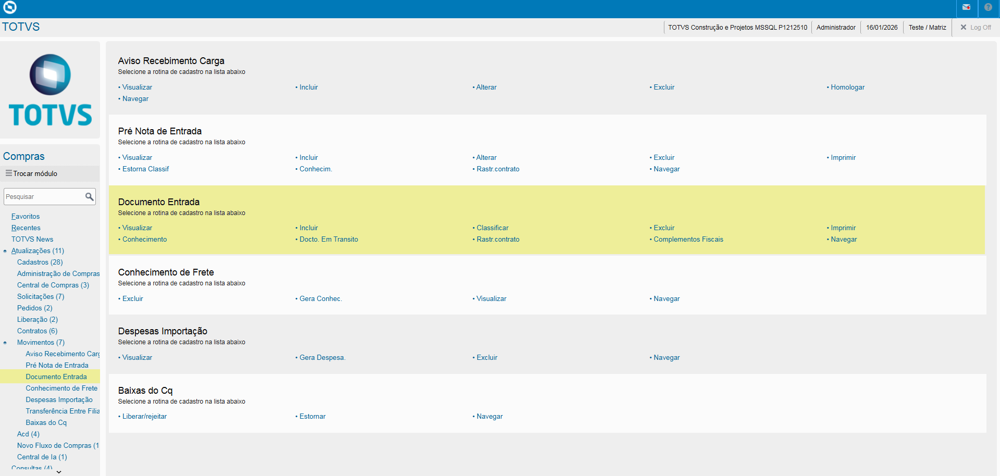

Ao fazer a entrada de Documento de Entrada sempre estará com a legenda **Verde** sinalizando que o Documento ainda não foi classificado.

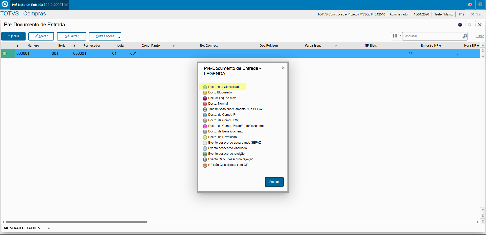

Para realizar a classificação do Documento é necessário posicionar-se sobre o registro e clicar na opção **"Classificar"**.

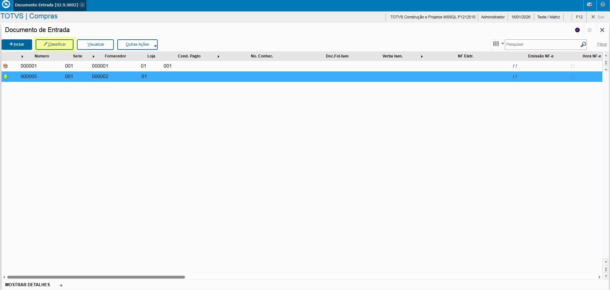

A tela similar a tela de Pre Documento de Entrada é exibida, com a adição de alguns campos como:

- **Tipo Operação**: Uso de TES Inteliigente, usado em Livros Fisicais.
- **Tipo Entrada**: Classificação da Pre Nota.

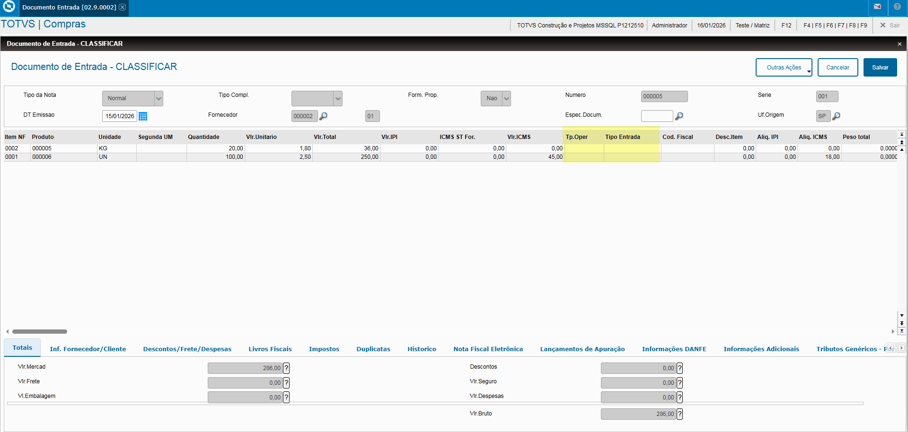

Caso houvesse amarração do produto, as informações seriam preenchidas nos campos, podendo também ser informado manualmente:

- **Conta Contábil**
- **Item Conta**
- **C. Custo**
- **Ord. Produção**

Após a classificação o registro é sinalizado como **Vermelho**, sendo um **"Documento Normal"**.

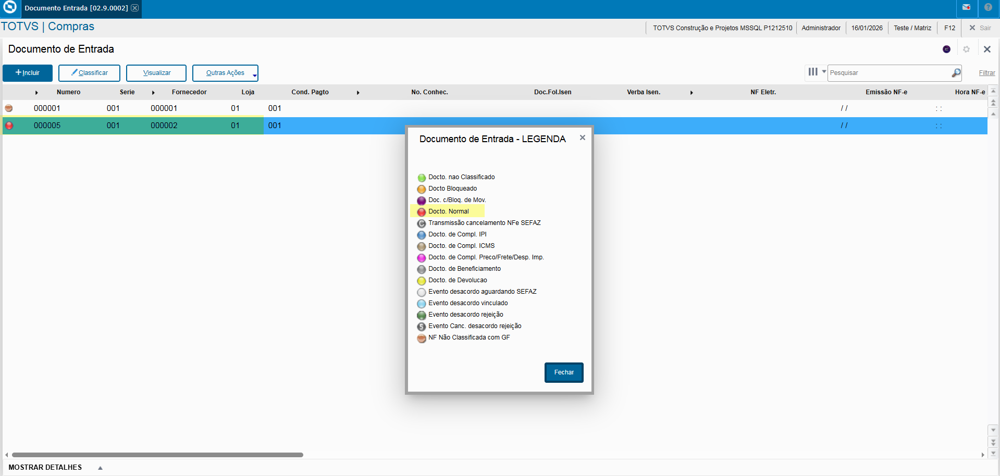

## Inclusão Documento de Entrada

- **Tipo Nota**: Informa o tipo do Documento.

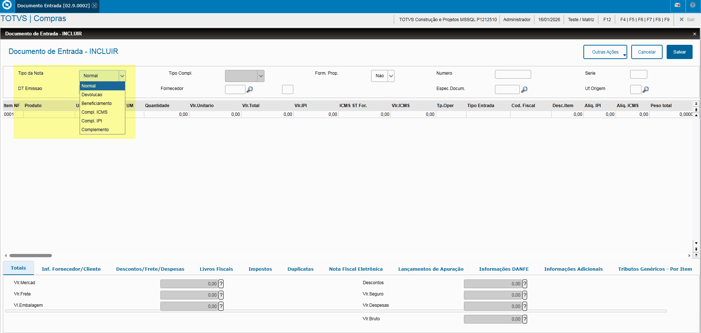

- **Formulário Próprio**: Caso o campo for informado como **"Sim"** indica que o Nota de Entrada está sendo emitida por parte da empresa e em caso de **"Não"** indica que o fornecedor fez a emissão.

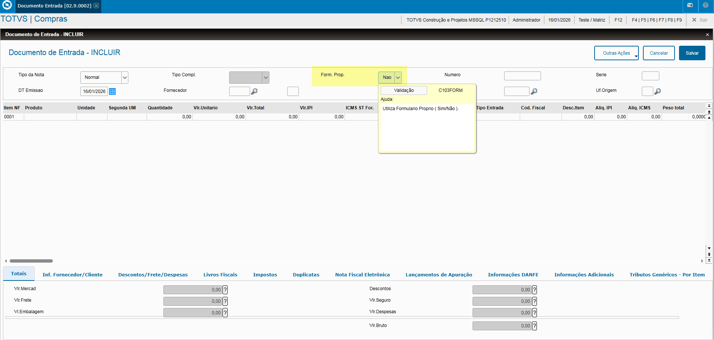

- **Fornecedor**: Informe do Fornecedor.

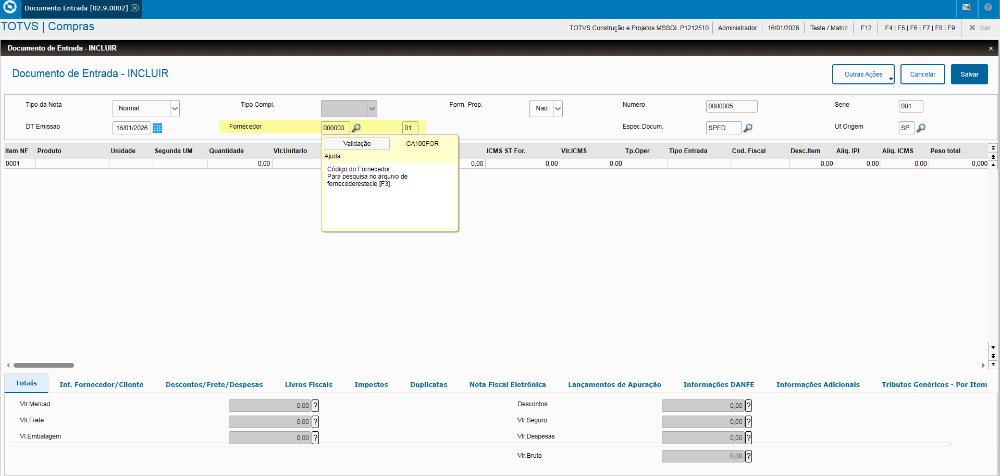

- **Espécie Documento**: Definição Espécie Documento.

**Lembrando que em caso de DANFE o campo deve ser informado como "SPED".**

As informações podem ser preenchidas manualmente ou pela opção **"Pedido"** no Menu **"Outras Ações", desde que possua amarração com o Pedido**.

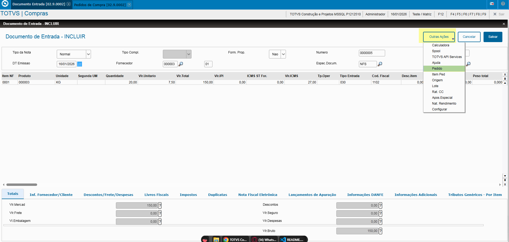

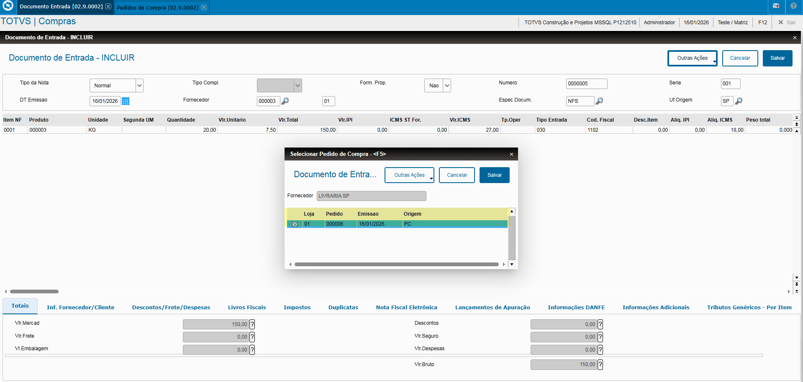

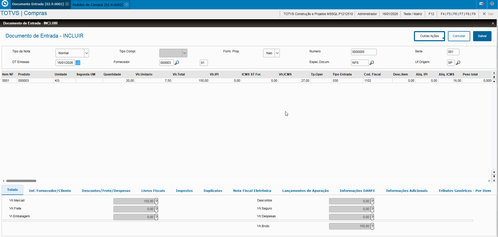

**Nesse exemplo o campo "Tipo Entrada" foi preenchido na inclusão do Pedido de Compras.**

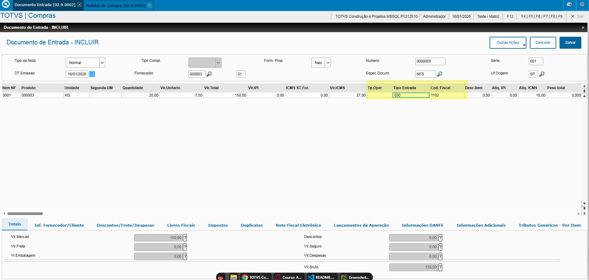

Caso faça manualmente o preenchimento das informações:

- **Produto**
- **Unidade**
- **Quantidade**
- **Valor Unitário**
- **Valor Total**

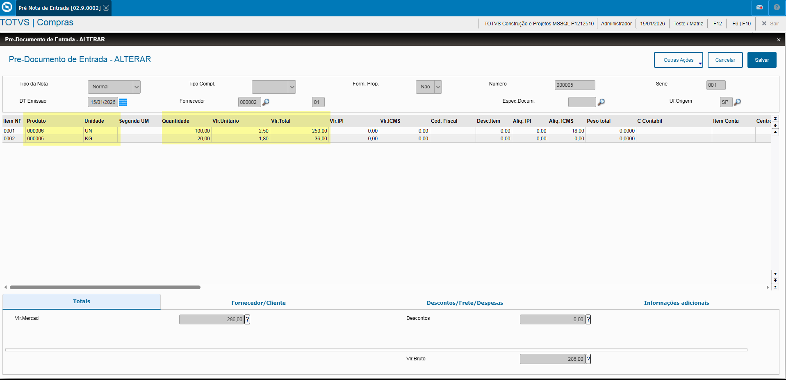

Se necessário é possível preencher os campos:

- **Conta Contábil**
- **Item Conta**
- **C. Custo**
- **Ord. Produção**

---

## Autor

**Cristian Gustavo** | Consultor e desenvolvedor TOTVS Protheus

- [LinkedIn Cristian Gustavo](https://www.linkedin.com/in/cristian-gustavo-719aa71b2/)
- [GitHub Cristian Gustavo](https://github.com/crsgustav0)

---

    Desenvolvido e documentado por: Cristian Gustavo
    Data início: 17/11/2025
