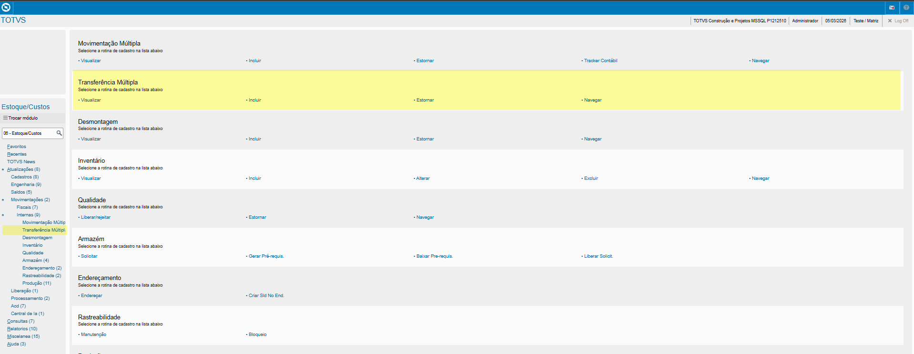
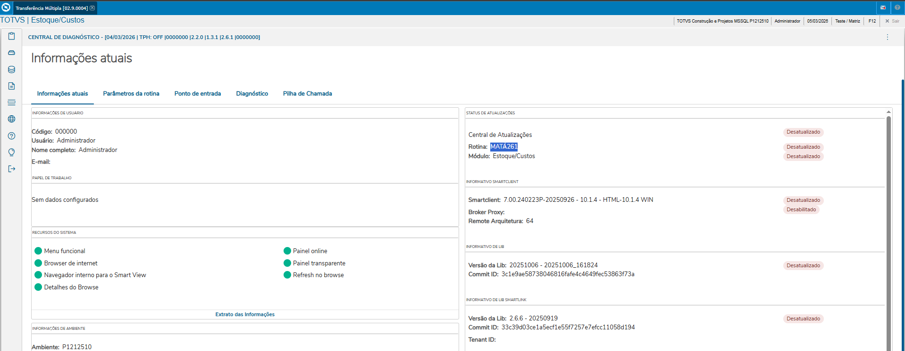
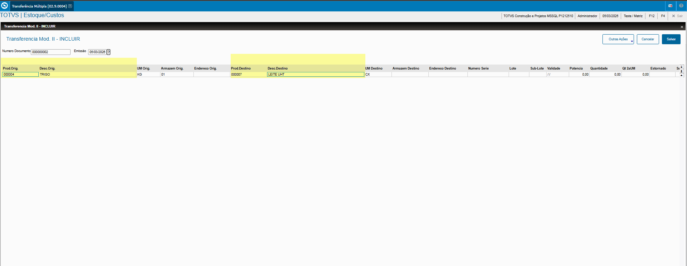
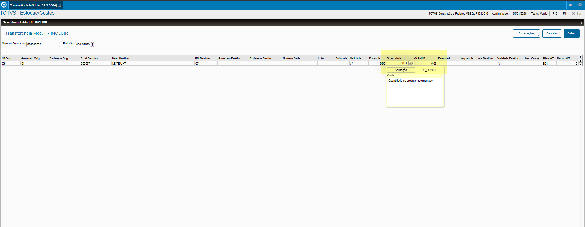
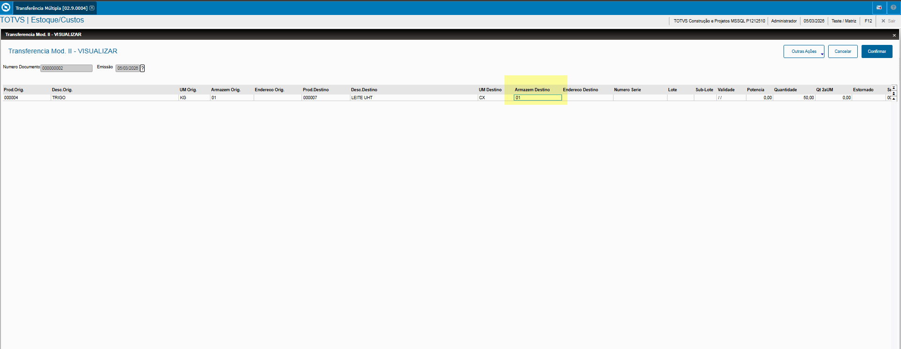
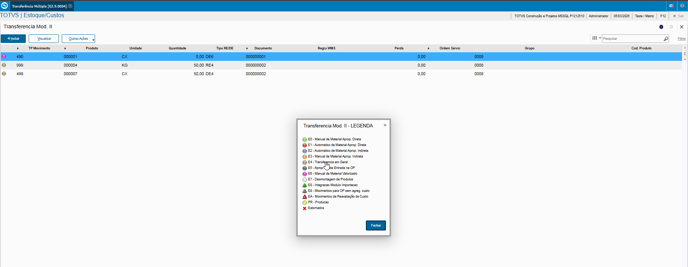

# Solicitar ao Armazém - **Rotina Solicitar ao Armazém - Módulo Estoque/Custos**

O cadastro de Solicitar ao Armazém feitas no Protheus é feito via **"Módulo 04 - Estoque/Custos "**.

De forma mais técnica, as informações cadastradas no Protheus é feita pela rotina padrão **MATA261.PRW** e suas informações podem ser encontradas na tabelas **"Tabela de Solicitar ao Armazém - SD3"**.

**Obs: A rotina permite o lançamento de Transferências entre armazéns ou Cod. Produtos.**.

[SD3 - Solicitar ao Armazém | ERP Labs](https://erplabs.com.br/SD3)

Acesso via Módulo Estoque/Custos e Rotina Protheus:

### Transferência entre Produtos:

- **Produto Origem**

Definição Produto Origem e Produto Destino.

- **Quantidade**

Definição da Quantidade do Produto a ser transferido, necessário também informar o campo **"Armazém Destino"**.

Após a inclusão é possível visualizar a legenda do registro.

---

## Autor

**Cristian Gustavo** | Consultor e desenvolvedor TOTVS Protheus

- [LinkedIn Cristian Gustavo](https://www.linkedin.com/in/cristian-gustavo-719aa71b2/)
- [GitHub Cristian Gustavo](https://github.com/crsgustav0)

---

    Desenvolvido e documentado por: Cristian Gustavo
    Data início: 17/11/2025
