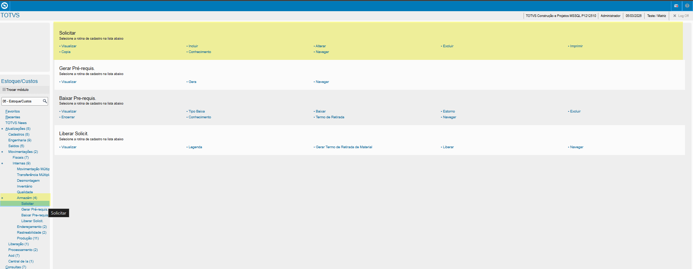
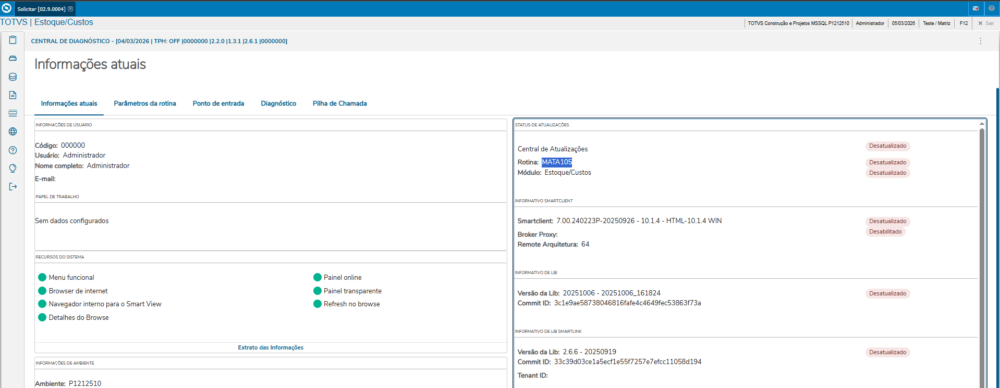
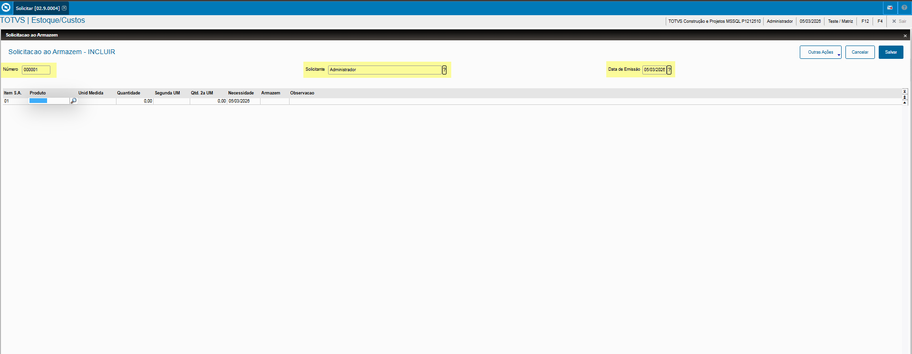
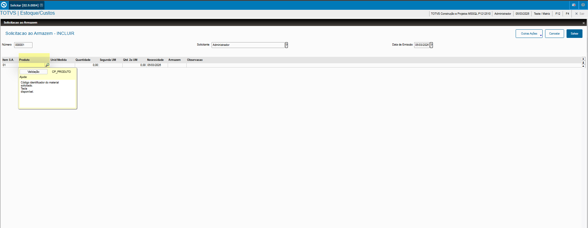
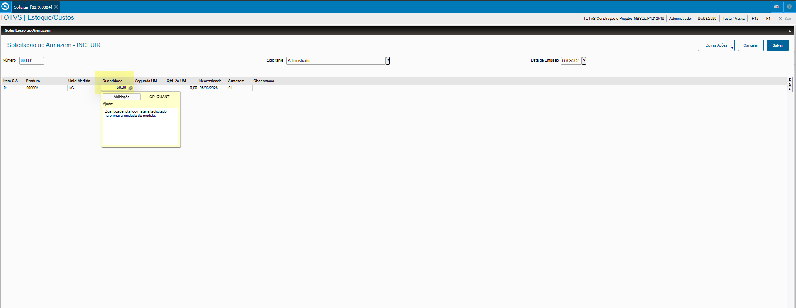
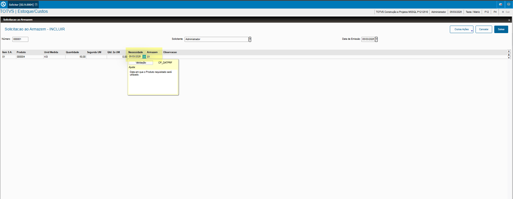
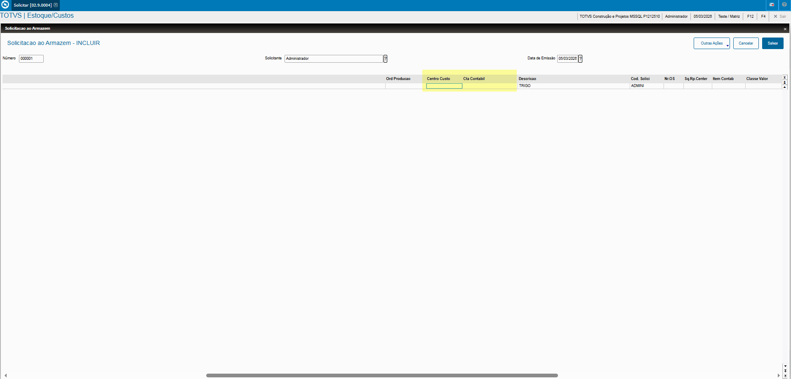
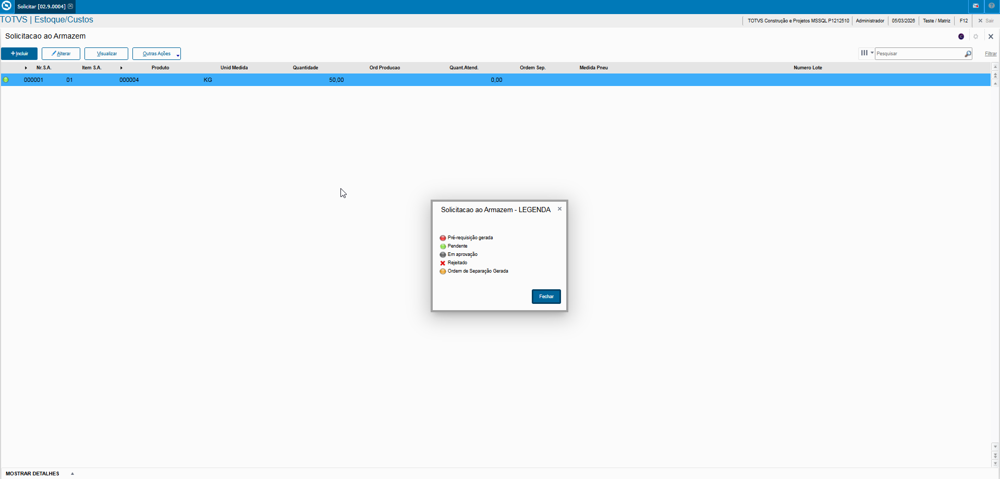

# Solicitações ao Armazém - **Rotina Solicitações ao Armazém - Módulo Estoque/Custos**

O cadastro de Solicitações ao Armazém feitas no Protheus é feito via **"Módulo 04 - Estoque/Custos "**.

De forma mais técnica, as informações cadastradas no Protheus é feita pela rotina padrão **MATA105.PRW** e suas informações podem ser encontradas na tabelas **"Tabela de Solicitações ao Armazém - SCP"**.

**Obs: A rotina permite gerar pré requisições não vinculadas a Ordem de Produto, controlando o Produto por um determinado departamento ou usuário ao Armazém.**.

[SCP - Solicitações ao Armazém | ERP Labs](https://erplabs.com.br/SCP)

Acesso via Módulo Estoque/Custos e Rotina Protheus:

### Cabeçalho

Os campos **"N. Solicitação"**, **"Solicitante"** e **"Data Emissão"** são preenchidos automaticamente.

### Itens

- **Produto Origem**

Definição Produto a ser Solicitado.

- **Quantidade**

Definição Quantidade produto a ser Solicitado.

- **Data Necessidade** e **Armazem**

Definição data necessidade do Produto e Armazém a ser solicitado.

- **C. Custo** e **Conta Contábil**

Campos não obrigatórios mas podem ser definidos.

---

Após a inclusão é possível visualizar a legenda do registro.

---

## Autor

**Cristian Gustavo** | Consultor e desenvolvedor TOTVS Protheus

- [LinkedIn Cristian Gustavo](https://www.linkedin.com/in/cristian-gustavo-719aa71b2/)
- [GitHub Cristian Gustavo](https://github.com/crsgustav0)

---

    Desenvolvido e documentado por: Cristian Gustavo
    Data início: 17/11/2025
