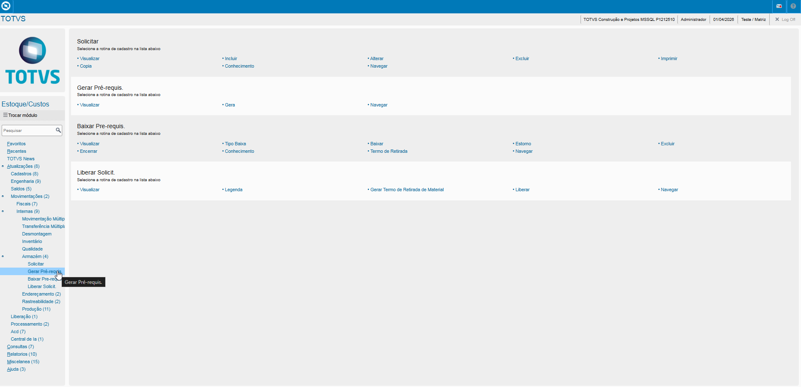
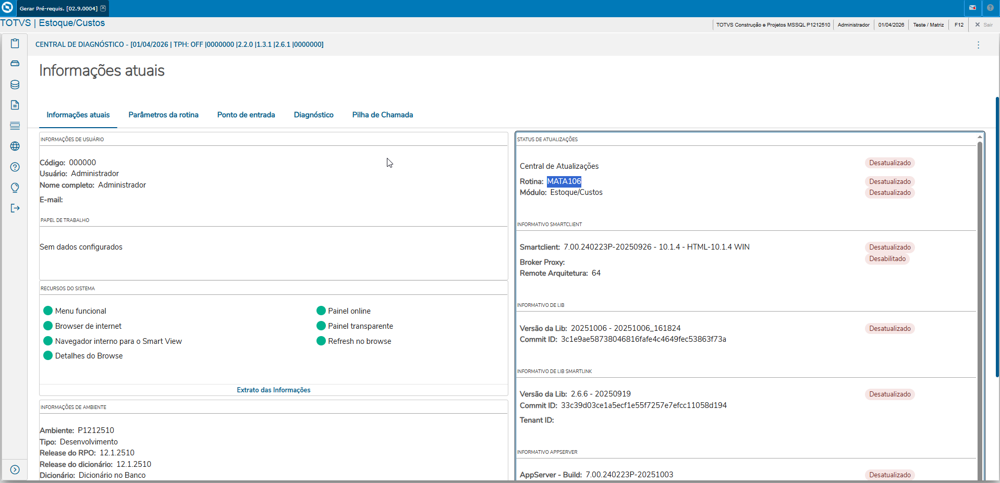
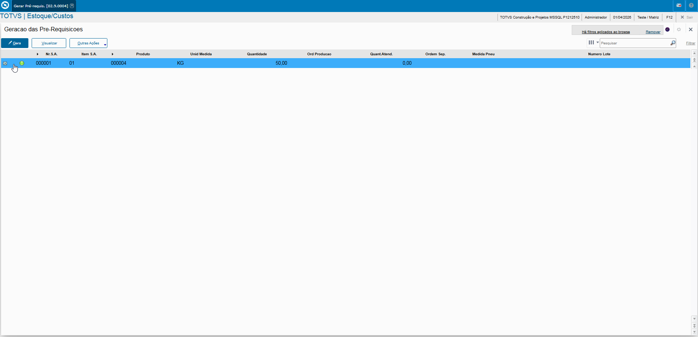
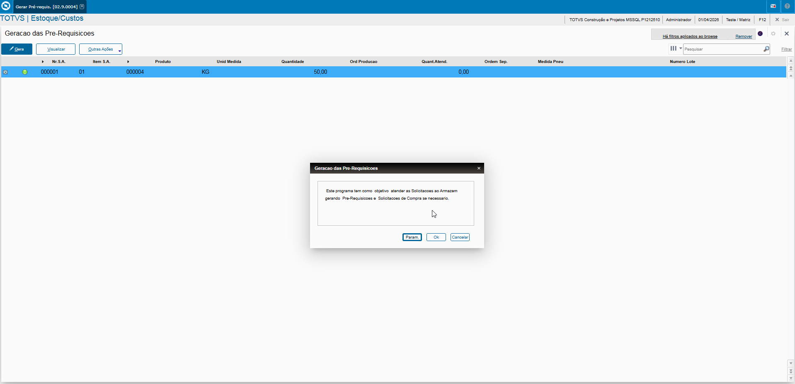
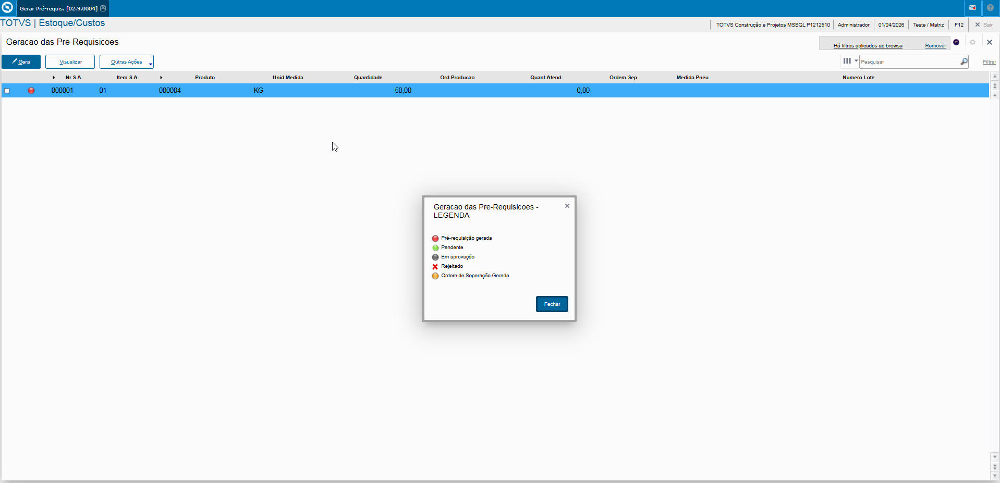

# Solicitações ao Armazém - **Rotina Gerar Pré Requisição ao Armazém - Módulo Estoque/Custos**

O cadastro de Gerar Pré Requisição ao Armazém feitas no Protheus é feito via **"Módulo 04 - Estoque/Custos "**.

De forma mais técnica, as informações cadastradas no Protheus é feita pela rotina padrão **MATA106.PRW**.

**Obs: Para gerar solicitações incluídas que se transformarão em Pre Requisições.**.

Acesso via Módulo Estoque/Custos e Rotina Protheus:

### Rotina

Para gerar a Pre Requisição é necessário selecionar o registros e apertar sobre a opção **"Gera"**

**Importante relembrar que caso o produto possua saldo em estoque, é gerado a Pre Requisição, caso contrário será gerado a Solicitação de Compra.**

Após a inclusão é possível visualizar a legenda do registro.

---

    Desenvolvido e documentado por: Cristian Gustavo
    Data início: 17/11/2025
