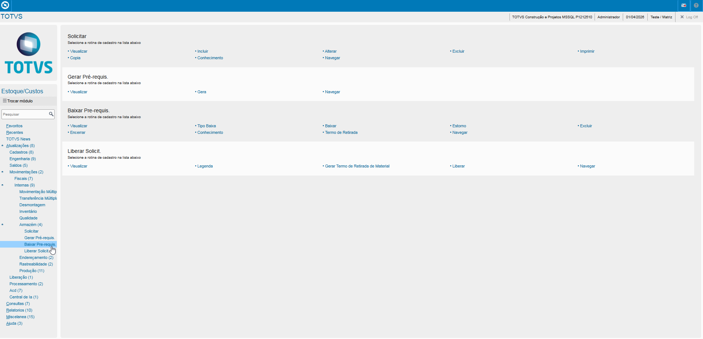
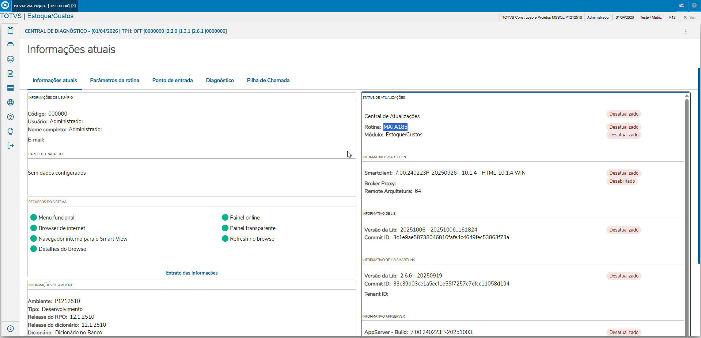
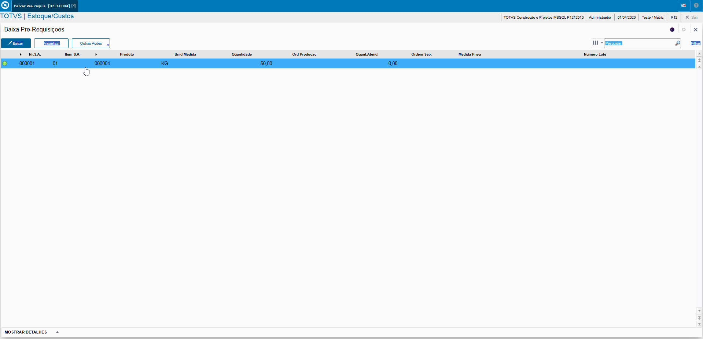
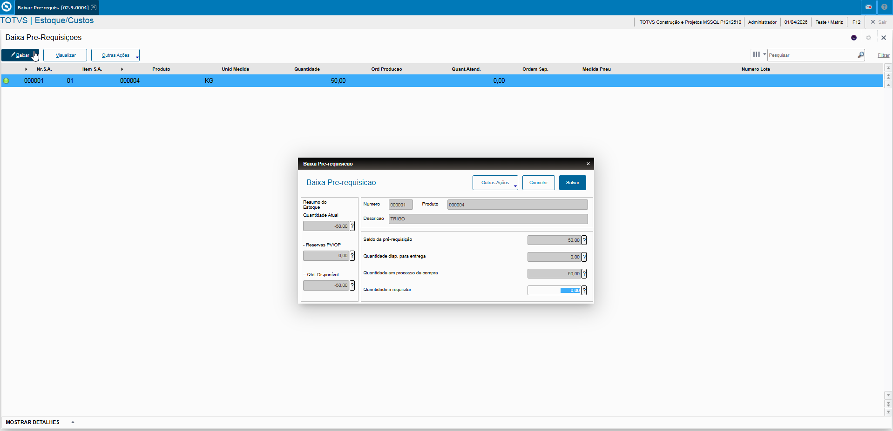
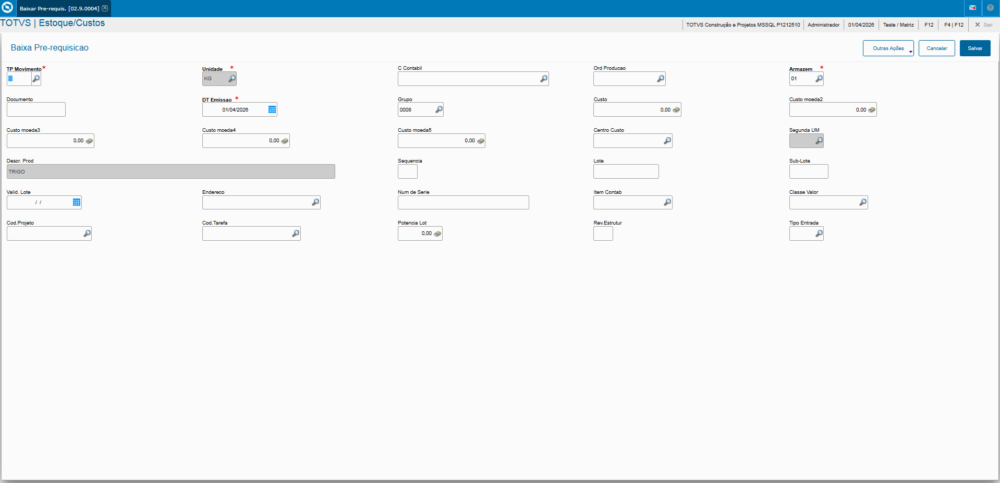
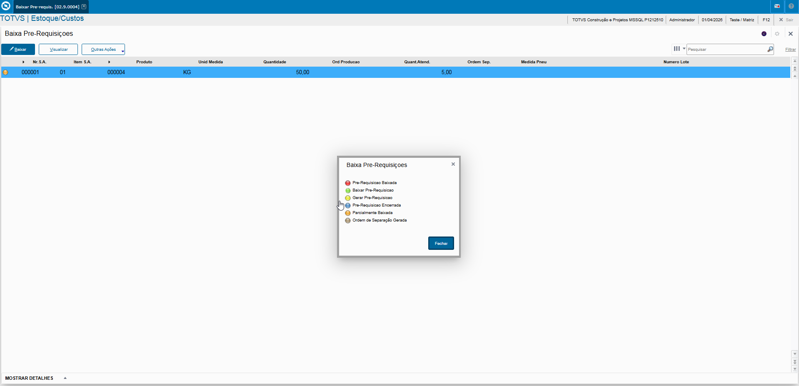

# Solicitações ao Armazém - **Rotina Baixar Pré Requisição - Módulo Estoque/Custos**

O cadastro de Baixar Pré Requisição feitas no Protheus é feito via **"Módulo 04 - Estoque/Custos "**.

De forma mais técnica, as informações cadastradas no Protheus é feita pela rotina padrão **MATA185.PRW** e suas informações podem ser encontradas na tabelas **"Tabela de Baixar Pré Requisição - SCP"**.

**Obs: A rotina tem como objetivo baixar as aquisições geradas para atender as solicitações de produtos ao Armazém, registro a requisição do material solicitado. A rotina deve ser usada ao realizar a saída efetiva do material do estoque.**

[SCP - Baixar Pré Requisição | ERP Labs](https://erplabs.com.br/SCP)

Acesso via Módulo Estoque/Custos e Rotina Protheus:

### Rotina

Para gerar a Pre Requisição é necessário selecionar o registros e apertar sobre a opção **"Baixar"**

**Importante relembrar que caso o produto possua saldo em estoque, é gerado a Pre Requisição, caso contrário será gerado a Solicitação de Compra.**

Ao salvar a quantidade a ser retirada os campos devem ser preenchidos:

- **Tipo Movimento**

Definição do Tipo Movimento referente ao Cadastro de Movimentações Externas.

---

Após a inclusão é possível visualizar a legenda do registro.

---

    Desenvolvido e documentado por: Cristian Gustavo
    Data início: 17/11/2025
