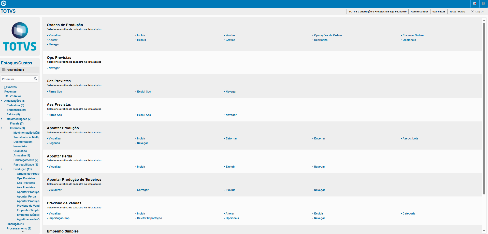
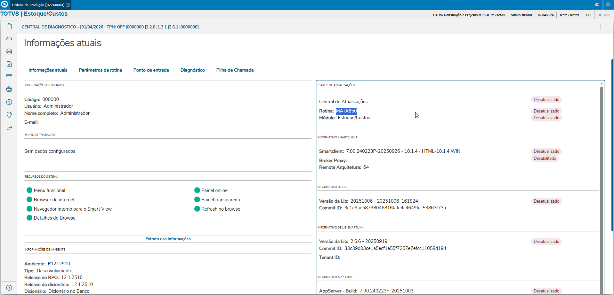
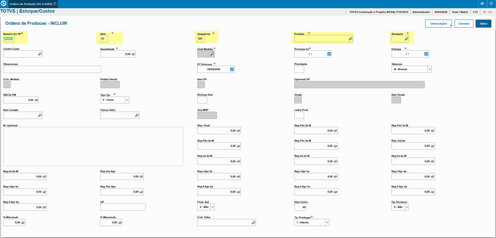
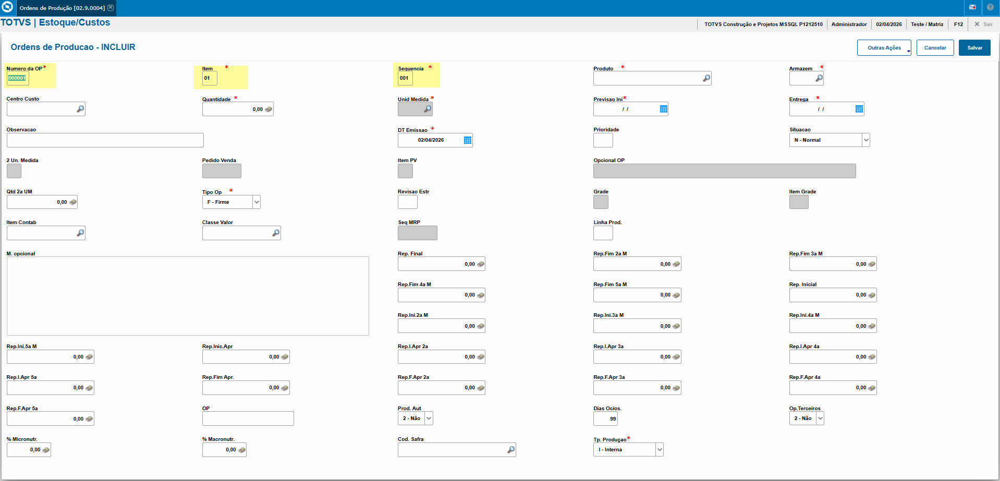
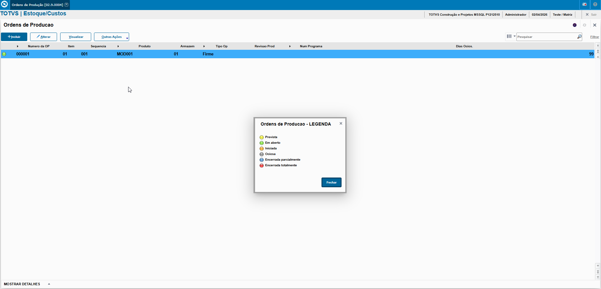

# Solicitações ao Armazém - **Rotina Ordens de Produção - Módulo Estoque/Custos**

O cadastro de Ordens de Produção feitas no Protheus é feito via **"Módulo 04 - Estoque/Custos "**.

De forma mais técnica, as informações cadastradas no Protheus é feita pela rotina padrão **MATA650.PRW** e suas informações podem ser encontradas na tabelas **"Tabela de Ordens de Produção - SC2"**.

**Obs: A rotina é o documento que iniciará a fabricação de um produto, desde seus componentes até suas etapas.**

[SC2 - Ordens de Produção | ERP Labs](https://erplabs.com.br/SC2)

Acesso via Módulo Estoque/Custos e Rotina Protheus:

### Rotina

A rotina padrão de Produtos x Fornecedor contém as seguintes operações, sendo:

- **Inclusão**
- **Alteração**
- **Consulta**
- **Exclusão**

Em caso de inclusão, deve seguir a regra de preenchimento dos campos obrigatórios, identificados com o **"/"** em sua descrição.

### Observações

- Campos **Número OP**, **Item** e **Sequência**

Campos obrigatórios informados automaticamente mas podem ser alterados.

- Campos **Número OP**, **Item** e **Sequência**

---

Após a inclusão é possível visualizar a legenda do registro.

---

    Desenvolvido e documentado por: Cristian Gustavo
    Data início: 17/11/2025
