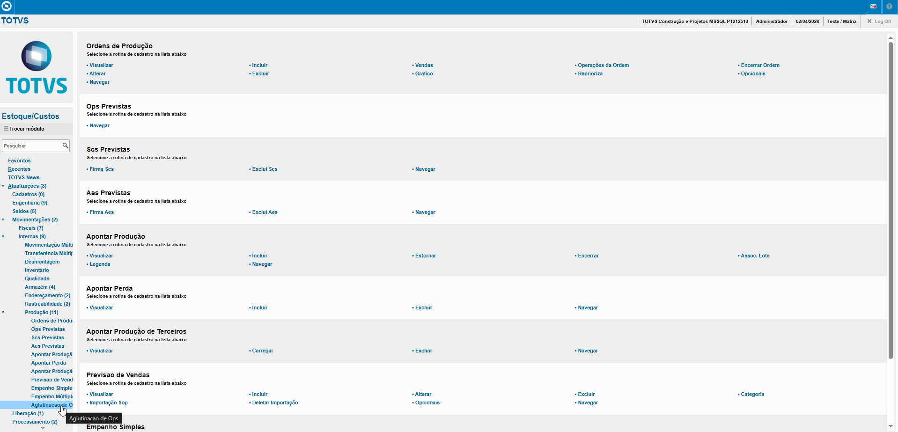
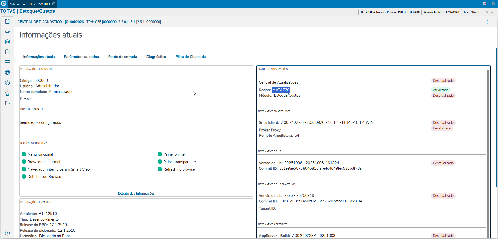

# Solicitações ao Armazém - **Rotina Aglutinação de Produção - Módulo Estoque/Custos**

O cadastro de Aglutinação de Produção feitas no Protheus é feito via **"Módulo 04 - Estoque/Custos "**.

De forma mais técnica, as informações cadastradas no Protheus é feita pela rotina padrão **MATA720.PRW** e suas informações podem ser encontradas na tabelas **"Tabela de Aglutinação de Produção - SC2"**.

**Obs: A rotina tem como principal objetivo aglutinar ordens de produção de um mesmo produto acabado.**

[SC2 - Aglutinação de Produção | ERP Labs](https://erplabs.com.br/SC2)

Acesso via Módulo Estoque/Custos e Rotina Protheus:

---

    Desenvolvido e documentado por: Cristian Gustavo
    Data início: 17/11/2025
