# Entedimento inicial Módulo Compras

## **Cadastro Produtos**

O cadastro de Produtos feitas no Protheus é feito via **"Módulo 06 - Compras"**.

De forma mais técnica, as informações cadastradas no Protheus é feita pela rotina padrão **MATA010.PRW** e suas informações podem ser encontradas na tabela **"Produtos - SB5"**.

[SB1 - Descrição Genérica do Produto | ERP Labs](https://erplabs.com.br/SB1)

Rotina Protheus:

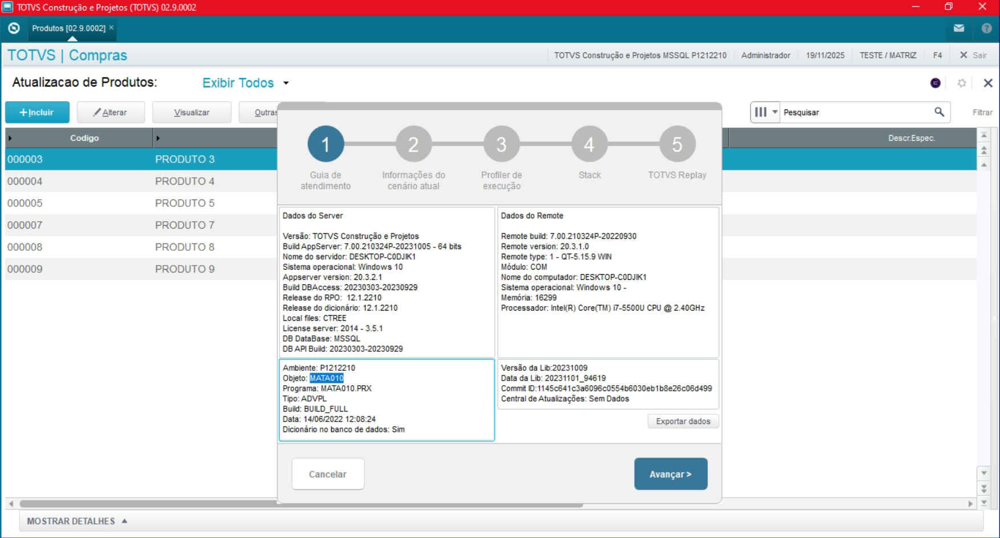

---

Acesso a rotina de cadastro de Produtos via Módulo Compras:

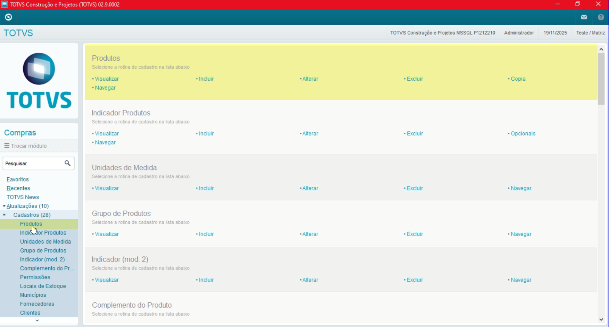

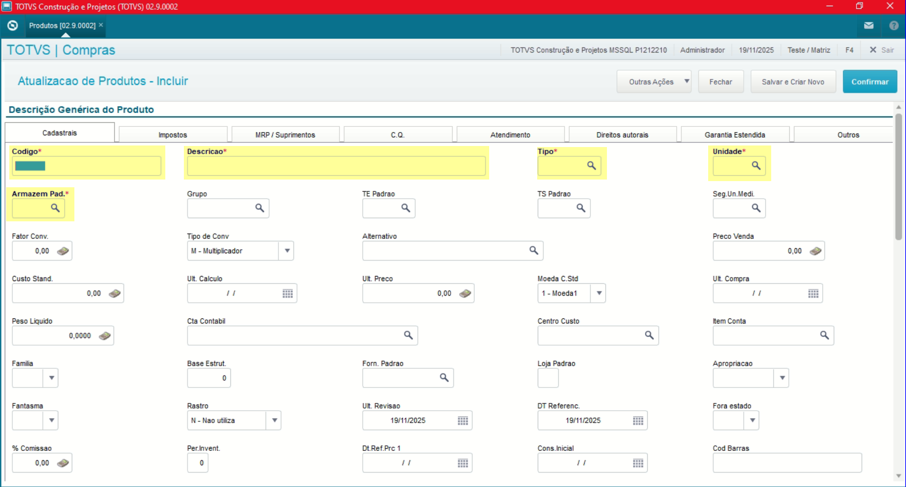

A rotina padrão de Produtos contém as seguintes operações, sendo:

- **Inclusão**
- **Alteração**
- **Consulta**
- **Exclusão**

Em caso de inclusão, deve seguir a regra de preenchimento dos campos obrigatórios, identificados com o **"/"** em sua descrição.

Na parte superior da rotina é possível visualizar o conteúdo **"F4" que por sua vez sinaliza que a rotina possui mais situações de dados que possam ser visualizados.**

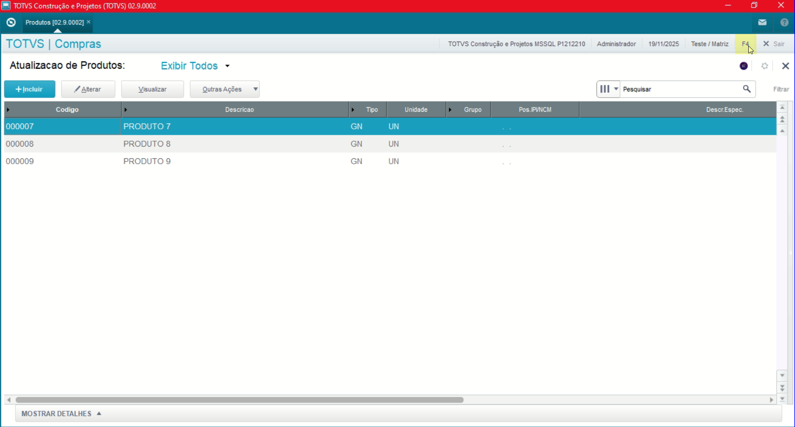

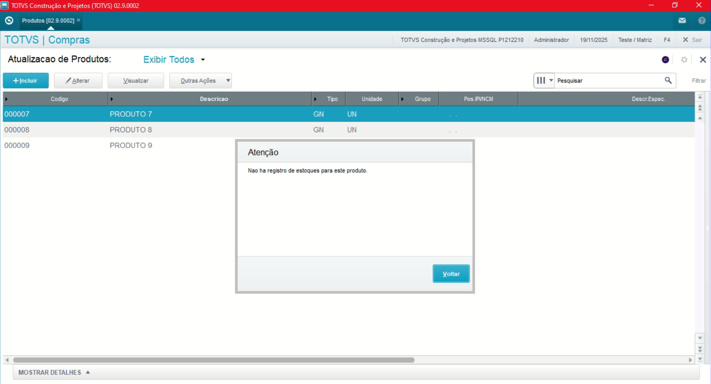

---

No menu Outras Ações, é possível encontrar as seguintes opções, sendo:

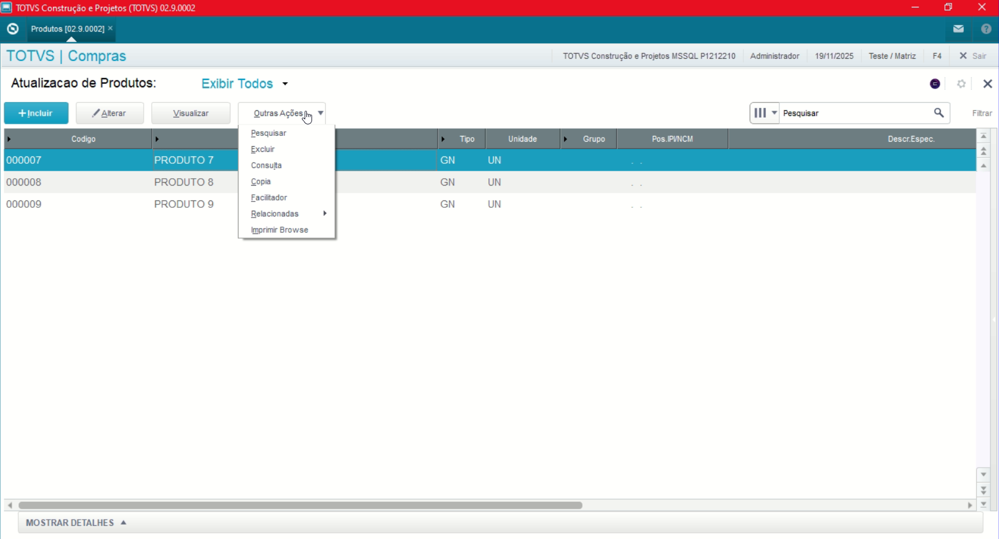

- **Facilitador**: Opção para centralizar os campos a serem alterados.
- **Adicionar Tabela de Preço**: Informações amarradas com o cadastro de Produtos.

---

### Observações

- **Exclusão de Produtos**

Em caso de exclusão o registro, cadastro do Fornecedor só pode ser excluído caso **não possua registros relacionados** para manter a integridade do sistema.

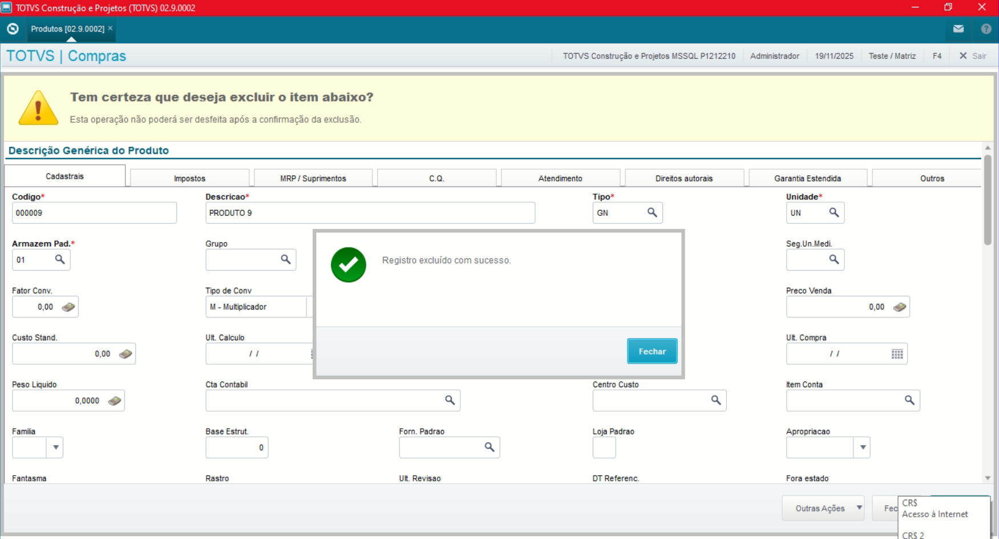

Do contrário será exibida a seguinte tela:

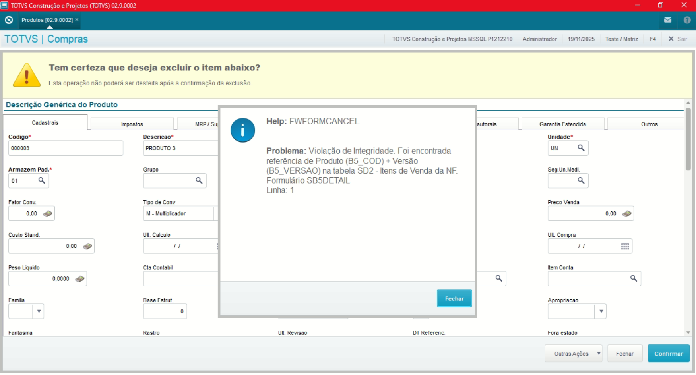

- **Armazem Padrão**

Referente ao armazem padrão que será amarrado ao produto, **não refere-se ao armazenamento físico do produto.**

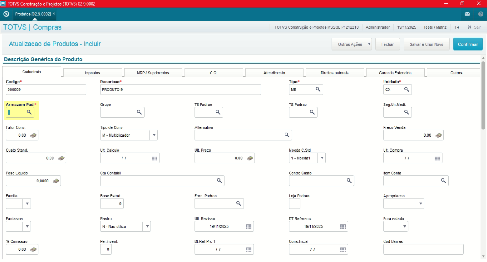

- **TES Padrão (Tipo Entrada Padrão)**

Informe se o produto gera duplicada, se há movimentação de estoque entre outras especifidades relacionadas ao produto.

**Caso o produto tenha situações relacionadas ao Tipo de Entrada/ Saída** como exemplo:

- Criação ou não de tributação
- Variação entrada
- Variação saída
- Alimentação ou não do estoque

**Nessa situação é preenchida em branco para que no momento de entrada da nota a mesma informação deve ser preenchida.**

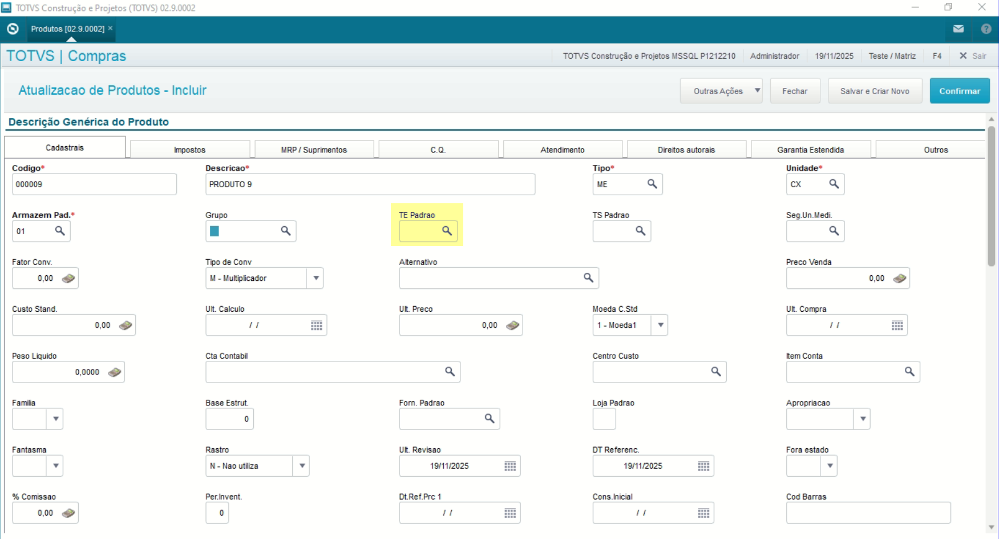

- **Peso Líquido**

**Na situação de um produto que não possua variação na entrada das notas quanto ao seu peso líquido, o valor pode ser informado.**

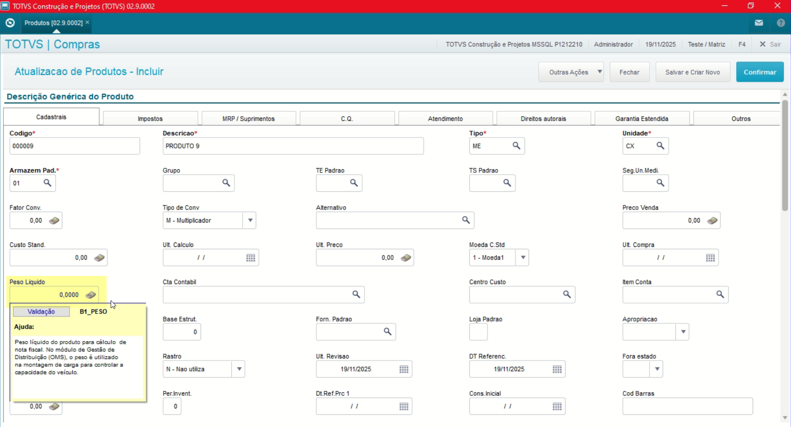

- **Conta Contabil**

Caso utilize a contabilização, ou seja, **realize a integração entre os Módulos Contabilidade Gerencial e Compras e o produto tenha o padrão de entrada e débito para uma específica conta deve ser preenchida.**

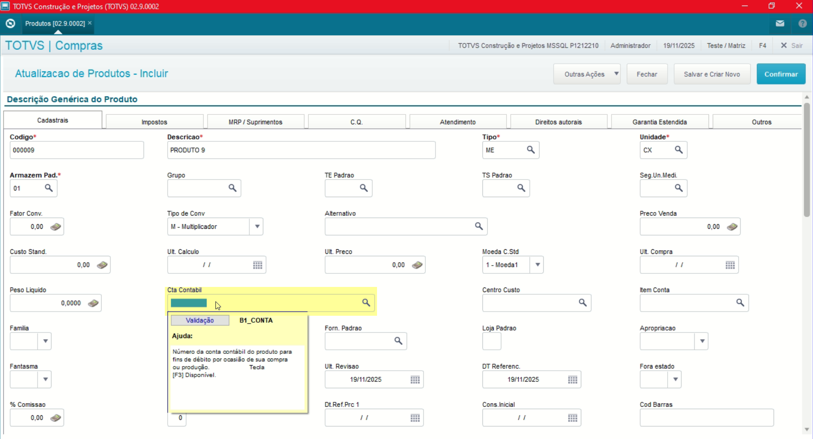

**A mesma regra é aplicada para o Campo Centro de Custo.**

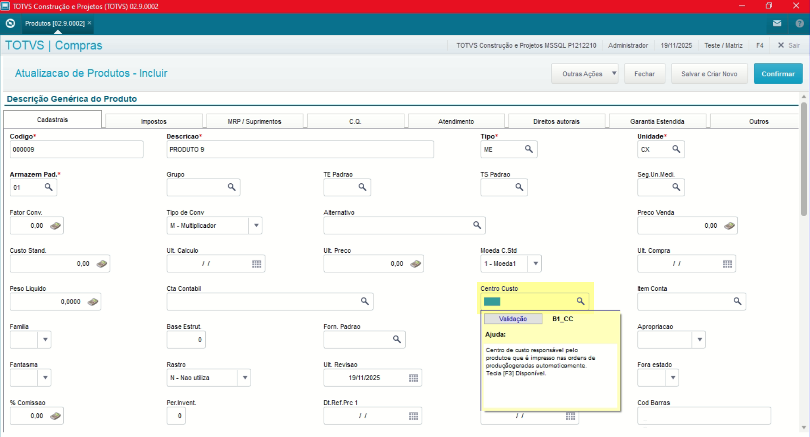

- **Contrato**

Referente ao Controle de Contrato de Parcerias, rotina localizada no Módulo de Compras.

**Caso o produto possua o Controle de Contratos de Contratos e de Pedidos de Compras pode ser preenchido como "Ambos".**

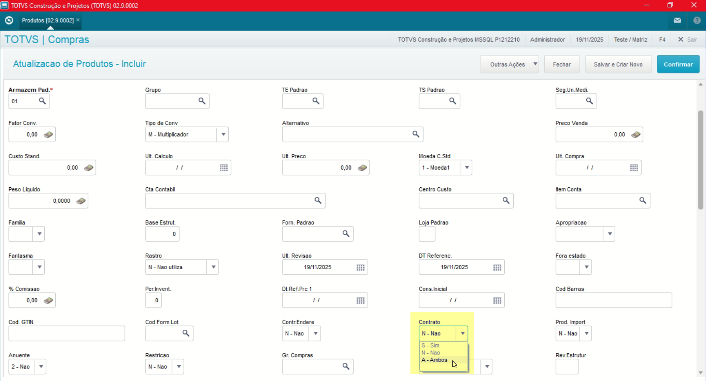

- **Grupo de Compras**

Caso o produto cadastrado seja específico a um grupo de compradores, pode ser feito a amarração a esse campo, rotina localizada na parte de Alçadas.

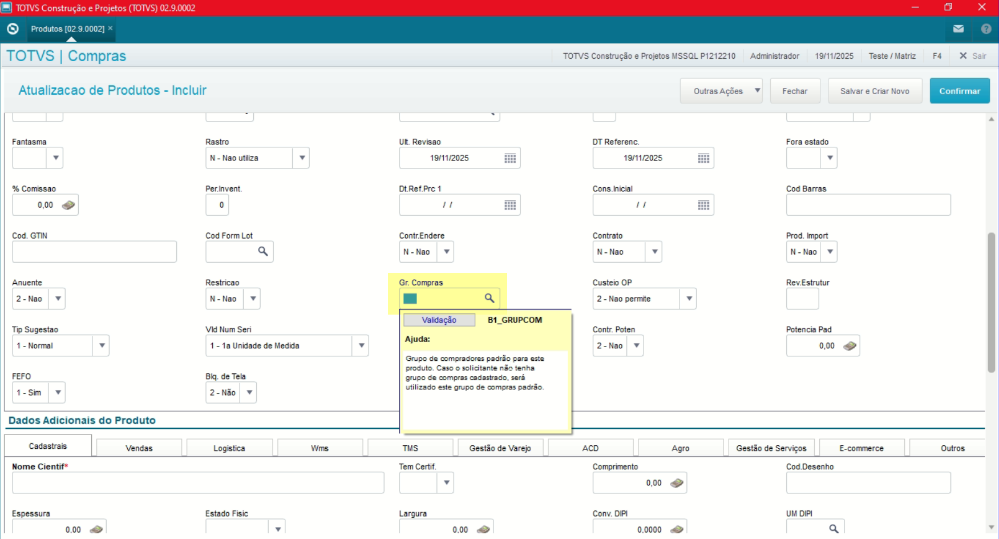

- **Bloqueio de Tela**

Caso o produto cadastrado já possua alguma movimentação específico a um grupo de compradores, pode ser feito a amarração a esse campo, rotina localizada na parte de Alçadas.

---

## **Cadastro Grupo de Produtos**

O cadastro de Grupo de Produtos feitas no Protheus é feito via **"Módulo 06 - Compras"**.

De forma mais técnica, as informações cadastradas no Protheus é feita pela rotina padrão **MATA035.PRW** e suas informações podem ser encontradas na tabela **"Grupo de Produto - SBM"**.

[SBM - Grupo de Produto | ERP Labs](https://erplabs.com.br/SBM)

Rotina Protheus:
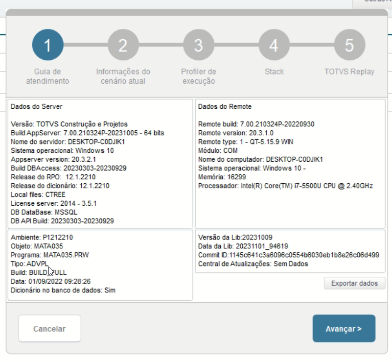

---

Acesso a rotina de cadastro de Grupo Produtos via Módulo Compras:

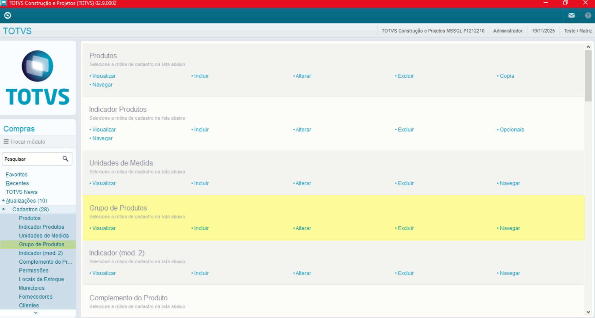

A rotina padrão de Produtos contém as seguintes operações, sendo:

- **Inclusão**
- **Alteração**
- **Consulta**
- **Exclusão**

Em caso de inclusão, deve seguir a regra de preenchimento dos campos obrigatórios, identificados com o **"/"** em sua descrição.

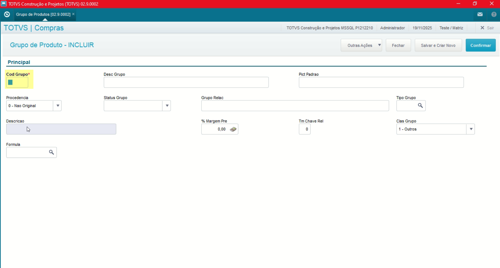

---

### Observações

- **Pic. Padrão**

Possível definir uma picture, máscara padrão para o campo através do campo, como exemplo **"@!"** que formata o conteúdo em letras maiúsculas.

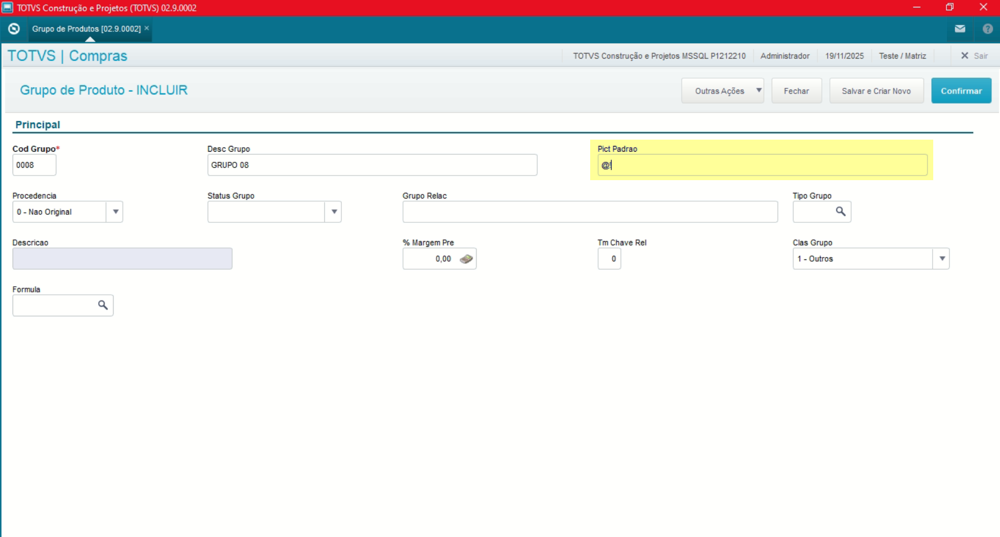

- **Referências:**

  [Principais máscaras usadas no Protheus | Terminal de Informação](https://terminaldeinformacao.com/2023/08/29/principais-mascaras-pictures-usadas-no-protheus)

---

## Autor

**Cristian Gustavo** | Consultor e desenvolvedor TOTVS Protheus

- [LinkedIn Cristian Gustavo](https://www.linkedin.com/in/cristian-gustavo-719aa71b2/)
- [GitHub Cristian Gustavo](https://github.com/crsgustav0)

---

    Desenvolvido e documentado por: Cristian Gustavo
    Data início: 17/11/2025
